# Tìm hiểu về Linux Network Namespaces

## Khái niệm,, chức năng của Network Namespaces

Thông thường thì những cài đặt trên Linux sẽ sử dụng chung một danh sách các network interfaces và routing table entries. Bạn có thể thay đổi nó nhưng về cơ bản nó vẫn được dùng chung trên cùng OS.

Network namespaces sinh ra để thay đổi điều này. Với Network namespaces, bạn có thể có các instances of network interfaces và routing tables hoạt động độc lập và tách biệt với nhau.

Mỗi network namespaces có bảng định tuyến riêng, các thiết lập iptables riêng cung cấp cơ chế NAT và lọc đối với các máy ảo thuộc namespace đó. Linux network namespaces cũng cung cấp thêm khả năng để chạy các tiến trình riêng biệt trong nội bộ mỗi namespace.

## Một số thao tác quản lý cơ bản 

Ban đầu, khi khởi động hệ thống Linux, bạn sẽ có một namespace mặc định đã chạy trên hệ thống và mọi tiến trình mới tạo sẽ thừa kế namespace này, gọi là root namespace. Tất cả các quy trình kế thừa network namespace được init sử dụng (PID 1).

Ta sử dụng câu lệnh `ip netns` để làm việc với network namespaces (xem thêm tại [đây](http://manpages.ubuntu.com/manpages/trusty/en/man8/ip-netns.8.html))

### List namespaces

- Để hiển thị toàn bộ các namespaces trên hệ thống:

```
ip netns 
# hoặc
ip netns list
```

- Nếu chưa thêm bất kì network namespace nào thì đầu ra màn hình sẽ để trống. root namespace sẽ không được liệt kê khi sử dụng câu lệnh `ip netns list`

### Add namespaces

- Để thêm một network namespace

```
ip netns add <tên_namespace>
```

Ví dụ:

```
ip netns add vibi1
ip netns add vibi2 
```

- Sử dụng câu lệnh `ip netns` hoặc `ip netns list` để hiển thị các namespace hiện tại:

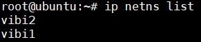

- Mỗi khi thêm vào một namespace, một file mới được tạo trong thư mục `/var/run/netns` với tên giống như tên namespace. (không bao gồm file của root namespace).

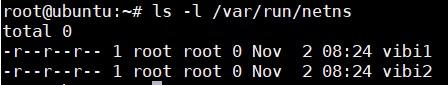

### Executing commands in namespaces

- Để xử lý các lệnh trong một namespace (không phải root namespace)

```
ip netns exec <namespace> <command>
```

Ví dụ: Liệt kê các interfaces trong namespace `vibi1`

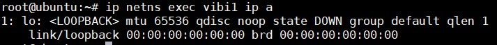

- Kết quả đầu ra sẽ khác so với khi chạy câu lệnh `ip a` ở chế độ mặc định (trong root namespace). Mỗi namespace sẽ có một môi trường mạng cô lập và có các interface và bảng định tuyến riêng.

- Để liệt kê tất cả các địa chỉ interface của các namespace sử dụng tuỳ chọn `-a` hoặc `-all`.

- Để sử dụng các câu lệnh với namespace ta sử dụng command bash để xử lý các câu lệnh trong riêng namespace đã chọn.

```
ip netns exec <namespace_name> bash 
ip a 
```

- Để thoát khỏi vùng làm việc của namespace gõ `exit`

### Assign network interface to a specific namespace

Sử dụng câu lệnh sau để gán interface vào namespace:

```
ip link set <interface_name> netns <namespace_name>
```

### Delete namespace

```
ip netns delete <namespace_name>
```

## Lab

### Kết nối 2 namespace sử dụng Openvswitch

#### Kết nối thông qua virtual ethernet (veth)

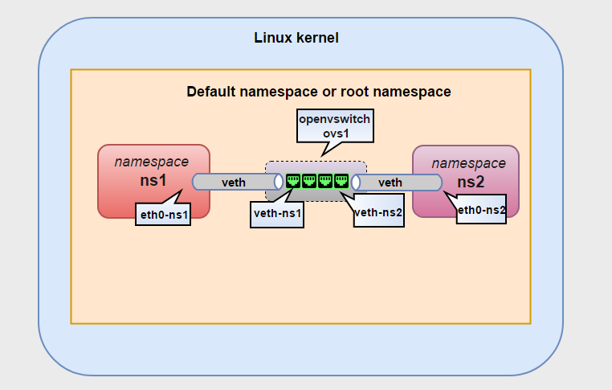

- Thêm virtual switch ovs1

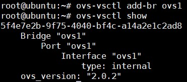

- Thêm cặp veth nối giữa namespace vibi1 và switch ovs1 

```
ip link add veth-vibi1 type veth peer name eth0-vibi1 
```

- Thêm veth dùng để nối giữa vibi2 và ovs1 

```
ip link add veth-vibi2 type veth peer name eth0-vibi2
```

Như vậy ta có 2 cặp 

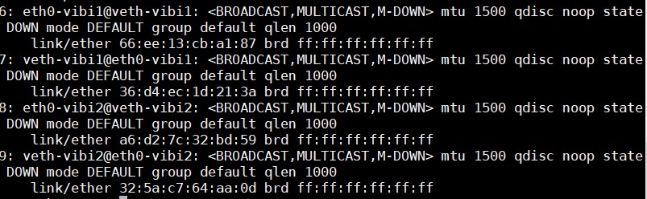

- Chuyển interface eth0-vibi1 vào namespace vibi1 và eth0-vibi2 vào namespace vibi2 và bật lên

```
ip link set eth0-vibi1 netns vibi1 
ip netns exec vibi1 ip link set eth0-vibi1 up
ip link set eth0-vibi2 netns vibi2 
ip netns exec vibi2 ip link set eth0-vibi2 up 
```

- Các interface còn lại gán vào openvswitch port và bật lên 

```
ip link set veth-vibi1 ip 
ip link set veth-vibi2 ip 
ovs-vsctl add-port ovs1 veth-vibi1 
ovs-vsctl add-port ovs1 veth-vibi2 
```

- Kiểm tra lại:

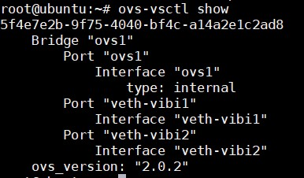

- Gán địa chỉ IP và ping thử giữa 2 namespace

```
ip netns exec vibi1 ifconfig eth0-vibi1 10.0.0.1/24
ip netns exec vibi2 ifconfig eth0-vibi2 10.0.0.2/24
ip netns exec vibi1 ping 10.0.0.2
```

- Kết quả:


#### Kết nối thông qua OVS port 

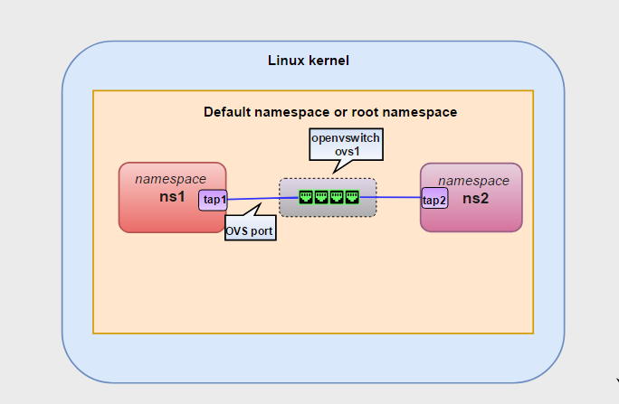

- Cách này không kết nối các namespace thông qua veth, mà sử dụng kết nối trực tiếp thông qua port internal của Openvswitch.

- Cách thực hiện tương tự như phần trên, không tạo thêm 2 veth mà tạo ra 2 port tap1 và tap2 type internal trên ovs1 

```
ovs-vsctl add-port ovs1 tap1 -- set interface tap1 type=internal 
ovs-vsctl add-port ovs1 tap2 -- set interface tap2 type=internal 
```

- Gán 2 port trên vào 2 namespaces và bật lên 

```
ip link set tap1 netns vibi1 
ip link set tap2 netns vibi2 
ip netns exec vibi1 ip link set tap1 up 
ip netns exec vibi2 ip link set tap2 up 
```

- Gán địa chỉ IP và thử ping thử giữa 2 interface

```
ip netns exec vibi1 ifconfig tap1 10.0.0.1/24
ip netns exec vibi2 ifconfig tap2 10.0.0.2/24
ip netns exec vibi1 ping 10.0.0.2
```

- Kết quả:

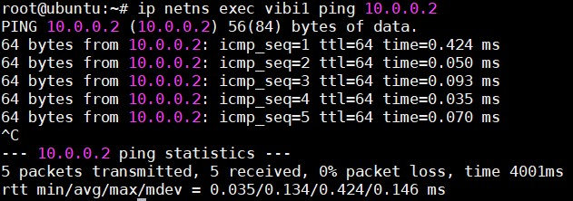

### Cấp dhcp cho 2 namespace khác nhau

Topology sau đây lấy ý tưởng từ hệ thống Openstack. Trên mỗi máy computer, các máy ảo thuộc về mỗi vlan đại diện cho các máy của một tenant. Chúng tách biệt về layer 2 và được cấp phát IP bởi các DHCP server ảo cùng VLAN (các DHCP server ảo này thuộc về các namespaces khác nhau và không cùng namespace với các máy ảo của các tenant, được cung cấp bởi dịch vụ dnsmasq). Các DHCP server này hoàn toàn có thể cấp dải địa chỉ trùng nhau do tính chất của namespace. Sau đây là mô hình:

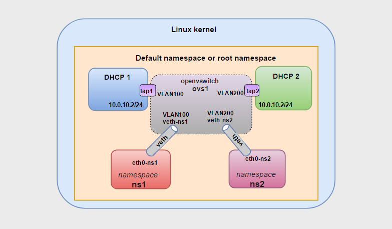

Mô hình bài lab bao gồm 2 DHCP namespace (DHCP1, DHCP2) và hai namespaces dành cho các máy ảo của 2 tenant (vibi1, vibi2), các máy ảo trên 2 tenant này thuộc về 2 VLAN khác nhau (VLAN100 và VLAN200). DHCP server trên các namespace DHCP1, DHCP2 sẽ cấp địa chỉ IP cho các máy ảo của 2 tenant trên 2 namespace tương ứng là vibi1 và vibi2.

- Tạo veth kết nối 2 network namespace và ovs1 

```
ip link add veth-vibi1 type veth peer name eth0-vibi1
ip link add veth-vibi2 type veth peer name eth0-vibi2
ip link set eth0-vibi1 netns vibi1 
ip link set eth0-vibi2 netns vibi2 
ip link set veth-vibi1 up 
ip link set eth0-vibi2 up 
ip netns exec vibi1 ip link set lo up 
ip netns exec vibi1 ip link set eth0-vibi1 up 
ip netns exec vibi2 ip link set lo up 
ip netns exec vibi2 ip link set eth0-vibi2 up 

ovs-vsctl add-port ovs1 veth-vibi1 -- set port veth-vibi1 tag=100
ovs-vsctl add-port ovs1 veth-vibi2 -- set port veth-vibi2 tag=200
```

- Tạo 2 namespace cho các DHCP namespace

```
ip netns add DHCP1
ip netns add DHCP2 
```

- Trên switch ảo ovs1 tạo 2 internal interface là tap1 và tap2 để kết nối với 2 namespaces tương ứng là DHCP1 và DHCP2. Chú ý gán tap1 vào VLAN100, tap2 vào VLAN200:

```
ovs-vsctl add-port ovs1 tap1 -- set interface tap1 type=internal 
ovs-vsctl set port tap1 tag=100
ovs-vsctl add-port ovs1 tap2 -- set interface tap2 type=internal 
ovs-vsctl set port tap2 tag=200
```

- Kiểm tra lại 

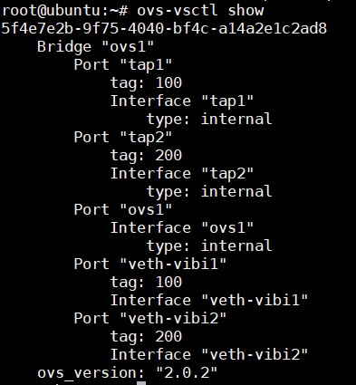

- Gán 2 internal interface tap1 và tap2 trên lần lượt vào các namespace DHCP1 và DHCP2. Chú ý là thực hiện hai thao tác này trên bash của root namespace. Nếu đang thao tác trong các namespace vibi1 và vibi2 thì phải thoát ra bằng lệnh exit cho tới khi trở về root namespace.

```
ip link set tap1 netns DHCP1 
ip link set tap2 netns DHCP2 
```

- Thiết lập IP cho các internal interface tap1 và tap2. Thiết lập dải địa chỉ cấp phát cho các máy ảo trên các tenant namespaces tương ứng vibi1 và vibi2 sử dụng dnsmasq (nếu máy host chưa có cần cài đặt dùng lệnh: apt-get install dnsmasq -y)

- Cấu hình cho tap1 

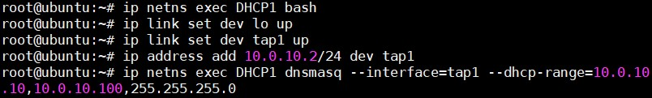

- Cấu hình cho tap2 

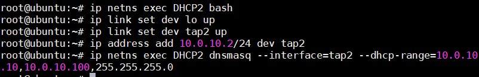

- Kiểm tra lại các tiến trình dnsmasq đã cấu hình chính xác chưa 

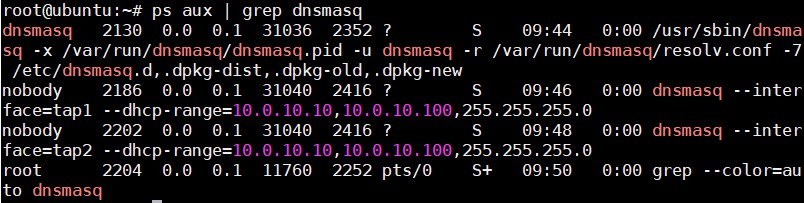

- Ta sẽ cấp phát IP cho các virtual interface eth0-vibi1 và eth0-vibi2 thuộc hai namespace tương ứng vibi1 và vibi2 

- Xin cấp IP cho eth0-vibi1 và kiểm tra địa chỉ IP trong namespace vibi1.

```
ip netns exec vibi1 dhclient eth0-vibi1
ip netns exec vibi1 ip a 
```

Kết quả:

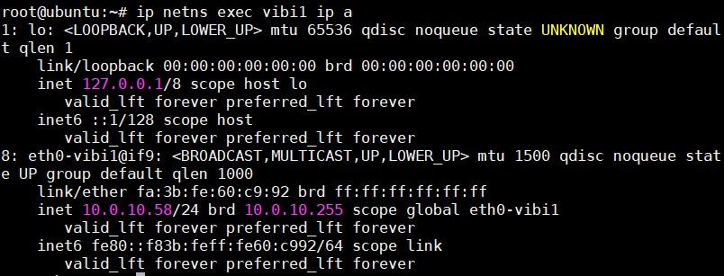

### Tham khảo:

https://github.com/thaonguyenvan/meditech-thuctap/blob/master/ThaoNV/Tim%20hieu%20Linux/namespaces.md