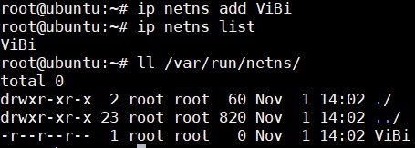
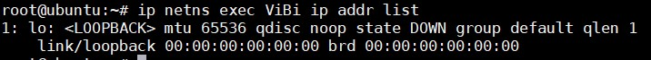
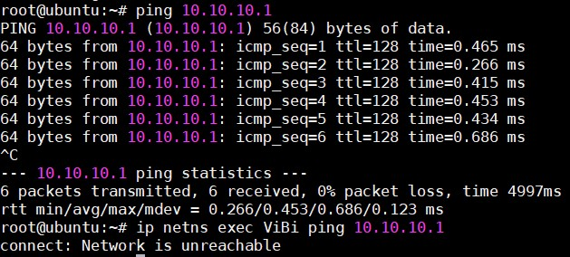

# Linux Network Namespaces

Thông thường, một bản cài đặt Linux sẽ chia sẻ chung tập hợp các network interfaces và các bản ghi trên bảng định tuyến. Ta có thể chỉnh sửa bảng định tuyến sử dụng các chính sách định tuyến, tuy nhiên về căn bản thì điều đó không thay đổi thực tế là các network interfaces và các bảng định tuyến vẫn chia sẻ chung khi xét trên toàn bộ hệ điều hành. Linux Network namespaces được đưa ra để giải quyết vấn đề đó. Với Linux namespaces, ta có thể có các máy ảo tách biệt nhau về network interfaces cũng như bảng định tuyến khi mà các máy ảo này vẫn hành trên các namespaces khác nhau. Mỗi network namespaces có bảng định tuyến riêng, các thiết lập iptables riêng cung cấp cơ chế NAT và lọc đối với các máy ảo thuộc namespaces đó. Linux network namespaces cũng cung cấp thêm khả năng để chạy các tiến trình riêng biệt trong nội bộ mỗi namespaces.

## Cấu trúc cơ bản Namespaces

Tạo một network namespaces



Mỗi một network namespaces sẽ có một địa chỉ loopback, bảng định tuyến và iptables riêng.



Bật nó lên

```
ip netns exec ViBi ip link set dev lo up
ip netns exec ViBi ifconfig
```

Network namespaces còn cung cấp khả năng chạy các tiến trình trên nó. Ví dụ chạy 1 chương trình bash trên namespaces ViBi

```
ip netns exec ViBi bash
```

Xoá một namespaces

```
ip netns delete ViBi
```

## Gán cổng cho network namespaces

Để kết nối network namespaces với mạng bên ngoài cần gán các virtual interface vào "default" hoặc "global" namespaces, nơi mà card mạng thật được gán vào. Để làm được điều này, trước tiên ta cần tạo ra 2 virtual interfaces và `vetha` và `vethb`

```
ip link add vetha type veth peer name vethb
```

Gán `vethb` vào namespaces ViBi 

```
ip link set vethb netns ViBi 
ip netns exec ViBi ip link set dev vethb up 
ip link set dev vetha up 
ip netns exec ViBi ifconfig 
ifconfig
```

Cấu hình virtual interface nằm tại namespace global và trong namespace ViBi 

```
ip addr add 10.10.20.1/24 dev vetha 
route
ip netns exec ViBi ip addr add 10.10.20.2/24 dev vethb 
ip netns exec ViBi route 
```

Giờ thử ping giữa 2 namespace

```
ping 10.10.20.2
ip netns exec ViBi ping 10.10.20.1
```

Ta thấy đều ping được, nhưng chúng được định tuyến hoàn toàn khác nhau, giờ ping thử ra máy mạng khác sẽ thấy:

