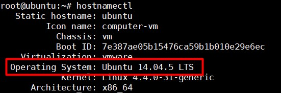
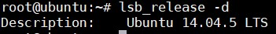
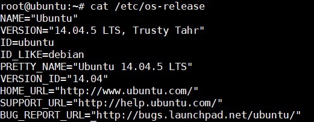
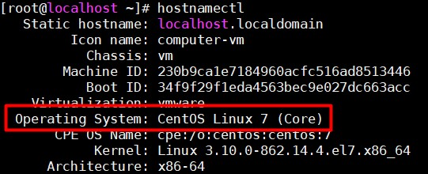
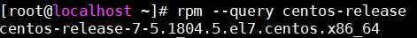
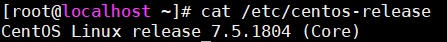
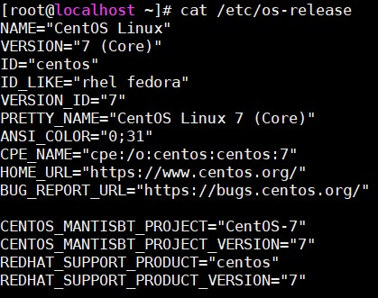
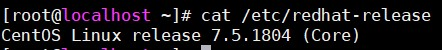
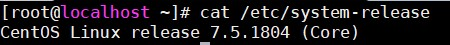

## Các command để check OS 

### Ubuntu

Để check xem máy đang sử dụng OS nào thì dùng các lệnh sau:

- `hostnamectl`

- `lsb_release -d`

- `cat /etc/os-release`

### CentOS

- `hostnamectl` 

- `rpm --query centos-release`

- `cat /etc/centos-release`

- `cat /etc/os-release`

- `cat /etc/redhat-release` 

- `cat /etc/system-release`

