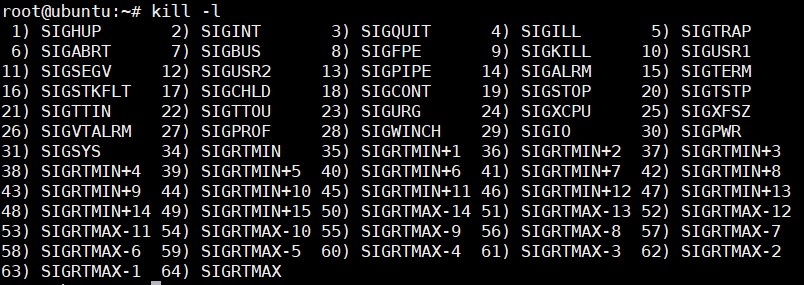

## Lệnh `kill`
Cú pháp: 

```
kill <signal> <pid>
```

Lệnh `kill` được dùng để chấm dứt một tiến trình. Để sử dụng lệnh `kill` bạn phải gửi kèm theo 1 tín hiệu như là 1 option của lệnh `kill`. Có tổng cộng khoảng 60 tín hiệu có thể sử dụng với lệnh `kill`, có thể dùng lệnh `kill -l` để xem danh sách các tín hiệu.



Có rất nhiều tín hiệu nhưng thông thường ta chỉ cần quan tâm tới các tín hiệu sau: 

| Tên | Signal | Miêu tả |
|-----|--------|---------|
| SIGHUP | 1 | Trì hoãn việc kiểm tra trên quản lý terminal hoặc sự dừng của quản lý tiến trình |
| SIGINT | 2 | Được thông báo nếu người sử dụng gửi một tín hiệu ngắt (Ctrl + C) |
| SIGQUIT | 3 | Được thông báo nếu người sử dụng gửi một tín hiệu bỏ (Ctrl + D) |
| SIGFPE | 8 | Được thông báo nếu một hoạt động thuộc về toán không hợp pháp được thử chạy |
| SIGKILL | 9 | Chấm dứt tiến trình ngay lập tức (kill cứng)| 
| SIGALRM | 14 | Tín hiệu báo số lần thực hiện (Alarm Clock) |
| SIGTERM | 15 | Tín hiệu kết thúc tiến trình mềm (có 1 vài tiến trình có thể không bị kill khi dùng tín hiệu này) |