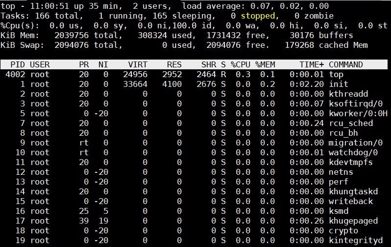
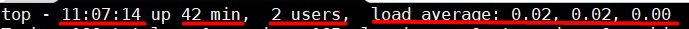
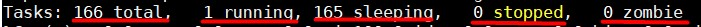
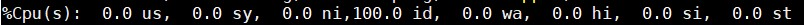
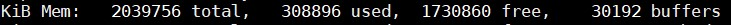
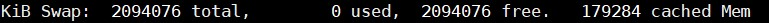
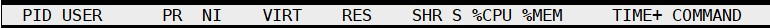
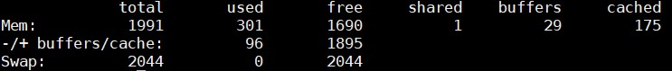
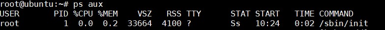

## Ý nghĩa các thông số

### Lệnh `TOP`

- Thông số liên quan đến thời gian của server

 

Dòng này có các thông tin về: Thời gian hiện tại, thời gian đã hoạt động, số user đang login, thời gian CPU load trung bình 1/5/15 phút

- Thông số liên quan đến các tiến trình

Dòng này có các thông tin về: Tổng số tiến trình ở chế độ active, tiến trình đang chạy, tiến trình đang ở chế độ ngủ, tiến trình đang stop, tiến trình đang chờ stop từ tiến trình khác.

- Thông tin về CPU

`%us`: %CPU được dùng cho từng tiến trình của user

`%sy`: %CPU được dùng cho tiến trình của hệ thống

`%ni`: %CPU tiến trình được dùng để cấu hình các giá trị

`%id`: %CPU ở trạng thái nghỉ

`%wa`: %CPU đang trong thời gian chờ I/O

`%hi`: %CPU được dùng phục vụ cho phần cứng khi bị gián đoạn

`%si`: %CPU được dùng phục vụ cho phần mềm khi bị gián đoạn

`%st`: %CPU ảo chờ đợi CPU thực xử lý các tiến trình

- Thông tin RAM

`total`: Tổng dung lượng RAM

`used`: Dung lượng RAM được sử dụng

`free`: Dung lượng RAM free

`buffers`: Dung lượng vào buffers 

- Thông tin SWAP

`total`: Dung lượng Swap RAM

`used`: Dung lượng swap RAM đang sử dụng

`free`: Dung lượng swap free

`cached mem`: Tổng cache memory bởi hệ thống

- Các tham số tiến trình đang hoạt động 

`PID`: PID của tiến trình

`USER`: user đang thực hiện tiến trình

`PR`: Độ ưu tiên của tiến trình

`NI`: Giá trị nice value của tiến trình

`VIRT`: Dung lượng RAM ảo thực hiện cho 1 tiến trình

`RES`: Dung lượng RAM thực chạy 1 tiến trình

`SHR`: Dung lượng RAM share cho tiến trình

`S`: Trạng thái tiến trình đang hoạt động

`%CPU`: %CPU được dùng cho tiến trình

`%MEM`: %MEM được dùng cho tiến trình

`TIME+`: Tổng thời gian thực hiện tiến trình

`COMMAND`: Tên của tiến trình

### Lệnh `free -m`

`total`: Tổng dung lượng RAM

`used`: Dung lượng RAM đã sử dụng

`free`: Dung lượng RAM còn trống

`shared`: Dung lượng RAM được share

`buffers`: Dung lượng RAM sử dụng cho buffers

`cached`: Dung lượng RAM sử dụng cho cache

### Lệnh `ps aux`

`USER`: Người dùng sở hữu tiến trình

`PID`: ID của tiến trình

`%CPU%`: %CPU sử dụng cho tiến trình

`%MEM`: %MEM dùng cho tiến trình

`VSZ`: Bộ nhớ ảo sử dụng cho tiến trình

`RSS`: Bộ nhớ thực sử dụng cho tiến trình

`TTY`: Kiểm soát TTY

`STAT`: Trạng thái tiến trình 

`START`: Thời gian bắt đầu của tiến trình

`TIME`: Thời gian CPU tích luỹ

`COMMAND`: Tên tiến trình 

