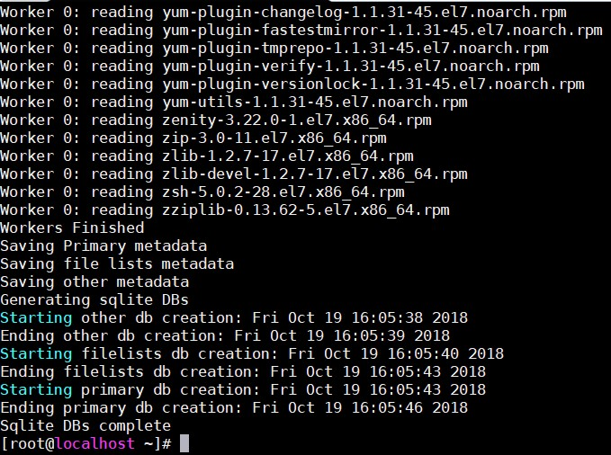
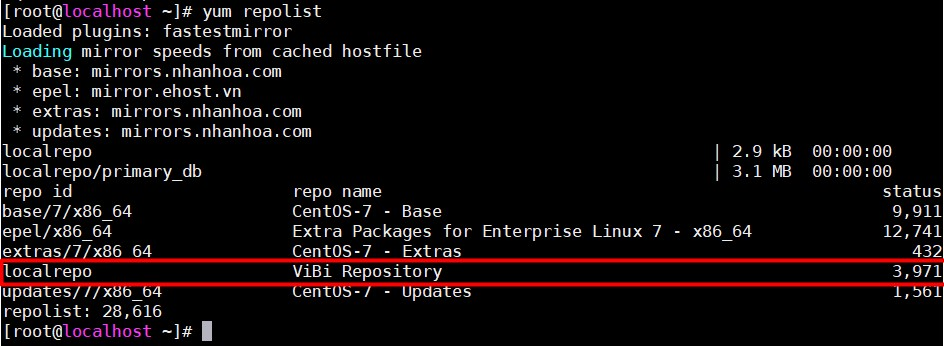
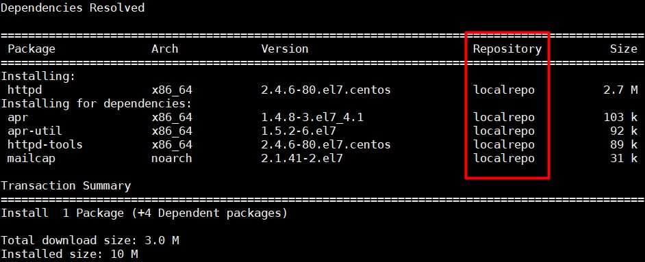
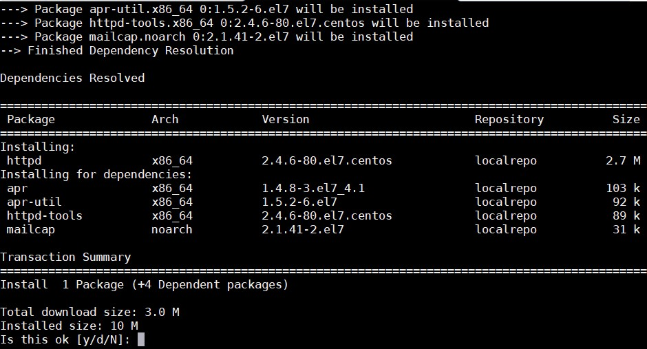

## Repository CentOS

### Các repo mặc định của CentOS 

- CentOS Base: Chứa các chương trình dành cho việc nâng cấp phiên bản CentOS hiện tại hoặc hệ thống 

- CentOS CR: Chứa các chương trình đã được phát triển, bao gồm các phiên bản mới dành cho phiên bản CentOS cụ thể nhưng không được kiểm tra.

- CentOS Debuginfo: Chứa các chương trình dành cho việc fix lỗi chương trình cũ hoặc hệ thống

- CentOS Vault: Chứa các phiên bản cũ của các chương trình đã phát hành trên phiên bản CentOS hiện tại

- CentOS Sources: Chứa các phiên bản cũ của các chương trình đã phát hành trên các phiên bản CentOS

- CentOS fasttrack: Chứa các chương trình dành cho việc nâng cấp các phiên bản CentOS hoặc hệ thống 

- CentOS Media: Dùng để mount ổ đĩa

### Khai báo 1 repo

Để khai báo 1 repo mới ta truy cập vào đường dẫn

```
/etc/yum.repos.d/ 
```

Sau đó tạo 1 file với đuôi .repo với nội dung:

```
[tên repo]
name=[tên repo]
baseurl=[đường dẫn của repo]
gpgcheck=0
enabled=1 (0 là disable repo)
```

### Local Repository

#### Chuẩn bị

- Cài đặt vftpd bằng lệnh `yum install vsfptd`

- Sau đó kích hoạt vsftps:

```
systemctl enable vsftpd
systemctl start vsftpd
```

- Cài đặt createrepo bằng lệnh `yum install createrepo`

- 1 folder chứa các file .rpm

#### Build Local Repository

- Tạo folder chứa file .rpm 

```
mkdir /var/ftp/pub/localrepo
```

- Khai báo Repository 

```
vi /etc/yum.repos.d/localrepo.repo
```

Thêm nội dung sau vào file:

```
[localrepo]
name=ViBi Repository
baseurl=file:///var/ftp/pub/localrepo
gpgcheck=0
enable=1
```

- Bắt đầu tạo local repo 

```
createrepo -v /var/ftp/pub/localrepo/
```



- Kiểm tra các repository hiện có bằng lệnh `yum repolist`



- Cài đặt 1 gói (ví dụ httpd) từ local repo vừa tạo dùng lệnh

```
yum install --disablerepo="*" --enablerepo="localrepo" httpd 
```

Kết quả



#### Cấu hình cho client sử dụng localrepo

- Tạo 1 file tại thư mục **/etc/yum.repos.d/** 

```
vi /etc/yum.repos.d/localrepo.repo
```

Với nội dung:

```
[localrepo]
name=ViBi Repository
baseurl=ftp://10.10.10.3/pub/localrepo
gpgcheck=0
enable=1
```

**Note**: `10.10.10.3` là địa chỉ ip của máy server chứa localrepo

- Thử cài httpd trên Client bằng lệnh 

```
yum install --disablerepo="*" --enablerepo="localrepo" httpd
```

Kết quả:



**Vậy là đã tạo được 1 local repository offline rồi**


