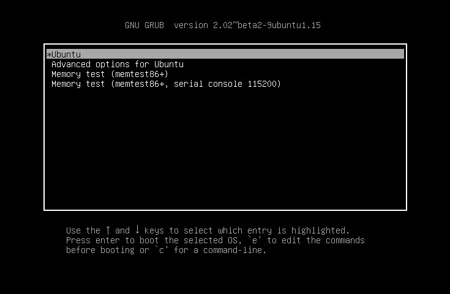
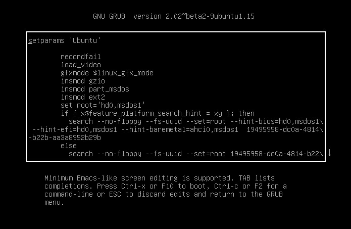
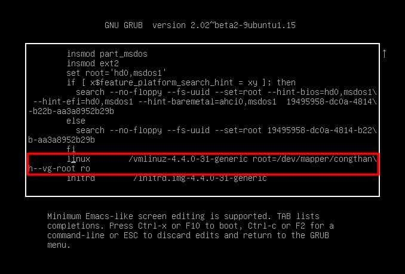

## Ubuntu

- Khởi động lại hệ thống vào GRUB2 boot loader menu

- Bấm `esc` để dừng màn hình, sau đó ấn `e` ở dòng entry Ubuntu để thực hiện chỉnh sửa boot loader 



- Sau khi vào được màn hình cấu hình GRUB2 sẽ có thông tin như ảnh dưới



- Tìm đến dòng cấu hình sau



sửa `ro` thành `rw init=/bin/bash`

- Ấn `Ctrl+X` hoặc `F10` để lưu và tự động boot vào môi trường initramfs

- Hệ thống filesystem hiện tại đang ở chế độ `read-write` được mount ở `/` 

- Kiểm tra lại xem filesystem đã được mount quyền đọc-ghi hay chưa, để thực hiện khôi phục mật khẩu root thì cần thêm quyền ghi trên filesystem

```
mount | grep -w /
```

- Nếu kiểm tra thấy chưa ở chế độ **rw** thì ta tiến hành remount lại filesystem root `/` với quyền **rw**. 

```
mount -o remount, rw /
```

- Tiến hành reset password user root

```
passwd root
```

- Khởi động lại hệ thống 

```
exec /sbin/init 
```

- Sau khi khởi động lại thành công thì có thể dùng mật khẩu mới để đăng nhập

## CentOS

- Khởi động lại hệ thống để vào GRUB boot loader

- Bấm `e` để chỉnh sửa boot loader

- Tìm đến dòng bắt đầu bằng **linux16...** và sửa `ro` thành `rw init=/sysroot/bin/sh`

- Bấm **Ctrl+X** để boot vào single user mode

- Truy cập hệ thống bằng lệnh: 

```
chroot /sysroot 
```

- Reset password:

```
passwd root
```

- Cập nhật thông tin SELinux

```
touch /.autorelabel
```

- Thoát chroot 

```
exit
```

- Khởi động lại hệ thống và đăng nhập bằng mật khẩu mới