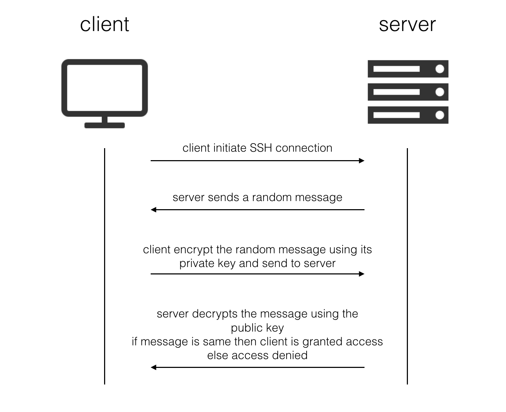
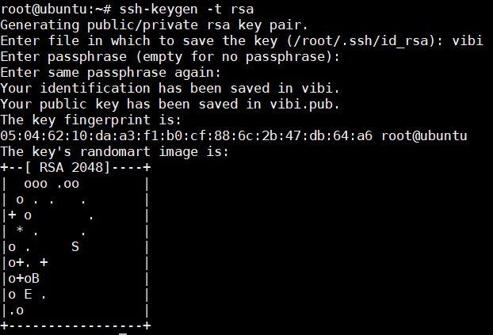
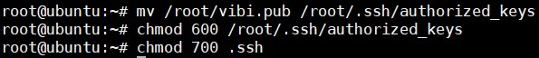
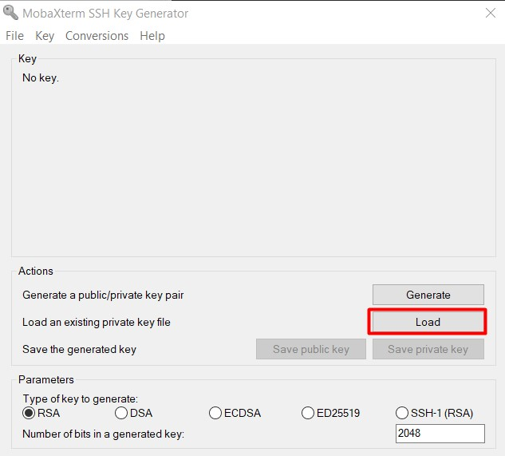
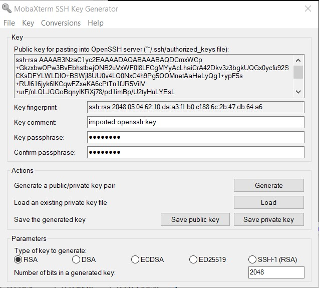
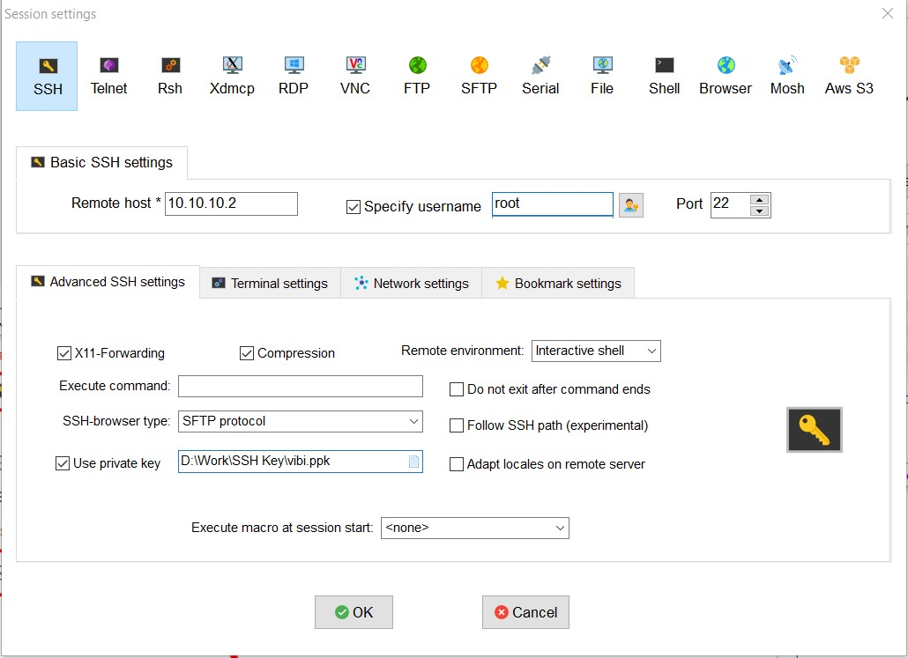
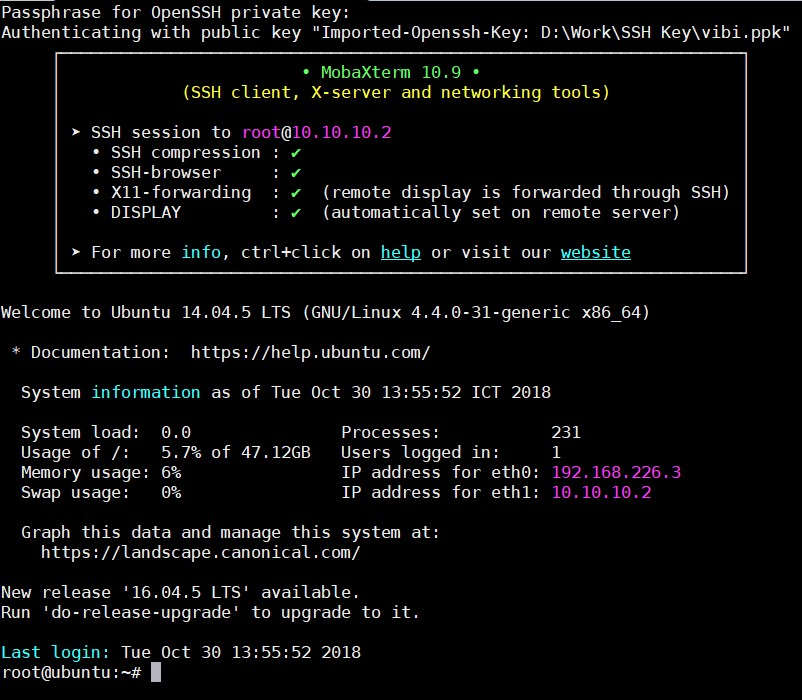
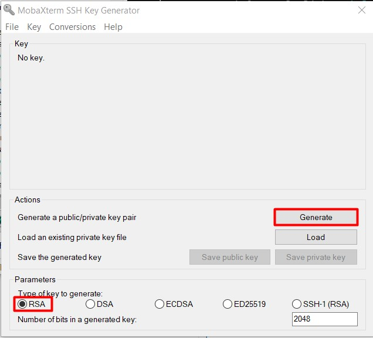
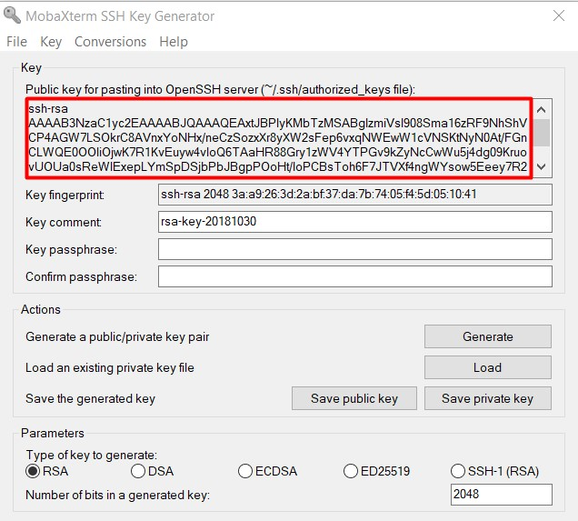
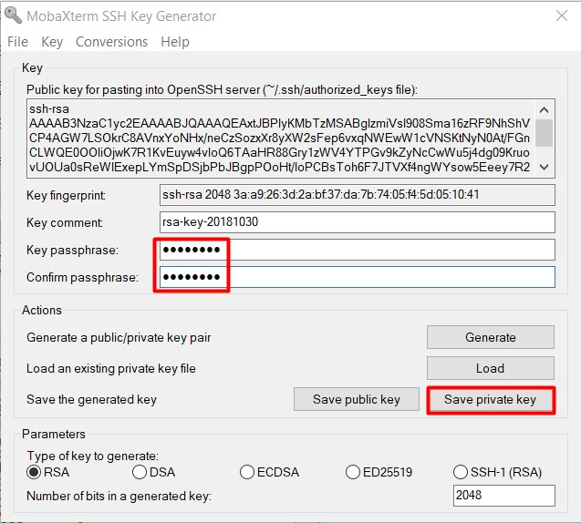

# Tìm hiểu về SSH

## Giới thiệu SSH 

SSH (secure shell) là một giao thức mã hóa dùng để quản trị và giao tiếp với servers. Khi làm việc với Linux server, bạn sẽ dành phần lớn thời gian của mình vào terminal được kết nối qua SSH.

Có một vài cách để SSH tới SSH server như dùng password hoặc keypair. Trong đó phương thức dùng keypair được cho là có tính bảo mật cao hơn bởi nếu trong quá trình sử dụng mà các gói tin của bạn bị bắt lại, các phiên trao đổi khóa giữa SSH server và client sẽ bị lộ và attacker có thể dùng nó để giải mã dữ liệu. Hơn nữa, việc này cũng tạo điều kiện cho các cuộc tấn công Brute Force mật khẩu.

SSH có ỗ trợ sử dụng cặp khóa Private Key và Public Key được chia sẻ với nhau từ trước. Nghĩa là bạn đã có sẵn Private Key để trao đổi với server mà không cần đến quá trình trao đổi khóa, điều này sẽ hạn chế khả năng bị bắt gói. Hơn nữa cặp khóa này còn có một mật khẩu riêng của nó, gọi là passphrase (hay keyphrase). Mật khẩu này được dùng để mở khóa Private Key (được hỏi khi bạn SSH vào server) và tạo lớp xác thực thứ 2 cho bộ khóa. Nghĩa là:

- Nếu attacker không có Private Key, việc truy cập vào server gần như không thể, chỉ cần bạn giữ kĩ Private Key.

- Tuy nhiên trong trường hợp Private Key bị lộ, bạn vẫn khá an toàn vì đối phương không có passphrase thì vẫn chưa thể làm được gì, tuy nhiên đó chỉ là tạm thời. Bạn cần truy cập server thông qua cách trực tiếp hoặc qua VNC của nhà cung cấp nếu đó là một VPS để thay đổi bộ khoá.

## Cách thức hoạt động của SSH Keys

SSH key pairs là một cặp khóa được mã hóa có thể được dùng để xác thực giữa client và server. Mỗi một cặp khóa sẽ có public key và private key. Private key được giữ ở phía client và phải được bảo mật tuyệt đối. Nếu có được private key, attackers hoàn toàn có thể truy cập vào server. Cũng vì thế nó được mã hóa với passphrase.

Public key có thể được chia sẻ và phân tán rộng rãi bởi nó được dùng để mã hóa các tin nhắn mà chỉ private key mới giải mã được. Public key sẽ được upload lên phía server và được lưu tại thư mục người dùng (~/.ssh/authorized_keys).

Khi có client muốn xác thực bằng SSH keys, server có thể test xem client đó có giữ private key hay không. Nếu client chứng minh được nó có private key thì kết nối có thể được thiết lập.

Hình dưới đây mô tả quá trình xác thực giữa server và client:



## Thực hành 

Mô hình lab: Client - Server. Phía Server chạy Linux, phía Client sử dụng Windows.

### Tạo khoá trên server 

#### Server

Sử dụng câu lệnh để tạo 1 cặp khoá:

```
ssh-keygen -t rsa
```

Keys được tạo ra được lưu tại thư mục của user tạo keys.

Sau khi gõ lệnh trên, bạn sẽ được yêu cầu nhập vào tên file chứa key và cả passphrase để mã hoá private key. Ví dụ: tạo ra 1 cặp key `vibi.pub` và `vibi` bằng tài khoản root. Keys được lưu tại `/root/vibi` và `/root/vibi.pub`.



Sau đó tiến hành phân quyền cho cặp key. Lưu ý: nếu bạn không chỉnh sửa cấu hình ssh thì phải chuyển public keys tới thư mục mặc định `~/.ssh/authorized_keys` thì server mới có thể xác nhận.



Tiếp theo tiến hành cấu hình trong file `/etc/ssh/sshd_config` để khai báo thư mục đặt key cũng như cho phép user root login. Sau khi chỉnh sửa, restart lại dịch vụ ssh


#### Client 

Tiến hành copy file private key ra máy dưới dạng và load bằng PuTTY hoặc MobaXterm. Ở đây mình dùng MobaXterm.





Sau khi load key, hãy lưu nó dưới dạng `.ppk`

Để ssh vào server, chỉ cần import key vào session



Nếu có passphrase thì bạn sẽ phải nhập passphrase. 



Thế là ssh thành công bằng key.

### Tạo khoá trên Client 

Dùng MobaXterm để tạo keys.



Di chuột liên tục trong vùng trống để tạo khoá


Copy toàn bộ nội dung trong ô "Public key for pasting into OpenSSH authorized_keys file:" và lưu dưới tên **authorized_keys** rồi gửi lên server. Đây là Public Key dành riêng cho OpenSSH.



Nhập passphrase và chọn `Save private key`. Việc tạo bộ khoá hoàn tất.



Để đăng nhập, mở session mới, nhập địa chỉ của server, chọn `Advanced SSH settings` -> `Use private key` rồi chọn tới private key vừa lưu.

### Cấu hình ssh chỉ sử dụng key pairs 

Để cấu hình ssh chỉ sử dụng key pairs, sửa đổi file `/etc/ssh/sshd_config`

```
PasswordAuthentication no
```

Có thể cấu hình sửa đổi file lưu public key tại dòng:

```
AuthorizedKeysFile %h/.ssh/authorized_keys
```

### Tham khảo

https://github.com/thaonguyenvan/meditech-thuctap/blob/master/ThaoNV/Tim%20hieu%20Linux/tim-hieu-ssh.md