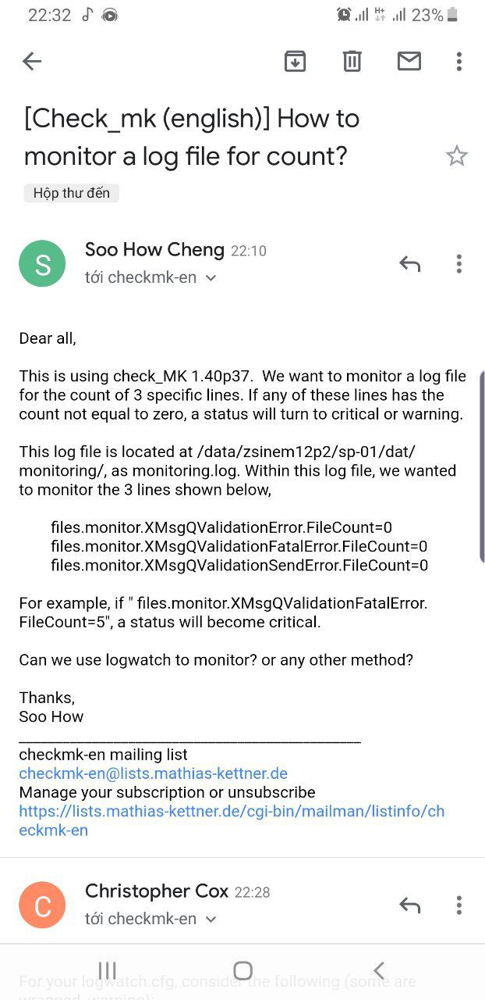
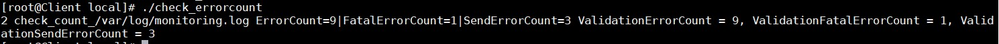
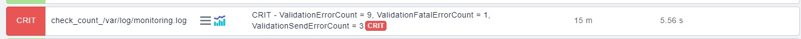
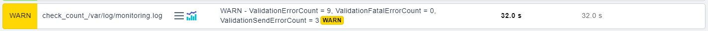
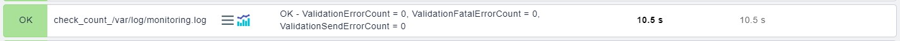

## Yêu cầu



Giám sát 3 dòng sau trong một file:

```
files.monitor XMsgQValidationError.FileCount=0
files.monitor.XMsgQValidationFatalError.FileCount=0
files.monitor.XMsgQValidationSendError.FileCount=0
```

OK nếu cả 3 dòng count = 0, nếu có bất kì dòng nào khác 0 sẽ báo WARNING, CRITICAL nếu cả 3 dòng count khác 0.

## Thực hành

Sử dụng [local check](https://github.com/doedoe12/Internship/blob/master/Monitor/Check_MK/Thuc_hanh/14.Local-check.md) để thực hiện yêu cầu trên.

Đặt script vào thư mục `/usr/lib/check_mk_agent/local/`

Nội dung script:

```
#!/usr/bin/bash
FILE=/var/log/monitoring.log
ve=`cat $FILE | grep "ValidationError.FileCount=[0-9]*" | grep -o "[0-9]*" | tail -1`
vfe=`cat $FILE | grep "ValidationFatalError.FileCount=[0-9]*" | grep -o "[0-9]*" | tail -1`
vse=`cat $FILE | grep "ValidationSendError.FileCount=[0-9]*" | grep -o "[0-9]*" | tail -1`
display="ValidationErrorCount = $ve, ValidationFatalErrorCount = $vfe, ValidationSendErrorCount = $vse"
perf="ErrorCount=$ve|FatalErrorCount=$vfe|SendErrorCount=$vse";

if [ $ve != 0 ] && [ $vfe != 0 ] && [ $vse != 0 ]; then
statustext=CRITICAL
status=2
elif [ $ve != 0 ] || [ $vfe != 0 ] || [ $vse != 0 ]; then
statustext=WARNING
status=1
else
statustext=OK
status=0
fi

echo "$status check_count_$FILE $perf $statustext - $display"
```

Phân quyền cho script:

```
chmod +x /usr/lib/check_mk_agent/local/check_errorcount
```

Chạy thử script:



Discover trên Check_MK web UI



Ở trên là khi cả 3 dòng đều khác 0, được kết quả CRIT. Sau đây ta sẽ test thử 2 trường hợp còn lại:

WARNING khi có dòng khác 0



OK khi cả 3 dòng bằng 0

