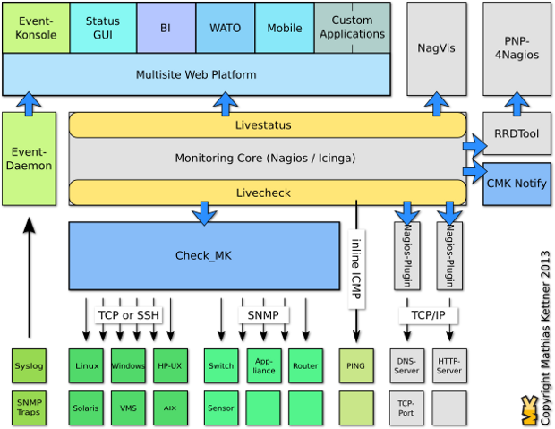
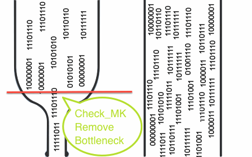
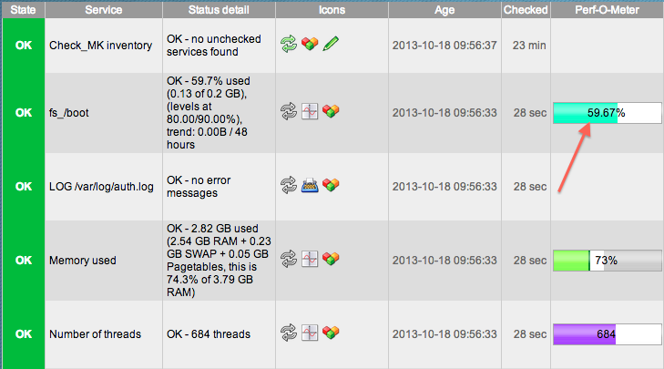

# Tổng quan về OMD (Open Monitoring Distribution)

## Lịch sử hình thành

Dự án Check_MK được phát triển từ năm 2008 như là một plugin của Nagios Core

Năm 2010 dự án OMD được khởi động bởi Mathias Kettner, là sự kết hợp của Nagios, Check_MK, Nagvis, PNP4Nagios, DocuWiki,... tạo nên sự linh hoạt trong giám sát. Các distro của OMD đang có là OMD-Labs và Check_MK Raw.

Năm 2015, phiên bản đơn giản của OMD ra đời gọi là Check_MK, Check_MK có 2 phiên bản là Check_MK Raw Edition (CRE) và Check_MK Enterprise Edition (CEE).

## OMD-Labs và Check_MK Raw

OMD-Labs chứa tất cả các thành phần nguyên bản của OMD và một số addons thêm vào như Grafana, InfluxDB, Naemon, Icinga 2. Check_MK Raw tập trung vào Check_MK, đây là một gói nhỏ hơn chứa các thành phần để chạy Check_MK.

### OMD-Labs

OMD-Labs là một nền tảng giám sát và một khái niệm mới về cài đặt, duy trì và cập nhật một hệ thống giám sát được xây dựng trên Nagios. Không được tính hợp sẵn trong các bản phân phối Linux mà tích hợp vào hệ thống dưới dạng các package rpm và deb.

Phiên bản stable hiện tại là 3.00, thường thì 6 tháng sẽ có một phiên bản stable mới được phát hành. Phiên bản tiếp theo sẽ ra mắt vào tháng 9 năm 2019.

OMD-Labs chứa nhiều thành phần phần mềm mới so với gói OMD thường (Check_MK). Một số cài đặt mặc định đã thay đổi

#### Một số điểm khác của OMD-Labs với OMD thường (Check_MK)

Các thành phần phần mềm bổ sung: OMD-Labs chỉ bổ sung các thành phần phần mềm mới và không loại bỏ bất kì phần mềm nào, làm cho OMD-Labs trở nên hoàn hảo hơn, và có thể chuyển sang các phiên bản khác bằng `omd update`

- Lõi giám sát mới: Bên cạnh Nagios 3, OMD-Labs còn chứa hai core mới là Naemon và Icinga2. Trong khi Naemon hoàn toàn tương thích với định dạng Nagios 3 config thì Icinga2 sử dụng định dạng cấu hình mới.

- Biều đồ Grafana/InfluxDB: Bên cạnh PNP4Nagios, OMD có đồ thị Grafana dựa trên InfluxDB. Để tạo mẫu đồ thị dựa trên mẫu, đã có histou (Histou được thiết kế để thêm các mẫu vào Grafana từ dữ liệu của Nagios). Giao diện giữa core giám sát và InfluxDB được thực hiện trong thành phần Nagflux.

- Hệ thống con Prometheus: Bên cạnh việc giám sát truyền thống, OMD-Labs đi kèm với Prometheus bao gồm quản lý cảnh báo, pushgateway và blackbox exporter.

- Livestatus Multitool Daemon

Thay đổi cài đặt mặc định

- Naemon Core: Naemon thay thế Nagios làm lõi mặc định trong OMD-Labs. Để trở lại cài đặt ban đầu:

```
omd config set CORE nagios
```

- Chế độ SSL/TLS Apache: OMD-Labs đi kèm với kích hoạt SSL/TLS Apache theo mặc định. Để trở lại mặc định:

```
omd config set APACHE_MOD own
```

- Giao diện web: Thruk là trang web mặc định trong OMD-Labs

### Check_MK Raw

Check_MK là một phần của OMD, hiện tại đang có 3 phiên bản Check_MK là Check_MK Raw Edition (CRE), Check_MK Enterprise Edition (CEE) và Check_MK Managed Services Edition (CME)

#### Check_MK Raw Edition (CRE) 

- Là một giải pháp giám sát toàn diện. Có thể sử dụng CRE miên phí, chỉ cần tuân thủ theo một số giấy phép của GNU GPL và giấy phép của nguồn mở

- Phiên bản stable hiện tại đang là 1.5.0p16

#### Check_MK Enterprise Edition (CEE)

- Phiên bản CEE được phát triển dựa trên bản Raw nhưng có nhiều tính năng bổ sung cho doanh nghiệp và cũng cho phép nhận hỗ trợ từ nhà phát hành một cách chuyên nghiệp.

- Phiên bản stable hiện tại là 1.5.0p16

#### So sánh tính năng của 2 phiên bản 

| Tính năng | CRE | CEE |
|-----------|-----|-----|
| Hệ thống giám sát toàn diện về CNTT với hơn 1000 plugin kiểm tra | Có | Có |
| Kiểm kê phần cứng/phần mềm | Có | Có |
| Bảng điều khiển sự kiện xử lý thông tin từ syslog | Có | Có |
| Hiệu suất lưu trữ dữ liệu và tính khả dụng cao | Có | Có |
| Hiệu suất cao về độ trễ thấp | Không | Có |
| Hiệu suất nâng cao cho SNMP dựa trên check bằng 100% | Không | Có |
| Livestatus-Proxy: Thời gian phản hồi tối ưu và sự ổn định trong thiết lập phân phối | Không | Có |
| Agent Bakery: Tự động đóng gói của các agent giám sát cá nhân | Không | Có |
| Report: Tạo các báo cáo riêng lẻ ở định dạng PDF | Không | Có |
| Hệ thống tương tác mới để hiển thị dữ liệu hiệu suất | Không | Có |
| Tích hợp kết nối với công cụ đồ hoạ Graphite | Không | Có |
| Giao diện người dùng tuỳ chon bằng tiếng Đức | Không | Có |
| Quản lý hệ điều hành thông qua Web-GUI | Không | Không |
| Duy trì các phiên bản và các thể hiện thông qua Web-GUI | Không | Không |
| Tích hợp HA | Không | Không |
| Giá thành | Miễn phí | 600 Euro/năm |

## Ưu điểm trong thiết kế kiến trúc của OMD 

OMD được xây dựng từ những đóng góp của cộng đồng về những khó khăn hay khuyết điểm mà Nagios gặp phải, từ đó đưa ra quyết định cần tích hợp  thêm những sản phẩm gì để cải thiện

Việc cài đặt trở nên vô cùng đơn giản. OMD được đóng gói hoàn chỉnh trong một package, việc cài đặt và cấu hình chỉ mất khoảng 10 phút với chỉ một câu lệnh



### Check_MK

Check_MK ra đời để giải quyết bài toán về hiệu năng mà Nagios gặp phải trong quá khứ. Cơ chế mới của Check_MK cho phép việc mở rộng hệ thống trở nên dễ dàng hơn, có thể giám sát nhiều hệ thống chỉ từ một máy chủ Nagios Server.



Có 2 module mà Check_MK sử dụng để cải thiện đáng kể hiệu năng là Livestatus và Livecheck

#### Livestatus

##### Trước khi có Livestatus

- Kết quả giám sát được sẽ lưu trong file `status.dat` gây nên hiện tượng thắt cổ chai cho CPU và Disk I/O

- Trạng thái của file status không phải là real-time mà update ít nhất là mỗi 10s 

- NDOUtils sử dụng database để theo dõi kết quả (MySQL hoặc PostgreSQL) nhưng vẫn còn một số thiếu sót quan trọng

- Việc cài đặt NDOUtils khá phức tạp

- NDOUtils cần một database cho việc lưu trữ dữ liệu. Hơn nữa, việc dữ liệu lưu trong database này tăng lên một cách nhanh chóng khiến cho bạn phải tiêu tốn nhiều CPU chỉ để cập nhật database

- Một số dự án tương tự vẫn sử dụng NDOUtils: Centreon và Opsview

- Việc dọn dẹp database có thể khiến Nagios bị treo trong một khoảng thời gian nhất định 

##### Sau khi có Livestatus

- Livestatus cũng sử dụng Nagios Event Broker API như NDO, nhưng nó sẽ không chủ động ghi dữ liệu ra. Thay vào đó, nó sẽ mở ra một socket để dữ liệu có thể được lấy ra theo yêu cầu

- Livestatus tiêu tốn ít CPU

- Livestatus không làm cho Disk I/O thay đổi khi truy vấn trạng thái dữ liệu 

- Không cần cấu hình, không cần cơ sở dữ liệu, không cần quản lý.

- Livestatus có quy mô lớn với hơn 50000 dịch vụ

#### Livecheck

Trước Nagios 4.0, ngay cả một hệ thống hoàn hảo hiếm khi quản lý để thực hiện hơn một vài nghìn lần kiểm tra mỗi phút.

Trong khí hệ thống càng lớn, tỷ lệ check tối đa sẽ trở nên rất tệ. Càng nhiều máy chủ và dịch vụ thì đồng nghĩa với việc khoảng thời gian check cần phải tăng lên. Tại sao lại như vậy?

##### Các vấn đề tồn tại trong Nagios (trước Nagios 4.0)

- Mỗi lần check tạo ra một bản fork. Quá trình fork rất tốn kém ngay cả khi kernel được tối ưu hoá

- Quá trình fork trong Nagios Core (trước phiên bản 4.0) không phân tán ra nhiều CPU mà thực hiện chỉ trên một CPU đơn. Điều này dẫn tới việc giới hạn số lần check mỗi giây, trong khi phần lớn các CPU khác rảnh rỗi.

##### Làm thế nào để Livecheck giải quyết được vấn đề nút thắt cổ chai

- Livecheck sử dụng các helper process, các core giao tiếp với helper thông qua Unix socket (điều này không xảy ra trên file system)

- Chỉ có một helper program được fork thay vì toàn bộ Nagios Core

- Các tiến trình fork được phân tán trên tất cả các CPU thay vì chỉ một như trước 

- Process VM size tổng chỉ khoảng 100KB

- Việc thực hiện check_icmp sẽ cho một con số cải tiến cụ thể. Giả sử nếu sử dụng CPU dual core 2800 MHz CPU:

	- Trước đây sẽ là 300 ICMP check/second
	
	- Sau khi cải tiến là 2600 ICMP check/second
	
### Multisite - Một giao diện web tiên tiến hơn Nagios 

Multisite là một phần của dự án Check_MK như là một giao diện web cho người dùng tốt hơn để thay thế cho Nagios 

Một GUI mới và sáng tạo để xem thông tin trạng thái Nagios và kiểm soát hệ thống giám sát. Nó dựa trên MK Livestatus và nhằm mục đích thay thế cho GUI web Nagios. Multisite hỗ trợ giám sát phân tán bằng một cách hiệu quả nhất 

- WATO

Với Nagios, mỗi khi cấu hình một host mới, hay cấu hình một cảnh báo,... bạn phải mất ít nhất 15 phút cho việc tạo, sửa đổi file cấu hình, dùng câu lệnh để restart service,... chưa kể thời gian tìm lỗi nếu cấu hình sai. Với WATO, tất cả các thao tác đó có thể thực hiện trong vòng 3 phút trên giao diện Web.

- Agent giám sát có sẵn cho Linux và Windows

- Đáp ứng được giao diện người dùng trên điện thoại

- Khả năng tìm kiếm mạnh mẽ

- Thông số đo lường trực quan với Perf-O-Meter



## Tham khảo 

https://github.com/thaonguyenvan/meditech-ghichep-omd/blob/master/docs/1.%20OMD%20la%20gi%20va%20tai%20sao%20nen%20dung%20OMD.md