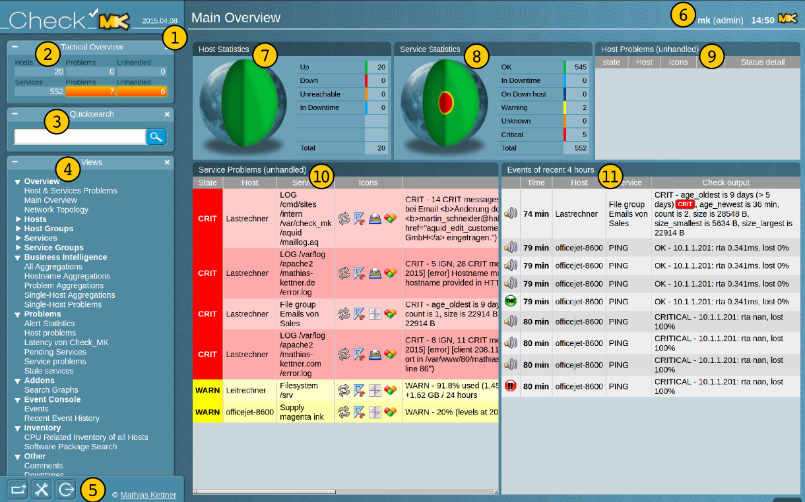
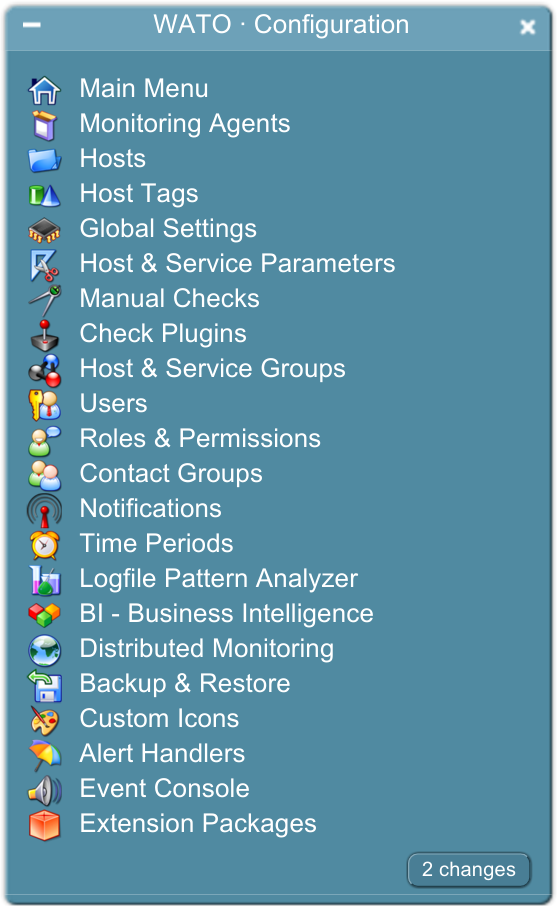
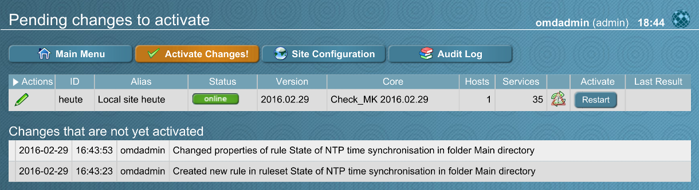
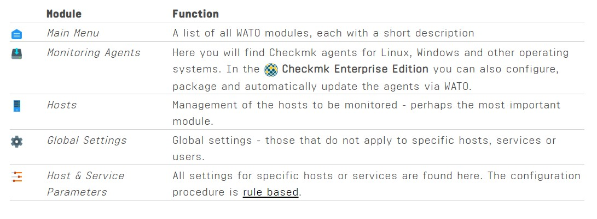
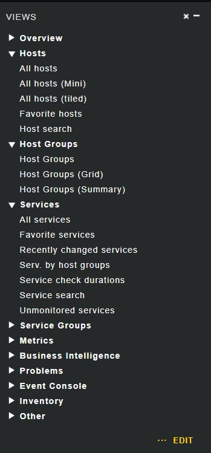
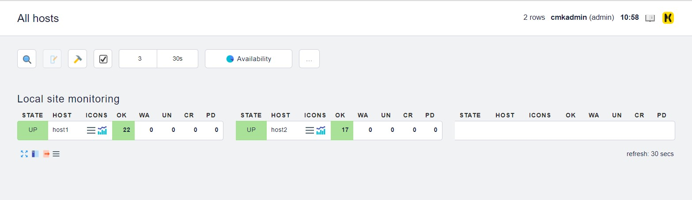
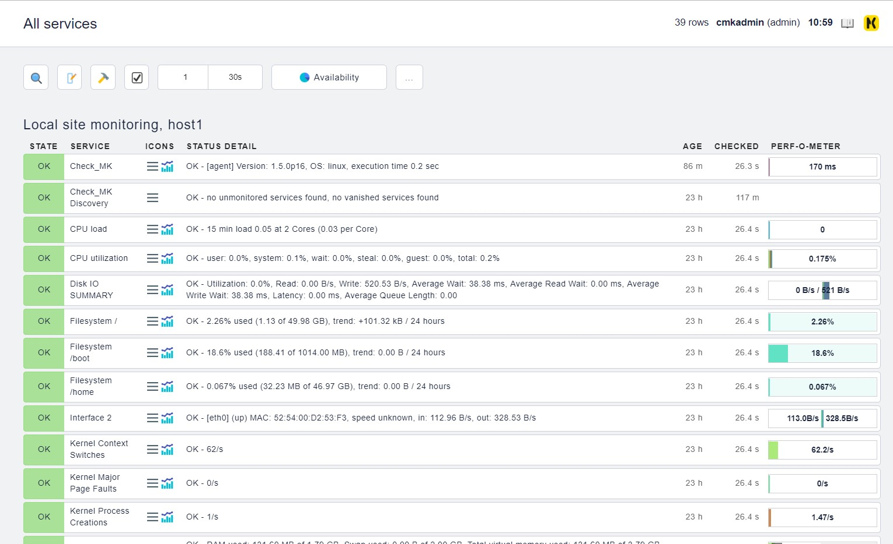
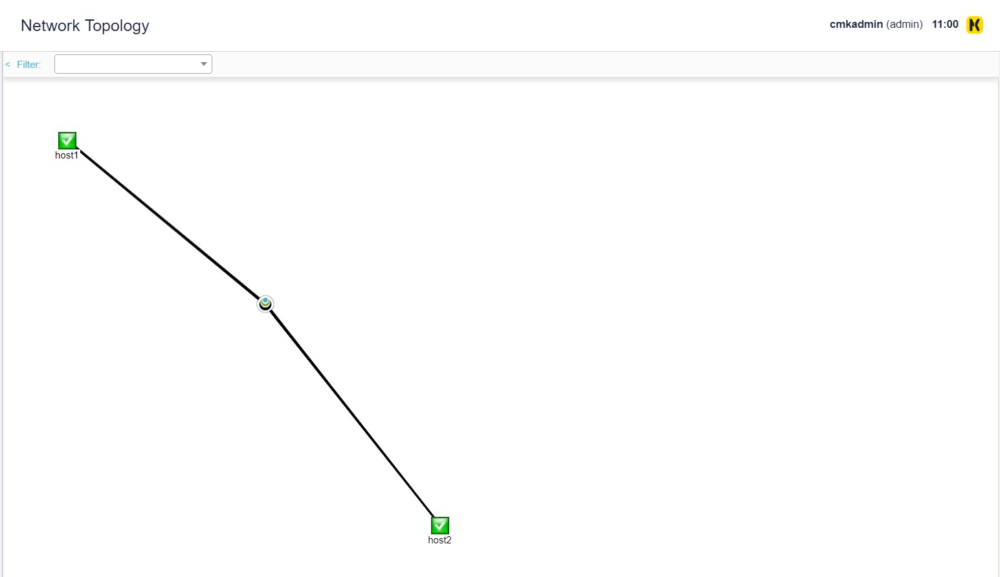
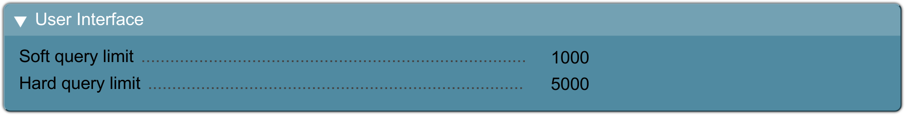

# Tìm hiểu về WATO và các tab chính trên dashboard Check_MK

## Introduction

Check_MK's web-based, GUI có 2 functions:

- Hiển thị các trạng thái hiện tại của tất cả các host, service và event

- Dùng để cấu hình Check_MK, module này là WATO 

Một tính năng của Check_MK interface là nó có thể cùng lúc hiển thị và cấu hình nhiều monitoring instances, và làm nhiệm vụ như một hệ thống lớn. Dưới đây là hình ảnh về giao diện tổng quan của Check_MK:

| | |
|-|-|
| 1 | Phiên bản Check_MK được cài đặt, bấm vào sẽ mở release note của phiên bản |
| 2 | Tactical Overview: Hiển thị số lượng host và service được giám sát, các vấn đề hiện tại và số lượng unhandled. Bạn có thể nhấn vào các con số để nhận thông tin tóm tắt về chúng. Các vấn đề của các host **DOWN** sẽ không hiển thị ở đây. |
| 3 | Quicksearch: Tìm kiếm host và service |
| 4 | Views: Truy cập các hiển thị khác nhau của host/service và các thông tin thêm về monitoring hiện tại |
| 5 | 3 nút công cụ để thay đổi thay công cụ, cấu hình cá nhân, và đăng xuất |
| 6 | Thông tin về logged user, role và thời gian lần page được refresh cuối cùng |
| 7 | Host Statistics: Hiển thị số lượng host trong các trạng thái khác nhau - bởi số và đồ thị true-to-scale |
| 8 | Service Statistics: Hiển thị các service, tương tự Host Statistics |
| 9 | Danh sách tất cả các vấn đề của host đang unhandled. Click vào tiêu đề sẽ mở rộng view |
| 10 | Tương tự 9 |
| 11 | Monitoring event được ghi lại trong vòng 4 tiếng |

Dashboard có thể tuỳ chỉnh được, xem thêm tại [đây](https://mathias-kettner.com/cms_dashboards.html) 

## WATO

### Introduction

Check_MK phân biệt giữa **monitoring** - nơi bạn xem các trạng thái của host/service, và **configuration environment** nơi bạn maintain các host/service và các cấu hình.

Những thay đổi cấu hình (ví dụ như thêm một host mới) sẽ không ảnh hưởng đến monitoring. Các thay đổi phải được kích hoạt trước bởi `Activate Changes` để có thể hoạt động. Điều này có thể hơi cồng kềnh, nhưng lại có lợi vì các thay đổi phức tạp có thể được chuẩn bị kĩ trước khi đưa ra. Ví dụ, sau khi thêm một host mới, bạn có thể muốn thiết lập các ngưỡng hoặc loại bỏ một vài service trước khi "trang bị" thành phần mới.

Công cụ đồ hoạ để cấu hình Check_MK được gọi là WATO (Web Administration Tool). WATO maintains tất cả các cấu hình trong một quy ước text format data mà các người dùng có kinh nghiệm có thể chỉnh sửa thủ công hoặc tạo bởi scripts. WATO có thể được truy cập thông qua thanh công cụ. Element này bao gồm cả chuẩn và các đề nghị truy cập trực tiếp tới tất cả các module WATO.

Mỗi khi bạn thay đổi một cấu hình giám sát sử dụng WATO, thay đổi này trước tiên sẽ được ghi nhận và giữ trong trạng thái **pending**. Các thay đổi này được xác định bởi nút `2 Changes` trên WATO modules và nút `2 changes` ở thanh công cụ. Cả 2 nút này đều mở ra danh sách các thay đổi:

Với nút `Activate Changes`, dữ liệu cấu hình từ WATO sẽ được sử dụng để tạo một cấu hình mới cho lõi giám sát và chỉ thị cho lõi giám sát ngay lập tức bắt đầu sử dụng cấu hình mới:

Danh sách các thay đổi đang đợi sau đó được clear. Các entries này không mất, tuy nhiên chúng nó thể được gọi lại bởi `Audit Log`. Tại đây bạn có thể tìm thấy một file log ghi lại các thay đổi được thực hiện bởi WATO.

### Important WATO modules 

WATO bao gồm một số lượng modules - mỗi cái ứng với một mặt quan trọng của Check_MK. Những modules dưới đây là đặc biệt quan trọng:

## Views

Task quan trọng nhất của Check_MK's user interface là hiển thị trạng thái của các host/service. Điều này được thực hiện trong tab `Views`. 

Trong Views, ta có thể xem tình trạng của các host với `All hosts`

tình trạng các service với `All services`

network topology

### Lưu ý

Tại Views, khi bạn giám sát một số lượng rất lớn các service (khoảng 50.000 service) thì `All service` không chỉ cần thời gian rất lâu để hiển thị, mà còn không hữu dụng. Vì thế để bảo vệ người dùng và hệ thống, Views được cấu hình tối đa hiển thị 1000 entries, nhưng bạn vẫn có thể xem thêm tới 5000 entries bằng cách chọn `Repeat query and allow more results`. Bạn vẫn có thể xem toàn bộ entries với `unlimited` nhưng việc làm mạo hiểm này cần có quyền `Administration rights`. Có thể cấu hình giới hạn hiển thị này tại WATO -> Global Settings -> User interface:

Views cũng có thể tuỳ chỉnh được như Dashboard, xem thêm tại [đây](https://mathias-kettner.com/cms_views.html)

## Tham khảo

https://mathias-kettner.com/cms_wato.html?

https://mathias-kettner.com/cms_user_interface.html

https://mathias-kettner.com/cms_views.html