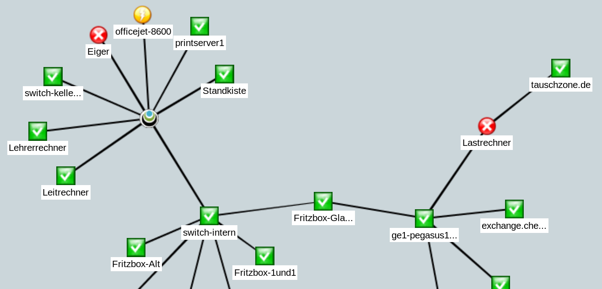

# Các khái niệm cơ bản trong Check_MK

## 1. States và events

Cần phải phân biệt rõ sự khác nhau giữa `states` và `events`. Event là một sự việc xảy ra trong khoảng thời gian nhất định, ví dụ như một SCSI timeout khi truy cập drive X. Nguồn đặc trưng cho events là syslog messages, SNMP traps, Windows Event Log và log data entries. 

States là chỉ một trạng thái duy trì liên tục, ví dụ: drive X is online. Để thường xuyên theo dõi trạng thái của thứ gì đó, hệ thống giám sát phải thường xuyên thăm dò nó. Như ví dụ cho thấy, trong giám sát, thường có thể chọn làm việc với các event hoặc với các state.

Hệ thống giám sát Check_MK có thể chứa cả states và events, nhưng khi được lựa chọn, nó sẽ luôn ưu tiên giám sát dựa trên states vì một số ưu điểm sau:

- Một sự cố trong giám sát sẽ được công nhận ngay lập tức

- Kiểm tra thường xuyên trong khung thời gian cố định cho phép thu thập dữ liệu hiệu suất.

- Check_MK có thể kiểm soát tốc độ mà các states được thăm dò. Không có nguy cơ xảy ra `event storm` trong trường hợp global error.

- Ngay cả trong tình huống hỗn loạn (Ví dụ: mất điện ở trung tâm máy tính), luôn có một trạng thái tổng thể đáng tin cậy

Có thể nói Check_MK giám sát dựa trên trạng thái là tiêu chuẩn. Đối với việc xử lý các trạng thái, đã có [Check_MK Event Console](https://mathias-kettner.com/cms_ec.html).

## 2. Hosts and services

### 2.1 Hosts

Mọi thứ trong Check_MK đều xoay quanh `hosts` và `services`. Một host có thể là:

- Một máy chủ

- Một thiết bị mạng (switch, router, load balancer...)

- Một thiết bị đo lường với một IP kết nối (thermomether, hydrometer...)

- Mọi thứ có địa chỉ IP

- Một cluster với một vài hosts 

Trong giám sát, một host luôn có 1 trong các trạng thái sau:

| State | Màu | ID | Ý nghĩa |
|-------|-----|----|---------|
| UP | Xanh lá | 0 | Host có thể truy cập thông qua mạng (nói chung là nó có thể trả lời PING) |
| DOWN | Đỏ | 1 | Host không trả lời mạng, không truy cập được |
| UNREACH | Cam | 2 | Đường dẫn tới host bị chặn giám sát, vì một router hoặc switch trên đường gặp sự cố |
| PEND | Xám | | Host mới thêm để giám sát, chưa từng được thăm dò trước đó |

Song song với state, một host có một số các thuộc tính khác có thể được cấu hình bởi người dùng:

- Một tên duy nhất

- Một địa chỉ IP

- Tuỳ chọn: một alias, không cần phải là duy nhất

- Tuỳ chọn: một hoặc nhiều **parents**

### 2.2 Parents 

Để cho monitoring có thể đánh giá được trạng thái **UNREACH**, nó cần phải biết đường nào để tới một host cụ thể. Ngoài ra, đối với mỗi máy chủ, một hoặc nhiều máy chủ được gọi là máy chủ gốc có thể được chỉ định. Ví dụ, nếu máy chủ A được thấy bởi monitoring chỉ có thể truy cập thông qua router B, thì B được gọi là một parent của A. Theo cách này thì chỉ có các parent trực tiếp được cấu hình. Ví dụ nữa, một cấu trúc cây được tạo ra với máy chủ giám sát là trung tâm.

Trong ví dụ trên, nếu host **switch-intern** rơi vào trạng thái **DOWN**, monitoring sẽ tự động cho rằng sự cố xảy ra tại **tauschzone.de** có thể giải thích đơn giản là nó không còn có thể truy cập để giám sát nữa, không thể xác định được là nó có gặp sự cố thật không. Lúc này nó sẽ được đặt ở trạng thái **UNREACH**. Nhưng, việc kiểm tra **tauschzone.de** sẽ vẫn tiếp tục, nếu có trả lời, nó sẽ hiển thị trạng thái **UP**. 

Tác vụ quan trọng nhất của parent là để phát hiện ra sự cố trong mạng và tránh các cảnh báo sai trong trường hợp này.

### 2.3 Services

Một host có một số các services. Một services có thể là bất cứ thứ gì (services này không giống với services trên Windows). Một service là một phần hoặc một mặt nào đó của host mà có thể trả về trạng thái OK hoặc là không OK. Tất nhiên, trạng thái chỉ có thể được xác định nếu host đó đang **UP**.

Một service được kiểm tra có thể có các trạng thái sau:

| Trạng thái | Màu | ID | Ý nghĩa |
|------------|-----|----|---------|
| OK | Xanh lá | 0 | Service hoàn toàn trong tầm kiểm soát, mọi giá trị đều nằm trong khoảng cho phép |
| WARN | Vàng | 1 | Chức năng của Service vẫn bình thường, nhưng các thông số đã nằm ngoài khoảng cho phép |
| CRIT | Đỏ | 2 | Service gặp sự cố |
| UNKNOWN | Cam | 3 | Không thể xác định chính xác trạng thái service. Monitoring agent trả về dữ liệu thiếu hoặc yếu tố được kiểm tra đã biến mất |
| PEND | Xám | Service mới được thêm vào và chưa cung cấp dữ liệu kiểm tra |

## 3. Host and Service Groups

Hosts và Services có thể được nhóm lại, một host/service có thể ở trong nhiều nhóm. Các nhóm này là tuỳ chọn và không yêu cầu phải cấu hình. Các nhóm máy chủ có thể hữu ích khi, bên cạnh cấu trúc thư mục mà các máy chủ được quản lý, cần có một nhóm bổ sung. Ví dụ, khi xây dựng cấu trúc thư mục theo vị trí địa lý, sẽ hữu dụng khi có một nhóm máy chủ Linux liệt kê tất cả các máy chủ Linux tại vị trí địa lý đó.

## 4. Contacts và contact groups

Contacts và contact groups chỉ ra khả năng của những người chỉ định đối với hosts và services. Một contact tương quan với một username hoặc web interface. Sự tương quan với hosts và services không xảy ra trực tiếp mà thông qua contact groups. Đầu tiên, một contact được gán vào một contact group. Sau đó hosts hoặc services có thể được gán vào contact group. Hosts và services có thể được gán vào nhiều contact groups.

Việc gán này là hữu dụng với một số lý do:

- Ai có quyền xem?

- Ai có quyền cấu hình và điều khiển hosts và services nào?

- Ai nhận thông báo về vấn đề gì?

User `omdadmin` (từ phiên bản 1.4.0 đổi thành `cmkadmin`), có quyền xem tất cả mọi host và service kể cả khi họ không phải là một contact.

## 5. Users and roles

Trong khi những người chịu trách nhiệm hoặc ủy quyền cho một máy chủ hoặc dịch vụ cụ thể được xác định thông qua các contact và contact group, các đặc quyền của họ được kiểm soát thông qua roles. Check_MK có 3 roles cơ bản:

## 6. Problems, alarms và notifications

### 6.1 Handled và unhandled problems

Check_MK nhận biết mọi host không **UP**, và mọi service không **OK** là một **problem**. Một **problem** có 2 trạng thái: **unhandled** và **handled**. Một vấn đề mới ban đầu sẽ được coi là **unhandled**. Ngay khi có ai đó **confirm** vấn đề, thì nó sẽ được chuyển sang **handled**, tìm hiểu thêm tại [đây](https://mathias-kettner.com/cms_basics_ackn.html). Có thể nói rằng **unhandled problem** là các vấn đề mà chưa ai đảm nhận. 

Các vấn đề về service của hosts không **UP** sẽ không được xác định là vấn đề.

### 6.2 Alerts và notifications

Khi trạng thái của host thay đổi (ví dụ từ **OK** sang **CRIT**), Check_MK ghi một **alert**. Những cảnh báo này có thể tạo ra một thông báo. Check_MK thiết kế khi một host hay service gặp một vấn đề, một email được gửi tới object's contacts (cmkadmin theo mặc định không phải là một contact cho bất kì một object nào). Điều này có thể được tuỳ biến rất linh hoạt. Một cảnh báo còn phụ thuộc vào số lượng tham số. Các thông báo bị chặn khi:

- Thông báo bị deactivated tại master control

- Thông báo bị deactivated trong host/service

- Thông báo bị deactivated cho một trạng thái cụ thể của host/service (ví dụ trạng thái WARN sẽ không có thông báo)

- Vấn đề của một service xảy ra trên host bị **DOWN** hoặc **UNREACH**

- Vấn đề của một host xảy ra khi parents của nó **DOWN** hoặc **UNREACH**

- **notification period** của host/service được thiết lập là không kích hoạt 

- host/service đang trong trạng thái flapping

- host/service đang trong một lịch downtime

Nếu không có điều kiện chặn thông báo nào thoả mãn, lõi giám sát sẽ tạo một thông báo, qua một chuỗi các rules. Trong các rules này, bạn có thể quyết định xem ai sẽ được cảnh báo và cảnh báo được gửi theo kiểu nào (email, SMS,...)

Xem thêm tại [đây](https://mathias-kettner.com/cms_notifications.html)

### 6.3 Flapping hosts và services

Khi một service thay đổi trạng thái nhanh và liên tục. Để tránh các thông báo liên tục được gửi, Check_MK cho service đó vào trạng thái flapping. Khi một service vào trạng thái flapping, một thông báo sẽ gửi đi để thông báo cho người dùng về sự thay đổi này, và chặn các cảnh báo khác. Khi service không còn flapping nữa, các cảnh báo sẽ tiếp tục bình thường.

### 6.4 Scheduled downtimes

Nếu bạn đang tiến hành bảo trì một máy chủ, thiết bị hoặc phần mềm, bạn sẽ muốn tránh các thông báo vào lúc này. 

Khi một host/service có lịch downtime:

- Không có thông báo nào được gửi đi

- Các vấn đề sẽ không hiển thị trên tactical overview

## 7. Timeperiods

Timeperiods được sử dụng trong nhiều cấu hình giám sát khác nhau. Một điển hình của timeperiod là `workhours`, có nghĩa là thời gian từ 8:00 đến 17:00 các ngày trong tuần trừ thứ 7, chủ nhật. `24x7` là mọi lúc mọi ngày và đã được định nghĩa sẵn.

Một vài trường hợp quan trọng sử dụng timeperiod:

- Giới hạn thời gian thông báo được tạo ra (notification period)

- Giới hạn thời gian kiểm tra được thực thi (check period)

- Service times for the evaluation of availability (service period)

- Times during which the event console applies defined rules

## 8. Check interval, check attempts và check period

Trong giám sát dựa trên trạng thái, các kiểm tra được thực thi theo một khoảng thời gian cố định. Check_MK mặc định là một phút check 1 lần. Điều này có thể được thay đổi trong cấu hình:

- Khoảng thời gian dài hơn để tiết kiệm tài nguyên CPU trên máy chủ và hệ thống target

- Khoảng thời gian ngắn hơn để nhận các cảnh báo nhanh hơn và thu thập dữ liệu tốt hơn.

Check period là khoảng thời gian mà các kiểm tra sẽ được thực hiện, các kiểm tra sẽ không thực thi ngoài khoảng thời gian này. Mặc định là 24x7.

Với `max check attempts` bạn có thể tránh các cảnh báo trong trường hợp gặp các lỗi không thường xuyên. Ví dụ đặt là 3, khi service chuyển trạng thái sang CRIT, ban đầu sẽ không có thông báo nào được tạo. Nếu sau 2 lần check tiếp theo mà kết quả trả về khác OK, lúc này mới có thông báo gửi đi.

## Tham khảo

https://mathias-kettner.com/cms_monitoring_basics.html