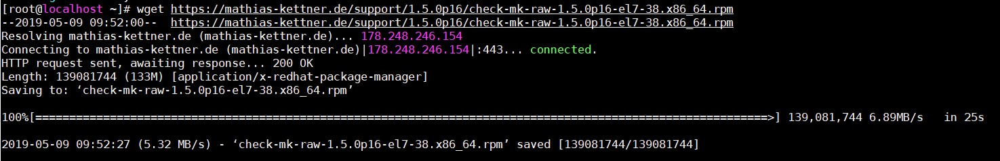
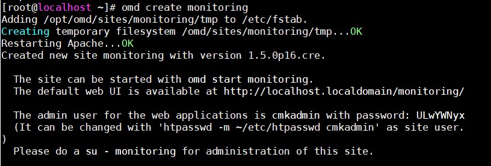
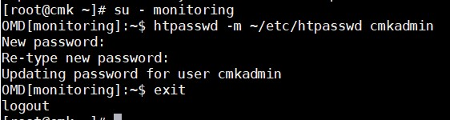
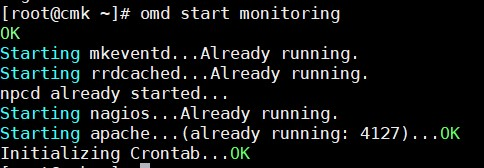
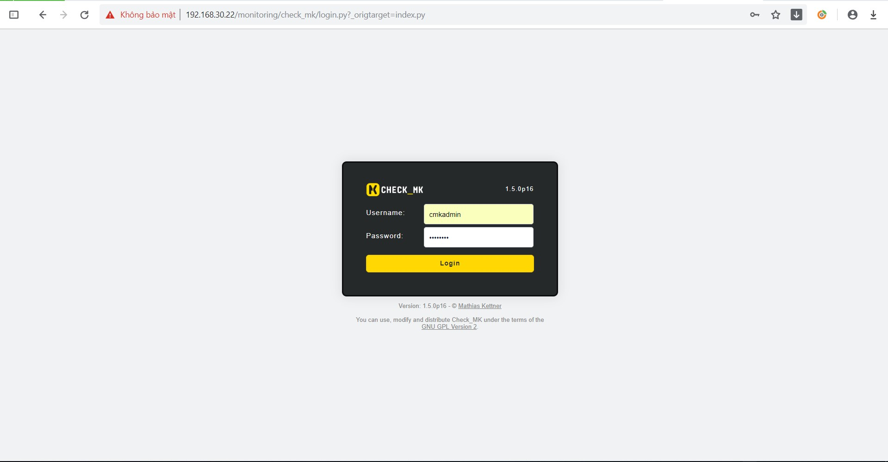
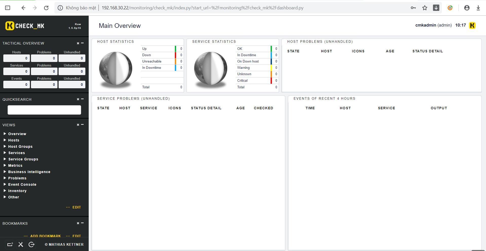

# Cài đặt Check_MK trên CentOS 7

## Prepare

- OS: CentOS 7

- IP: 192.168.30.22

## Cài đặt

- Cài đặt repo EPEL

Check_MK cần khá nhiều các gói dependence đi kèm, vì thế chúng ta cài đặt thêm gói repo này để có thể đáp ứng được một số gói mà local repo không cung cấp.

```
yum install -y epel-release wget
```

- Tải file cài đặt Check_MK

```
wget https://mathias-kettner.de/support/1.5.0p16/check-mk-raw-1.5.0p16-el7-38.x86_64.rpm
```



- Sử dụng `yum` để cài đặt gói rpm, mục đích là để hoàn thiện những gói dependence mà `Check_MK` cần.

```
yum install -y check-mk-raw-1.5.0p16-el7-38.x86_64.rpm
```

### Tạo và khởi động site trên Check_MK

- Tạo site

```
omd create monitoring
```

`monitoring` là tên tuỳ chọn, có thể đặt bất cứ tên gì



- Đổi mật khẩu user `cmkadmin`

```
su - monitoring
htpasswd -m ~/etc/htpasswd cmkadmin
```



- Khởi động site 

```
omd start monitoring
```



- Mở port 80 cho HTTPD trên firewalld

```
firewall-cmd --permanent --add-port=80/tcp
firewall-cmd --reload
```

- Tắt SELinux

Tắt tức thời bằng lệnh

```
setenforce 0
```

Tắt hoàn toàn bằng cách sửa file cấu hình của SELinux

```
vi /etc/selinux/config
```

Sửa dòng `SELINUX=enforcing` thành `SELINUX=disabled`

- Truy cập địa chỉ

```
http://192.168.30.22/monitoring
```

Đăng nhập bằng user `cmkadmin` với mật khẩu đã tạo ở trên.



