# Cài đặt agent trên Host giám sát

## CentOS 7

Đầu tiên, vào web UI để lấy link tải agent cho client. Kéo xuống `WATO - Configuration`, chọn `Monitoring Agent`

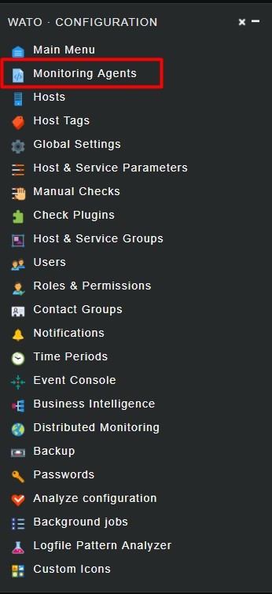

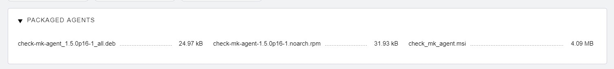

Ở đây có 3 packet dành cho 3 distro:

- .deb: Dành cho các host sử dụng Debian

- .rpm: Dành cho các host sử dụng RHEL

- .msi: Dành cho các host sử dụng MS Windows

Lấy link tải agent cho CentOS 7 bằng cách chuột phải vào gói rpm, chọn Sao chép địa chỉ liên kết. Sau đó qua máy cần cài đặt dùng lệnh wget để tải file.

Kiểm tra `xinet.d` đã được cài đặt chưa

```
rpm -qa | grep xinetd
```

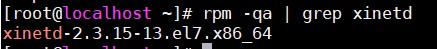

Nếu câu lệnh không trả về kết quả như hình, cài đặt xinetd:

```
yum install -y xinetd
```

Khởi động xinetd và cho khởi động cùng hệ thống:

```
systemctl start xinetd
systemctl enable xinetd
```

Cài đặt agent bằng lệnh:

```
rpm -ivh check-mk-agent-*
```

Để cho phép Check_MK server được truy cập vào host, chúng ta chỉnh sửa file cấu hình agent trên host:

```
vi /etc/xinetd.d/check_mk
```

Có 3 thông số cần phải chỉnh:

- port: 6556

- only_from: Thêm địa chỉ IP server CMK 

- disable: no

Khởi động lại xinetd:

```
systemctl restart xinetd
```

Kiểm tra port đã hoạt động:

```
netstat -npl | grep 6556
```

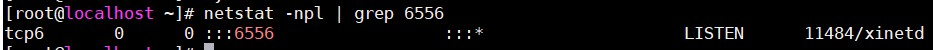

Mở port 6556 trên firewalld:

```
firewall-cmd --add-port=6556/tcp --permanent
firewall-cmd --reload
```

Tắt SELinux:

```
setenforce 0
```

Chỉnh sửa file cấu hình SELinux, sửa dòng `SELINUX=enforcing` thành `SELINUX=disabled`

Sau khi cài thành công, chúng ta cấu hình trên Web UI

## Ubuntu 16.04

Tải agent:

```
wget http://192.168.30.22/monitoring/check_mk/agents/check-mk-agent_1.5.0p16-1_all.deb
```

Cài đặt agent:

```
dpkg -i check-mk-agent_1.5.0p16-1_all.deb
```

Để cho phép CMK Server được truy cập vào host, chúng ta chỉnh sửa file cấu hình agent trên host:

```
vi /etc/xinetd.d/check_mk
```

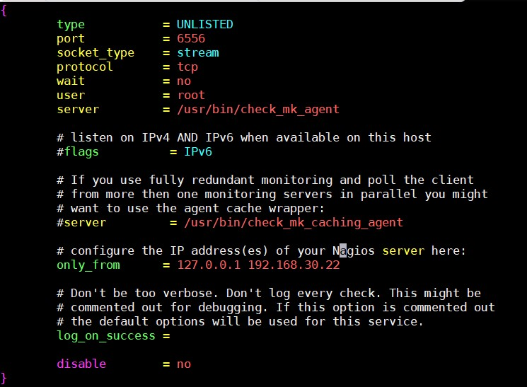

Khởi động lại `xinetd`

```
systemctl restart xinetd
```

Mở port 6556 trên firewalld:

```
ufw allow 6556/tcp
ufw reload
```

Tiếp theo sẽ cấu hình trên Web UI 

## Web UI

Quay lại Web UI, chúng ta sẽ thêm mới 1 host. Đầu tiên vào Menu `WATO Configuration`, chọn `Hosts` và click vào `Create new host`

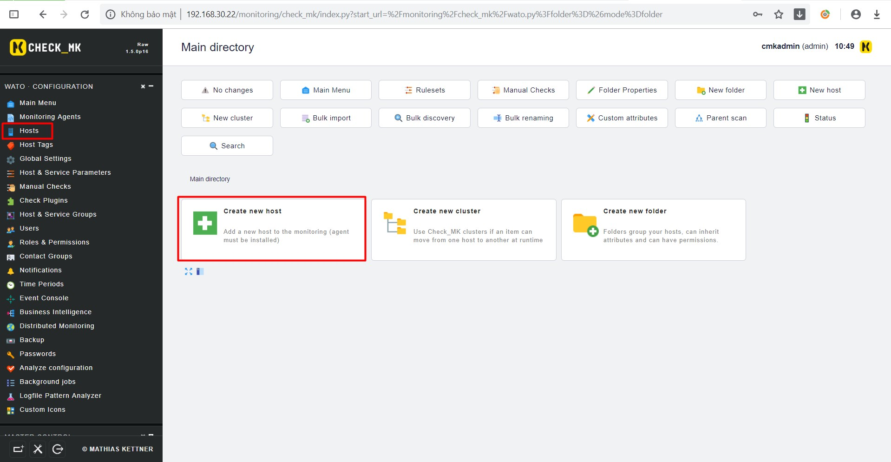

Điền thông tin host 

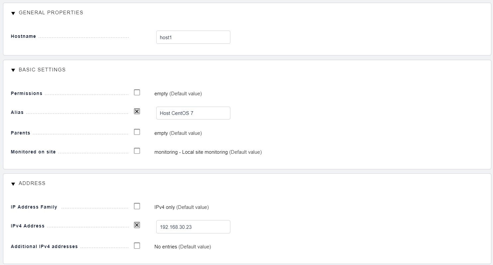

Click vào `Save & go to Services`, sau đó Server sẽ thu thập thông tin từ Agent cài trên host giám sát.

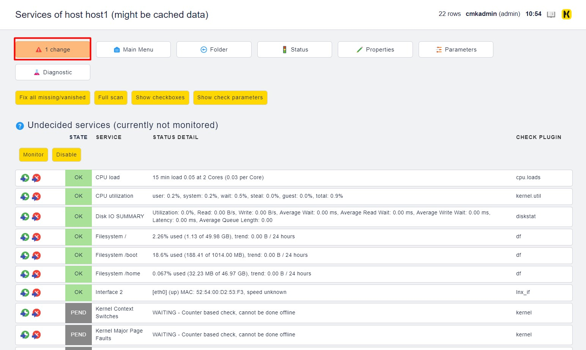 

Bấm vào ô trong hình để active những thay đổi

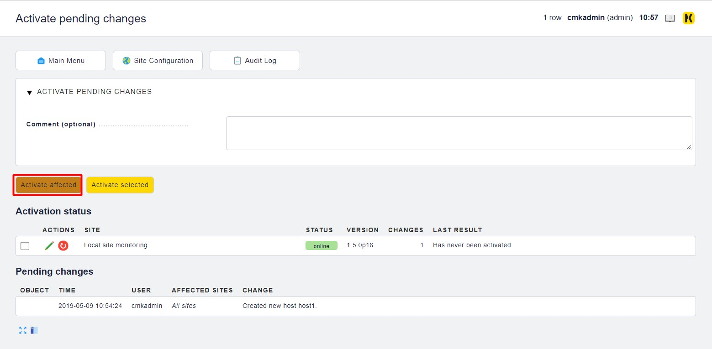

Các thay đổi được Apply thành công.

Tại tab `View`, `Services` > `All Services`, click vào biểu tượng `Refresh` để force check dịch vụ

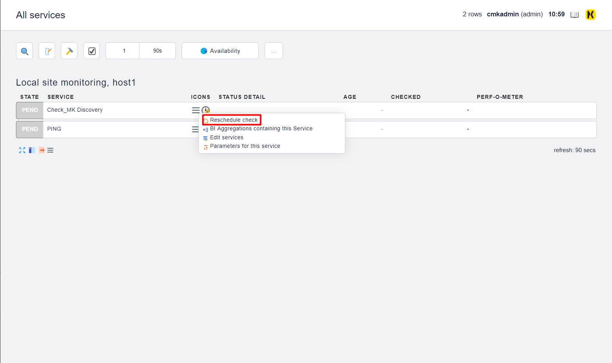

Nếu gặp trường hợp không active được dịch vụ Check_MK_discovery thì làm như sau. Trên `WATO` chọn `Hosts`, sau đó chọn host không active được `Check_MK_discovery` -> Chọn `Services` -> `Fix all missing` -> Sau đó apply change.

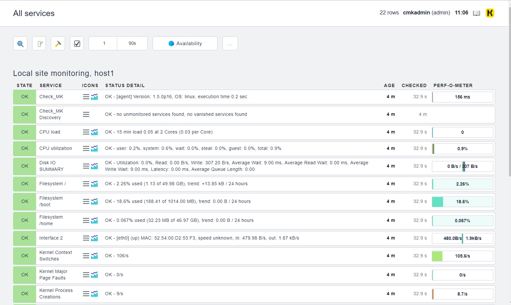