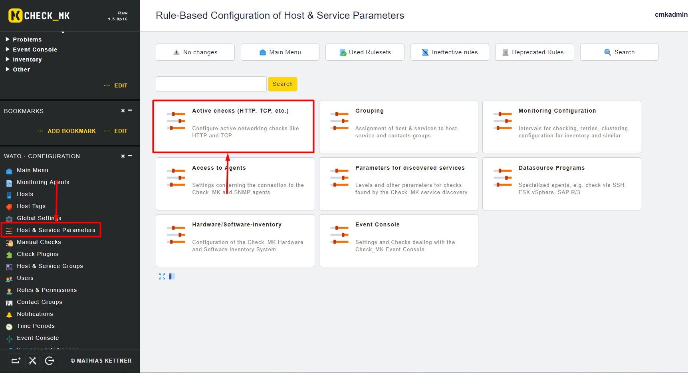
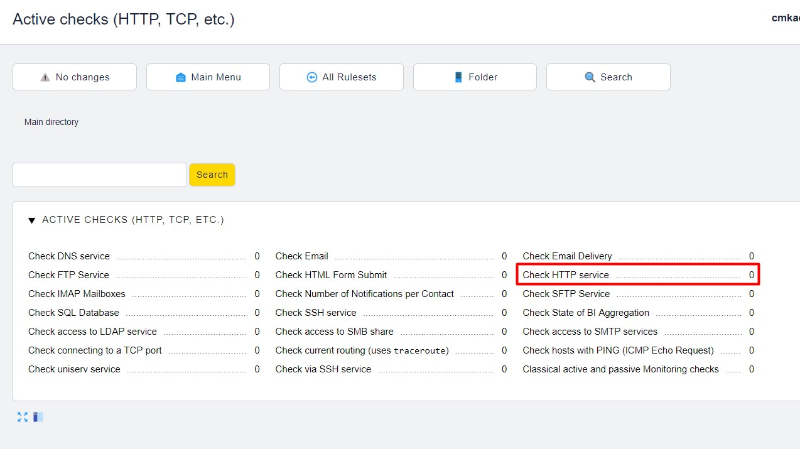
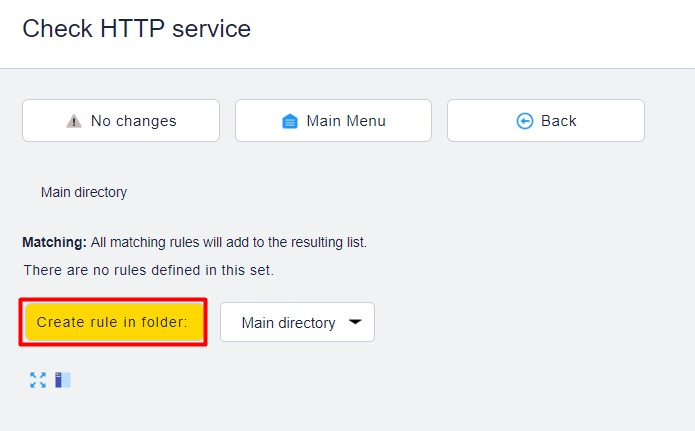
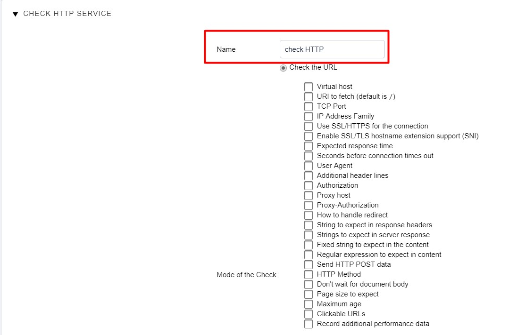
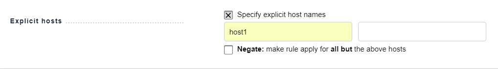
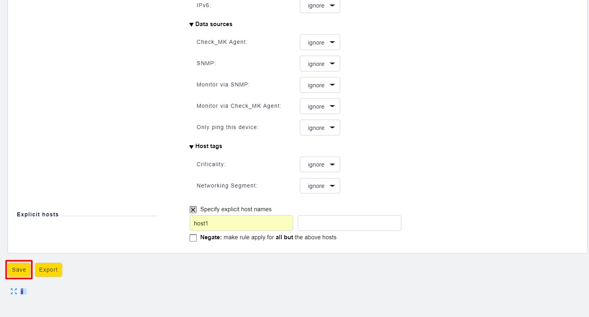
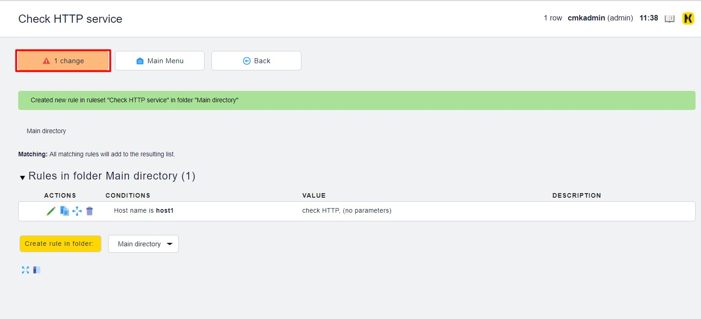
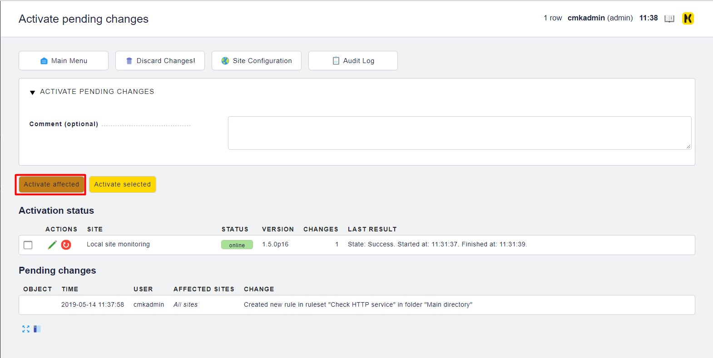
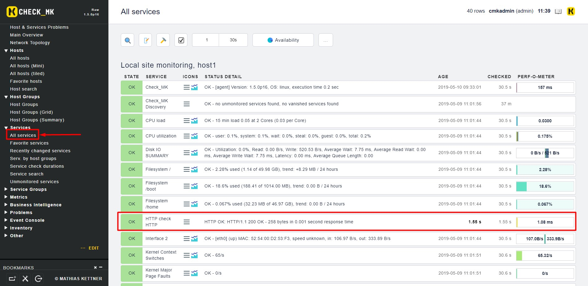

# Cấu hình Active check 

## Thêm dịch vụ giám sát Active Checks

Trên Web UI, chúng ta tìm đến `WATO Configuration`, chọn `Host & Services Parameters`

Ví dụ chọn dịch vụ HTTP:

Bấm vào `Create rule in folder:` để tạo 1 rule mới

Khai báo host cần giám sát:

Bấm Save để lưu:

Lưu các thay đổi:

Kiểm tra lại trên dashboard:

## Tham khảo 

https://github.com/thaonguyenvan/meditech-ghichep-omd/blob/master/docs/3.Active-check.md