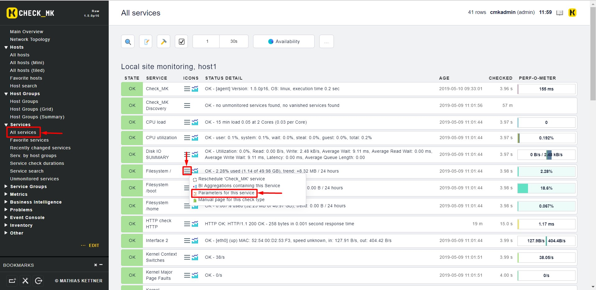
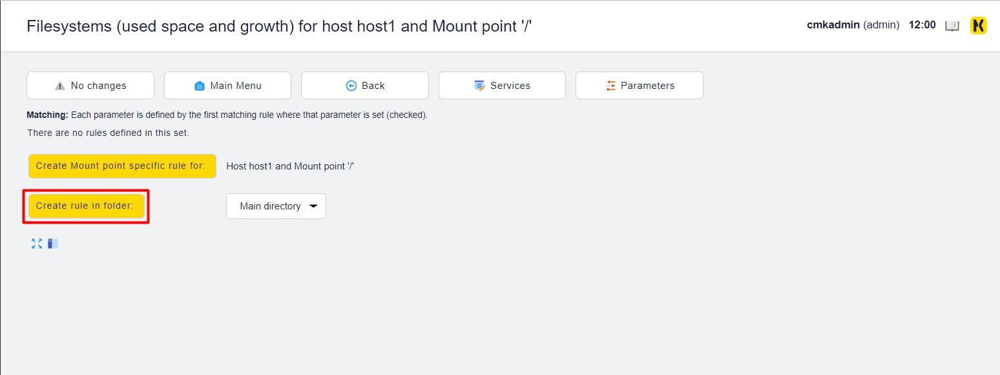
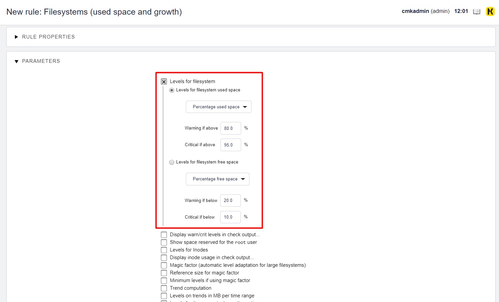
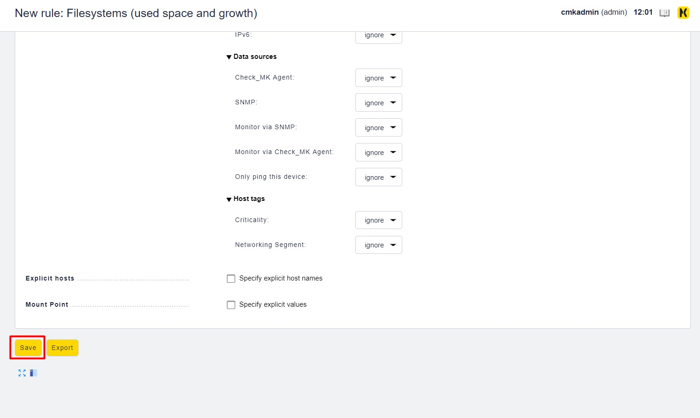
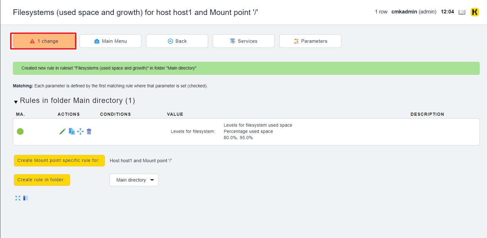
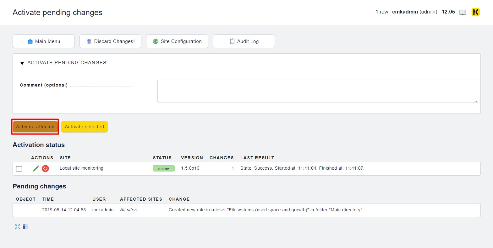

# Đặt ngưỡng cảnh báo cho dịch vụ

Trên Web UI, chúng ta tìm đến `Views`, mở tab `Services` và chọn `All services`

Trong ví dụ này, tôi sẽ đặt ngưỡng cảnh báo khi thư mục `/` được sử dụng 80% dung lượng thì cảnh báo Warning và 95% dung lượng là Critical.

Đặt lại ngưỡng cảnh báo:

Thêm một rule mới:

Thiết lập ngưỡng tại đây:

Lưu lại các thay đổi:

## Tham khảo

https://github.com/thaonguyenvan/meditech-ghichep-omd/blob/master/docs/4.%20Set-threshold.md