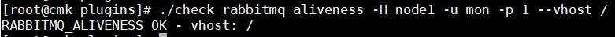
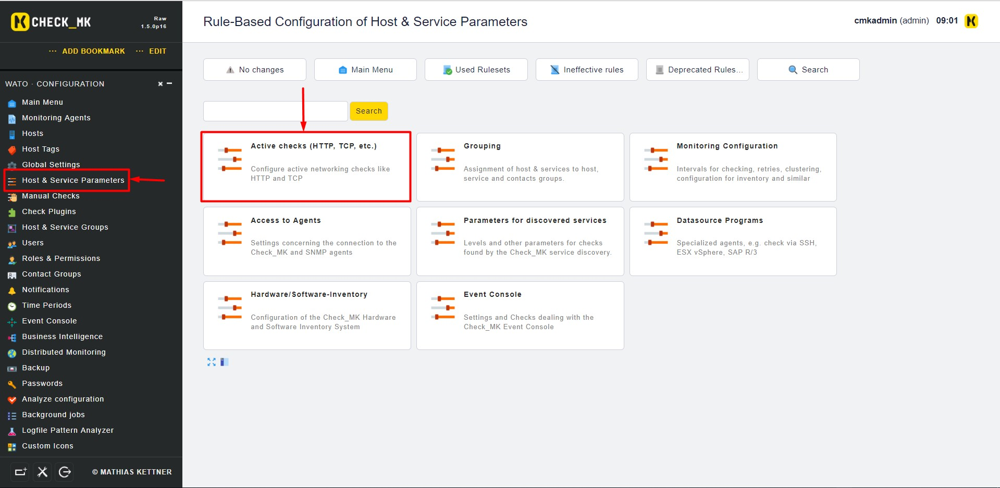
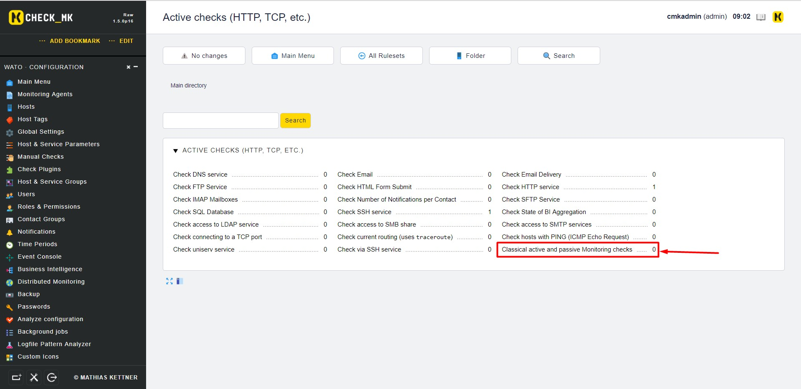
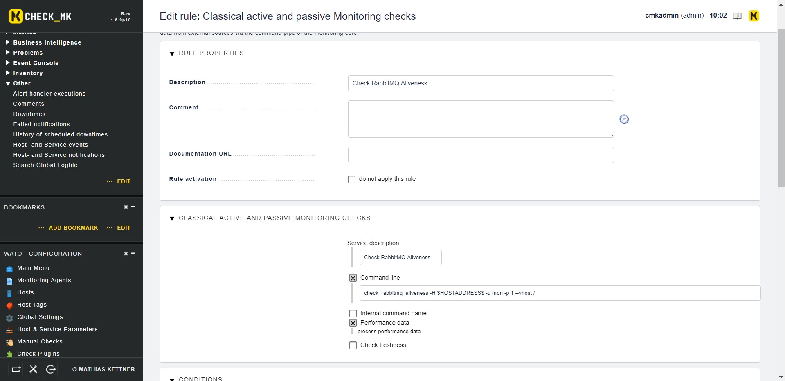
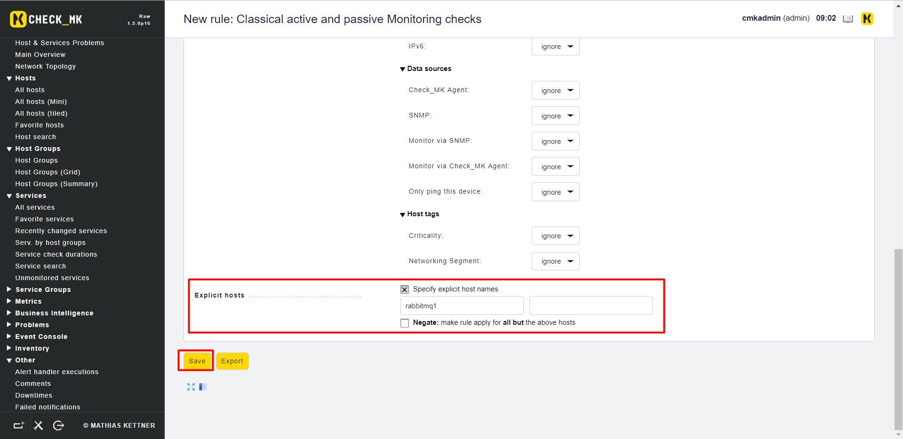
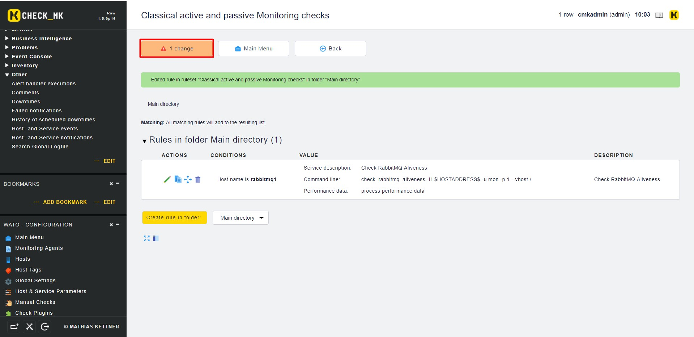
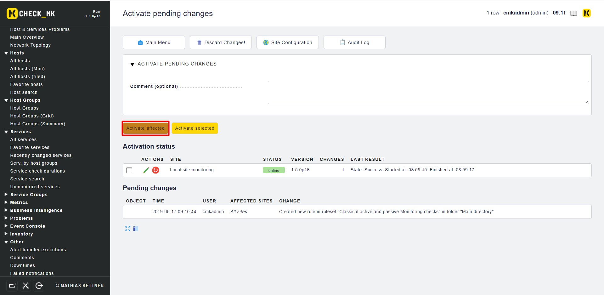
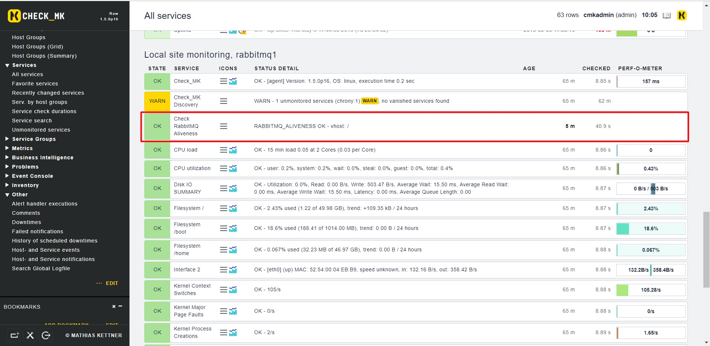

# Giám sát RabbitMQ bằng OMD-Check_MK

## 1. Chuẩn bị Plugin

### 1.1 Host RabbitMQ

Thông tin host RabbitMQ

```
OS: CentOS 7
IP: 192.168.30.24
Hostname: node1
Service: RabbitMQ
```

Đầu tiên, tạo một user có chức năng `monitoring` trên RabbitMQ

```
rabbitmqctl add_user mon 1
rabbitmqctl set_user_tags mon monitoring
rabbitmqctl set_permissions -p / mon ".*" ".*" ".*" 
```

## 1.2 Server OMD 

- **Bước 1**: Cài đặt perl và gói `Monitoring::Plugins` 

```
yum install -y epel-release
yum install -y perl-Monitoring-Plugin perl-Config-Tiny perl-JSON* perl-Math-Calc-Units
```

- **Bước 2**: Cài đặt Plugin trên OMD

Tải plugin, chú ý thay `monitoring` bằng tên site của bạn

```
git clone https://github.com/nagios-plugins-rabbitmq/nagios-plugins-rabbitmq.git
cp nagios-plugins-rabbitmq/scripts/* /opt/omd/sites/monitoring/lib/nagios/plugins
```

Phân quyền cho plugin

```
cd /opt/omd/sites/monitoring/lib/nagios/plugins
chmod +x check_rabbitmq_*
```

- **Bước 3**: Thêm thông tin host RabbitMQ trên OMD server

Thêm thông tin của RabbitMQ server trên file `/etc/hosts` của OMD server

```
vi /etc/hosts
```

Thêm thông tin

```
192.168.30.24 node1
```

**Chú ý**: Thông tin `node1` phải trùng với hostname mà server RabbitMQ đang sử dụng

- **Bước 4**: Chạy thử plugin để biết cách sử dụng 

```
cd /opt/omd/sites/monitoring/lib/nagios/plugins
./check_rabbitmq_aliveness -H node1 -u mon -p 1
```

Tham khảo thêm tại [đây](https://gist.github.com/hoangdh/c86dc9d081882ac116322b45399f0442)



Như vậy, ta thấy script chạy khá ổn. Tiếp đến chúng ta sẽ thêm vào `check_mk`.

## 2. Cấu hình trên Web UI

Đầu tiên, chúng ta cài agent lên host RabbitMQ và thêm nó vào OMD

**Lưu ý**: Phần IP của host chúng ta điền `node1` vì đã khai báo ở phần trên trong file hosts như hình.


Trên Web UI, chúng ta tìm đến **WATO · Configuration** > **Host & Service Parameters** và chọn **Classical active and passive Monitoring checks**





Bấm vào **Create rule in folder:** để tạo thêm 1 rule mới

Điền thông tin plugin



Giải thích:

- **Description**: Mô tả plugin

- **Service description**: Tên hiển thị của plugin

- **Command line**: Câu lệnh sử dụng plugin. Biến **HOSTADDRESS** được sử dụng để gọi địa chỉ của host mà chúng ta khai báo ở trên là `node1`

```
check_rabbitmq_aliveness -H $HOSTADDRESS$ -u mon -p 1 --vhost / 
```

- **Performance data**: Cho phép OMD xử lý, phân tích dữ liệu thu được.

Tiếp theo, chúng ta kéo xuống bên dưới và chọn host `rabbitmq1` vừa thêm:



Lưu lại cấu hình





Kiểm tra lại trên `Services` -> `All services`



Như vậy là đã giám sát thành công RabbitMQ Aliveness, để check các trạng thái khác của RabbitMQ, ta thao tác như trên và thay thế câu lệnh ở bài viết [này](https://gist.github.com/hoangdh/c86dc9d081882ac116322b45399f0442)

## Tham khảo

https://github.com/thaonguyenvan/meditech-ghichep-omd/blob/master/docs/8.1.Monitor-RabbitMQ.md