# Giám sát Mysql bằng OMD - Check_MK

## 1. Chuẩn bị plugin

### 1.1 Chuẩn bị trên host MySQL 

Thông tin host MySQL

```
OS: CentOS 7
IP: 192.168.30.25
Hostname: mariadb
Service: MariaDB
```

- **Bước 1**: Bind địa chỉ của server database

Sửa file `/etc/my.cnf.d/server.cnf` và thêm ở phần `[mysqld]`

```
[mysqld]
bind-address = 0.0.0.0
```

- **Bước 2**: Restart lại dịch vụ

```
systemctl restart mariadb 
```

- **Bước 3**: Tạo user kiểm tra cho OMD

Ở phần này chúng ta cần tạo một USER có quyền USAGE trên host DB

Đăng nhập vào MySQL

```
mysql -u root -p 
```

Thực hiện câu lệnh sau:

```
GRANT usage ON *.* TO 'checker'@'%' IDENTIFIED BY '123';
```

`checker`: Tên của user dùng cho OMD có thể truy xuất vào DB (Tuỳ chọn)

`123`: Mật khẩu của `checker` (Tuỳ chọn)

### 1.2 Chuẩn bị trên server OMD

- **Bước 1**: Cài đặt các gói đi kèm trên OMD server

Thêm repo của MariaDB

```
vi /etc/yum.repos.d/MariaDB.repo
```

Thêm nội dung:

```
[mariadb]
name = MariaDB
baseurl = http://yum.mariadb.org/10.3/centos7-amd64
gpgkey=https://yum.mariadb.org/RPM-GPG-KEY-MariaDB
gpgcheck=1
```

Cài gói MariaDB-client và DBI, DBD::mysql

```
yum install MariaDB-client perl-DBI perl-DBD-MySQL -y
```

- **Bước 2**: Cài đặt plugin trên OMD

Kiểm tra plugin, chú ý thay `monitoring` bằng tên site của bạn. Kiểm tra plugin `check_mysql_health` trong thư mục chứa plugin của OMD. Vì plugin này đã tích hợp sẵn vào OMD.

```
cd /opt/omd/sites/monitoring/lib/nagios/plugins
ll check_mysql*
```

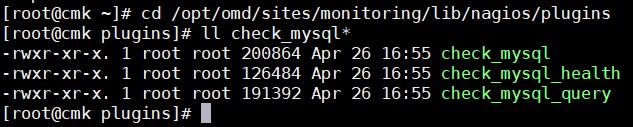

- **Bước 3**: Chạy thử plugin 

```
cd /opt/omd/sites/monitoring/lib/nagios/plugins
./check_mysql_health --hostname 192.168.30.25 --username checker --password 123 --mode connection-time --warning 3 --critical 5
```

**Chú ý**: Thay thế user và password của bạn vào câu lệnh nếu có thay đổi thông tin ở bước tạo user.

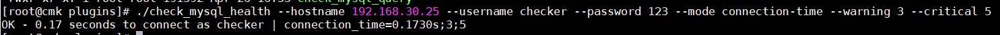

## 2. Cấu hình trên Web UI

Đầu tiên, chúng ta cài agent lên host DB - MySQL và thêm nó vào OMD

Thông tin như hình

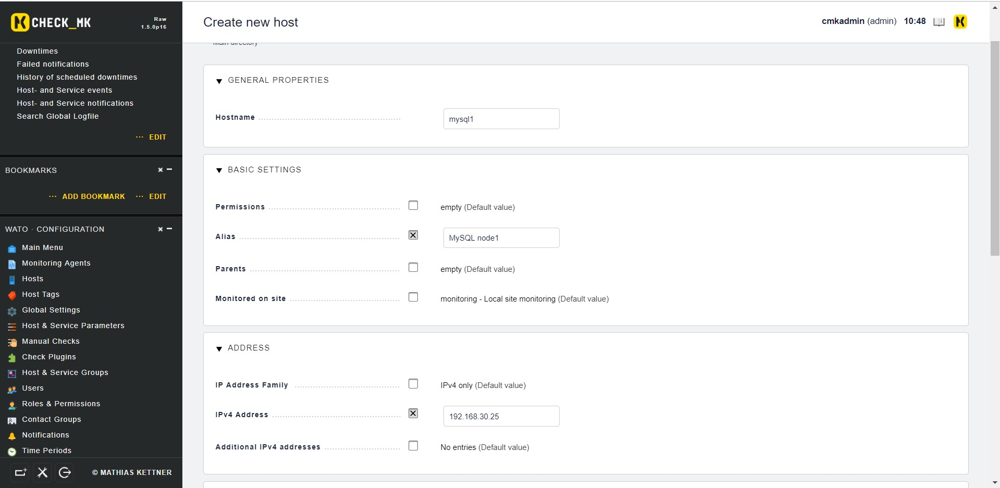

Trên Web UI, chúng ta tìm đến **WATO · Configuration** > **Host & Service Parameters** và chọn **Classical active and passive Monitoring checks**

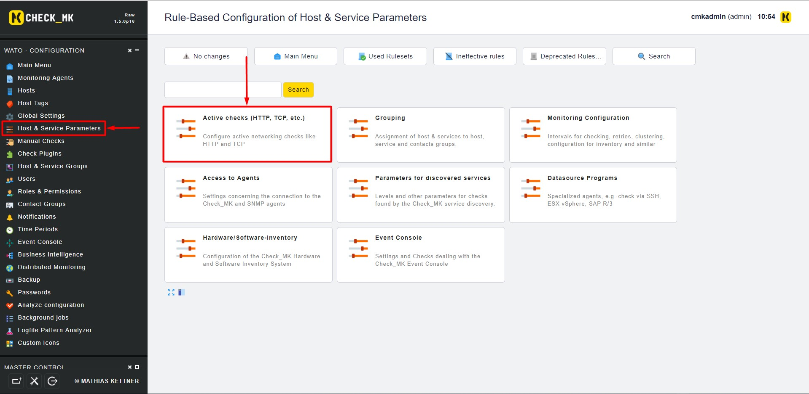

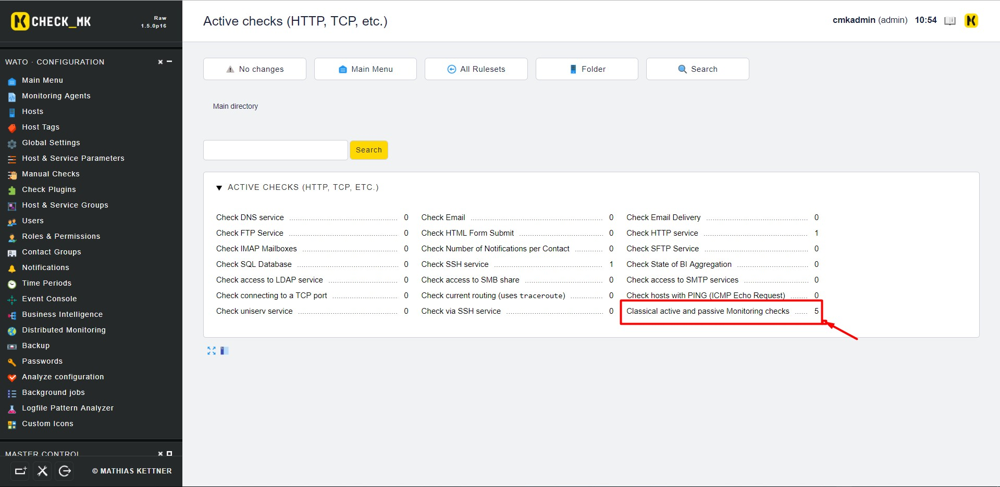

Bấm vào **Create rule in folder** để tạo thêm 1 rule mới

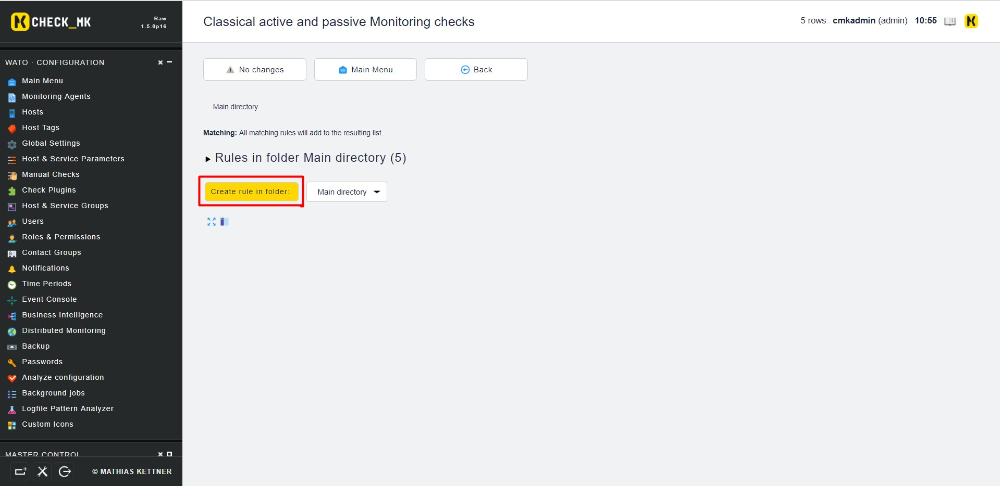

Điền thông tin của plugin

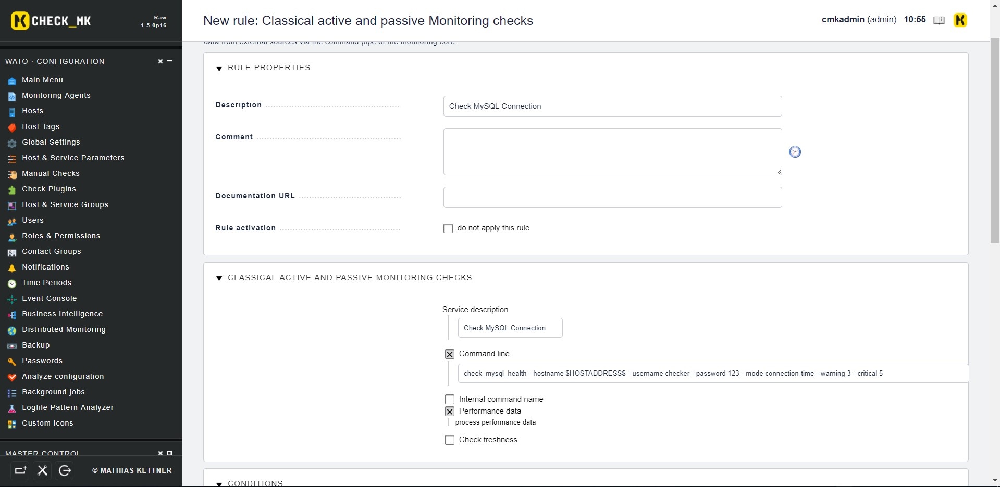

Giải thích:

- `Description`: Mô tả plugin

- `Service description`: Tên hiển thị của plugin

- `Command line`: Câu lệnh sử dụng plugin

```
check_mysql_health --hostname $HOSTADDRESS$ --username checker --password 123 --mode connection-time --warning 3 --critical 5 
```

- `Performance data`: Cho phép OMD xử lý, phân tích dữ liệu thu thập được

Tiếp theo, kéo xuống bên dưới và chọn host `mysql1` vừa thêm 

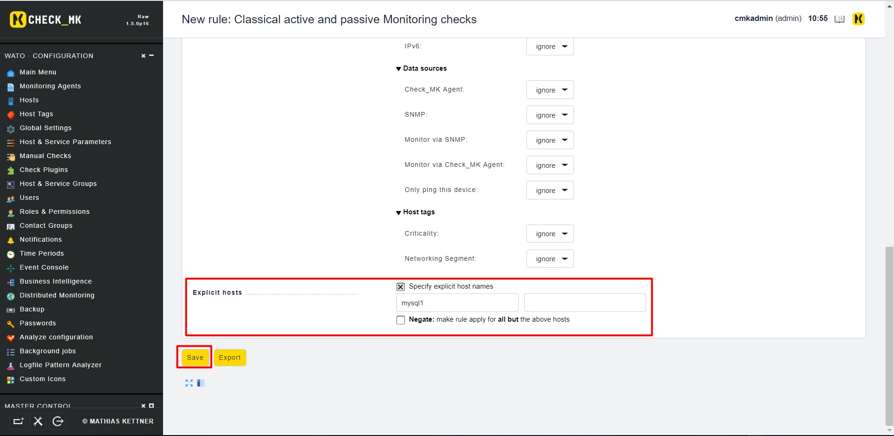

Lưu lại cấu hình 

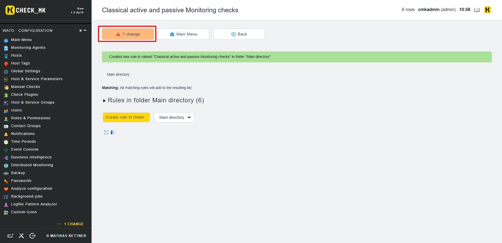

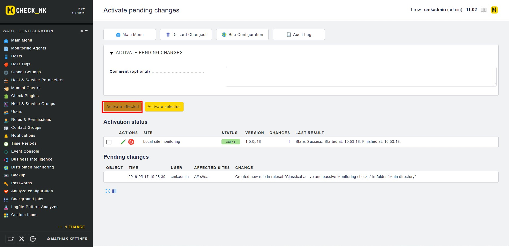

Kiểm tra thông tin trên `Services` -> `All services`

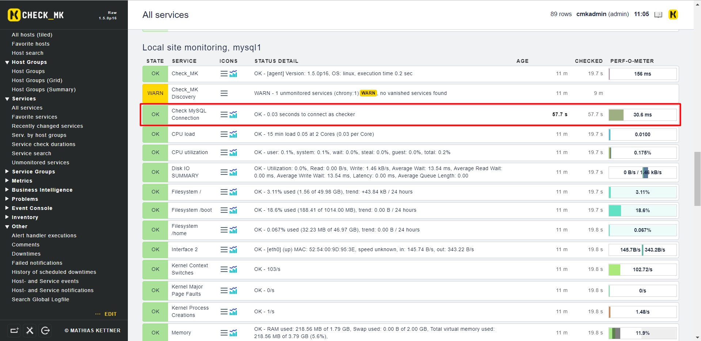

Để check thêm các MODE khác trong plugin với MySQL, chúng ta thao tác như trên và thay thế câu lệnh ở bài viết [này](https://gist.github.com/hoangdh/c5aab8dc05dca9710d3b98a782251352), xem file [excel](https://goo.gl/shx5jx) để biết thông tin các MODE

## Tham khảo

https://github.com/thaonguyenvan/meditech-ghichep-omd/blob/master/docs/8.2.Monitor-MySQL.md