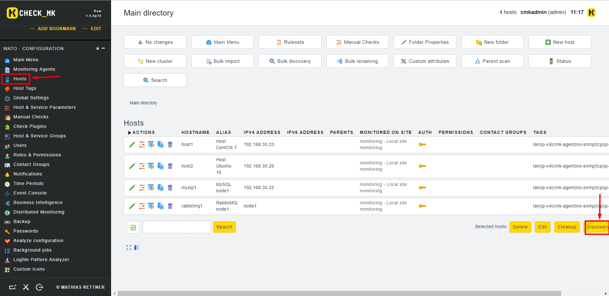
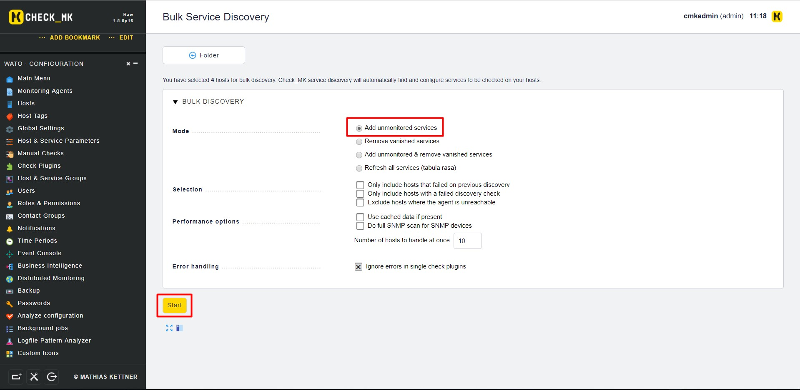
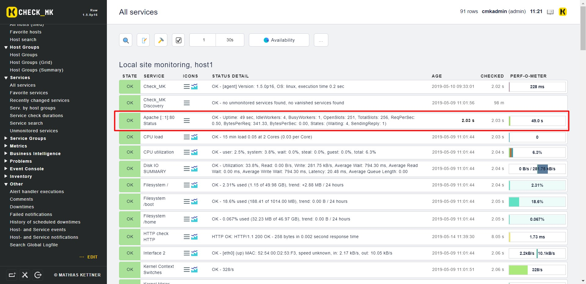

# Giám sát Apache bằng OMD - Check_MK

Bài này chúng ta sẽ thực hiện giám sát một máy chủ CentOS 7 cài web server apache (httpd).

- Cài đặt httpd trên máy client

```
yum install httpd -y 
```

- Dùng trình soạn thảo `vi` mở file cấu hình `/etc/httpd/conf/httpd.conf` và thêm vào đoạn module sau:

```
<IfModule mod_status.c>
<Location /server-status>
SetHandler server-status
Order deny,allow
Deny from all
Allow from 127.0.0.1 ::1
</Location>
# Keep track of extended status information for each request
ExtendedStatus On
</IfModule>
```

- Copy file plugin từ máy chủ OMD qua máy Client

```
scp /opt/omd/versions/1.5.0p16.cre/share/check_mk/agents/plugins/apache_status root@192.168.30.25:/usr/lib/check_mk_agent/plugins/
```

- Phân quyền cho file plugin:

```
chmod +x /usr/lib/check_mk_agent/plugins/apache_status
```

- Sau đó chuyển qua giao diện web chọn `Hosts` rồi chọn `Discovery`



- Sau đó chọn `Start`



- Sau đó chọn `Finish` rồi `Save Change` để lưu cấu hình

- Kiểm tra lại kết quả



## Tham khảo 

https://github.com/thaonguyenvan/meditech-ghichep-omd/blob/master/docs/8.3.Monitor-apache.md