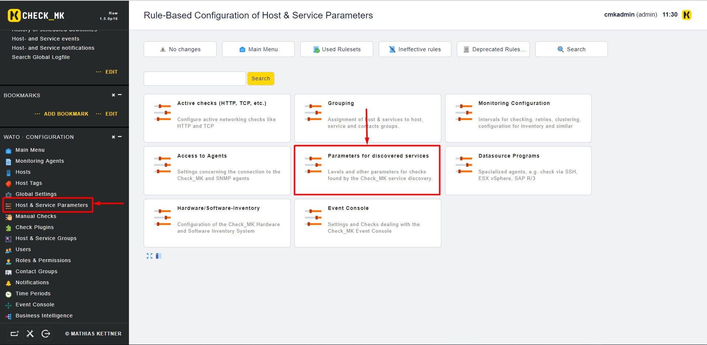
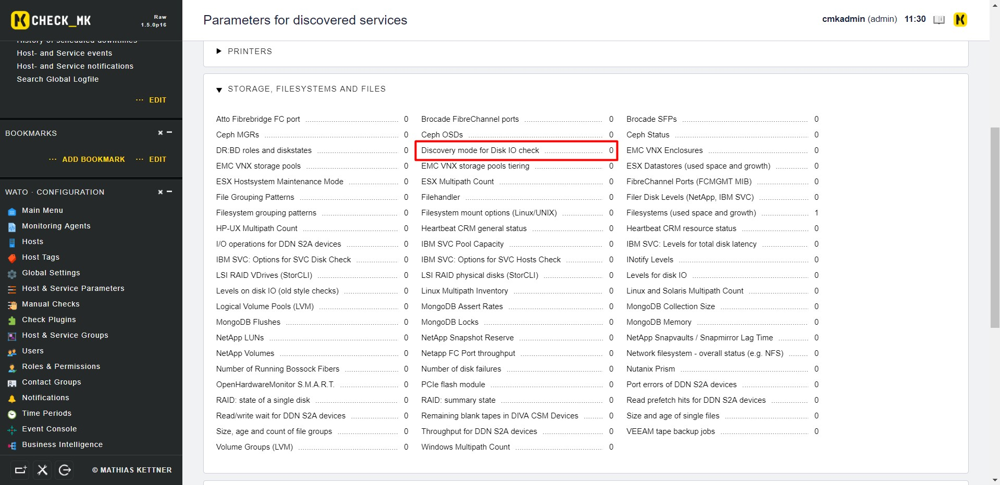
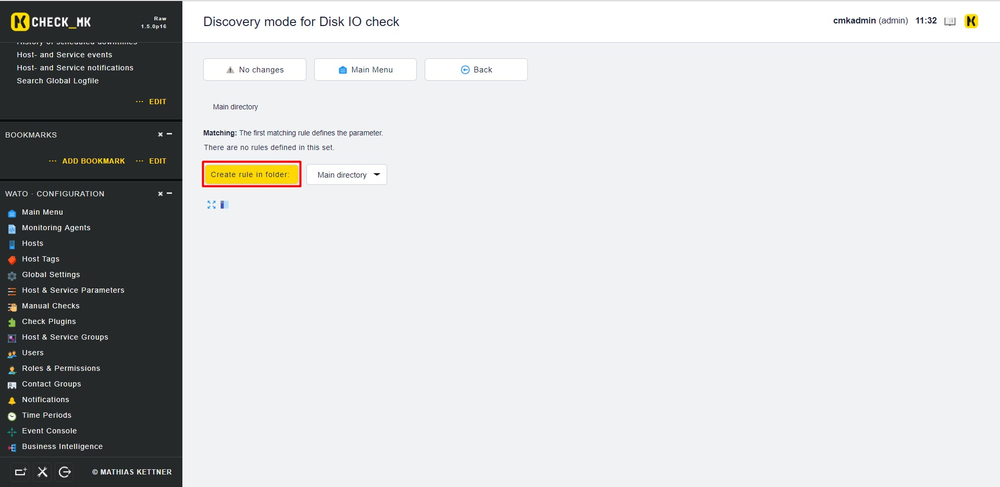
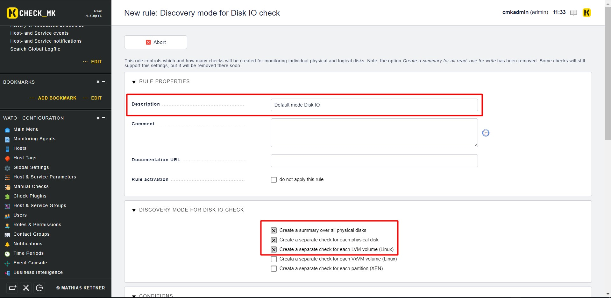
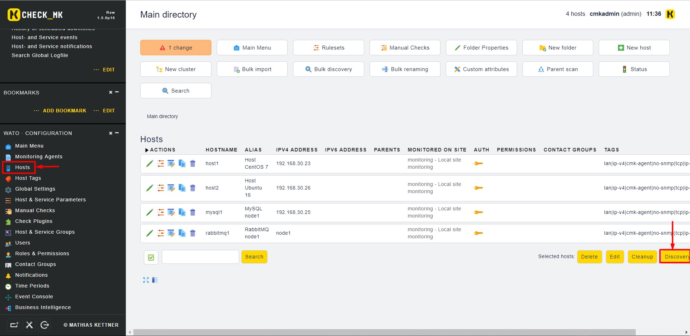
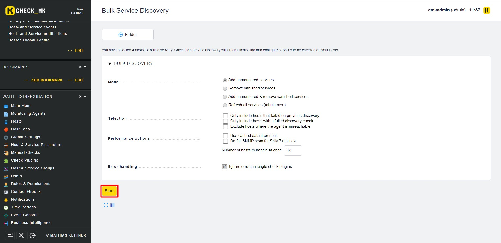
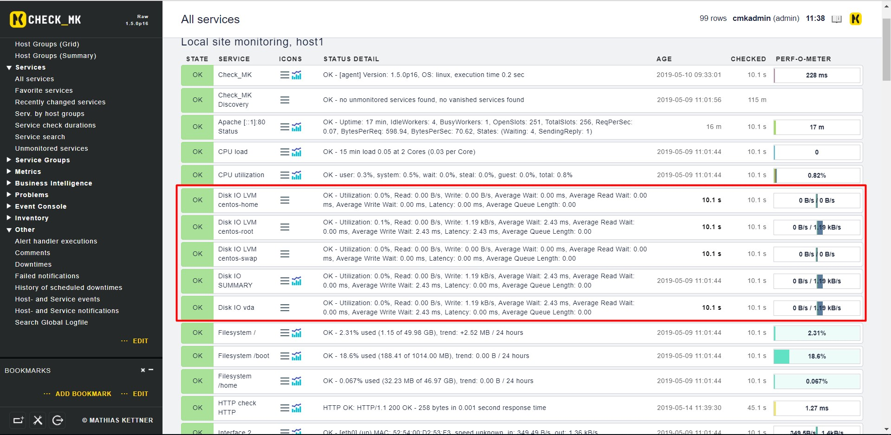

# Monitor file system

Mặc định thì check_mk sẽ gộp chung các vùng nhớ của chúng ta lại với nhau để giám sát dưới thông số `DISK IO SUMMARY`. Tuy nhiên như thế này chúng ta không thể theo dõi được các vùng nhớ hay ô nhớ khác trên hệ thống. Để tách riêng từng vùng nhớ chúng ta sử dụng `Host & Service Parameters` để thực hiện việc này.

Các bước thực hiện:

- Trên `WATO` chọn `Host and Service Parameters` rồi chọn `Parameters for Discovered Services`:

- Tại mục `Storage, Filesystems and Files` chọn `Discovery mode for DISK IO check`

- Chọn `Create rule in folder`

- Điền các thông tin sau:

- Sau đó chọn `Save`. Chưa vội `Active Change`, tại `WATO` chọn `Hosts` rồi chọn `Discovery`

- Chọn `Start`

- Sau đó chọn `Finish` rồi lúc này hãy `Active Change`

- Kiểm tra kết quả

## Tham khảo 

https://github.com/thaonguyenvan/meditech-ghichep-omd/blob/master/docs/8.4.Monitor-Filesystem.md