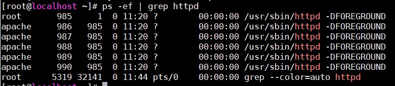
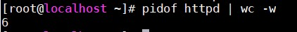
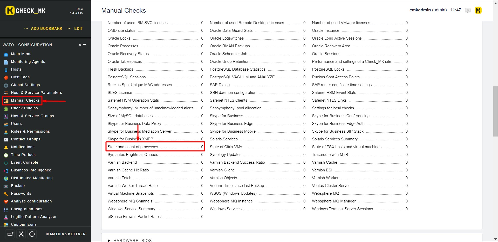
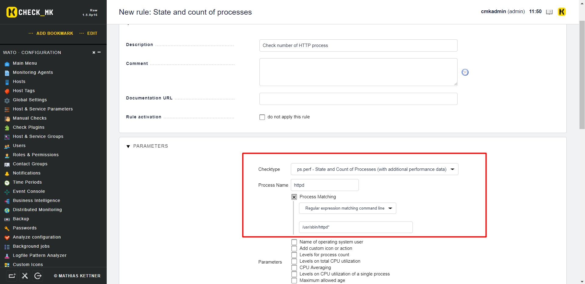

# Giám sát số lượng process của một dịch vụ

Trong bài lab này sẽ thực hiện đếm số process của dịch vụ `HTTP`

- Đầu tiên chúng ta cần kiểm tra xem các process của `HTTP`:

```
ps -ef | grep httpd
```

- Kết quả thu được:



- Sử dụng câu lệnh sau để tiến hành đếm số process hiện có với dịch vụ `HTTP`:

```
pidof httpd | wc -w
```

- Kết quả thu được 



- Như vậy có thể thấy rằng dịch vụ `HTTP` hiện đang có 6 process trên hệ thống

- Bây giờ tiến hành giám sát các tiến trình của dịch vụ `HTTP`. Đầu tiên, tại `WATO` chọn `Manual Checks` rồi chọn `State and count of processes`



- Chọn `Create rule in folder`


- Điền các thông số về process muốn giám sát



- `Save` lại và kiểm tra kết quả 


## Tham khảo

https://github.com/thaonguyenvan/meditech-ghichep-omd/blob/master/docs/8.5.Monitor-numbers.md