# Monitor VMWare ESXi bằng OMD - Check_MK

## 1. Cài đặt agent

- **Bước 1**: Tại `WATO`, chọn `Monitoring Agents` và tải gói Agent có đuôi `.msi` về

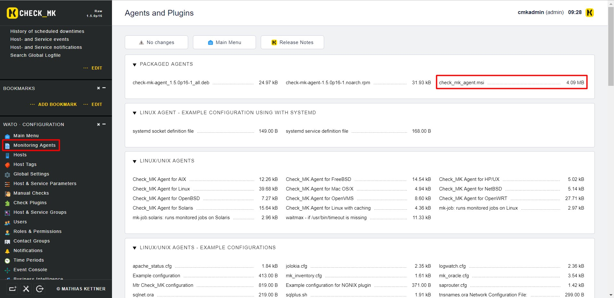

- **Bước 2**: Sau khi tải về, tiến hành cài đặt bình thường

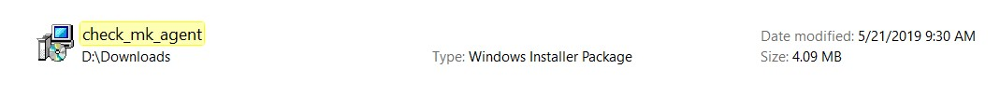

- **Bước 3**: Kiểm tra Service đã hoạt động chưa

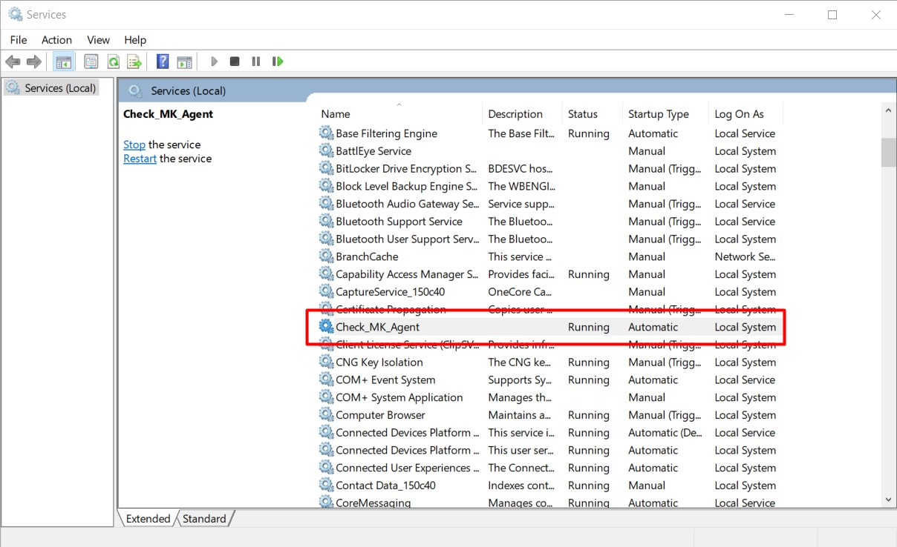

- **Bước 4**: Nếu có sử dụng firewall, cần phải tạo rule cho firewall với port 6556

Vào `Windows Defender Firewall with Advanced Security`, chọn `Inbound Rules` -> `New Rule`

Chọn Port như trong hình, sau đó chọn `Next`

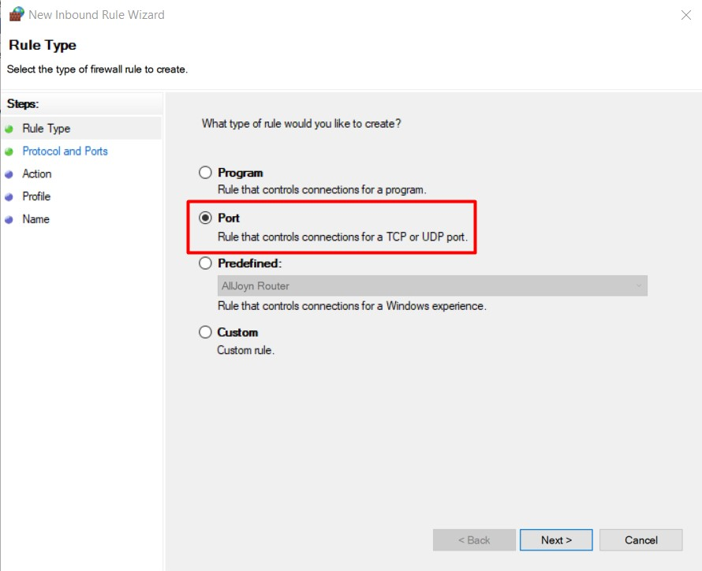

Chọn như hình và điền port 6556, sau đó `Next`

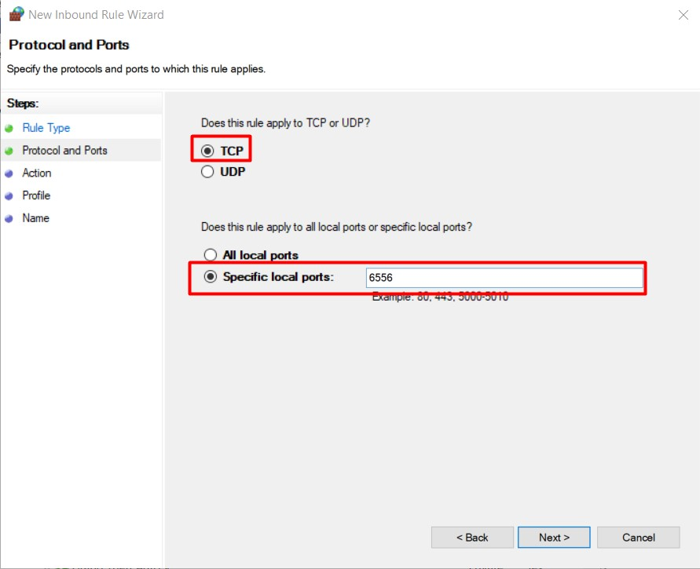

Chọn `Allow the connection`, sau đó `Next` 

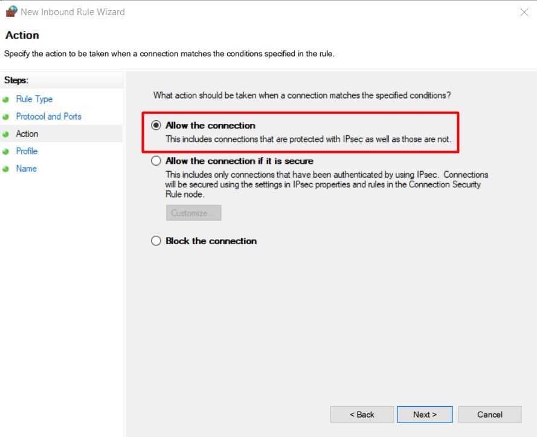

`Next` đến bước `Name` thì điền tên cho rule rồi `Finish` là xong

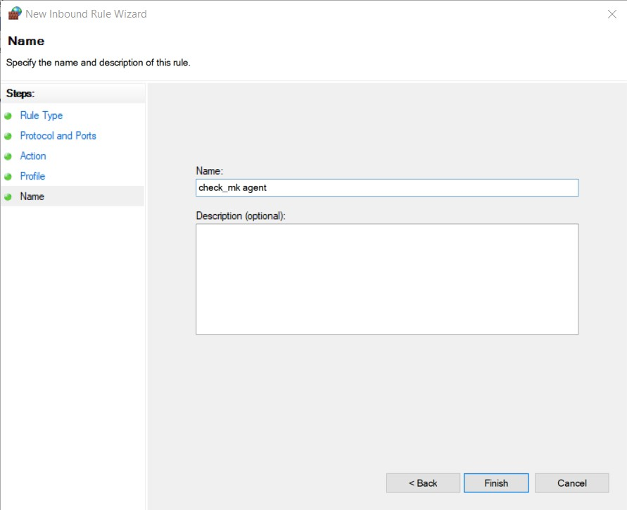

Làm tương tự với Outbound Rule 

## 2. Add host trên Dashboard

Thêm host trên WATO tương tự như ở [đây](https://github.com/doedoe12/Internship/blob/master/Monitor/Check_MK/Thuc_hanh/02.Install-agent.md)

## 3. Kết quả

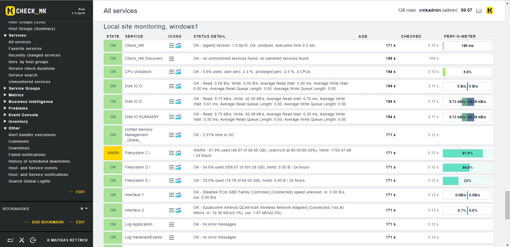

## 4. Monitor services windows

Cách giám sát các services cụ thể trên Windows

- Trên `WATO` chọn `Host & Service Parameters` -> `Parameters for discovered services`

- Tiếp theo trong mục `DISCOVERY - AUTOMATIC SERVICE DETECTION` chọn `Windows Service Discovery`

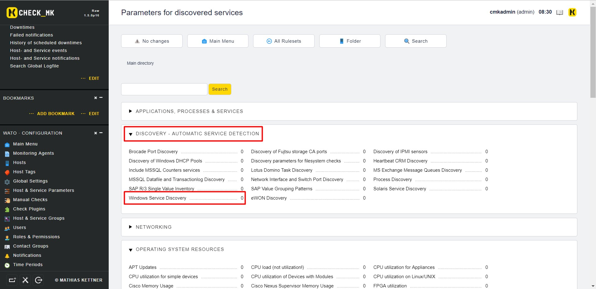

- Chọn `Create rule in folder`

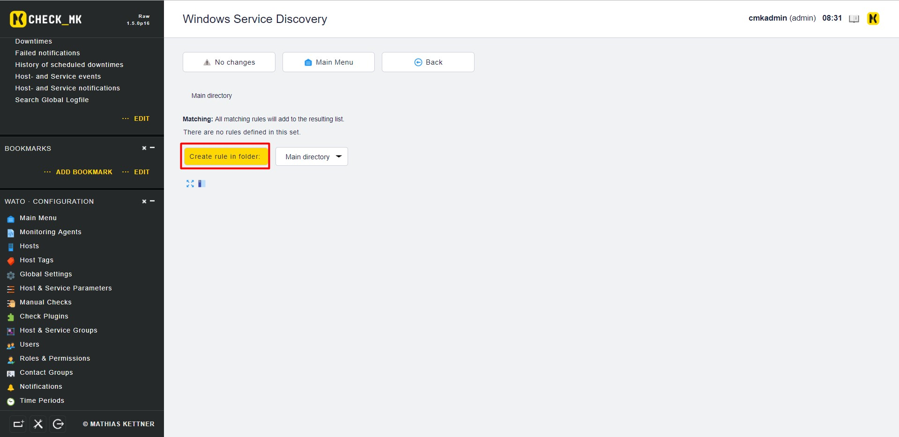

- Tích vào ô `Services (Regular Expressions)` và điền Service Name vào ô

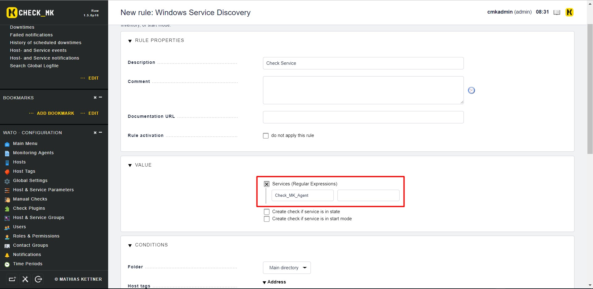

- Điền tên host rồi chọn `Save` và Activate Changes

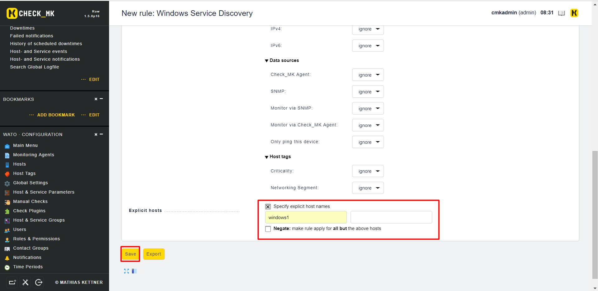

- Trên `WATO` chọn `Host` - `Discovery`

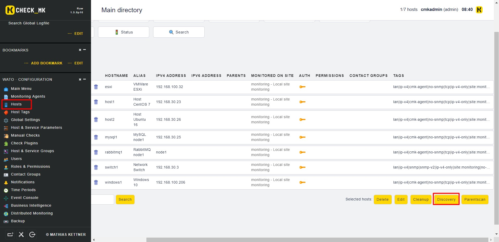

- Chọn `Start` 

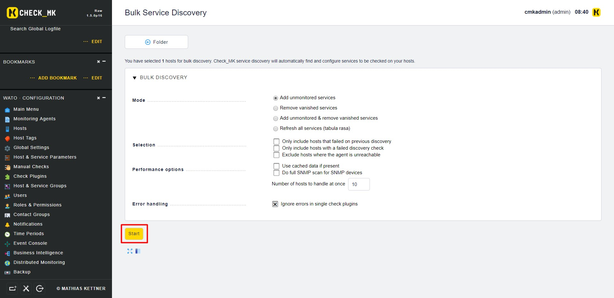

- `Finish` để hoàn thành

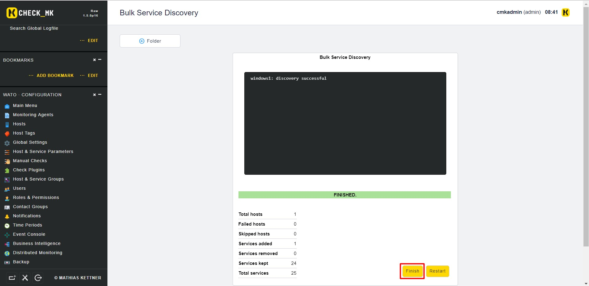

- Kiểm tra trên dashboard

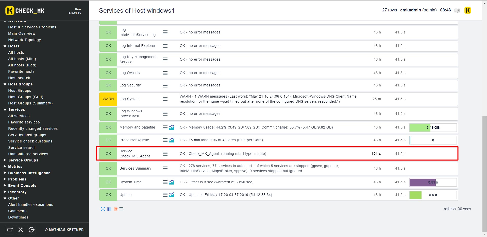