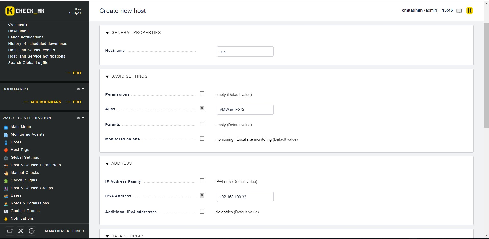
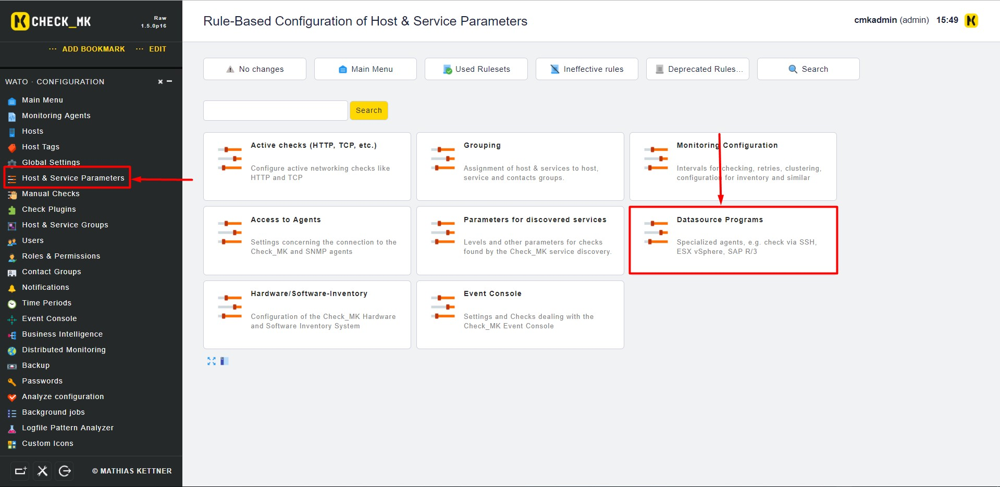
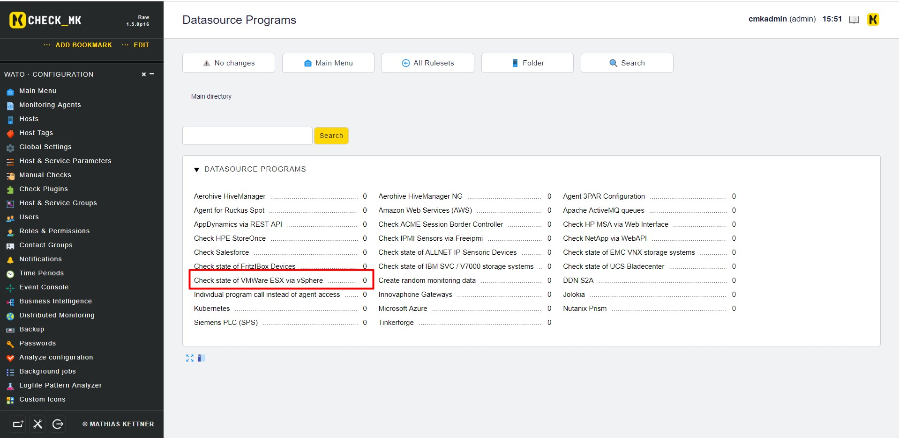
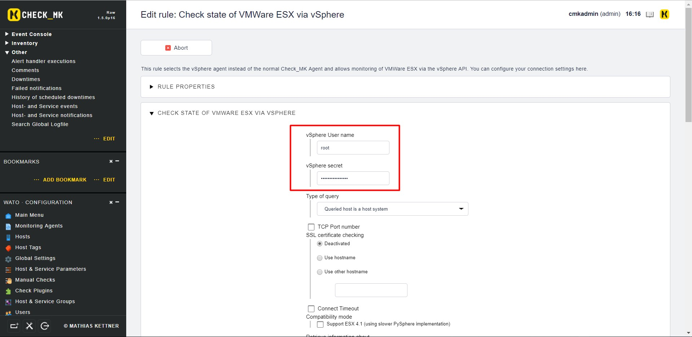
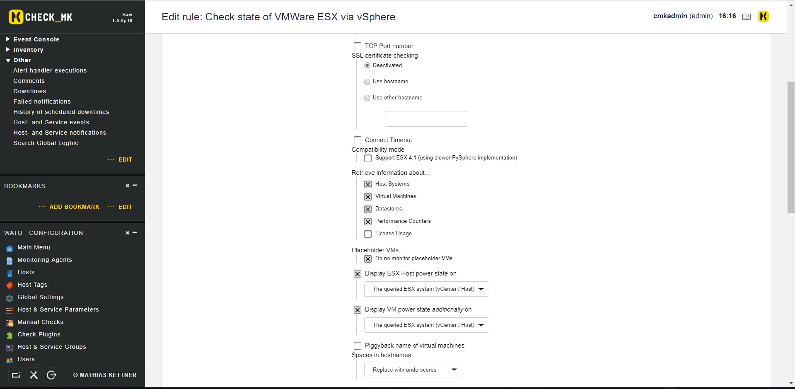
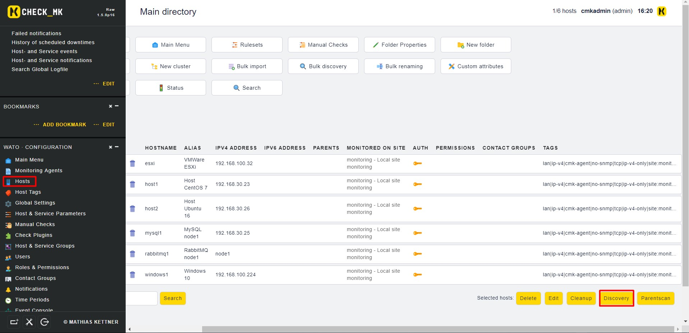
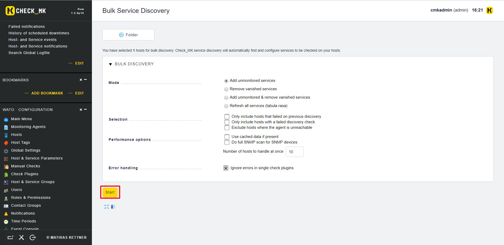
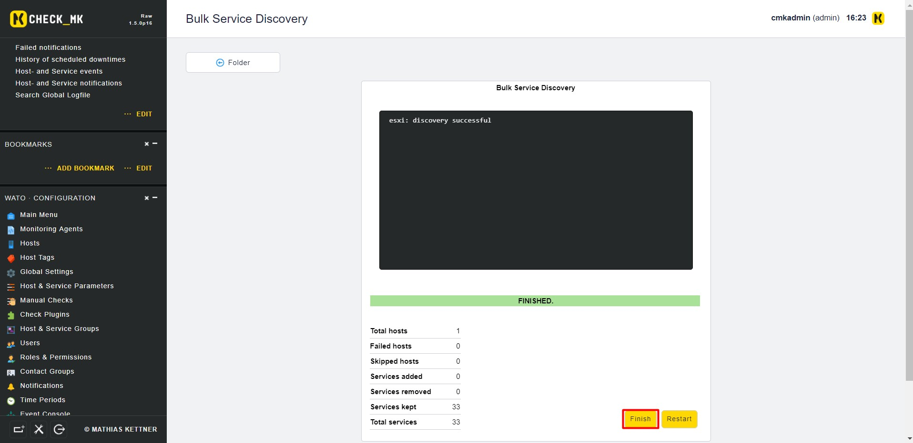
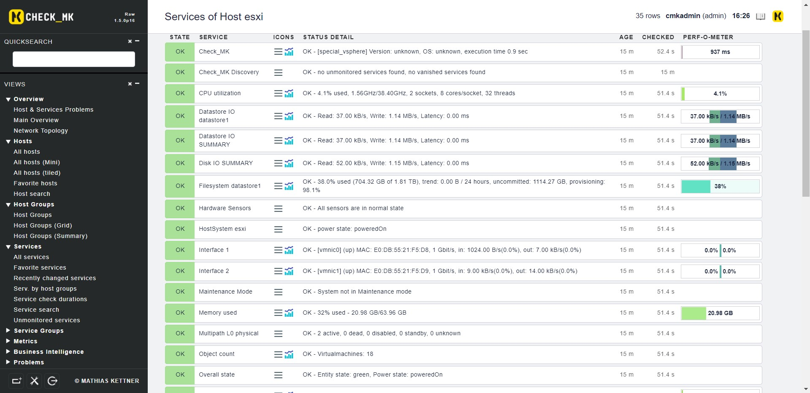

# Giám sát VMWare ESXi bằng OMD - CheckMK

## Yêu cầu

- Có 1 user có quyền monitor trên host ESXi

## Cấu hình

- **Bước 1**: Khai báo host ESXi trên `WATO` CheckMK

- **Bước 2**: Tại `WATO`, chọn `Host & Service Parameters` rồi chọn `Datasource Programs`

Sau đó chọn `Check state of VMWare ESX via vSphere`

Rồi chọn `Create rule in folder`

Điền thông tin user dùng để monitor trên host ESXi

Các tuỳ chọn thêm

Điền tên host rồi chọn `Save` để lưu cấu hình

- **Bước 3**: Tại `WATO` chọn `Hosts` rồi chọn `Discovery`

Chọn `Start`

`Finish` để hoàn thành Discovery

- **Bước 4**: Kiểm tra trên dashboard

