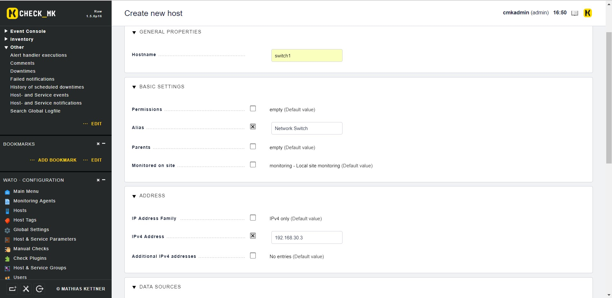
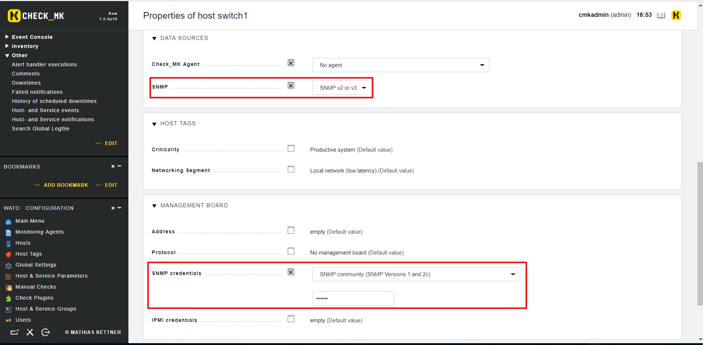
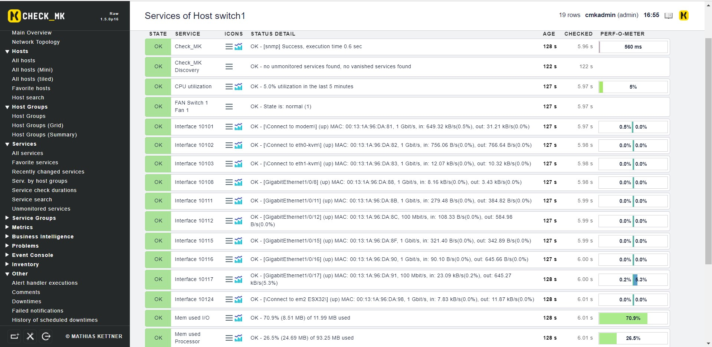

# Giám sát Switch bằng OMD - CheckMK

## Yêu cầu

- Switch phải hỗ trợ SNMP

- CheckMK server có thể kết nối tới Switch

## Cấu hình

- Thêm host mới

Điền tên hiển thị trên CheckMK của switch, địa chỉ IP của switch

Tiếp theo chọn phiên bản SNMP, tại `SNMP credential` chọn như hình dưới, rồi điền community string của switch

Xong chọn `Save & go to services` để lưu cấu hình và check lại 1 lần nữa.

Kiểm tra trên dashboard:

