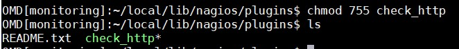
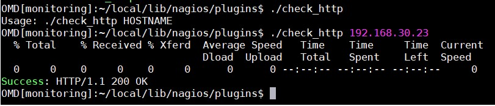
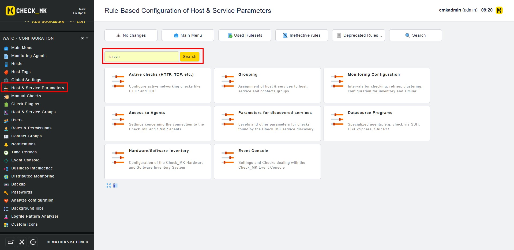
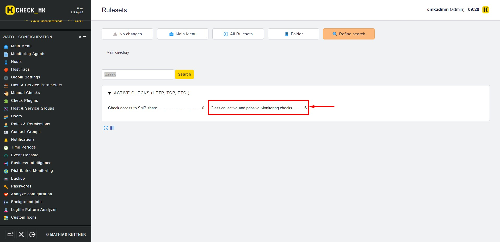
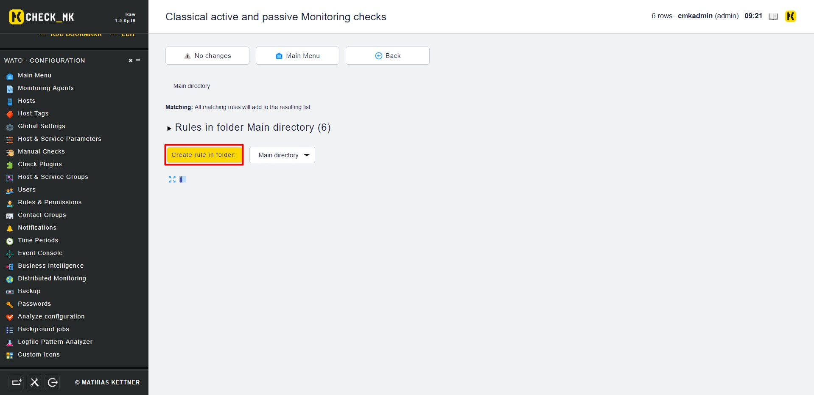
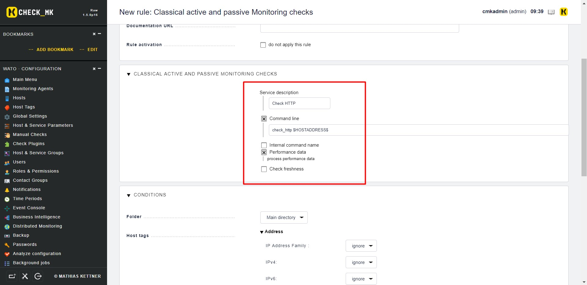
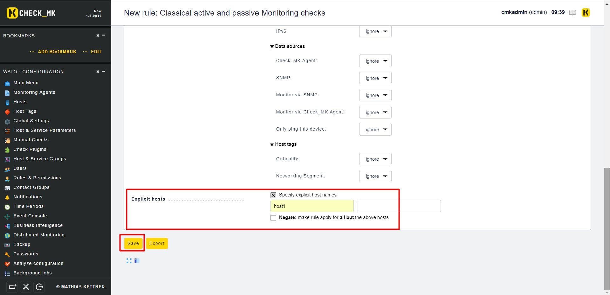
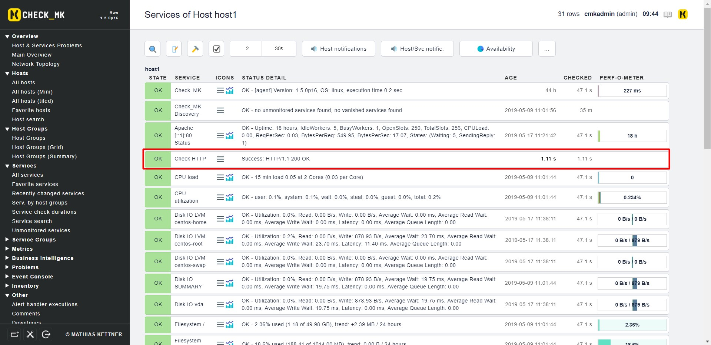

# Thêm plugins vào OMD - Check MK

## 1. Chuẩn bị plugin

- **Bước 1**: Copy vào thư mục plugin

Với ví dụ này, tôi đã chuẩn bị 1 plugin đơn giản để check trạng thái của Web Server

Tiến hành tải plugin vào thư mục plugin 

```
su monitoring
cd ~/local/lib/nagios/plugins
wget https://raw.githubusercontent.com/hoangdh/meditech-ghichep-nagios/master/scripts/Plugin-nagios/check%20http/check_http
```

`monitoring` là tên site của bạn

`~local/lib/nagios/plugins`: là thư mục home của `monitoring`

- **Bước 2**: Phân quyền cho plugin

```
chmod 755 check_http
```



- **Bước 3**: Chạy thử plugin



## 2. Cấu hình trên Web UI

Trên Web UI, chúng ta tìm đến `WATO · Configuration` > `Host & Service Parameters` và tìm kiếm **classic**



Click vào `Classic active and passive Monitoring checks`



Bấm vào `Create rule in folder`, để tạo rule mới



Điền thông tin cho lệnh check, biến $HOSTADDRESS$ để xác định ra Địa chỉ của HOST đang áp dụng. Bấm `SAVE` để lưu





Activate Change và kiểm tra lại trên dashboard



## Tham khảo 

https://github.com/thaonguyenvan/meditech-ghichep-omd/blob/master/docs/6.Add-plugins.md