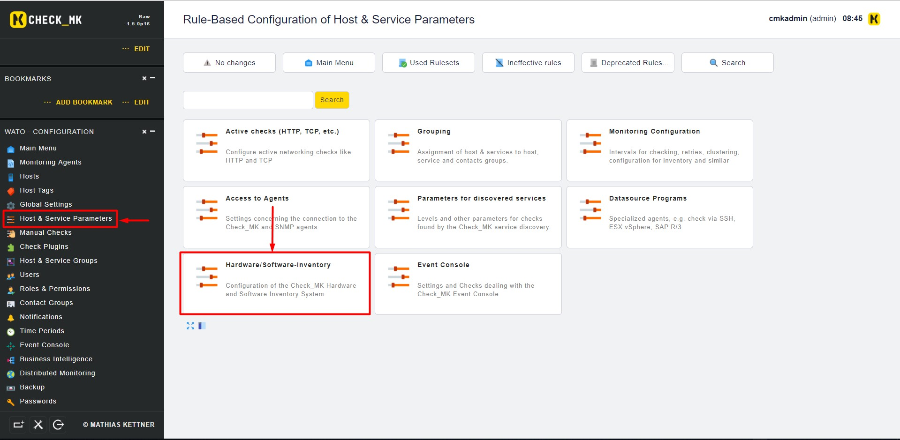
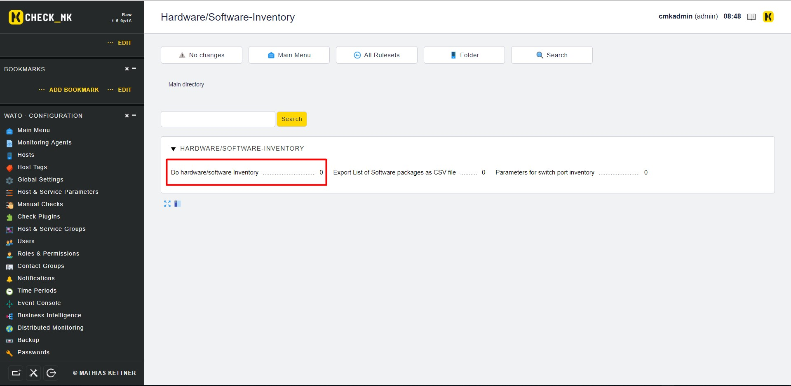
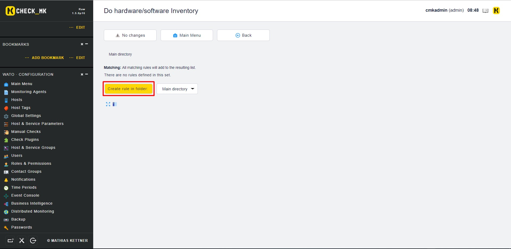
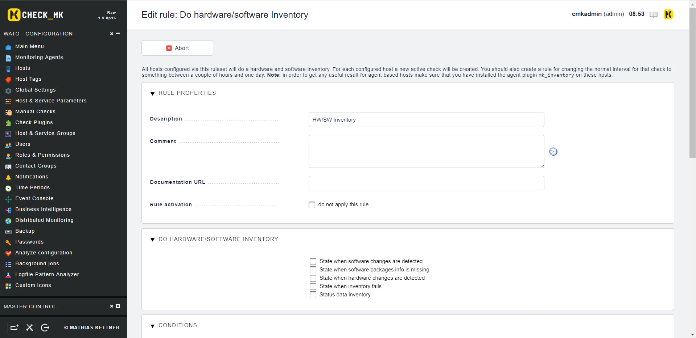
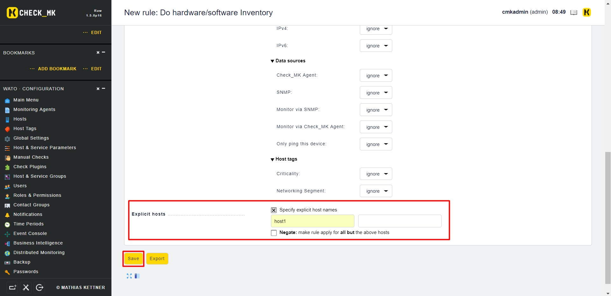
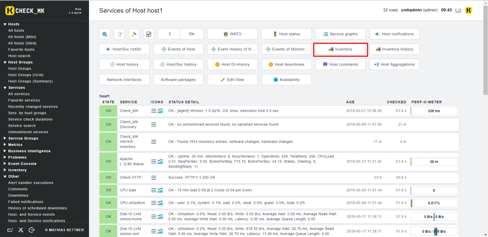

# Cấu hình Inventory để lấy thông tin về phần cứng và phần mềm trên hệ thống

- **Bước 1**: Trên `WATO` chọn `Host & Service Parameters` rồi chọn `Hardware/Software-Inventory`



- **Bước 2**: Chọn `Do Hardware/Software Inventory`



- **Bước 3**: Chọn `Create rule in folder`



- **Bước 4**: Điền thông tin cho rule



Điền tên host sẽ áp dụng rule (không chọn thì sẽ áp dụng cho mọi host) rồi chọn `Save` để lưu



- **Bước 5**: Copy file `/opt/omd/versions/1.5.0p16.cre/share/check_mk/agents/plugins/mk_inventory.linux` từ OMD server sang `usr/lib/check_mk_agent/local/mk_inventory` tại Client

Phân quyền cho file plugin vừa copy sang

```
chmod +x /usr/lib/check_mk_agent/local/mk_inventory
```

- **Bước 6**: Kiểm tra kết quả trên Web



Click vào để xem các thông số mà chúng ta thu thập được từ Client


## Lưu ý

- Hardware/Software Inventory có tự tạo 1 rule để check mỗi ngày 1 lần, có thể sửa lại check_interval tại rule này

- Plugin mk_inventory mặc định 4 tiếng mới có thể thu thập dữ liệu 1 lần, nếu dưới 4 tiếng cho dù có force check cũng không có kết quả gì khác. Có thể thay đổi thời gian này tại file plugin mk_inventory ở phần:

```
INTERVAL=${INVENTORY_INTERVAL:-14400}
```

*14400* là thời gian tính theo giây, 14400 giây = 4 tiếng.