# Check_MK Bussiness Intelligence

## Introduction

Xem giới thiệu về BI tại đây: https://mathias-kettner.de/cms_bi.html

## Cấu hình BI

- Đầu tiên ở giao diện `WATO` chọn `Business Intelligence`

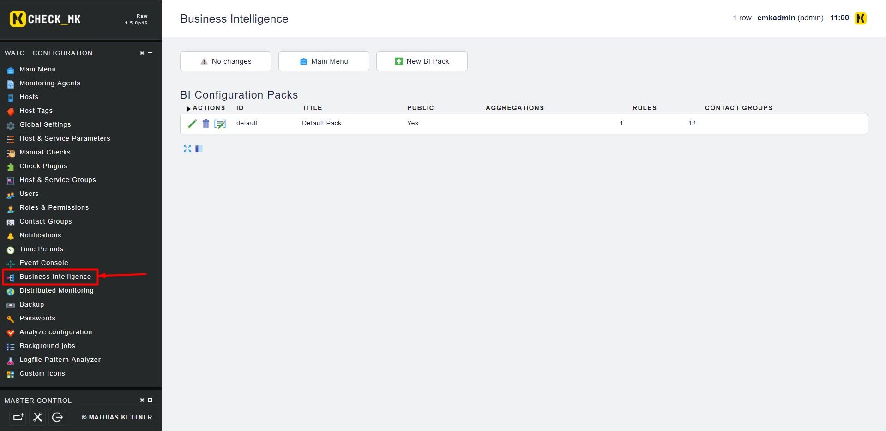

- Bạn sẽ nhìn thấy các BI Pack được cấu hình ở đây, mặc định sẽ có sẵn một Pack. Giờ chúng ta sẽ thử tạo một cái mới:

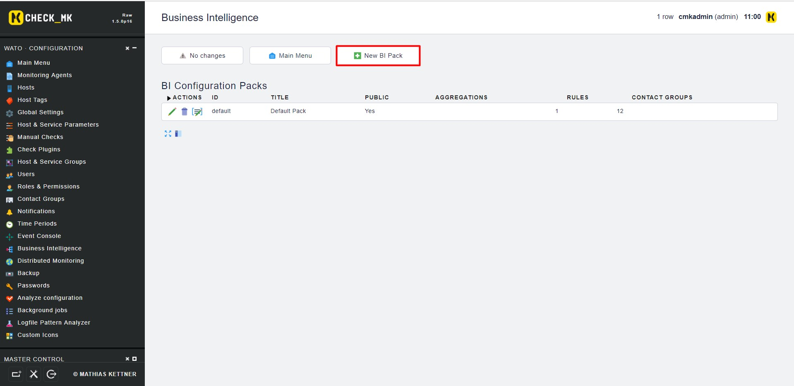

- Điền các thông tin cần thiết rồi `Create` để tạo

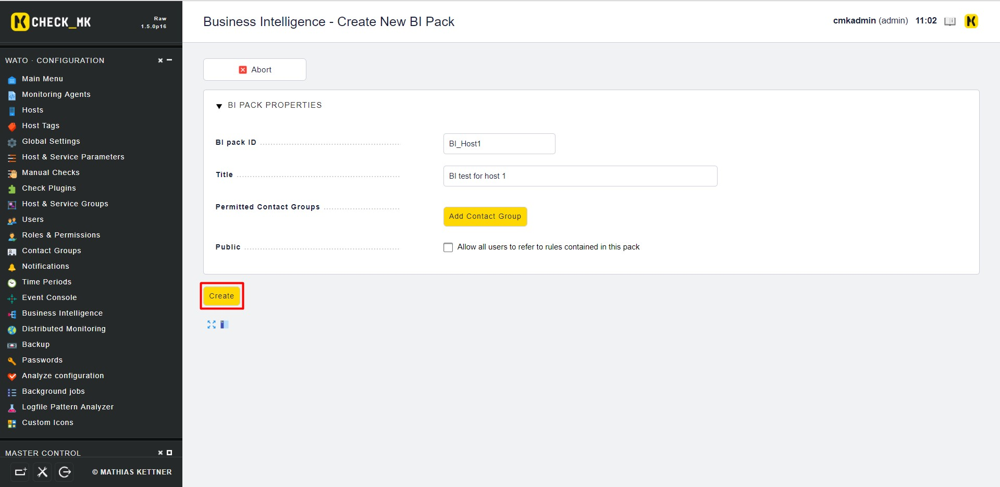

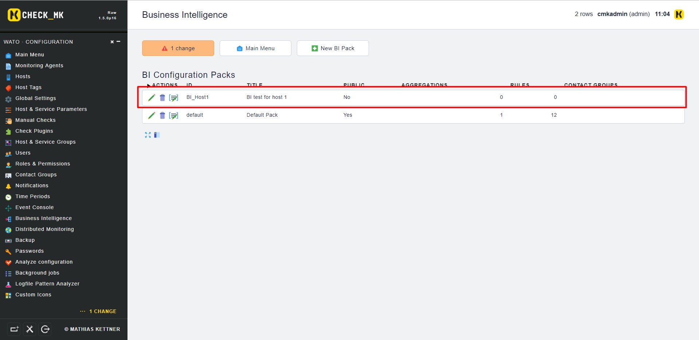

- Ta sẽ không Activate Change bây giờ, tiếp tục tạo các rule trong BI pack này:

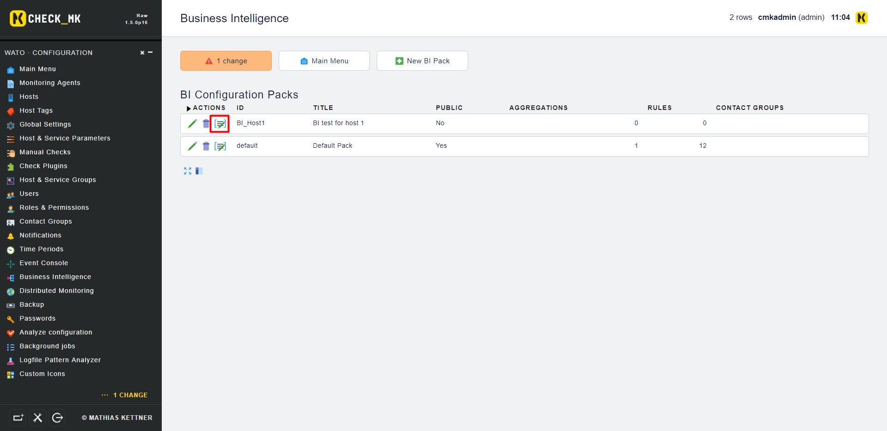

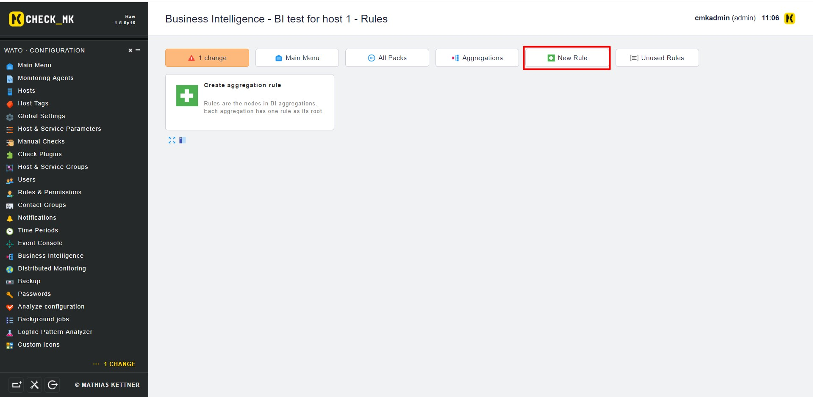

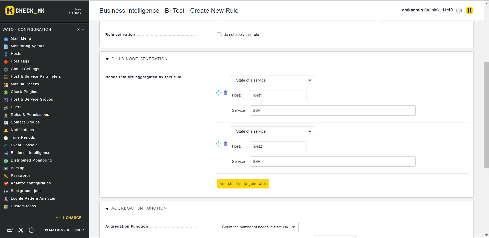

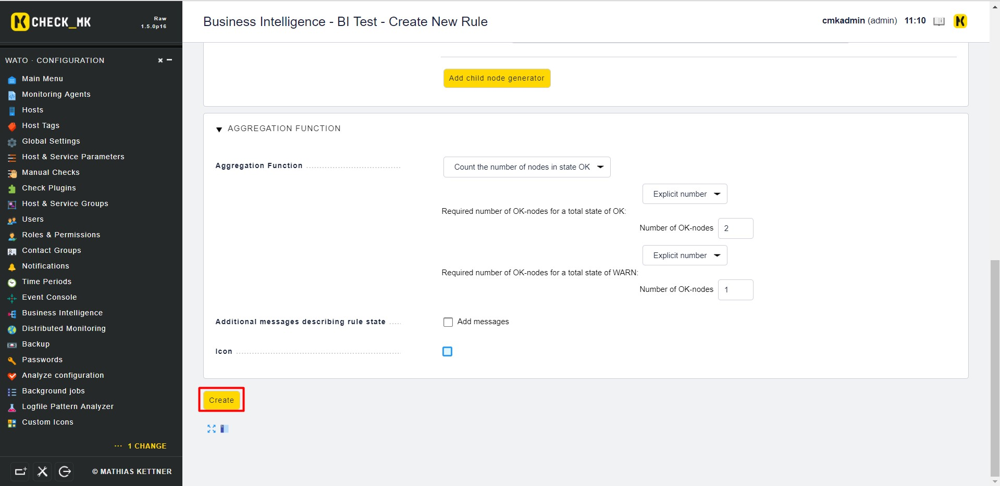

- Tiếp tục tạo thêm rule

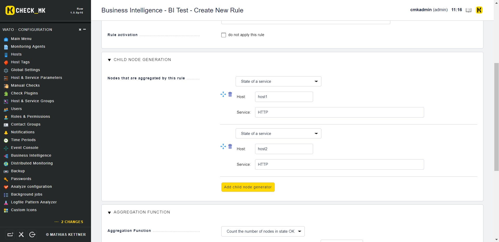

- Tạo 1 rule kết nối 2 rule vừa xong

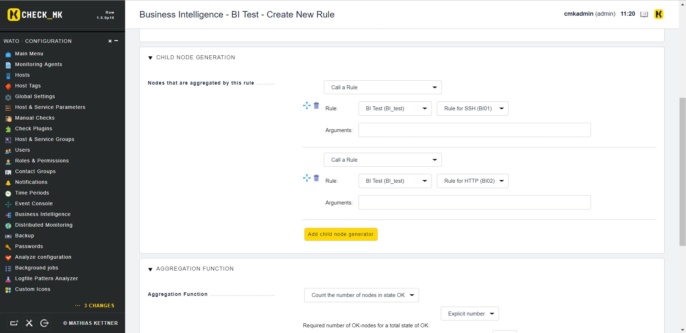

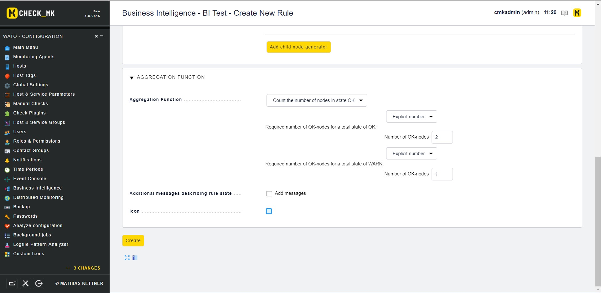

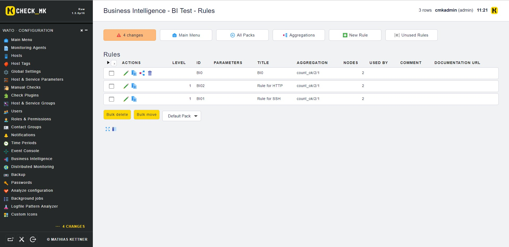

- Tiếp theo ta định nghĩa một Aggregation

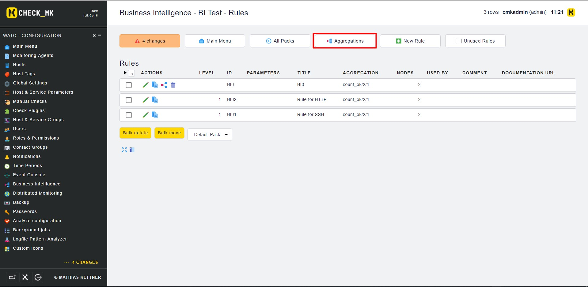

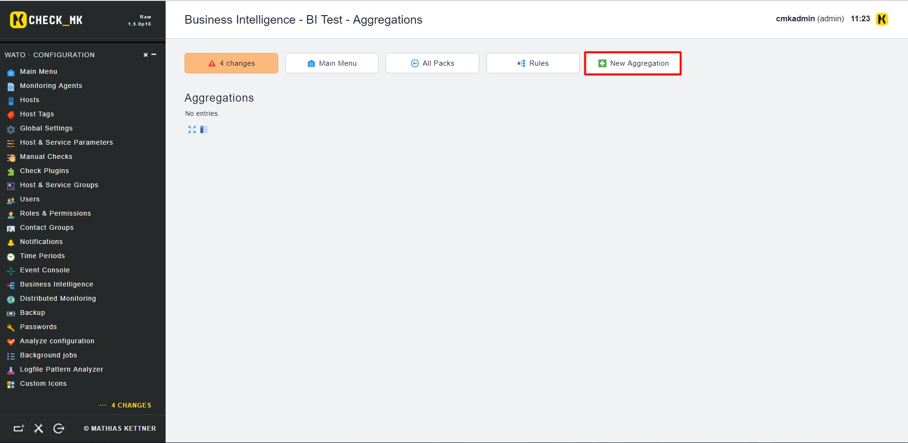

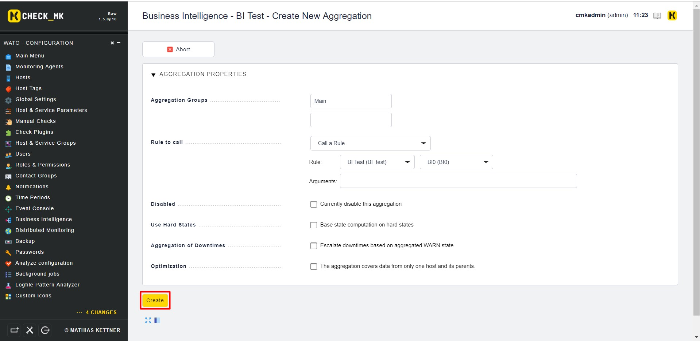

- Giờ thì Activate Change thôi

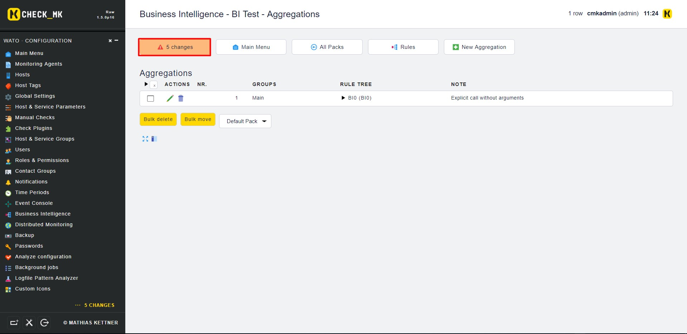

- Vào `Views` -> `Business Intelligence` -> `All Aggregation` để kiểm tra kết quả

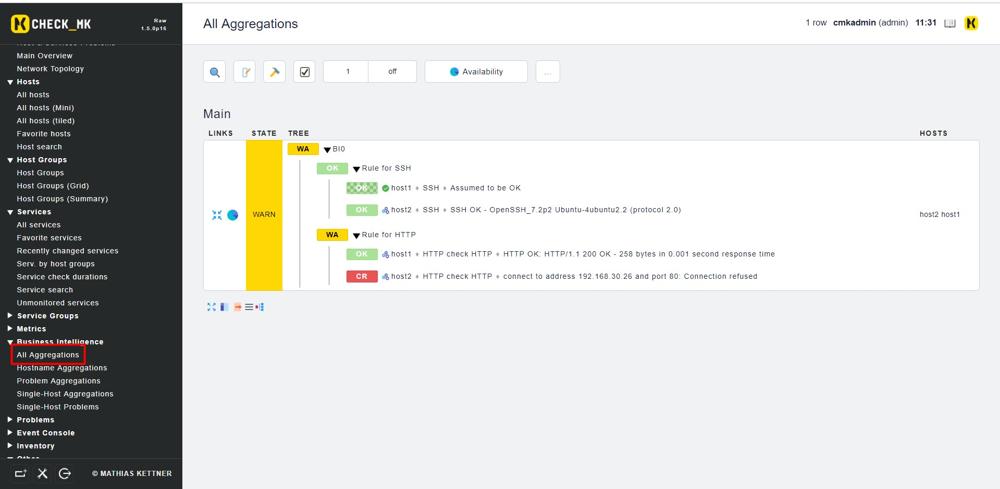