# Vẽ topo mạng sử dụng Nagvis

- Truy cập vào đường dẫn:

```
ip-server/site/nagvis
```

Trong đó

```
ip-server: Là địa chỉ của máy server

site: Là tên site trên OMD
```

Giao diện Nagvis


Để bắt đầu vẽ chúng ta cần tạo 1 map, thực hiện như sau:

- Chọn `Options`, sau đó chọn `Manage Maps`

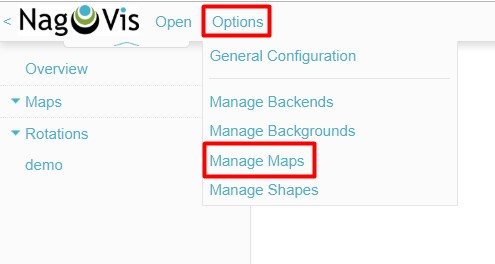

- Sau đó hệ thống đưa ra 1 bảng để tạo một map mới, điền các thông tin cần thiết rồi nhấp chọn `Create`

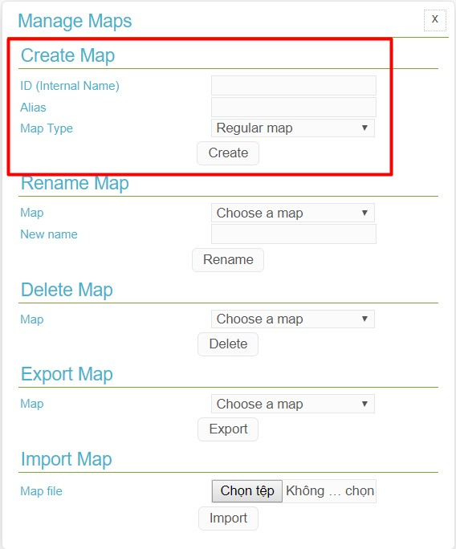

**Lưu ý**: Ở phần map type có các chế độ sau:

```
Regular map: là một map thông thường, tự vẽ thủ công

Geographical map: tích hợp bản đồ vào map

Automap based on parent/child relations: tự động thêm các host được giám sát vào map. Không có thao tác thêm/sửa/xoá.
```

- Sau khi tạo xong chúng ta bắt đầu vẽ. Lưu ý rằng tất cả các objects khi chúng ta lựa chọn vào topo đều được lấy từ dữ liệu của OMD thông qua MK livestatus

- Bắt đầu với một host, chọn `Edit map` -> `Add Icon` -> `Host`:

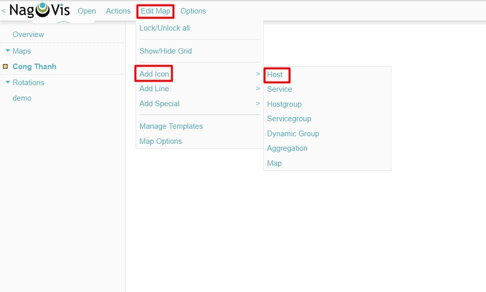

- Nhấp chuột vào một vị trí trên màn hình để đặt host, hệ thống đưa ra 1 bảng. Tại ô `host_name` chọn host cần thêm:

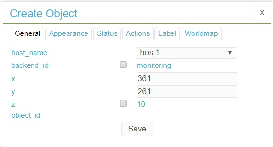

- Tại tab `Label` cài đặt như sau, sau đó nhấn `save` để hoàn tất thêm 1 host:

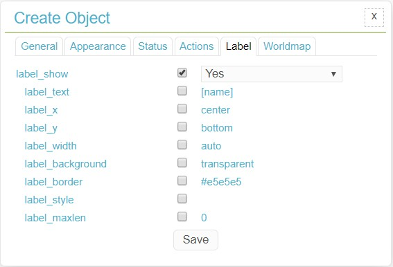

- Kết quả:

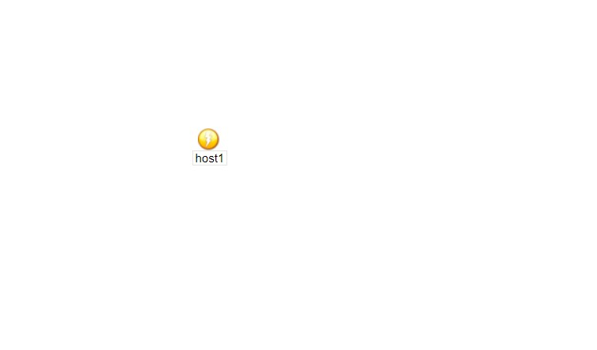

- Tương tự có thể thêm các host khác vào topo:

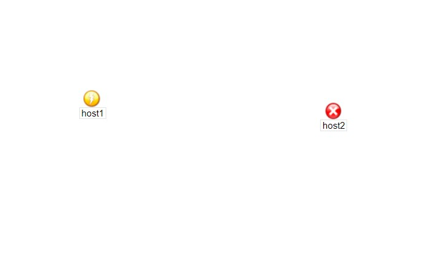

- Để thay đổi vị trí các object, ta chuột phải vào object và chọn `unlock` sau đó kéo để thay đổi vị trí:

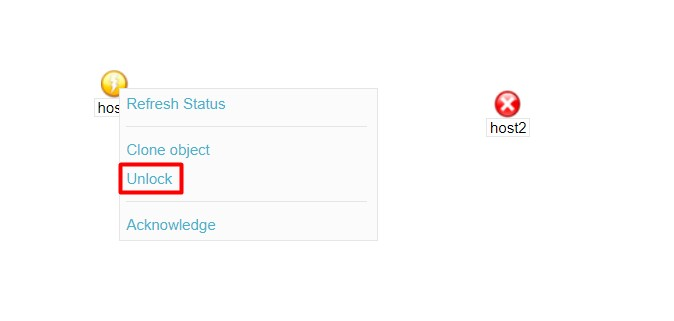

- Thay đổi vị trí xong thì chuột phải và chọn `Lock`

Tiếp theo chúng ta sẽ tạo ra đường monitor card mạng của 2 host này.

- Chọn `Edit Map` -> `Add Line` -> `Service`:

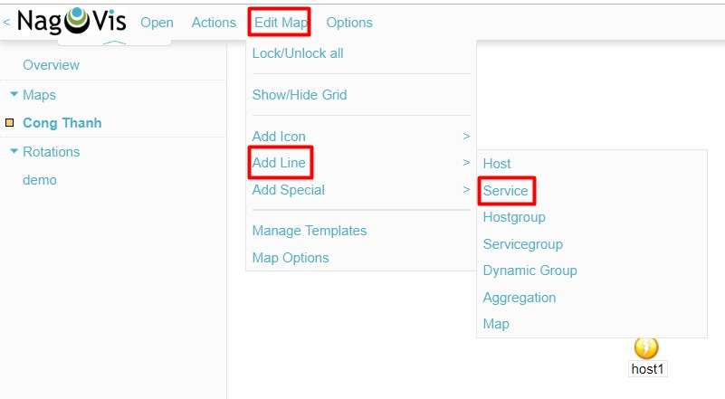

- Kéo chuột theo 1 đường thằng kết nối giữa 2 điểm từ host 1 đến host 2, sau đó hệ thống sẽ hiện ra 1 bảng như sau:

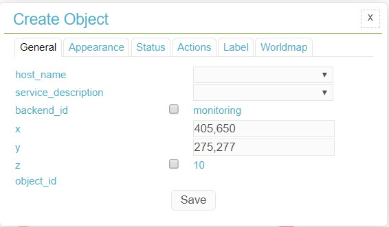

- Tại tab `General`, thiết lập như sau:

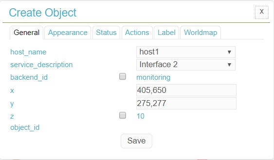

```
Trong đó:

host_name là host muốn monitor
service_description là tên card mạng mà chúng ta muốn hiển thị (tương tự nếu là service khác)
```

- Tại tab `Appearance` thiết lập như sau:

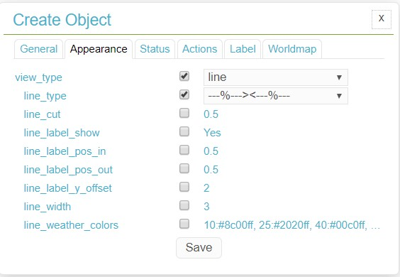

- Sau khi chọn `save` thu được kết quả:

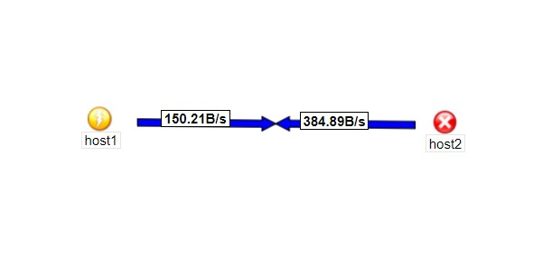

## Một số lưu ý

- Khi sử dụng nagvis để tạo object, nếu muốn thay đổi vị trí hay chỉnh sửa các chức năng khác thì hãy chọn `unlock` object đó rồi tiến hành chỉnh sửa.

- Khi chỉnh sửa xong thì nên `lock` object đó lại để tránh những thay đổi không mong muốn

- Từ topo chúng ta có thể di chuyển con trỏ chuột đến từng object để theo dõi hiện trạng của nó, cũng có thể nhấp chọn vào object để xem thông tin chi tiết hơn từ máy chủ `check_mk`

## Tham khảo

https://github.com/thaonguyenvan/meditech-ghichep-omd/blob/master/docs/9.Huong-dan-add-va-su-dung-Shape.md