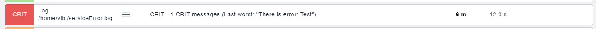
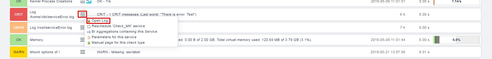

# Check_MK Logwatch

## Cấu hình Logwatch 

Check log và báo lại mỗi lần log có từ `error`

Trên Linux logfile được giám sát bằng extension của check_mk_agent là `logwatch`.

- Copy plugin `mk_logwatch` từ server về client

```
scp <username>@<ip_server>:/opt/omd/versions/1.5.0p16.cre/share/check_mk/agents/plugins/mk_logwatch /usr/lib/check_mk_agent/plugins
```

- Tạo một file config `/etc/check_mk/logwatch.cfg` trên client với nội dung sau:

```
/home/vibi/serviceError.log maxlines=100 maxtime=10 overflow=W
 C [E,e]rror*
 R There is error: \1
 W [W,w]arning*
 O accept*
```

**Lưu ý**:

- `/root/serviceError.log`: File được theo dõi

- `maxlines`: Cấu hình về số lượng dòng log mới lớn nhất của file được chấp nhận check (còn lại sẽ bị drop)

- `maxtime`: Thời gian lớn nhất cho việc parsing các dòng log mới

- `overflow`: Nếu vượt quá một trong 2 thông số trên, một log giả mới sẽ được thêm vào để cảnh báo. Mặc định sẽ là Critical, nhưng có thể thiết lập là `W` hoặc `I`. `overflow=I` là để bỏ qua không tạo log giả.

- Khai báo pattern phải bắt đầu bằng 1 dấu cách.

- `C`: Critical nếu bất cứ dòng log nào thoả mãn pattern phía sau (Ví dụ pattern `[E,e]rror(.*)` sẽ bắt tất cả các dòng có từ **error** hoặc **Error**)

- `R`: Rewrite - Hiển thị thông báo thay vì hiển thị dòng log

Restart lại agent:

```
systemctl restart xinetd
```

Truy cập giao diện web của check_mk và `Discovery` lại host


Test thử plugin:

```
echo "error Test" >> /home/vibi/serviceError.log
```



Logwatch lưu và kiểm soát trạng thái của các file log thông qua một file `logwatch.state.local`. File này sẽ lưu lại vị trí đã được kiểm tra trước đó, nên sẽ dễ dàng tìm ra thời điểm có log mới từ lần check cuối cùng gần nhất.

## Cấu hình Logrotate

Vào `Views` chọn `Service`, kéo tới service mới thêm vào để xem log:



Tất cả các log sẽ được phân loại và hiển thị như sau:


Và được lưu trữ trong `/omd/sites/monitoring/var/check_mk/logwatch/` theo từng host trên server

Tiếp theo, chúng ta sẽ cấu hình rotate các file log này bằng lograte, mỗi một giờ một lần

Ví dụ tôi sẽ tạo một file `/omd/sites/monitoring/etc/logrotate.d/logwatch` cấu hình như sau:

```
/omd/sites/monitoring/var/check_mk/logwatch/host1/*.log {
    missingok # Không thông báo lỗi nếu file log bị thiếu
    rotate 7 # Giữ lại nhiều nhất 12 tệp log cũ
    compress # Nến file đã được rotate, sử dụng gzip nên mặc định là file .gz/
    delaycompress
    notifempty # Không rotate file log nếu nó rỗng
}
```

Dòng đầu tiên nghĩa là áp dụng cho tất cả các file log của `host1` trong thư mục `omd/sites/monitoring/var/check_mk/logwatch/host1/` có đuôi là `.log` và bên dưới đó là một số các thông tin cấu hình.

Logrotate kiểm soát trạng thái của các file log tại file `/omd/sites/monitoring/tmp/run/logrotate.state`

Tiếp theo chúng ta sẽ cấu hình crontab, đặt 1 tiếng chạy logrotate này một lần

## Cấu hình Crontab

Thêm vào dòng sau (1 dòng cuối) trong file `/omd/sites/monitoring/etc/cron.d/logrotate`:

```
#
# Daily Logrotate
#
0 0 * * * $OMD_ROOT/bin/logrotate -s $OMD_ROOT/tmp/run/logrotate.state $OMD_ROOT/etc/logrotate.conf >/dev/null 2>&1
0 * * * * logrotate -f -s /omd/sites/monitoring/tmp/run/logrotate.state /omd/sites/monitoring/etc/logrotate.d/logwatch > /dev/null 2>&1
```

Khởi động lại omd:

```
omd restart
```

## Tham khảo

https://github.com/trangnth/Monitor/blob/master/Ghichep_omd/Check_MK%20logwatch.md