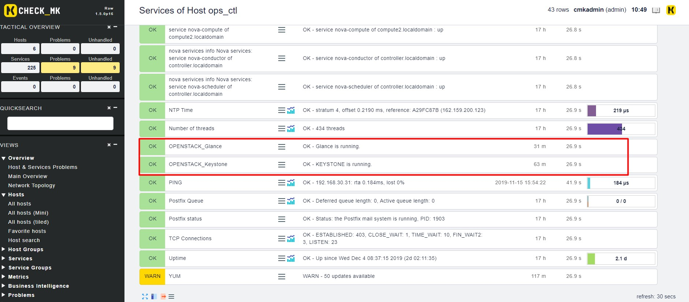
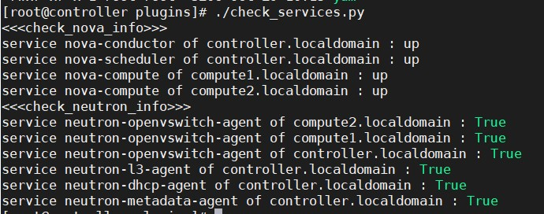
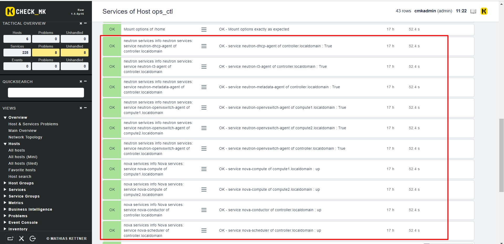

# Cấu hình giám sát OpenStack

## Giám sát service

- Check status service Keystone và Glance

Thực hiện trên node Controller OpenStack

Tải các plugin tại [đây](https://github.com/hoangdh/nagios-plugins-OpenStack/tree/master/plugins/check_services)

```
cd /tmp
wget https://raw.githubusercontent.com/hoangdh/nagios-plugins-OpenStack/master/plugins/check_services/check_keystone
wget https://raw.githubusercontent.com/hoangdh/nagios-plugins-OpenStack/master/plugins/check_services/check_glance
```

Phân quyền thực thi cho plugin

```
chmod +x check_keystone
chmod +x check_glance
```

Tạo file cấu hình `/etc/check_mk/mrpe.cfg`

```
OPENSTACK_Keystone /tmp/check_keystone
OPENSTACK_Glance /tmp/check_glance
```

Thực hiện discovery service trên web check_mk 



- Check neutron và nova

Thực hiện trên node Controller

Cài đặt python3.5

```
yum -y install https://centos7.iuscommunity.org/ius-release.rpm
yum -y install python35u
yum -y install python35u-pip
yum install python35u-devel -y
pip3.5 install python-openstackclient
pip3.5 install python-neutronclient
```

Tải các plugin tại [đây](https://github.com/MinhKMA/plugin_checkMK/tree/master/OpenStack/client) và đặt vào thư mục `/usr/lib/check_mk_agent/plugins/`

Phân quyền thực thi cho plugin

```
cd /usr/lib/check_mk_agent/plugins/
chmod +x *
```

Chạy thử script:

```
./check_services.py
```



Thực hiện trên monitor server

Tải plugin tại [đây](https://github.com/MinhKMA/plugin_checkMK/tree/master/OpenStack/server) và đặt vào thư mục `/opt/omd/sites/monitoring/local/share/check_mk/checks/`

Lên dashboard discovery service



## Giám sát máy ảo

- Cài đặt Graphite và Grafana lên máy chủ monitor

Cài epel repo:

```
yum install -y epel-release
```

Cài graphite:

```
yum --enablerepo=epel -y install graphite-web python-carbon
```

Sửa file `/etc/graphite-web/local_settings.py`:

```
...
SECRET_KEY = 'UNSAFE_DEFAULT'
TIME_ZONE = 'Asia/Ho_Chi_Minh'
...
```

Sửa file `/etc/httpđ/conf.d/graphite-web.conf`

```
...
Require local
Require ip 192.168.30.0/24 # Mạng local của bạn
...
```

Đổi tên file `/etc/httpd/conf.modules.d/10-wsgi-python3.5.conf` để tránh xung đột module:

```
mv /etc/httpd/conf.modules.d/10-wsgi-python3.5.conf /etc/httpd/conf.modules.d/10-wsgi-python3.5.conf.1
```

Đồng bộ database

```
/usr/lib/python2.7/site-packages/graphite/manage.py syncdb
```

Khởi động dịch vụ

```
chown -R apache. /var/lib/graphite-web 
systemctl start carbon-cache 
systemctl enable carbon-cache 
systemctl restart httpd
```

Thiết lập firewall

```
firewall-cmd --permanent --add-port=80/tcp
firewall-cmd --permanent --add-port=2003/tcp
firewall-cmd --permanent --add-port=2003/udp
firewall-cmd --reload
```

Thêm repo Grafana

```
cat > /etc/yum.repos.d/grafana.repo <<'EOF'
[grafana]
name=grafana
baseurl=https://packages.grafana.com/oss/rpm
repo_gpgcheck=1
enabled=1
gpgcheck=1
gpgkey=https://packages.grafana.com/gpg.key
sslverify=1
sslcacert=/etc/pki/tls/certs/ca-bundle.crt
EOF
```

Cài đặt Grafana

```
yum install -y grafana fontconfig initscripts 
```

Khởi động Grafana

```
systemctl start grafana-server
systemctl enable grafana-server
```

Thiết lập firewall

```
firewall-cmd --permanent --add-port=3000/tcp
firewall-cmd --reload
```

- Cài Collectd lên các node Compute

Thêm repo epel

```
yum install epel-release -y
```

Cài đặt Collectd

```
yum install collectd collectd-rrdtool -y
```

Backup file cấu hình Collectd

```
cp /etc/collectd.conf /etc/collectd.conf.1
```

Cấu hình file `/etc/collectd.conf` để lấy metric của máy ảo

```
Hostname    "localhost"
FQDNLookup   false
BaseDir     "/var/lib/collectd"
PIDFile     "/var/run/collectd.pid"
PluginDir   "/usr/lib64/collectd"
TypesDB     "/usr/share/collectd/types.db"
Interval     60
LoadPlugin virt
LoadPlugin write_graphite
<Plugin virt>
        Connection "qemu:///system"
        RefreshInterval 60
        IgnoreSelected true
        HostnameFormat uuid
        InterfaceFormat address
        PluginInstanceFormat name
        ExtraStats "cpu_util disk disk_err domain_state job_stats_background pcpu perf vcpupin"
</Plugin>
<Plugin write_graphite>
  <Node "graphite">
    Host "192.168.30.22"
    Port "2003"
    Protocol "tcp"
    ReconnectInterval 0
    LogSendErrors true
    StoreRates true
    AlwaysAppendDS false
    EscapeCharacter "_"
    SeparateInstances false
    PreserveSeparator false
    DropDuplicateFields false
  </Node>
</Plugin>
Include "/etc/collectd.d"
```

- Truy cập web UI Grafana `http://grafana-server_ip:3000` và thêm datasource Graphite như sau:


## Tham khảo

https://github.com/hoangdh/nagios-plugins-OpenStack

https://minhkma.github.io/2018/10/check-mk--write-your-own-check/

https://github.com/trangnth/Monitor/blob/master/Ghichep_omd/Check_MK%20Check%20qemu-kvm.md