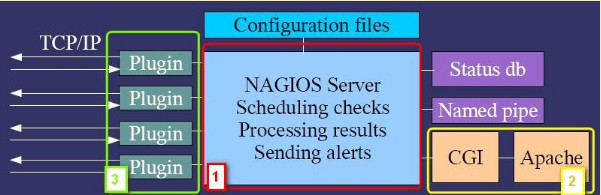
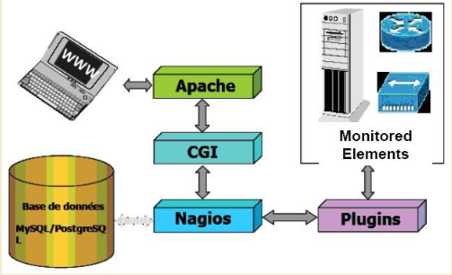
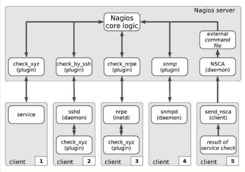

# Tổng quan về Nagios

## Nagios là gì?

Nagios là một hệ thống giám sát mạnh mẽ cho phép các tổ chức xác định và giải quyết các vấn đề cơ sở hạ tầng CNTT trước khi chúng ảnh hưởng đến quá trình kinh doanh quan trọng.

Lần đầu tiên ra mắt vào năm 1999, Nagios đã có hàng ngàn dự án được phát triển bởi cộng đồng Nagios trên toàn thế giới. Nagios được bảo trợ chính thức bởi Nagios Enterprises, hỗ trợ cộng đồng trong một số cách khác nhau thông qua việc bán các sản phẩm thương mại và dịch vụ của mình.

Nagios theo dõi toàn bộ cơ sở hạ tầng CNTT của bạn để đảm bảo hệ thống, ứng dụng, dịch vụ và quy trình kinh doanh đang hoạt động tốt. Trong trường hợp bị lỗi, Nagios có thể cảnh báo nhân viên kỹ thuật các vấn đề, cho phép họ bắt đầu quá trình phục hồi trước khi ảnh hưởng đến quá trình kinh doanh, người sử dụng, hoặc khách hàng.

Được thiết kế với khả năng mở rộng và tính linh hoạt trong, Nagios mang đến cho bạn sự an tâm đến từ hiểu biết quy trình kinh doanh của tổ chức, bạn sẽ không bị ảnh hưởng bởi sự cố ngừng hoạt động không rõ nguyên nhân.

Nagios hỗ trợ người quản trị trong việc:

- Lên kế hoạch cho việc nâng cấp cơ sở hạ tầng trước khi hệ thống lỗi thời gây ra lỗi 

- Ứng phó với các vấn đề ngay khi có dấu hiệu đầu tiên 

- Tự động sửa chữa các vấn đề khi chúng được phát hiện

- Đảm bảo sự ngưng hoạt động của các cơ sở hạ tầng CNTT có ảnh hưởng tối thiểu đến hệ thống.

- Theo dõi toàn bộ cơ sở hạ tầng và quy trình kinh doanh của bạn 

- Giám sát các dịch vụ mạng (HTTP, SMTP, POP3, PING,...)

- Giám sát tài nguyên máy chủ (processor load, disk usage,...)

- Những phần bổ trợ đơn giản cho phép người dùng phát triển dịch vụ kiểm tra riêng của họ

- Phát hiện và phân biệt được các máy chủ hay dịch vụ xuống cấp và không thể truy cập được 

- Thông báo cho người giám sát khi máy chủ hay dịch vụ có vấn đề và được giải quyết 

- Tuỳ chọn giao diện web để xem tình trạng mạng hiện có, thông báo và lịch sử các vấn đề, đăng nhập tập tin,...

## Lịch sử 

- **1996**: Ethan Galstad đã tạo ra một ứng dụng MS-DOS đơn giản để ping các máy chủ Novell Netware và trả về các trang số liệu. Ứng dụng này được thiết kế bằng cách sử dụng các ứng dụng ở bên thứ 3 ở bên ngoài để thực hiện kiểm tra các máy chủ và gửi các trang khái niệm về kiến trúc cơ bản của Nagios được sinh ra.

- **1998**: Ethan đã sử dụng những ý tưởng trước đây của mình để bắt đầu xây dựng một ứng dụng mới và được cải tiến đề chạy dưới Linux

- **1999**: Ethan công bố sản phẩm của mình dưới dạng một dự án mã nguồn mở dưới cái tên **NetSaint**. Ông ước tính có thể khoảng vài chục người quan tâm đến sản phẩm này.

- **2002**: Do những vấn đề gặp phải với tên nhãn hiệu **NetSaint** có thể có tác động lâu dài. Ethan quyết định đổi tên dự án thành **Nagios**. Nagios được viết tắt của từ "Nagios Ain't Gonna Insist On Sainthood". Phát triển dự án NetSaint Plugins được chuyển đến dự án Nagios Plugins.

- **2005**: Nagios được bình chọn là dự án của tháng (Project of the month-potm) theo bình chọn của SourceForge.net

- **2006**: Nagios được đánh giá bởi eWeek Labs là một trong số những công cụ phải có của doanh nghiệp. Nagios được đề cập đến như là một "Hot Companies in Open Source"

- **2007**: Ethan đã thành lập Nagios Enterprises, LLC để cung cấp các dịch vụ tư vấn và phát triển xung quanh Nagios. Nagios là sản phẩm cuối cùng trong danh mục "Công cụ tốt nhất hoặc tiện ích nhất cho người quản trị hệ thống" của giải thưởng cộng đồng SourceForge.net. Cùng năm Nagios cũng đạt được giải thưởng "Ứng dụng giám sát mạng của năm" 2007 của LinuxQuestions.org. LinuxWorld.com đánh giá Nagios là một trong "5 công cụ bảo mật mã nguồn mở hàng đầu trong doanh nghiệp". EWeek đánh giá Nagios là một trong những "Ứng dụng mã nguồn mở quan trọng nhất mọi thời đại".

- **2008**: Nagios làm bìa trước của tạp chí Thông tin Tuần báo mang tên "Doanh nghiệp mã nguồn mở". Nagios đoạt giải thưởng "Ứng dụng giám sát mạng trong năm" của LinuxQuestions.org 2008 trong năm thứ hai liên tiếp. Nagios được vinh danh là một trong những Người đoạt giải nhất của Phần mềm nguồn mở của Infoworld ("BOSSIE") 2008. Nagios đoạt danh hiệu "Server Monitoring". Nagios được tải trực tiếp từ SourceForge.net trên 500.000 lần.

- **2009**: Hợp đồng hỗ trợ hàng năm lần đầu tiên được Nagios Enterprises chính thức cung cấp. Nagios Enterprises đưa ra sản phẩm giám sát thương mại đầu tiên, Nagios XI. Nagios thắng giải thưởng Reader's Choice 2009 cho "Ứng dụng giám sát yêu thích của Linux". Nagios là người cuối cùng trong giải thưởng Cộng đồng SourceForge.net năm 2009 cho "Công cụ tốt nhất hoặc Tiện ích dành cho Người quản trị Hệ thống". Nagios đoạt giải thưởng "Ứng dụng giám sát mạng của năm" của LinuxQuestions.org năm thứ ba liên tiếp. Infoworld đặt tên Nagios là một trong số những người đoạt giải nhất của Phần mềm nguồn mở (BOSSIE) năm 2009. Nagios đổi tên thành Nagios Core. Nagios Core được tải trực tiếp từ SourceForge.net trên 600.000 lần.

- **2010**: Nagios đoạt giải thưởng "Ứng dụng giám sát mạng của năm" năm thứ 4 liên tiếp. Nagios đoạt giải thưởng Linux Journal 2010 Reader's Choice Award cho "Ứng dụng giám sát tốt nhất". Nagios đã giành được cuộc thăm dò LinuxCon 2010 cho "Các công cụ hoạt động CNTT ưa thích". Nagios Fusion được phát hành như là một bảng điều khiển trung tâm theo dõi máy chủ.

- **2011**: Nagios BPI được phát hành để theo dõi quá trình kinh doanh. Hội nghị Thế giới Nagios đầu tiên được tổ chức tại Saint Paul, MN(Hoa Kỳ). Nagios đoạt giải thưởng "Ứng dụng giám sát mạng của năm" năm thứ 5 liên tiếp. Nagios đoạt giải Linux Journal 2011 Reader's Choice Award cho "Ứng dụng giám sát tốt nhất". Nagios đoạt giải nguồn mở PortalProgramas 2011 trong danh mục "Essential for Communications Networks". Nagios được WebhostingSearch.com trao tặng "Best Web Tool". Nagios được liệt kê trong danh sách SecTools.org của 125 công cụ bảo mật hàng đầu.

- **2012**: NSTI được phát hành để quản lý SNMP. Nagios Incident Manager được phát hành. Hội nghị Thế giới lần thứ 2 Nagios được tổ chức tại Saint Paul, MN (Hoa Kỳ). Nagios đoạt giải "Ứng dụng giám sát mạng của năm" lần thứ 6 liên tiếp. Nagios đoạt giải thưởng Linux Journal 2012 Reader's Choice Award cho "Ứng dụng giám sát tốt nhất". Nagios là một dự án đặc trưng trên SourceForge.net 

- **2013**: Nagios Network Analyzer được phát hành để cung cấp phân tích sâu về mô hình lưu lượng mạng. NCPA được phát hành để tăng thêm độ mở rộng cho Nagios. Nagios Core 4 được phát hành. Hội nghị Thế giới Nagios lần thứ 3 được tổ chức tại Saint Paul, MN (Hoa Kỳ). Nagios giành giải "Ứng dụng giám sát mạng của năm" lần thứ 7 liên tiếp. Nagios đoạt giải Linux Journal 2013 Reader's Choice Award cho "Ứng dụng giám sát tốt nhất"

- **2014**: Nagios đã được cài đặt hơn 8 triệu lần kể từ năm 2008. Nagios được đặt tên là Kho tàng ẩn của St. Paul trong Tech{dot}MN. Nagios thông báo rằng nhóm Nagios Plugin đang trải qua một số thay đổi, bao gồm cả việc giới thiệu một người bảo trợ mới. Nagios đoạt giải thưởng "Ứng dụng Theo dõi Mạng của năm" năm thứ 8 liên tiếp. Hội nghị thế giới Nagios lần thứ 4 được tổ chức tại Saint Paul, MN (Hoa Kỳ). Nagios Log Server được phát hành để cung cấp giám sát đăng nhập cấp doanh nghiệp và quản lý.

- **2015**: Nagios XI 5 đến với hơn 200 cải tiến và đổi mới. Nagios đoạt giải thưởng "Ứng dụng giám sát mạng của năm" lần thứ 9 liên tiếp. Nagios Log Server đã được lựa chọn lần thứ 2 trong phần sản phẩm ShowNet của giải Best of Show Interop Tokyo 2015. Hội nghị Nagios World lần thứ 5 được tổ chức tại Saint Paul, MN (Hoa Kỳ).

- **2016**: Nagios Core vượt quá 7.500.000 lượt tải xuống trực tiếp từ SourceForge.net. Nagios giành được "Dự án tháng" của SourceForge cho tháng 10 năm 2016.

## Các phiên bản 

### 1. Nagios XI (Enterprise Server and Network Monitoring SoftwareEnterprise Server and Network Monitoring Software)

- Bảng lợi ích 

| Lợi ích | Chi tiết |
|---------|----------|
| Comprehensive IT Infrastructure Monitoring | Cung cấp giám sát của tất cả các thành phần cơ sở hạ tầng quan trong bao gồm các ứng dụng, dịch vụ, hệ điều hành, các giao thức mạng, các hệ thống đo và cơ sở hạ tầng mạng. Hàng trăm addons của bên thứ ba cung cấp cho việc giám sát hầu như tất cả các ứng dụng, dịch vụ và hệ thống trong hệ thống. |
| Performance | Công cụ giám sát Nagios Core 4 mạnh mẽ cung cấp cho người dùng mức độ cao nhất về việc theo dõi hiệu suất của máy chủ. Các worker process hiệu quả cao cho phép khả năng mở rộng gần như vô hạn và giám sát hiệu quả | 
| Visibility | Cung cấp một cái nhìn trung tâm về toàn bộ mạng lưới hoạt động CNTT và quy trình kinh doanh của bạn. Các bảng điều khiển mạnh mẽ cung cấp khả năng truy cập thông tin giám sát mạnh mẽ và dữ liệu của bên thư ba. Chế độ xem giúp người dùng truy cập nhanh vào thông tin mà họ thấy hữu ích nhất |
| Proactive Planning & Awareness | Biểu đồ quy hoạch xu hướng và năng suất được tích hợp tự động, cho phép các tổ chức lên kế hoạch nâng cấp cơ sở hạ tầng trước khi hệ thống rơi vào lạc hậu. Cảnh báo được gửi cho nhân viên CNTT, các bên liên quan đến kinh doanh và người dùng cuối qua email hoặc tin nhắn văn bản di động, cung cấp cho họ thông tin để họ có thể bắt đầu giải quyết vấn đề ngay lập tức | 
| Customizability | Một giao diện mạnh mẽ cung cấp cho tuỳ biến bố trí, thiết kế và sở thích trên cơ sở người dùng mỗi lần, cho khách hàng của bạn và các thành viên trong nhóm sự linh hoạt mà họ muốn. |
| Ease of Use | Giao diện cấu hình dựa trên web cho phép quản trị viên có thể dễ dàng kiểm soát việc quản lý cấu hình giám sát, cài đặt hệ thống, và nhiều hơn nữa cho người dùng cuối và các thành viên trong nhóm. Các cấu hình thay đổi hướng dẫn người dùng thông qua quá trình giám sát các thiết bị, dịch vụ và ứng dụng mới - tất cả mà không cần phải hiểu các khái niệm giám sát phức tạp |
| Multi-Tenant Capabilities | Truy cập vào giao diện web của nhiều người dùng cho phép các bên liên quan xem trạng thái cơ sở hạ tầng có liên quan. Cá nhân hoá của người dùng cụ thể đảm bảo khách hàng chỉ nhìn thấy các thành phần cơ sở hạ tầng mà họ được uỷ quyền cho. Quản lý người dùng nâng cao giúp đơn giản hoá quản trị bằng cách cho phép bạn quản lý tài khoản người dùng một các dễ dàng. Cung cấp tài khoản người dùng mới với một vài cú nhấp chuột và người dùng tự động nhận được một email với các thông tin đăng nhập của họ. |
| Extendable Architecture | Nhiều API cho phép tích hợp đơn giản với các ứng dụng của bên thứ ba. Hàng ngàn cộng đồng phát triển addons mở rộng giám sát và chức năng cảnh báo. Giao diện tuỳ chỉnh và phát triển addons có sẵn để điều chỉnh Nagios XI để đáp ứng nhu cầu chính xác của tổ chức bạn |

- Bảng tính năng 

| Tính năng | Chi tiết |
|-----------|----------|
| Powerful Monitoring Engine | Nagios XI sử dụng công cụ giám sát Nagios Core 4 mạnh mẽ để cung cấp cho người dùng hiệu quả, khả năng mở rộng theo dõi. |
| Updated Web Interface | Trang tổng quan mới của bạn cung cấp tổng quan cấp cao về host, services và network devices |
| Advance Graphs & More | Quản trị viên có thể dễ dàng xem sự cố mạng và giải quyết chúng trước khi chúng trở thành những thảm hoạ lớn |
| Capacity Planning | Biểu đồ quy hoạch xu hướng và năng suất được tích hợp tự động cho phép các tổ chức lên kế hoạch nâng cấp |
| Configuration Wizards | Nhanh chóng thay đổi, đơn giản chỉ cần nhập các thông tin cần thiết, và bạn đang lên và theo dõi với một vài cú nhấp chuột đơn giản. |
| Infrastructure Management | Tập hợp số lượng lớn máy chủ, Tự động Phát hiện, Tự động Tạm ngừng, đưa ra cái nhìn tổng quan và nhiều hơn nữa | 
| Configuration Snapshot | Lưu các cấu hình gần đây nhất của bạn. Lưu trữ nó, revert lại bất cứ khi nào bạn muốn |
| Advanced User Management | Dễ dàng thiết lập và quản lý tài khoản người dùng chỉ với một vài cú nhấp chuột sau đó chỉ định các vai trò tuỳ chỉnh để đảm bảo một môi trường an toàn |

### Centralized Log Management, Monitoring and Analysis Software

- Lợi ích 

| Lợi ích | Chi tiết |
|---------|----------|
| Ease of Use | Máy chủ Log Nagios đơn giản hoá quá trình tìm kiếm dữ liệu đăng nhập của bạn. Thiết lập các cảnh báo để thông báo cho bạn khi các mối đe doạ tiềm ẩn xuất hiện hoặc chỉ cần truy vấn dữ liệu nhật ký để kiểm tra nhanh bất kỳ hệ thống nào. Với Nagios Log Server, bạn sẽ nhận được tất cả các dữ liệu nhật ký của mình ở một vị trí, với tính sẵn sàng cao và khả năng vượt qua. Nhanh chóng cấu hình các máy chủ của bạn để gửi tất cả dữ liệu đăng nhập với các trình hướng dẫn cài đặt nguồn dễ dàng và bắt đầu giám sát các bản ghi của bạn chỉ trong vài phút. |
| Infinite Scalability | Máy chủ Nagios Log có thể mở rộng để đáp ứng nhu cầu của toàn bộ cơ sở hạ tầng IT của bạn, vì vậy khi tổ chức của bạn phát triển, bạn có thể dễ dàng bổ sung thêm các trường hợp Nagios Log Server vào nhóm giám sát của bạn. Điều này cho phép bạn nhanh chóng thêm nhiều sức mạnh, tốc độ, lưu trữ và độ tin cậy vào nền tảng phân tích đăng nhập tổng thể của bạn. Nagios Log Server được thiết kế cho các tổ chức có kích thước bất kỳ và có thể thích ứng với một nút bấm. |
| Your Data in Real Time | Dễ dàng tương quan các sự kiện đăng nhập trên tất cả các máy chủ trong một vài cú nhấp chuột. Nagios Log Server cho phép bạn xem các dữ liệu đăng nhập trong thời gian thực, cung cấp khả năng phân tích và giải quyết nhanh các vấn đề khi chúng xảy ra. Điều này giúp tổ chức của bạn an toàn, bảo mật và hoạt động trơn tru. |
| Adaptability | Nagios Log Server có một API hoàn toàn có thể truy cập cho phép tích hợp hoàn chỉnh để phù hợp với nhu cầu của các ứng dụng bên ngoài của bạn. Máy chủ Nagios Log dễ dàng tích hợp với các giải pháp của bên thứ ba hoặc cơ sở hạ tầng hiện tại của bạn. |
| Network Security | Nagios Log Server là một giải pháp hàng đầu được thiết kế hoàn hảo cho việc kiểm tra bảo mật và mạng. Dễ dàng tạo cảnh báo từ giao diện web dựa trên các truy vấn và ngưỡng quan trọng nhất đối với bạn. Thông báo cho người dùng thông qua Nagios XI / Nagios Core, email,SNMP hoặc thực hiện một kịch bản để đảm bảo giải quyết nhanh vấn đề. Nagios Log Server cho phép bạn lặn sâu vào vấn đề để giúp bạn tìm ra giải pháp. Ngoài ra, Nagios Log Server có thể lưu trữ các bản ghi lịch sử của tất cả các sự kiện cần kiểm tra bảo mật, giữ cho tổ chức của bạn tuân thủ các yêu cầu về bảo mật. |
| Advanced User Management | Khả năng đa người dùng cho phép các đội CNTT cùng làm việc hiệu quả. Quản trị viên có thể thêm, chỉnh sửa và xóa người dùng cũng như thiết lập quyền truy cập. Quản trị viên cũng có thể cấp cho người dùng cụ thể quyền truy cập vào API bên ngoài thông qua khóa truy cập. |
| Customized Dashboards | Một giao diện mạnh mẽ cung cấp cho tùy biến bố trí, thiết kế và sở thích trên cơ sở người dùng mỗi lần, cho khách hàng của bạn và các thành viên trong nhóm sự linh hoạt mà họ muốn. Người dùng có thể tạo trang tổng quan tùy chỉnh trong giao diện web để xem quan điểm nhanh của dữ liệu quan trọng nhất đối với họ. Người dùng cũng có thể dễ dàng chia sẻ bảng điều khiển với một URL tùy chỉnh để tăng cường sự hợp tác của đội. |
| Network Insights | Máy chủ Nagios Log cung cấp cho người dùng nhận thức về cơ sở hạ tầng của họ. Lặn sâu vào các sự kiện mạng, nhật ký và sự kiện bảo mật. Sử dụng Log Server để cung cấp các bằng chứng cần thiết để theo dõi các mối đe dọa bảo mật và nhanh chóng giải quyết các lỗ hổng với các thông báo và cảnh báo được cài sẵn. |

- Tính năng 

| Tính năng | Chi tiết |
|-----------|----------|
| Comprehensive Dashboards | Hệ thống bảng điều khiển mạnh mẽ cung cấp cho người dùng khả năng truy vấn, lọc và phân tích sự kiện nhật ký đến. |
| High Availability & Failover | Máy chủ nhật ký sử dụng một cụm máy chủ lưu trữ dữ liệu nhật ký để tránh mất dữ liệu và đảm bảo tính sẵn có của thông tin đăng nhập của bạn. |
| Alerting | Tạo cảnh báo dựa trên các truy vấn có các ngưỡng cụ thể và gửi cho các thành viên thích hợp. |
| Setup Wizards | Nhận dữ liệu nhật ký từ nguồn được chỉ định chỉ với một vài cú nhấp chuột bằng cách dễ dàng thực hiện theo các hướng dẫn từng bước. |
| Quick Search & Query | Tìm kiếm với nhiều truy vấn và bộ lọc cho phép bạn nhanh chóng tìm ra vấn đề chính xác mà bạn đang tìm kiếm. |
| Extendable Architecture | Quản trị viên có quyền truy cập đầy đủ vào API backend cho phép tùy chỉnh vô hạn với các ứng dụng của bên mình và bên thứ ba. |
| Real-Time Data | Xem dữ liệu đăng nhập từ tất cả các máy chủ của bạn trong thời gian thực, cho phép bạn phân tích và giải quyết các vấn đề khi chúng xảy ra. |
| Highly Scalable | Bạn có thể dễ dàng thêm các trường hợp cluster khác để cung cấp cho hệ thống của bạn mạnh mẽ hơn, tốc độ, dung lượng lưu trữ và độ tin cậy cao hơn. |

### Netflow Analysis, Monitoring, and Bandwidth Utilization Software

- Lợi ích 

| Lợi ích | Chi tiết |
|---------|----------|
| Extensive Network Analysis | Network Analyzer cung cấp một cái nhìn sâu vào tất cả các nguồn lưu lượng mạng và các mối đe dọa bảo mật tiềm ẩn cho phép các quản trị viên hệ thống nhanh chóng thu thập thông tin cấp cao về sức khoẻ của mạng cũng như dữ liệu hạt rất cao để phân tích mạng hoàn chỉnh và toàn diện. |
| Intuitive Design | Với giao diện web mạnh mẽ và trực quan, Network Analyzer rất dễ sử dụng, đồng thời cung cấp hiệu năng và tốc độ tối ưu. Network Analyzer liên tục tích hợp với giải pháp giám sát mạng của nagios, Nagios XI, cho phép hợp nhất các cảnh báo và thông báo cũng như duy trì một mạng lưới an toàn và an toàn. Dễ dàng thiết lập các cảnh báo và thêm các nguồn bằng trình thuật toán trực quan của Network Analyzer chỉ với một vài cú nhấp chuột. |
| Network Clarity | Network Analyzer cung cấp một cái nhìn trung tâm về dữ liệu lưu lượng truy cập mạng và dữ liệu băng thông cũng như sự phân chia lưu lượng mạng. Bảng điều khiển mạnh mẽ cung cấp chế độ xem nhanh các nguồn dữ liệu dòng chảy hoặc luồng dữ liệu quan trọng, số liệu hệ thống máy chủ và hành vi mạng bất thường để đánh giá nhanh về sức khoẻ của mạng. Người dùng có thể dễ dàng tìm hiểu thông tin cụ thể về từng IP, cổng nguồn, cổng đích hoặc bất kỳ sự kết hợp nào của nó. |
| In-Depth Insight | Khả năng cảnh báo và báo cáo tiên tiến của Network Analyzer cung cấp cho nhân viên CNTT nhận thức cao về mạng của họ. Có thể truy cập và lưu trữ dữ liệu chi tiết, chi tiết đến từng gói dữ liệu để theo dõi và phân tích thêm. Khi các ngưỡng quan trọng được vượt quá, hoạt động mạng bất thường xảy ra hoặc các yêu cầu về băng thông đã được đáp ứng, Network Analyzer có thể kích hoạt cảnh báo cho phép Quản trị viên bắt đầu giải quyết các vấn đề ngay lập tức. |
| Adaptability | Tạo môi trường Mạng Analyzer thể hiện bản sắc mạng của bạn. Nhóm nguồn cho phép Quản trị viên tổ chức các nguồn tương tự cũng như áp dụng chế độ xem và truy vấn vào nhiều nguồn đồng thời và với các thông số chính xác của bạn. Bổ sung thêm các tính năng cho phép người sử dụng Network Analyzer để đẩy thông báo SNMP để giám sát và hệ thống quản lý SNMP trap. Network Analyzer thích ứng với môi trường hiện tại của bạn để thực hiện một quá trình triển khai không quá khó khăn chỉ mất vài phút để bắt đầu và chạy. |
| Bandwidth Utilization Calculator | Một máy tính sử dụng băng thông có thể tuỳ chỉnh được bao gồm cho phép tạo báo cáo để tóm tắt việc sử dụng băng thông trên mỗi nguồn, IP hoặc bất kỳ sự kết hợp nào mà người dùng mong muốn. |

- Tính năng 

| Tính năng | Chi tiết |
|-----------|----------|
| Comprehensive Dashboard | Trang tổng quan nhà cung cấp tổng quan cấp cao về các nguồn, kiểm tra, dữ liệu luồng dữ liệu mạng và nhiều hơn nữa. |
| Security and Reliability | Trình phân tích mạng có khả năng cảnh báo người dùng khi hoạt động đáng ngờ xảy ra trên mạng. |
| Advanced Visualizations | Hình ảnh nâng cao cung cấp thông tin chi tiết sâu sắc, nhanh chóng về lưu lượng mạng, băng thông và sức khoẻ tổng thể của mạng. |
| Custom Application Monitoring | Các truy vấn, lượt xem và báo cáo được cá nhân cung cấp cho bạn khả năng giám sát việc sử dụng mạng của các ứng dụng cụ thể. |
| Automated Alert System | Nhận cảnh báo khi hoạt động bất thường diễn ra hoặc khi quá trình sử dụng băng thông vượt quá ngưỡng quy định của bạn. |
| Seamless Nagios XI Integration | Tích hợp với Nagios XI để xem chính xác Mạng Analyzer máy chủ tải và không gian đĩa cứng từ bên trong hệ thống XI. |
| Advanced User Management | Tùy chọn người dùng nâng cao cho phép các đội CNTT cùng làm việc hiệu quả để giữ cho mạng hoạt động trơn tru. |

### Nagios Core 

- Lợi ích 

| Lợi ích | Chi tiết |
|---------|----------|
| Monitoring | Nhân viên CNTT cấu hình Nagios để theo dõi các thành phần cơ sở hạ tầng CNTT quan trọng, bao gồm hệ thống số liệu, giao thức mạng, ứng dụng, dịch vụ, máy chủ và cơ sở hạ tầng mạng. |
| Alerting | Nagios gửi thông báo khi các thành phần cơ sở hạ tầng quan trọng bị fail và phục hồi, cung cấp cho các quản trị viên thông báo các sự kiện quan trọng. Cảnh báo có thể được gửi qua email, SMS hoặc tập lệnh tùy chỉnh. |
| Response | Nhân viên CNTT có thể nhận cảnh báo và bắt đầu giải quyết sự cố và điều tra các cảnh báo bảo mật ngay lập tức. Cảnh báo có thể được leo thang đến các nhóm khác nhau nếu cảnh báo không được công nhận kịp thời. |
| Reporting | Báo cáo cung cấp bản ghi lịch sử về sự cố, sự kiện, thông báo và phản hồi thông báo để xem xét sau. Báo cáo khả dụng giúp đảm bảo SLA của bạn đang được đáp ứng. |
| Maintenance | Thời gian ngừng hoạt động theo lịch trình sẽ được lên lịch để ngăn ngừa các cảnh báo trong thời gian bảo trì và nâng cấp. |
| Planning | Đồ thị và báo cáo về xu hướng và năng suất cho phép bạn xác định các nâng cấp cơ sở hạ tầng cần thiết trước khi xảy ra sự cố. |
| Free | |

- Tính năng 

| Tính năng | Chi tiết | 
|-----------|----------|
| Comprehensive Monitoring | Core cung cấp giám sát tất cả các thành phần cơ sở hạ tầng quan trọng trong cơ sở hạ tầng CNTT của bạn. |
| Visibility | Đạt được chế độ xem tập trung về toàn bộ hoạt động CNTT của bạn và xem lại thông tin trạng thái chi tiết thông qua giao diện web. |
| Awareness | Cảnh báo với khả năng leo thang được gửi tới nhân viên CNTT thông qua email và SMS để đảm bảo phát hiện nhanh các tình trạng như cúp điện. |
| Problem Remediation | Trình xử lý sự kiện có thể tự động khởi động lại các ứng dụng, máy chủ, thiết bị và dịch vụ không thành công khi có sự cố. |
| Proactive Planning | Việc mở rộng quy hoạch khả năng và năng lực cho phép bạn lập kế hoạch nâng cấp. |
| Reporting | Các báo cáo khả dụng đảm bảo SLA đang được đáp ứng và các báo cáo lịch sử cung cấp hồ sơ về các thông tin quan trọng. |
| Multi-Tenant Capabilities | Chế độ xem người dùng đa người dùng và quan điểm người dùng cụ thể có thể được định cấu hình để đảm bảo khách hàng xem thông tin cụ thể. |
| Extendable Architecture | Nhiều API cung cấp tích hợp với ứng dụng của bên thứ ba và các tiện ích do cộng đồng phát triển. |

## Tính năng của Nagios 

- Giám sát các dịch vụ mạng (SMTP, POP3, HTTP, PING,...)

- Giám sát các host (CPU, Disk, RAM,...)

- Các plugin đơn giản, dễ dàng phát triển và kiểm tra dịch vụ

- Phát hiện và phân biệt các host bị down và host không thể truy cập được 

- Thông báo khi có sự cố xảy ra và khi sự cố được khắc phục 

- Tự động xoay vòng log file 

- Hỗ trợ giám sát dự phòng

- Có giao diện web để view

- Hoạt động dựa trên cơ chế plugin, Nagios nhận thông tin từ plugin và xử lý các thông tin đó

- Thiết lập plugin đơn giản, người dùng có thể tự phát triển plugin của mình qua shell script, C/C++, Python, Ruby,...

- Cung cấp lịch sử ghi lại các cảnh báo, thông báo, sự cố,...

- Thư viện add-on plugin phong phú 

## Kiến trúc Nagios

Kiến trúc của Nagios gồm 2 phần chính:

### Nagios Core

Nagios Core là công cụ giám sát và cảnh báo, nó làm việc như các ứng dụng chính trên hàng trăm dự án Nagios được xây dựng. Nó làm việc như là lịch trình sự kiện cơ bản, xử lý sự kiện và quản lý thông báo cho các phần tử được theo dõi. Nó khắc họa một số API được sử dụng để mở rộng khả năng của mình để thực hiện nhiệm vụ bổ sung, được thực hiện như một tiến trình được viết bằng C vì lý do hiệu suất, và được thiết kế để chạy tự nhiên trên hệ thống Linux/Unix

### Nagios Plugins

Nagios plugins là phần mở rộng độc lập để Nagios Core cung cấp ở mức độ thấp về cách theo dõi bất cứ điều gì và tất cả mọi thứ với Nagios Core. Plugins hoạt động như các ứng dụng độc lập, nhưng thường được thiết kế để thực thi bởi Nagios Core.

Plugins xử lý đối số dòng lệnh, đi về các doanh nghiệp thực hiện kiểm tra, và sau đó trả lại kết quả cho Nagios Core để xử lý tiếp. Plugin có thể được biên dịch nhị phân (viết bằng C, C++,...) hoặc các bản thực thi (Perl, PHP,...)

Ngoài ra, còn có các thành phần Nagios Frontends, Nagios Configtools.

### Kiến trúc tổng quan, nội tại và mối quan hệ giữa các thành phần với nhau

Nagios được xây dựng theo kiến trúc client/server. Nagios kiểm tra các thông tin của máy chủ lưu trữ và các dịch vụ phụ thuộc vào chương trình bên ngoài (plugins) mà không có bất kỳ cơ chế nội bộ nào làm điều đó. Nagios server thường chạy trên một host và các plugin chạy trên các remote host cần được giám sát. Sau đó chúng sẽ gửi thông tin tới máy chủ để hiển thị trong một GUI. 3 thành phần nội tại cần chú ý:

- **Scheduler**: 1 phần của Nagios server được sử dụng để kiểm tra các plugins và gửi thông báo theo kết quả

- **GUI**: Một giao diện của Nagios được sử dụng để hiển thị các trang web được tạo bởi CGI. Nó có thể là các nút màu xanh lá cây hoặc đỏ âm thanh, đồ thị,... Một nút màu xanh lá sẽ bị chuyển thành đỏ và phát ra một âm thanh khi một plugins trả về bị lỗi theo sau để gửi cảnh báo mềm. Khi cảnh báo mềm được nhắc đến nhiều lần, một cảnh báo cứng có thể được nâng lên, sau đó nagios sẽ gửi thông báo cho quản trị viên 

- **Plugins**: Chúng được sử dụng để kiểm tra một dịch vụ và trả về kết quả cho máy chủ Nagios. Ngoài ra, chúng được cấu hình bởi người dùng.

Hình trên cho chúng ta cái nhìn tổng quan về nội bộ của nagios, Nagios có các plugins để theo dõi, nó kết nối với apache được kiểm soát bởi CGI để hiển thị kết quả. Hơn nữa cơ sở dữ liệu kết nối với Nagios để giữ một file log.

Hình ảnh này lại cho chúng ta thấy được kiến trúc bên ngoài của Nagios. Plugins của nagios server kiểm tra các dịch vụ của máy khác sử dụng plugins của nó, NRPE (sử dụng NRPE để gửi dữ liệu được mã hóa bằng SSL/TLS), SSH (chạy trực tiếp qua secure shell), SNMP (sử dụng cho máy chủ và các thiết bị mạng), NSCA (để phân phối tải lên máy chủ nagios).

## Tham khảo

https://github.com/meditechopen/meditech-ghichep-nagios/blob/master/docs/prepare/docs/3-nagios-overveiw.md
https://github.com/meditechopen/meditech-ghichep-nagios/blob/master/docs/lythuyet-nagios/1.TongQuan.md
