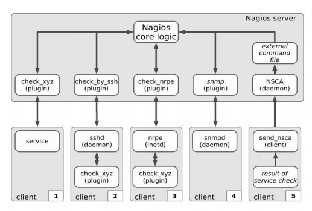

## Cách thức hoạt động của Nagios

Nagios có 5 cách thực thi các hành động kiểm tra

- Kiểm tra dịch vụ trực tiếp: Đối với các dịch vụ mạng có giao thức giao tiếp qua mạng như SMTP, HTTP, FTP,… Nagios có thể tiến hành kiểm tra trực tiếp một dịch vụ xem nó đang hoạt động hay không bằng cách gửi truy vấn kết nối dịch vụ đến server dịch vụ và đợi kết quả trả về. Các plugin phục vụ kiểm tra này được đặt ngay trên server Nagios.

- Chạy các plugin trên máy ở xa bằng secure shell: Nagios server không có cách nào có thể truy cập trực tiếp client để theo dõi những thông tin như tình trạng sử dụng ổ đĩa, swap, tiến trình … Để làm được việc này thì trên máy được giám sát phải cài plugin cục bộ. Nagios sẽ điểu khiển các plugin cục bộ trên client qua secure shell ssh bằng plugin check_by_ssh. Phương pháp này yêu cầu một tài khoản truy cập host được giám sát nhưng nó có thể thực thi được tất cả các plugin được cài trên host đó.

- Bộ thực thi plugin từ xa (NRPE - Nagios Remote Plugin Executor) NRPE là một addon đi kèm với Nagios. Nó trợ giúp việc thực thi các plugin được cài đặt trên máy/thiết bị được giám sát. NRPE được cài trên các host được giám sát. Khi nhận được truy vấn từ Nagios server thì nó gọi các plugin cục bộ phù hợp trên host này, thực hiện kiểm tra và trả về kết quả cho Nagios server. Phương pháp này không đòi hỏi tài khoản truy cập host được giám sát như sử dụng ssh. Tuy nhiên cũng như ssh các plugin phục vụ giám sát phải được cài đặt trên host được giám sát. NRPE có thể thực thi được tất cả các loại plugin giám sát. Nagios có thể điều khiển máy cài NRPE kiểm tra các thông số phần cứng, các tài nguyên, tình trạng hoạt động của máy đó hoặc sử dụng NRPE để thực thi các plugin yêu cầu truy vấn dịch vụ mạng đến một máy thứ 3 để kiểm tra hoạt động của các dịch vụ mạng như http, ftp, mail…

- Giám sát qua SNMP Cốt lõi của giao thức SNMP (SimpleNetwork Management Protocol )là tập hợp đơn giản các hoạt động giúp nhà quản trị mạng có thể quản lý, thay đổi trạng thái thiết bị. Hiện nay rất nhiều thiết bị mạng hỗ trợ giao thức SNMP như Switch, router, máy in, firewall ... Nagios cũng có khả năng sử dụng giao thức SNMP để theo dõi trạng thái của các client, các thiết bị mạng có hỗ trợ SNMP. Qua SNMP, Nagios có được thông tin về tình trạng hiện thời của thiết bị. Ví dụ như với SNMP, Nagios có thể biết được các cổng của Switch, router có mở hay không, thời gian Uptime (chạy liên tục) là bao nhiêu…

- NSCA (Nagios Service Check Acceptor) : Nagios được coi là một phần mềm rất mạnh vì nó dễ dàng được mở rộng và kết hợp với các phần mềm khác. Nó có thể tổng hợp thông tin từ các phần mềm kiểm tra của hãng thứ ba hoặc các tiến trình Nagios khác về rạng thái của host/dịch vụ. Như thế Nagios không cần phải lập lịch và chạy các hành động kiểm tra host/dịch vụ mà các ứng dụng khác sẽ thực hiện điểu này và báo cáo thông tin về cho nó. Và các ứng dụng kiểm tra có thể tận dụng được khả năng rất mạnh của Nagios là thông báo và tổng hợp báo cáo. Nagios sử dụng công cụ NSCA để gửi các kết quả kiểm tra từ ứng dụng của bạn về server Nagios. Công cụ này giúp cho thông tin gửi trên mạng được an toàn hơn vì nó được mã hóa và xác thực.

## Cơ chế

Hình trên cho thấy cái nhìn tổng quan về các cách thức kiểm tra dịch vụ với Nagios. Có 5 client được giám sát bằng 5 cách thức khác nhau:

- Client 1: Nagios sử dụng plugin **check_xyz** được cài đặt ngay trên server Nagios để gửi truy vấn kiểm tra dịch vụ trên client( http, ftp, dns, smtp…)

- Client 2, 3: Nagios sử dụng các plugin trung gian để chạy plugin **check_xyz** giám sát được cài đặt trực tiếp trên client. (bởi vì có những dịch vụ không có hỗ trợ giao thức trao đổi qua mạng, ví dụ khi bạn muốn kiểm tra dung lượng ổ đĩa cứng còn trống trên client…)

- Client 4: Kiểm tra dịch vụ qua giao thức snmp, nagios server sẽ sử dụng plugin check_snmp để kiểm tra các dịch vụ trên client có hỗ trợ giao thức SNMP. Rất nhiều thiết bị mạng như router, switch, máy in… có hỗ trợ giao thức SNMP.

- Client 5: Đây là phương pháp kiểm tra bị động. Nagios không chủ động kiểm tra dịch vụ mà là client chủ động gửi kết quả kiểm tra dịch vụ về cho Nagios thông qua plugin NSCA. Phương pháp này được áp dụng nhiều trong giám sát phân tán. Với các mạng có quy mô lớn, người ta có thể dùng nhiều server Nagios để giám sát từng phần của mạng. Trong đó có một server Nagios trung tâm thực hiện tổng hợp kết quả từ các server Nagios con thông qua plugin NSCA.

## Tham khảo 

https://github.com/meditechopen/meditech-ghichep-nagios/blob/master/docs/prepare/docs/3-nagios-overveiw.md