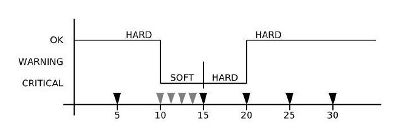
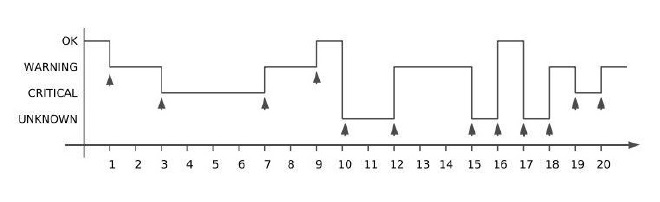

## Một số khái niệm trong Nagios

### Host checks

Host được kiểm tra bởi Nagios daemon khi:

- Trong khoảng thời gian được định nghĩa trong tùy chọn check_interval (khoảng thời gian giữa hai lần kiểm tra kế tiếp) và retry_interval (Khoảng thời gian thực hiện kiểm tra lại để xác nhận khi phát hiện host thay đổi trạng thái) của định nghĩa cấu hình host.

- Khi dịch vụ mà host đó cung cấp thay đổi trạng thái. Thường thì khi dịch vụ thay đổi trạng thái thì host cũng thay đổi trạng thái. Ví dụ nếu Nagios phát hiện ra dịch vụ HTTP thay đổi trạng thái từ CRITICAL sang OK, thì rất có thể là host cung cấp dịch vụ này vừa khởi động lại và đang chạy.

- Khi có host con của host đó bị đặt vào trạng thái UNREARCHABLE. Đó là trạng thái mà Nagios không liên lạc được với host đó hay có thể hiểu là mất đường truyền đến host đó.

Nagios phân loại host ra ba trạng thái:

- **UP**: Hoạt động bình thường

- **DOWN**: Tạm dừng hoạt động

- **UNREARCHABLE**: Không tìm thấy

Việc đặt lịch một host checks là không bắt buộc. Nếu bạn thiết lập `check_interval` bằng 0, thì Nagios sẽ không thực hiện checks theo định kỳ nữa. Nó vẫn sẽ thực hiện check nhưng chỉ khi được yêu cầu checks hosts khi cần thiết.

### Service checks

Dịch vụ được kiểm tra bởi Nagios daemon khi:

- Trong khoảng thời gian được định nghĩa trong tùy chọn check_interval (khoảng thời gian giữa hai lần kiểm tra kế tiếp) và retry_interval (Khoảng thời gian thực hiện kiểm tra lại để xác nhận khi phát hiện dịch vụ thay đổi trạng thái) của định nghĩa cấu hình dịch vụ.

- Theo yều cầu khi cần `predictive service dependency checks`

Nagios phân loại service thành bốn trạng thái:

- **OK**: Hoạt động bình thường

- **WARNING**: Có thể hoạt động nhưng chưa chính xác hoặc có thể không hoạt động 

- **UNKNOWN**: Không xác định được

- **CRITICAL**: Không hoạt động 

Service checks được thực hiện bởi các plugin, và có thể trả về một trong 4 trạng thái trên. Trạng thái của các plugin chính là trạng thái của các service.

Khi Nagios check status của các service thấy thay đổi giữa các trạng thái thì nó sẽ thực hiện các hành động thích hợp.

### State

Việc giám sát trạng thái hoạt động của các service hay host được xác định bằng hai thành phần:

- Trạng thái của service hoặc host (OK, WARNING, UP, DOWN,...)

- Loại state của service hoặc host

Có hai loại state trong Nagios là: SOFT và HARD states. Hai loại này chính là một phần quan trọng của monitoring logic. Vì chúng được sử dụng để xác định khi nào trình event handlers được thực thi và khi thông báo ban đầu được gửi đi.

Nagios cho phép bạn xác định bao nhiêu lần một dịch vụ hoặc host cần được kiểm tra lại trước khi nó được coi là một real problem. Điều này sẽ được điều khiển bởi tùy chọn `max_check_attempts` trên host đó.

### Soft State

- Soft state là trạng thái lỗi của dịch vụ hay host, tuy nhiên Nagios chưa chắc chắn đây thực sự là lỗi xảy ra với dịch vụ hay host. Ví dụ, Nagios cần thực hiện nhiều lần check để xác định xem dịch vụ hoặc host đó có thực sự bị lỗi hay không, nếu trong 1 lần check mà bị lỗi thì sẽ đưa ra trạng thái soft và cảnh báo sẽ chưa được gửi đi

Soft State xảy ra trong các tình huống sau:

- Khi kết quả check dịch vụ hoặc host trả về kết quả là trạng thái `non-OK` hoặc `non-UP` state nhưng chưa được Nagios check lại. Số lần check sẽ được xác định bởi `max_check_attempts`. Đây được gọi là soft error

- Khi dịch vụ hoặc host phục hồi từ 1 trạng thái soft error

### Hard State

Hard States xảy ra trong các trường hợp sau:

- Khi kết quả check host hoặc service trả về là `non-OK` hoặc `non-UP` và đã thực hiện check đủ số lần được định nghĩa trong `max_check_attempts` thì đây gọi lại hard error state.

- Khi dịch vụ hoặc host chuyển từ trạng thái hard error này sang trạng thái error khác (ví dụ: wanning -> critical)

- Khi service check results có trạng thái là `non-OK` và tướng ứng với host là DOWN hoặc UNREACHABLE

- Khi host hoặc service recovers từ một hard error state. Đây gọi là hard recovery

- Khi nhận được một passive host check. Passive host checks được coi là HARD trừ khi tùy chọn passive_host_checks_are_soft được bật.

Ví dụ thay đổi trạng thái của service với giá trị `max_check_attempts` là 5:



#### Ý nghĩa của 2 trạng thái giám sát 

- Mục đích của việc có 2 trạng thái giám sát này là để ngăn chặn những cảnh báo giả từ Nagios. Nghĩa là khi 1 dịch vụ hoặc host gặp vấn đề nhưng đó chỉ là lỗi tạm thời thì Nagios sẽ không đưa ra cảnh báo

- Rất hữu dụng khi giám sát các dịch vụ sử dụng giao thức ICMP hay UDP, vì có thể fail tạm thời trong 1 vài tình huống

### Flapping

Nếu trạng thái của host/service không ổn định, thay đổi liên tục. Người quản trị sẽ nhận được rất nhiều thông báo trong một khoảng thời gian ngắn. Nó không chỉ gây khó chịu mà còn làm rối loạn việc xác định vấn đề lỗi. Nagios có thể phát hiện vấn đề này và đặt trạng thái đó là flapping.

Để phát hiện tình trạng flap của một dịch vụ, Nagios lưu lại 21 kết quả kiểm tra dịch vụ gần nhất, tức là tối đa lưu lại 20 lần thay đổi trạng thái của dịch vụ. Hình dưới đây mô tả sự thay đổi trạng thái của một dịch vụ:



Từ hình trên ta có thể thấy là trong 20 lần kiểm tra, dịch vụ thay đổi trạng thái 12 lần. Nagios dựa vào số liệu này để thông báo dịch vụ đang rơi vào tình trạng flapping hoặc thoát khởi tình trạng flapping. Khi flapping xảy ra, Nagios sẽ ghi sự kiện này vào tệp log, đặt thông tin flap vào phần comment của dịch vụ và dừng hành động thông  báo trạng thái dịch vụ.

Một host hoặc service được xác định là `started` flapping khi phần trăm chuyển đổi trạng thái đầu tiên vượt high flapping threshold.

Một host hoặc service được xác định là `stopped` flapping khi phần trăm chuyển đổi trạng thái thấp hơn slow flapping threshold.

Cấu hình phát hiện flap được đặt tại 2 vị trí: Tệp cấu hình chính nagios.cfg và trong định nghĩa của từng dịch vụ cụ thể.

Trong tệp cấu hình chính `/etc/nagios/nagios.cfg`

```
enable_flap_detection=1 // cho phép phát hiện flap. 
low_service_flap_threshold=5.0 //ngưỡng dưới flap 
high_service_flap_threshold=20.0 //ngưỡng trên flap
```

## Tham khảo

https://assets.nagios.com/downloads/nagioscore/docs/nagioscore/3/en/hostchecks.html
https://assets.nagios.com/downloads/nagioscore/docs/nagioscore/3/en/servicechecks.html
https://assets.nagios.com/downloads/nagioscore/docs/nagioscore/3/en/flapping.html
https://github.com/trangnth/Monitor/blob/master/Ghichep_nagios/Ghichep.md
https://github.com/meditechopen/meditech-ghichep-nagios/blob/master/docs/lythuyet-nagios/3.Soft-Hard-States.md