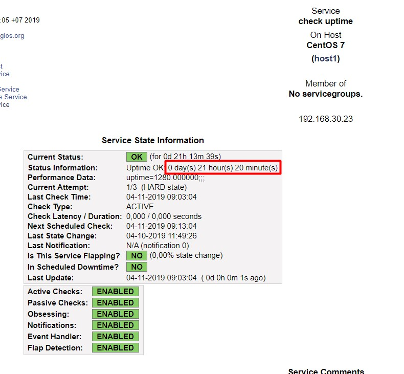
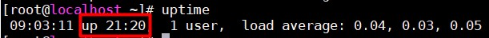
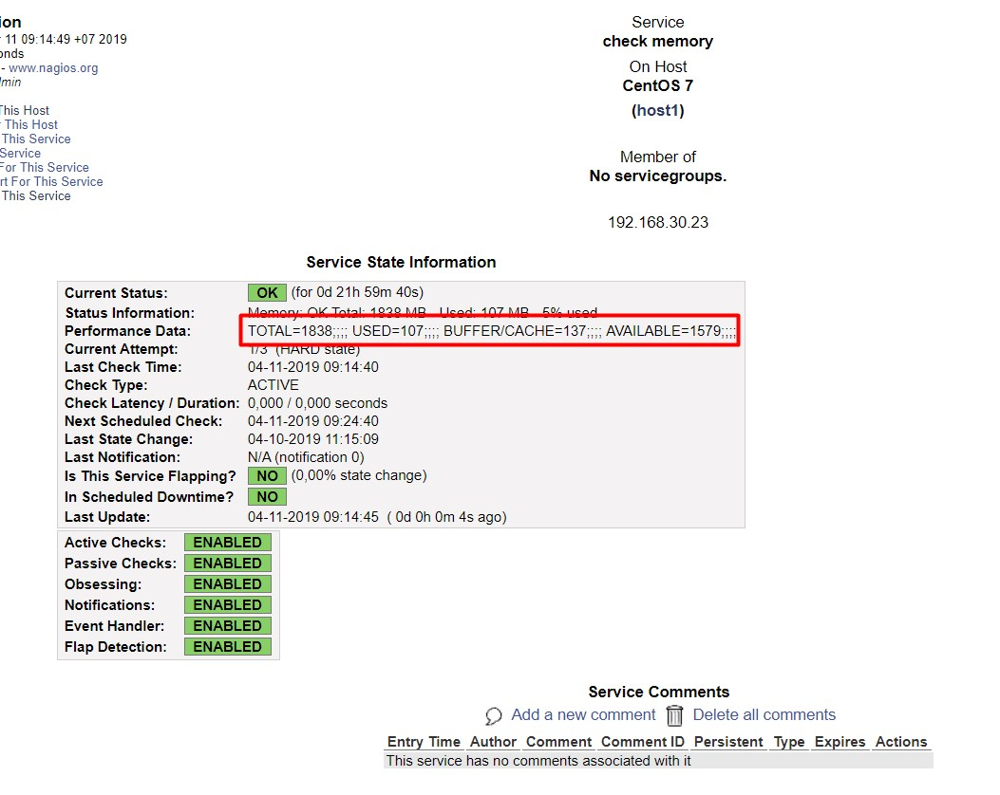
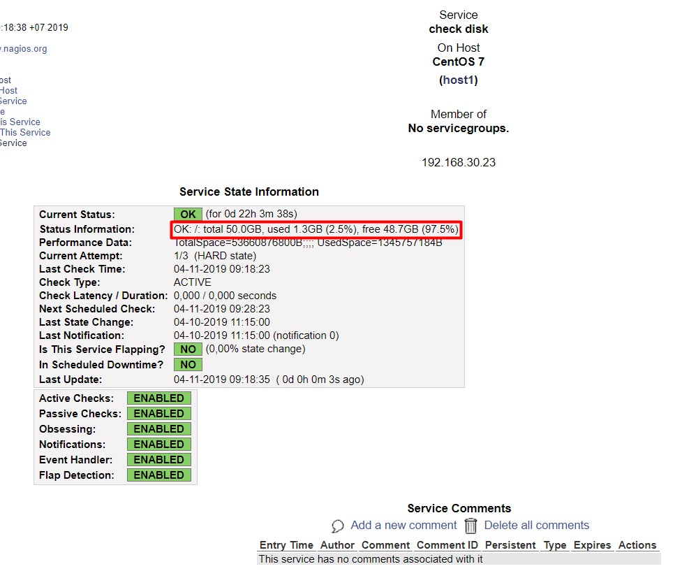
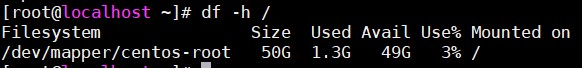

## So sánh một vài thông số được Nagios check và hiển thị với các thông số check trực tiếp bằng câu lệnh trên host

### check_uptime

Thông số của service check_uptime hiển thị trên Nagios Web UI

Kiểm tra trên host bằng câu lệnh `uptime`

Nhận thấy 2 thông số hoàn toàn trùng khớp nhau

### check_memory

Thông số hiển thị của service check_memory

Kiểm tra trên host bằng lệnh `free -m`

Có thể thấy các thông số khá trùng khớp với nhau 

### check_disk

Thông số trên Nagios

Thông số kiểm tra bằng lệnh `df -h /`

