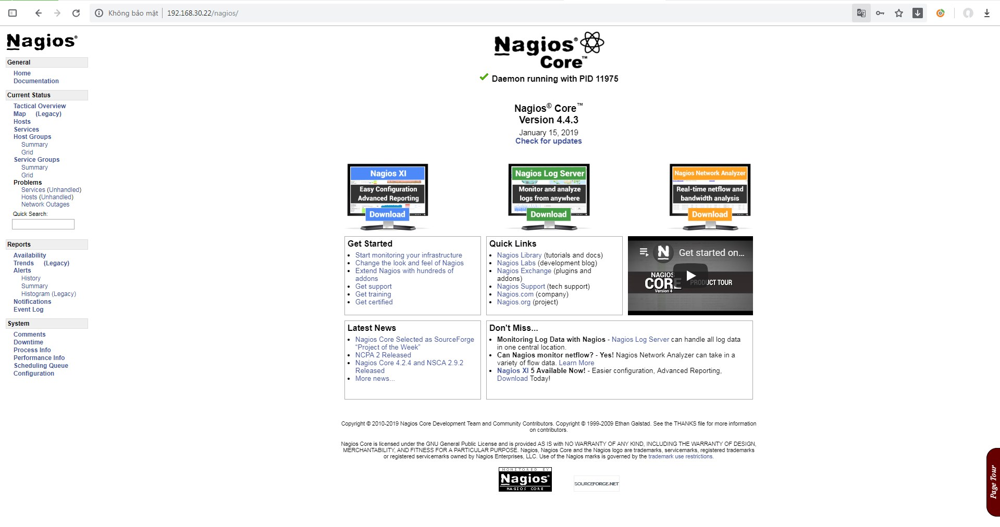

## Cài đặt Nagios Core server trên CentOS 7

### Chuẩn bị

- Cài đặt các gói thư viện cần thiết:

```
yum install gcc glibc glibc-common gd gd-devel make net-snmp openssl-devel xinetd unzip httpd php php-fpm curl wget -y
```

- Mở port 80 cho httpd trên firewall

```
firewall-cmd --permanent --add-port=80/tcp
firewall-cmd --reload
```

- Tắt SELinux

```
sed -i s/SELINUX=enforcing/SELINUX=disable/g /etc/sysconfig/selinux
setenforce 0
```

### Tạo user cho Nagios

Tạo user `nagios` trên máy chủ cài đặt Nagios Server

```
useradd -m -s /bin/bash nagios
passwd nagios
```

Tạo group `nagcmd` để chấp nhận các external command được submit qua web interface. Thêm user nagios và apache vào group.

```
groupadd nagcmd
usermod -a -G nagcmd nagios
usermod -a -G nagcmd apache 
```

### Cài đặt Nagios Core và Plugin

Tải Nagios Core về server, phiên bản hiện tại là Nagios Core 4.4.3. Để cập nhật mới nhất, xem tại trang chủ Nagios tại [đây](https://www.nagios.org/downloads/)

```
cd /opt
wget http://prdownloads.sourceforge.net/sourceforge/nagios/nagios-4.4.3.tar.gz
```

Sau khi tải xong, giải nén và biên dịch Nagios Core và Plugin trên máy chủ

- Giải nén source Nagios

`tar xzf nagios-4.4.3.tar.gz`

- Biên dịch Nagios

```
cd nagios-4.4.3
./configure --with-command-group=nagcmd
make all
make install
make install-commandmode
make install-init
make install-config
make install-webconf
```

- Cho phép Nagios khởi động cùng hệ thống

`systemctl enable nagios`

- Cài đặt password cho `nagiosadmin` khi đăng nhập web:

`htpasswd -c /usr/local/nagios/etc/htpasswd.users nagiosadmin`

- Tải gói Plugin và giải nén 

```
cd /opt
wget https://nagios-plugins.org/download/nagios-plugins-2.2.1.tar.gz
tar xzf nagios-plugins-2.2.1.tar.gz 
```

- Biên dịch các Plugin từ source code

```
cd nagios-plugins-2.2.0
./configure --with-nagios-user=nagios --with-nagios-group=nagios --with-openssl
make
make install
```

### Khởi động Nagios Server 

- Khởi động lại apache và chạy nagios, cho phép khởi động cùng hệ thống:

```
systemctl enable httpd 
systemctl restart httpd
systemctl restart nagios
```

- Truy cập vào giao diện web và đăng nhập bằng `nagiosadmin` và password vừa tạo ở địa chỉ:

`http://192.168.30.22/nagios`

- Giao diện Nagios



## Tham khảo

https://assets.nagios.com/downloads/nagioscore/docs/nagioscore/4/en/quickstart-fedora.html
https://github.com/meditechopen/meditech-ghichep-nagios/blob/master/docs/thuchanh-nagios/1.Setup-CentOS-7.md