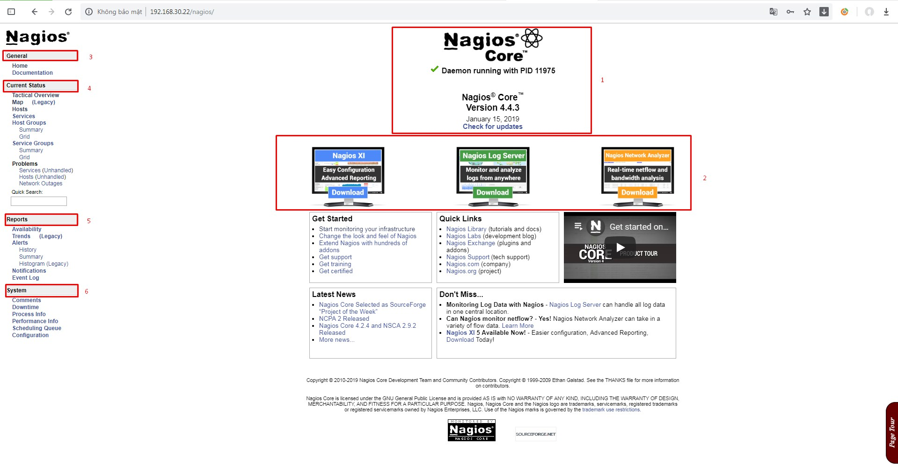
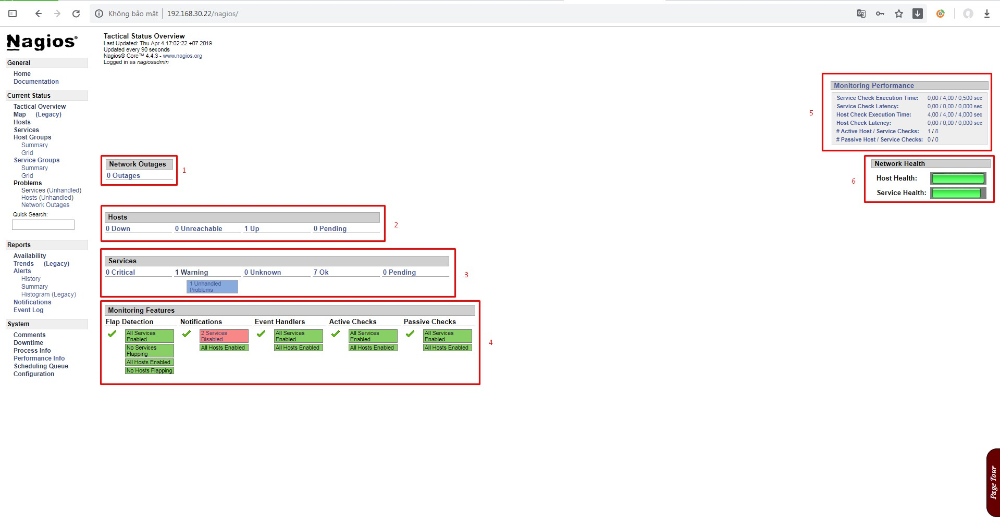
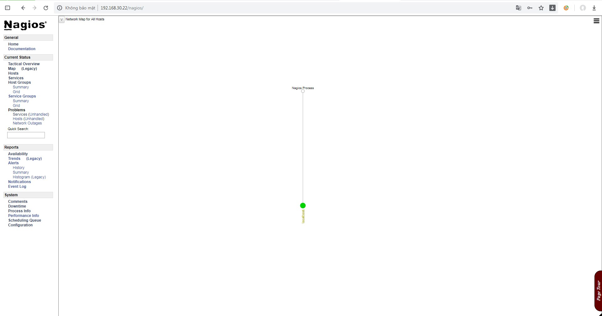
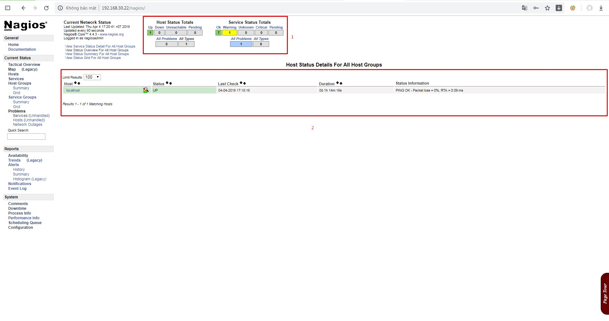
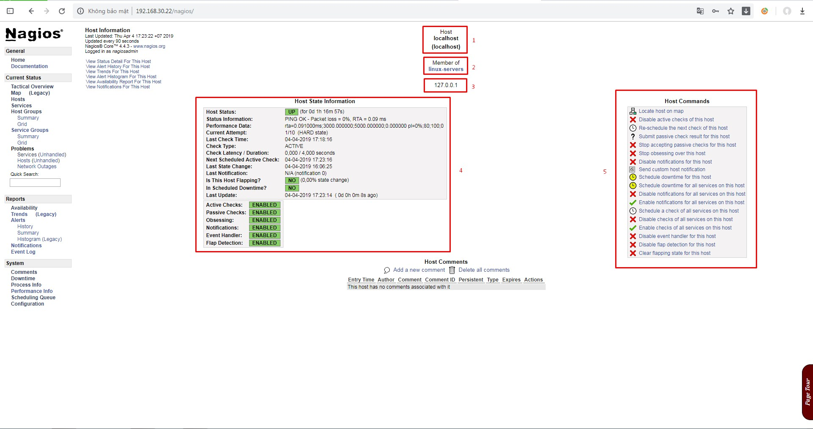

# Giao diện web của Nagios

## 1. Giao diện tổng quan của Nagios dashboard

- Mục 1: Tên sản phẩm, PID của nagios daemon, phiên bản

- Mục 2: Các sản phẩm khác của Nagios(Nagios XI, Nagios Log Server, Nagios Network Analyzer)

- Mục 3: **General**: Giới thiệu chung về sản phẩm Nagios và tài liệu docs về Nagios

- Mục 4: **Current status**: Trạng thái gần đây của Nagios, sẽ hiển thị thông tin giám sát tại đây

- Mục 5: **Report**: Báo cáo về các trạng thái đang diễn ra trên hệ thống

- Mục 6: **System**

## 2. Current status

### 2.1 Tactical Monitoring Overview

Thể hiện 1 cách tổng quan về các trạng thái giám sát

- Mục 1: Thể hiện Network Outages (tình trạng mạng gián đoạn)

- Mục 2: Thể hiện tình trạng các host được giám sát 

- Mục 3: Thể hiện tình trạng các service trên các host 

- Mục 4: Thể hiện các tính năng giám sát như flap detecting, notifications,...

- Mục 5: Hiệu suất giám sát như thời gian thực hiện check, tình trạng host, service

- Mục 6: Đánh giá sức khỏe của hệ thống 

### 2.2 Map (Legacy): Mô tả các host được giám sát trong hệ thống

### 2.3 Host: Các host được giám sát 

- Mục 1: Bảng tổng quan về trạng thái các host và các service đang được giám sát. Khi click vào bất cứ thông số nào như Up, Down, Unreachable, Pending sẽ hiện ra thông tin các host đang trong trạng thái trên.

- Mục 2: Thông tin chi tiết về các host đang giám sát như lần check cuối cùng, trạng thái host, thời gian host được giám sát, thông tin.

#### 2.3.1 Thông tin cụ thể của host

- Mục 1: Tên host

- Mục 2: Tên hostgroup

- Mục 3: Địa chỉ IP của host

- Mục 4: Các thông tin cụ thể của host như trạng thái, thời gian check,...

- Mục 5: Các command cụ thể để thực thi ngay 1 lệnh đến host như disable active check, gửi cảnh báo,...

#### 2.3.2 Host command 

- **Locate host on map**: Dẫn đến map của hệ thống giám sát 

- **Disable active checks of this host**: Disable ngay lập tức active check host

- **Re-schedule the next check of this host**: Thay đổi lịch lần check tiếp theo của host

- **Submit passive check result for this host**: Gửi kết quả check passive của host

- **Stop accepting passive checks for this host**: Ngừng chấp nhận check passive cho host này

- **Stop obsessing over this host**

- **Disable notifications for this host**: Tắt thông báo của host

- **Send custom host notification**: Gửi ngay lập tức thông tin cụ thể của host mail

- **Schedule downtime for this host**: Lên kế hoạch cho downtime của host, trong thời gian này nagios sẽ không gửi cảnh báo.

- **Schedule downtime for all services on this host**: Lên kế hoạch cho thời gian downtime của service

- **Disable notification for all services on this host**: Tắt thông báo cho tất cả dịch vụ trên host

- **Enable notification for all services on this host**: Bật thông báo cho tất cả dịch vụ trên host

- **Schedule a check of all services on this host**: Lên lịch kiểm tra cho tất cả dịch vụ trên host

- **Disable checks of all services on this host**: Tắt check cho tất cả dịch vụ trên host

- **Enable checks of all services on this host**: Bật check cho tất cả dịch vụ trên host

- **Disable event handler for this host**

- **Disable flap detection for this host**: Ngắt phát hiện trạng thái flap của host

