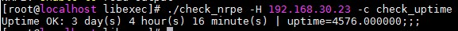
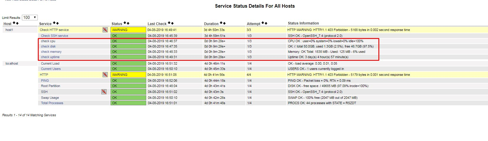

## Cài đặt giám sát Nagios với NRPE

### Mô hình

- Server:

OS: CentOS 7

IP: 192.168.30.22

- Client

OS: CentOS 7

IP: 192.168.30.23

### Cài đặt trên client

- Mở cổng 5666:

```
firewall-cmd --permanent --zone=public --add-port=5666/tcp
firewall-cmd --reload
```

- Cài đặt epel repo

`yum install epel-release -y`

- Cài đặt NRPE và các Plugin 

`yum install nrpe nagios-plugins-all -y`

- Chỉnh sửa các thông tin trong file `/etc/nagios/nrpe.cfg`:

```
allowed_hosts=127.0.0.1, <nagios_server_ip>
```

- Khởi động lại dịch vụ NRPE

```
systemctl restart nrpe
systemctl enable nrpe
```

### Trên Server 

- Mở cổng 5666:

```
firewall-cmd --permanent --zone=public --add-port=5666/tcp
firewall-cmd --reload
```

- Tải gói và cài đặt NRPE

```
cd /opt
wget http://liquidtelecom.dl.sourceforge.net/project/nagios/nrpe-3.x/nrpe-3.2.1.tar.gz
tar xzf nrpe-3.2.1.tar.gz
cd nrpe-3.2.1
./configure --enable-command-args --with-nagios-user=nagios \
--with-nagios-group=nagios --with-ssl=/usr/bin/openssl \
--with-ssl-lib=/usr/lib/x86_64-linux-gnu
make all 
make install
```

- Kiểm tra cài đặt 

```
cd /usr/local/nagios/libexec/
./check_nrpe -H <client_IP>
```

- Khai báo câu lệnh `check_nrpe` vào file `/usr/local/nagios/etc/objects/commands.cfg`:

```
define command{
	command_name check_nrpe
	command_line $USER1$/check_nrpe -H $HOSTADDRESS$ -c $ARG1$
}
```

### Cấu hình giám sát các thông số host

- Để giám sát các thông số như RAM, Disk, CPU,... sẽ sử dụng một số scripts theo link sau:

`https://github.com/trimq/meditech-ghichep-nagios/tree/master/scripts/Plugin-nagios`

- Tải các script về

```
mkdir -p /usr/lib/nagios/plugin
cd /usr/lib/nagios/plugin 
wget https://raw.githubusercontent.com/trimq/meditech-ghichep-nagios/master/scripts/Plugin-nagios/check_disk_space.sh
wget https://raw.githubusercontent.com/trimq/meditech-ghichep-nagios/master/scripts/Plugin-nagios/check_mem.sh
wget https://raw.githubusercontent.com/trimq/meditech-ghichep-nagios/master/scripts/Plugin-nagios/check_cpu.sh
wget https://raw.githubusercontent.com/trimq/meditech-ghichep-nagios/master/scripts/Plugin-nagios/check_uptime
```

- Phân quyền cho các file

```
chmod +x check_cpu.sh
chmod +x check_disk_space.sh
chmod +x check_mem.sh
chmod +x check_uptime
```

- Kiểm tra các file script:

```
./check_cpu.sh
./check_disk_space.sh -w 70 -c 80 -p /
./check_mem.sh -w 70 -c 80
```

**-w**: Ngưỡng cảnh báo Warning

**-c**: Ngưỡng cảnh báo Critical

**-p**: Phân vùng được kiểm tra

- Khai báo trong file cấu hình `/etc/nagios/nrpe.cfg`, thêm vào nội dung sau:

```
command[check_disk_space]=/usr/lib/nagios/plugin/check_disk_space.sh -w 70 -c 80 -p /
command[check_cpu]=/usr/lib/nagios/plugin/check_cpu.sh
command[check_uptime]=/usr/lib/nagios/plugin/check_uptime
command[check_mem]=/usr/lib/nagios/plugin/check_mem.sh -w 75 -c 85
```

- Khởi động lại NRPE

`systemctl restart nrpe`

- Kiểm tra trên server:

```
cd /usr/local/nagios/libexec/
./check_nrpe -H 192.168.30.23 -c check_uptime
```



- Khai báo trên file cấu hình của host để giám sát:

```
vi /usr/local/nagios/etc/servers/host1.cfg
# Thêm nội dung phía dưới
define service {
    use                 generic-service     ; Inherit default values from a template
    host_name           host1
    service_description check memory
    check_command       check_nrpe!check_mem
}
define service {
    use                 generic-service     ; Inherit default values from a template
    host_name           host1
    service_description check uptime
    check_command       check_nrpe!check_uptime
}
define service {
    use                 generic-service     ; Inherit default values from a template
    host_name           host1
    service_description check cpu
    check_command       check_nrpe!check_cpu
}
define service {
    use                 generic-service     ; Inherit default values from a template
    host_name           host1
    service_description check disk
    check_command       check_nrpe!check_disk_space
}
```

- Khởi động lại nagios

`systemctl restart nagios`

- Kiểm tra trên dashboard



## Tham khảo 

https://github.com/meditechopen/meditech-ghichep-nagios/blob/master/docs/thuchanh-nagios/4.Setup-NagiosNRPE.md