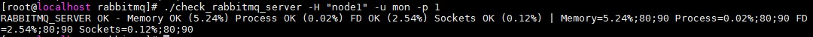
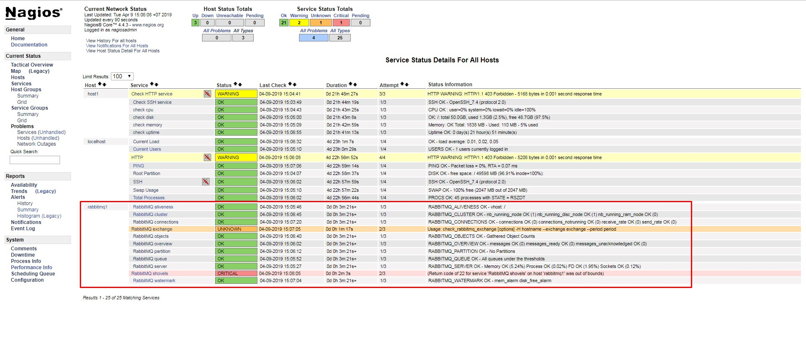

## Giám sát RabbitMQ 

### 1. Thông tin host RabbitMQ

```
OS: CentOS 7
IP: 192.168.30.24
Hostname: node1
Service: RabbitMQ
```

Cách cài đặt RabbitMQ xem tại [đây](https://github.com/hoangdh/meditech-ghichep-rabbitmq/blob/master/docs/tutorials/setup-standalone/CENTOS-7.md)

### 2. Các bước tiến hành

#### 2.1 Chuẩn bị trên host RabbitMQ

- Tạo một user có chức năng `monitoring` trên RabbitMQ

```
rabbitmqctl add_user mon 1
rabbitmqctl set_user_tags mon monitoring
rabbitmqctl set_permissions -p / mon ".*" ".*" ".*" 
```

#### 2.2 Cấu hình trên Nagios Server

##### 2.2.1 Cài đặt Perl-CPAN trên Nagios Server

```
yum install -y epel-release
yum install -y perl-Monitoring-Plugin perl-Config-Tiny perl-JSON* perl-Math-Calc-Units
```

##### 2.2.2 Cài đặt plugin trên Nagios Server

- Tải gói plugin từ `git` và copy chúng vào thư mục plugin

```
git clone https://github.com/nagios-plugins-rabbitmq/nagios-plugins-rabbitmq.git

mkdir /usr/local/nagios/libexec/rabbitmq/
cp nagios-plugins-rabbitmq/scripts/* /usr/local/nagios/libexec/rabbitmq/

chown -R nagios. /usr/local/nagios/libexec/rabbitmq/
```

##### 2.2.3 Thêm thông tin host và giám sát dịch vụ trên Nagios Server

- Thêm thông tin vào file host

Thêm thông tin của RabbitMQ vào file `/etc/hosts` trên Nagios Server:

```
192.168.30.24 node1
```

- Kiểm tra plugin

```
cd /usr/local/nagios/libexec/rabbitmq/
./check_rabbitmq_server -H "node1" -u mon -p 1
```



- Thêm command vào file `/usr/local/nagios/etc/objects/commands.cfg` trên Nagios Server

```
define command {
 command_name check_rabbitmq_aliveness
 command_line $USER1$/rabbitmq/check_rabbitmq_aliveness -H $ARG1$ --port=$ARG2$ -u $ARG3$ -p $ARG4$
}
define command {
 command_name check_rabbitmq_cluster 
 command_line $USER1$/rabbitmq/check_rabbitmq_cluster -H $ARG1$ --port=$ARG2$ -u $ARG3$ -p $ARG4$
}
define command {
 command_name check_rabbitmq_connections
 command_line $USER1$/rabbitmq/check_rabbitmq_connections -H $ARG1$ --port=$ARG2$ -u $ARG3$ -p $ARG4$
}
define command {
 command_name check_rabbitmq_exchange
 command_line $USER1$/rabbitmq/check_rabbitmq_exchange -H $ARG1$ --port=$ARG2$ -u $ARG3$ -p $ARG4$
}

define command {
 command_name check_rabbitmq_objects
 command_line $USER1$/rabbitmq/check_rabbitmq_objects -H $ARG1$ --port=$ARG2$ -u $ARG3$ -p $ARG4$
}


define command {
 command_name check_rabbitmq_overview
 command_line $USER1$/rabbitmq/check_rabbitmq_overview -H $ARG1$ --port=$ARG2$ -u $ARG3$ -p $ARG4$
}

define command {
 command_name check_rabbitmq_partition
 command_line $USER1$/rabbitmq/check_rabbitmq_partition -H $ARG1$ --port=$ARG2$ -u $ARG3$ -p $ARG4$
}

define command {
 command_name check_rabbitmq_queue
 command_line $USER1$/rabbitmq/check_rabbitmq_queue -H $ARG1$ --port=$ARG2$ -u $ARG3$ -p $ARG4$
}

define command {
 command_name check_rabbitmq_server
 command_line $USER1$/rabbitmq/check_rabbitmq_server -H $ARG1$ --port=$ARG2$ -u $ARG3$ -p $ARG4$
}

define command {
 command_name check_rabbitmq_shovels
 command_line $USER1$/rabbitmq/check_rabbitmq_shovels -H $ARG1$ --port=$ARG2$ -u $ARG3$ -p $ARG4$
}

define command {
 command_name check_rabbitmq_watermark
 command_line $USER1$/rabbitmq/check_rabbitmq_watermark -H $ARG1$ --port=$ARG2$ -u $ARG3$ -p $ARG4$
}
```

**Lưu ý**: Các command trên chưa đặt ngưỡng cảnh báo

- Tạo file cấu hình cho RabbitMQ

Tạo file `/usr/local/nagios/etc/servers/rabbitmq1.cfg` và thêm nội dung sau:

```
define host{
use                             linux-server
host_name                       rabbitmq1
alias                           RabbitMQ Server
address                         node1
}
define service {
    use                     generic-service
    host_name               rabbitmq1
    service_description     RabbitMQ aliveness
    check_command           check_rabbitmq_aliveness!node1!15672!mon!1
}
define service {
    use                     generic-service
    host_name               rabbitmq1
    service_description     RabbitMQ cluster
    check_command           check_rabbitmq_cluster!node1!15672!mon!1
}
define service {
    use                     generic-service
    host_name               rabbitmq1
    service_description     RabbitMQ connections
    check_command           check_rabbitmq_connections!node1!15672!mon!1
}
define service {
    use                     generic-service
    host_name               rabbitmq1
    service_description     RabbitMQ exchange
    check_command           check_rabbitmq_exchange!node1!15672!mon!1
}
define service {
    use                     generic-service
    host_name               rabbitmq1
    service_description     RabbitMQ objects 
    check_command           check_rabbitmq_objects!node1!15672!mon!1
}
define service {
    use                     generic-service
    host_name               rabbitmq1
    service_description     RabbitMQ overview  
    check_command           check_rabbitmq_overview!node1!15672!mon!1
}
define service {
    use                     generic-service
    host_name               rabbitmq1
    service_description     RabbitMQ partition 
    check_command           check_rabbitmq_partition!node1!15672!mon!1
}
define service {
    use                     generic-service
    host_name               rabbitmq1
    service_description     RabbitMQ queue
    check_command           check_rabbitmq_queue!node1!15672!mon!1
}
define service {
    use                     generic-service
    host_name               rabbitmq1
    service_description     RabbitMQ server 
    check_command           check_rabbitmq_server!node1!15672!mon!1
}
define service {
    use                     generic-service
    host_name               rabbitmq1
    service_description     RabbitMQ shovels 
    check_command           check_rabbitmq_shovels!node1!15672!mon!1
}
define service {
    use                     generic-service
    host_name               rabbitmq1
    service_description     RabbitMQ watermark
    check_command           check_rabbitmq_watermark!node1!15672!mon!1
}
```

- Khởi động lại Nagios

`systemctl restart nagios`

- Kiểm tra trên Web UI



## Tham khảo

https://github.com/meditechopen/meditech-ghichep-nagios/blob/master/docs/thuchanh-nagios/5.Monitor-RabbitMQ.md