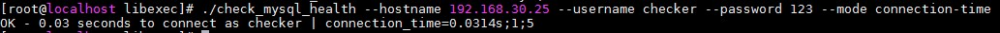
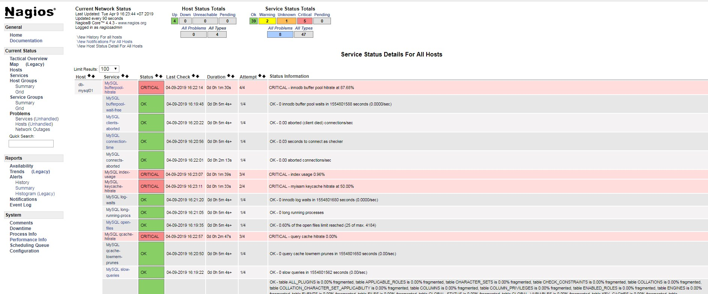

## Monitor MySQL 

### 1. Thông tin host MySQL

```
OS: CentOS 7 
IP: 192.168.30.25
Service: MariaDB
```

Mở port 3306 trên host MySQL

```
firewall-cmd --permanent --add-port=3306/tcp
firewall-cmd --reload
```

### 2. Chuẩn bị cài đặt Plugin

#### 2.1 Chuẩn bị trên host Database

- Bước 1: Cho phép bind đến DB

Sửa file `/etc/my.cfn.d/server.cnf` thêm nội dung sau ở phần [mysqld]

```
...
[mysqld]
bind-address = 0.0.0.0
...
```

- Bước 2: Khởi động lại dịch vụ

`systemctl restart mariadb`

- Bước 3: Tạo user kiểm tra cho Nagios

Ở phần này chúng ta cần tạo một USER có quyền USAGE trên host DB (192.168.30.25)

```
GRANT usage ON *.* TO 'checker'@'192.168.30.22' IDENTIFIED BY '123';
```

`checker`: Tên của user dùng cho Nagios có thể truy xuất DB 

`123`: Mật khẩu của `checker` (Tùy chọn)

`192.168.30.22`: Địa chỉ IP của Nagios Server

#### 2.2 Cài đặt Plugin trên Nagios Server

- Cài các gói đi kèm

Thêm repo của MariaDB

`vi /etc/yum.repos.d/MariaDB.repo`

```
[mariadb]
name = MariaDB
baseurl = http://yum.mariadb.org/10.3/centos7-amd64
gpgkey=https://yum.mariadb.org/RPM-GPG-KEY-MariaDB
gpgcheck=1
```

Cài gói MariaDB-client và DBI, DBD::mysql

```
yum install MariaDB-client perl-DBI perl-DBD-MySQL -y
```

- Cài đặt Plugin `check_mysql_health`:

```
wget https://labs.consol.de/assets/downloads/nagios/check_mysql_health-2.2.2.tar.gz 
tar zxvf check_mysql_health-2.2.2.tar.gz 
cd check_mysql_health-2.2.2
./configure
make
make install
```

- Kiểm tra plugin

```
cd /usr/local/nagios/libexec/

./check_mysql_health --hostname 192.168.30.25 --username checker --password 123 --mode connection-time
```

Kết quả trả về như sau là plugin hoạt động ổn định:



#### 2.3 Thêm thông tin host và giám sát

- Thêm command mới vào file `/usr/local/nagios/etc/objects/commands.cfg`

```
...
# MySQL Health

define command{
command_name check_mysql_health
command_line $USER1$/check_mysql_health -H $ARG4$ --username $ARG1$ --password $ARG2$ --port $ARG5$ --mode $ARG3$
}
```

- Tạo file cấu hình `/usr/local/nagios/etc/servers/mysql-server.cfg` với nội dung:

```
define host{
        use                             linux-server
        host_name                       db-mysql01         
        alias                           mysql          
        address                         192.168.30.25   
        max_check_attempts              5
        check_period                    24x7
        notification_interval           30
        notification_period             24x7
}
define service{
use local-service
host_name db-mysql01
service_description MySQL connection-time
check_command check_mysql_health!checker!123!connection-time!192.168.30.25!3306!
}
define service{
use local-service
host_name db-mysql01
service_description MySQL uptime
check_command check_mysql_health!checker!123!uptime!192.168.30.25!3306!
}
define service{
use local-service
host_name db-mysql01
service_description MySQL threads-connected
check_command check_mysql_health!checker!123!threads-connected!192.168.30.25!3306!
}
define service{
use local-service
host_name db-mysql01
service_description MySQL threads-created
check_command check_mysql_health!checker!123!threads-created!192.168.30.25!3306!
}
define service{
use local-service
host_name db-mysql01
service_description MySQL threads-running
check_command check_mysql_health!checker!123!threads-running!192.168.30.25!3306!
}
define service{
use local-service
host_name db-mysql01
service_description MySQL threads-cached
check_command check_mysql_health!checker!123!threads-cached!192.168.30.25!3306!
}
define service{
use local-service
host_name db-mysql01
service_description MySQL connects-aborted
check_command check_mysql_health!checker!123!connects-aborted!192.168.30.25!3306!
}
define service{
use local-service
host_name db-mysql01
service_description MySQL clients-aborted
check_command check_mysql_health!checker!123!clients-aborted!192.168.30.25!3306!
}
define service{
use local-service
host_name db-mysql01
service_description MySQL qcache-hitrate
check_command check_mysql_health!checker!123!qcache-hitrate!192.168.30.25!3306!
}
define service{
use local-service
host_name db-mysql01
service_description MySQL qcache-lowmem-prunes
check_command check_mysql_health!checker!123!qcache-lowmem-prunes!192.168.30.25!3306!
}
define service{
use local-service
host_name db-mysql01
service_description MySQL keycache-hitrate
check_command check_mysql_health!checker!123!keycache-hitrate!192.168.30.25!3306!
}
define service{
use local-service
host_name db-mysql01
service_description MySQL bufferpool-hitrate
check_command check_mysql_health!checker!123!bufferpool-hitrate!192.168.30.25!3306!
}
define service{
use local-service
host_name db-mysql01
service_description MySQL bufferpool-wait-free
check_command check_mysql_health!checker!123!bufferpool-wait-free!192.168.30.25!3306!
}
define service{
use local-service
host_name db-mysql01
service_description MySQL log-waits
check_command check_mysql_health!checker!123!log-waits!192.168.30.25!3306!
}
define service{
use local-service
host_name db-mysql01
service_description MySQL tablecache-hitrate 
check_command check_mysql_health!checker!123!tablecache-hitrate !192.168.30.25!3306!
}
define service{
use local-service
host_name db-mysql01
service_description MySQL table-lock-contention
check_command check_mysql_health!checker!123!table-lock-contention!192.168.30.25!3306!
}
define service{
use local-service
host_name db-mysql01
service_description MySQL index-usage
check_command check_mysql_health!checker!123!index-usage!192.168.30.25!3306!
}
define service{
use local-service
host_name db-mysql01
service_description MySQL tmp-disk-tables 
check_command check_mysql_health!checker!123!tmp-disk-tables !192.168.30.25!3306!
}
define service{
use local-service
host_name db-mysql01
service_description MySQL table-fragmentation
check_command check_mysql_health!checker!123!table-fragmentation!192.168.30.25!3306!
}
define service{
use local-service
host_name db-mysql01
service_description MySQL open-files
check_command check_mysql_health!checker!123!open-files!192.168.30.25!3306!
}
define service{
use local-service
host_name db-mysql01
service_description MySQL slow-queries
check_command check_mysql_health!checker!123!slow-queries!192.168.30.25!3306!
}
define service{
use local-service
host_name db-mysql01
service_description MySQL long-running-procs
check_command check_mysql_health!checker!123!long-running-procs!192.168.30.25!3306!
}
```

Chi tiết mode xem tại [đây](https://labs.consol.de/nagios/check_mysql_health/#command-line-parameters)

- Khởi động lại Nagios Server

`systemctl restart nagios`

- Kiểm tra trên Web UI



## Tham khảo 

https://github.com/meditechopen/meditech-ghichep-nagios/blob/master/docs/thuchanh-nagios/6.Monitor-MySQL.md