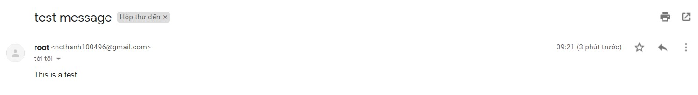
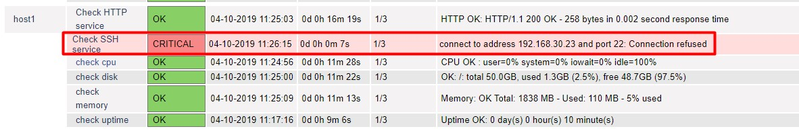
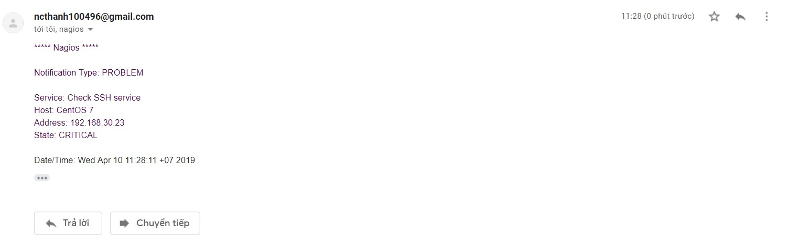
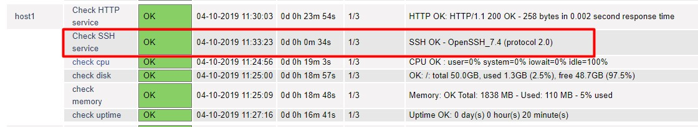
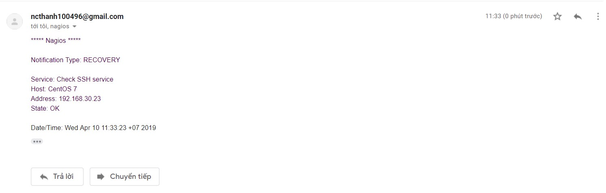
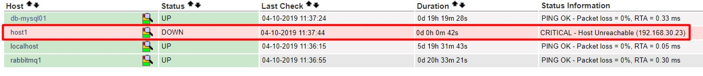
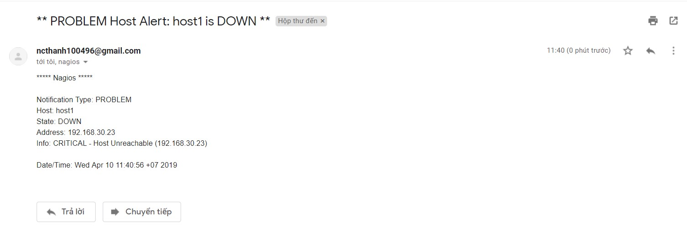
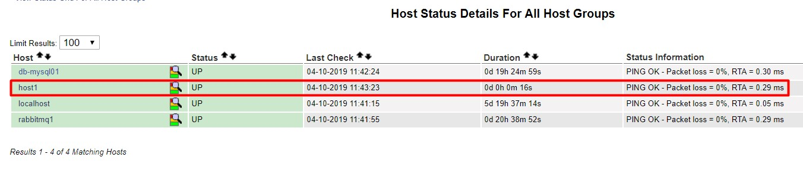
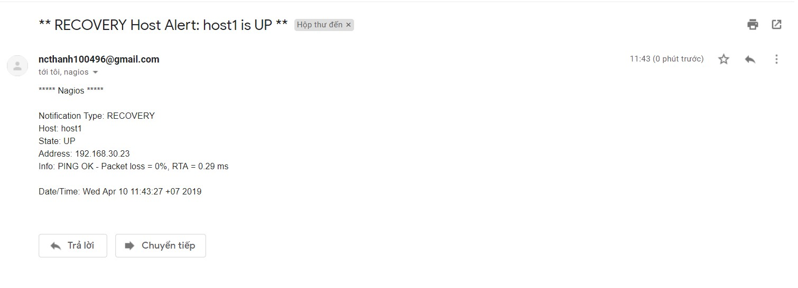

## Cấu hình gửi cảnh báo qua email

### 1. Mô hình lab

- Server: 

```
OS: CentOS 7
IP: 192.168.30.22
Service: Nagios Core
```

- Client:

```
OS: CentOS 7
IP: 192.168.30.23
Service: SSH, HTTP
```

### 2. Chuẩn bị

#### 2.1 Cấu hình gửi cảnh báo qua Gmail

- Cài đặt gói mail postfix

```
yum -y install postfix cyrus-sasl-plain mailx
```

- Cấu hình dịch vụ mail postfix, thêm vào file `/etc/postfix/main.cf` nội dung sau:

```
relayhost = [smtp.gmail.com]:587
smtp_use_tls = yes
smtp_sasl_auth_enable = yes
smtp_sasl_password_maps = hash:/etc/postfix/sasl_passwd
smtp_tls_CAfile = /etc/ssl/certs/ca-bundle.crt
smtp_sasl_security_options = noanonymous
smtp_sasl_tls_security_options = noanonymous
```

- Khởi động lại dịch vụ:

```
systemctl restart postfix
systemctl enable postfix
```

- Tạo file `/etc/postfix/sasl_passwd` để khai báo tài khoản mail xác thực, thêm nội dung sau vào file:

```
[smtp.gmail.com]:587 username@gmail.com:password
```

**username** và **password** thay bằng username và password mail của bạn

- Thiết lập chế độ less secure của Gmail, truy cập link sau:

https://myaccount.google.com/lesssecureapps

- Khởi động lại postfix

```
systemctl restart postfix
```

#### 2.2 Kiểm tra gửi thử email

- Thực hiện câu lệnh sau trên Nagios Server

```
echo "This is a test." | mail -s "test message" username@gmail.com
```

Thay `username` bằng username vừa cấu hình phía trên.

- Kiểm tra trên hòm thư



### 3. Gửi cảnh báo khi có sự cố

- Thêm các thông tin liên lạc của Nagios vào file `/usr/local/nagios/etc/objects/contacts.cfg`

```
define contact{
        contact_name                    nagiosadmin             ; Short name of user
        use                             generic-contact         ; Inherit default values from generic-contact template (defined above)
        alias                           Nagios Admin            ; Full name of user

        email                           ncthanh100496@gmail.com        ; <<***** CHANGE THIS TO YOUR EMAIL ADDRESS ******

        service_notification_period             24x7
        service_notification_options            w,u,c,r,f,s
        service_notification_commands           notify-service-by-email
        host_notification_period                24x7
        host_notification_options               d,u,r,f,s
        host_notification_commands              notify-host-by-email
        }
```

**Ý nghĩa các tham số**

**service_notification_options**: Trạng thái sẽ gửi cảnh báo của service 

**w**: Warning

**u**: Unknown service

**c**: Critical

**r**: Recovery service

**f**: Cảnh báo khi service khởi động và tắt flapping

**s**: Gửi cảnh báo khi dịch vụ downtime trong lịch trình

**host_notification_options**: Trạng thái sẽ gửi cảnh báo của host 

**d**: Cảnh báo khi host DOWN

- Khởi động lại dịch vụ

```
systemctl restart nagios 
```

#### Kiểm tra kết quả

- Thử tắt dịch vụ SSH trên client:

```
systemctl stop sshd
```

Kiểm tra trên dashboard:



Kiểm tra hòm thư



- Khởi động lại dịch vụ

```
systemctl start sshd
```

Kiểm tra trên dashboard



Kiểm tra hòm thư



- Gửi cảnh báo khi máy chủ down

Tắt máy chủ:

```
init 0
```

Kiểm tra trên dashboard



Kiểm tra hòm thư



Khởi động lại máy và kiểm tra trên dashboard



Kiểm tra hòm thư



### 4. Gửi cảnh báo cho nhiều người dùng 

- Add thêm user vào Nagios và đặt mật khẩu cho user vừa add

```
htpasswd /usr/local/nagios/etc/htpasswd.users <username>
```

- Khai báo thông tin về user trong file `/usr/local/nagios/etc/objects/contacts.cfg`

```
define contact{
        contact_name                    vibi             ; Short name of user
        use                             generic-contact         ; Inherit default values from generic-contact template (defined above)
        alias                           Cong Thanh            ; Full name of user

        email                           ncthanh100496@gmail.com        ; <<***** CHANGE THIS TO YOUR EMAIL ADDRESS ******
        service_notification_period             24x7
        service_notification_options            w,u,c,r,f,s
        service_notification_commands           notify-service-by-email
        host_notification_period                24x7
        host_notification_options               d,u,r,f,s
        host_notification_commands              notify-host-by-email
        }
```

- Thêm user vào contactgroup trong file `/usr/local/nagios/etc/objects/contacts.cfg`

```
define contactgroup{
        contactgroup_name       admins
        alias                   Nagios Administrators
        members                 nagiosadmin,vibi
        }
```

- Khởi động lại Nagios

```
systemctl restart nagios
```

