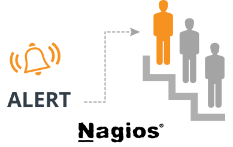

# Cấu hình cảnh báo leo thang trong Nagios

## 1. Giới thiệu

Cảnh báo leo thang có thể hiểu là khi một host/service thay đổi trạng thái, mail cảnh báo sẽ gửi tới một người hoặc một nhóm thứ nhất đã được đặt. Nếu quá khoảng thời gian chúng ta đặt cho người/nhóm thứ nhất, Nagios sẽ gửi thông báo tới nhóm thứ 2.



## 2. Mô hình lab

- Server: 

```
OS: CentOS 7
IP: 192.168.30.22
Service: Nagios Core
```

- Client:

```
OS: CentOS 7
IP: 192.168.30.23
Service: SSH, HTTP
```

## 3. Tiến hành 

### 3.1 Cấu hình contact và group nhận cảnh báo 

**Thực hiện trên server**

- Mở file cấu hình `/usr/local/nagios/etc/objects/contacts.cfg`

- Thêm contact và group vào file cấu hình 

```
...
define contact{
        contact_name     mem1
        use				 generic-contact
        alias            Member 1
        email            mem1@example.com
        service_notification_period     24x7	
        host_notification_period        24x7	
        service_notification_options    w,u,c,r,f,s
        host_notification_options       d,u,r,f,s
        service_notification_commands   notify-service-by-email	
        host_notification_commands      notify-host-by-email
}       
define contact{
        contact_name     mem2
        use				 generic-contact
        alias            Member 2
        email            mem2@example.com
        service_notification_period     24x7	
        host_notification_period        24x7	
        service_notification_options    w,u,c,r,f,s
        host_notification_options       d,u,r,f,s
        service_notification_commands   notify-service-by-email	
        host_notification_commands      notify-host-by-email
}       
define contact{
        contact_name     mem3
        use				 generic-contact
        alias            Member 3
        email            mem3@example.com
        service_notification_period     24x7	
        host_notification_period        24x7	
        service_notification_options    w,u,c,r,f,s
        host_notification_options       d,u,r,f,s
        service_notification_commands   notify-service-by-email	
        host_notification_commands      notify-host-by-email
}       
define contact{
        contact_name     mem4
        use				 generic-contact
        alias            Member 4
        email            mem4@example.com
        service_notification_period     24x7	
        host_notification_period        24x7	
        service_notification_options    w,u,c,r,f,s
        host_notification_options       d,u,r,f,s
        service_notification_commands   notify-service-by-email	
        host_notification_commands      notify-host-by-email
}  
define contactgroup{
        contactgroup_name       admin1
        alias                   Technical Support
        members                 mem1, mem3
}
        
define contactgroup{
        contactgroup_name       admin2
        alias                   Technical Support Pro
        members                 mem2, mem4
}
```

Thay địa chỉ email của các thành viên vào trường `email`

`Group` có thể có nhiều `contact`, mỗi `contact` được phân cách nhau bởi dấu phẩy

### 3.2 Cấu hình cảnh báo theo host

- Mở file cấu hình của host 

```
vi /usr/local/nagios/etc/servers/host1.cfg 
```

- Thêm cấu hình cảnh báo 

```
...
define hostescalation {
        host_name host1
        contact_groups admin1
        first_notification 2
        last_notification 3
        notification_interval 15
}
define hostescalation {
        host_name host1
        contact_groups admin2
        first_notification 3
        last_notification 5
        notification_interval 30
}
```

**host_name**: Xác định hostname đặt cảnh báo 

**contact_groups**: Các nhóm nhận mail cảnh báo 

**first_notification**: Tin cảnh báo được gửi từ tin thứ 2

**last_notification**: Số tin cảnh báo gửi đến cuối cùng. Ví dụ ở trên là `5`, nghĩa là bản tin cuối cùng được gửi đến là bản tin số 5, từ số 6 trở đi sẽ không gửi đến nhóm này nữa. Nếu muốn nhận tin cho đến khi host UP, đặt là `0`.

**notification_interval**: Thời gian gửi đi bản tin tiếp theo

- Lưu file và khởi động lại dịch vụ

```
systemctl restart nagios 
```

### 3.3 Cấu hình cảnh báo theo service

- Mở file cấu hình của host 

Đặt cảnh báo cho dịch vụ `HTTP` ở `host1`

```
vi /usr/local/nagios/etc/servers/host1.cfg 
```

- Thêm cấu hình cảnh báo 

```
...
define service {
        use                             generic-service
        host_name                       host1
        service_description             HTTPMonitor
        check_command                   check_nrpe!check_http
        notification_period             24x7
        check_period		        	24x7
        check_interval		        	3 
}
define serviceescalation {
    host_name		host1
    service_description	    HTTPMonitor
    first_notification	2
    last_notification	3
    notification_interval	3
    contact_groups		admin1
}
define serviceescalation {
    host_name       host1
    service_description     HTTPMonitor
    first_notification	3
    last_notification	0
    notification_interval	5
    contact_groups		admin2
}	
```

**service_description**: Phần mô tả của dịch vụ

- Lưu file và khởi động lại dịch vụ

```
systemctl restart nagios 
```

## Tham khảo

https://github.com/meditechopen/meditech-ghichep-nagios/blob/master/docs/thuchanh-nagios/7.Escalations.md