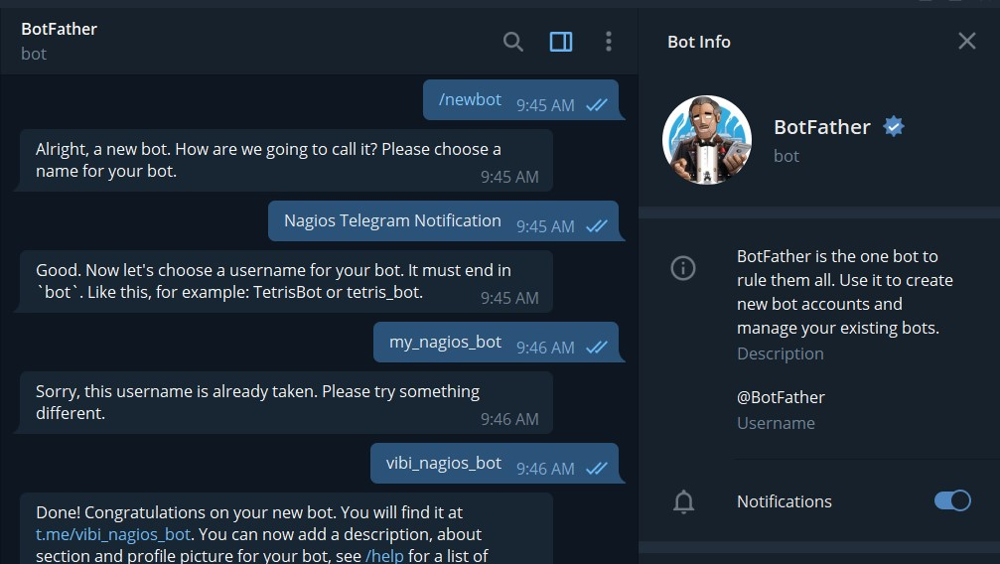
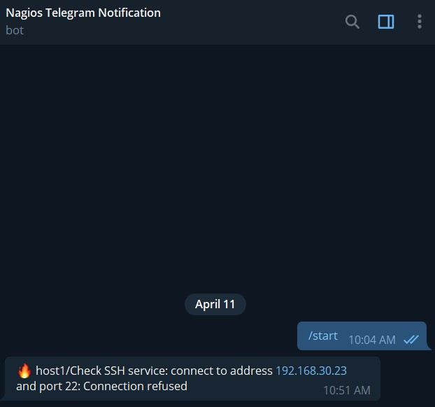
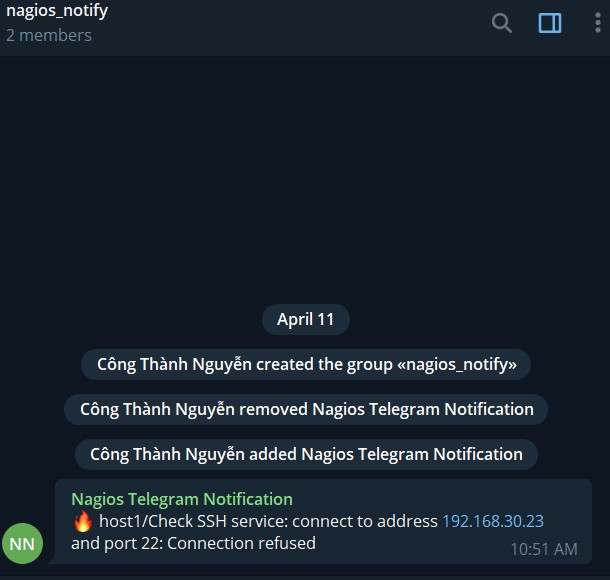

## Cấu hình gửi cảnh báo cho Telegram

### 1. Tạo bot telegram

Tạo bot telegram bằng cách chat với BotFather



Sau khi tạo bot thành công, sẽ nhận được token của bot

### 2. Cài đặt công cụ

```
curl -O https://raw.githubusercontent.com/pommi/telegram_nagios/master/telegram_nagios.py
cp telegram_nagios.py /usr/local/bin/
chmod 755 /usr/local/bin/telegram_nagios.py
pip install twx.botapi
```

### 3. Cấu hình

- Định nghĩa các member trong file `/usr/local/nagios/etc/objects/contacts.cfg`

```
define contact{
        contact_name                    nagiosadmin		; Short name of user
	    use				                generic-contact
        alias                           Nagios Admin		; Full name of user
	    pager                           70304xxxx           ; ID user received
        email                           ncthanh100496@gmail.com ; Email received
        }

define contact {
  	    contact_name                    nagios_group
	    use                             generic-contact
        alias                           Nagios Admin            ; Full name of user
  	    pager                           -32062xxxx              ; ID group chat
}

Để xem ID telegram của mình và nhóm chat làm như sau:

```
Thêm bot vào nhóm chat 
Truy cập địa chỉ https://api.telegram.org/bot<YourBOTToken>/getUpdates
#ID nhóm bắt đầu bằng dấu -
```

- Thêm command vào file `/usr/local/nagios/etc/objects/command.cfg`

```
define command {
  command_name     notify-host-by-telegram
  command_line     /usr/local/bin/telegram_nagios.py --token 51xxxxxxx:AAExxxxxxxxxxxxxxxxxxxxxxxxxxxxxxx --object_type host --contact "$CONTACTPAGER$" --notificationtype "$NOTIFICATIONTYPE$" --hoststate "$HOSTSTATE$" --hostname "$HOSTNAME$" --hostaddress "$HOSTADDRESS$" --output "$HOSTOUTPUT$"
}

define command {
  command_name     notify-service-by-telegram
  command_line     /usr/local/bin/telegram_nagios.py --token 51xxxxxxx:AAExxxxxxxxxxxxxxxxxxxxxxxxxxxxxxx --object_type service --contact "$CONTACTPAGER$" --notificationtype "$NOTIFICATIONTYPE$" --servicestate "$SERVICESTATE$" --hostname "$HOSTNAME$" --servicedesc "$SERVICEDESC$" --output "$SERVICEOUTPUT$"
}
```

**Chú ý**: `51xxxxxxx:AAExxxxxxxxxxxxxxxxxxxxxxxxxxxxxxx` là token của bot 

- Chỉnh sửa file `/usr/local/nagios/etc/objects/template.cfg`

Mục CONTACT  TEMPLATES, cập nhật 2 dòng trong `generic-contact`:

```
service_notification_commands   notify-service-by-email,notify-service-by-telegram
host_notification_commands      notify-host-by-email,notify-host-by-telegram
```

Mục SERVICE TEMPLATES, comment dòng này trong `generic-service`:

```
#        contact_groups                  admins
```

### 4. Thử nghiệm

- Tắt SSH trên host1

```
systemctl stop sshd
```

- Thông báo gửi về telegram cho một người



- Thông báo gửi cho một nhóm chat 



## Tham khảo

https://github.com/locvx1234/meditech-ghichep-nagios/blob/master/docs/thuchanh-nagios/8.Setup-Telegram-alert.md
https://pommi.nethuis.nl/nagios-notifications-via-telegram/