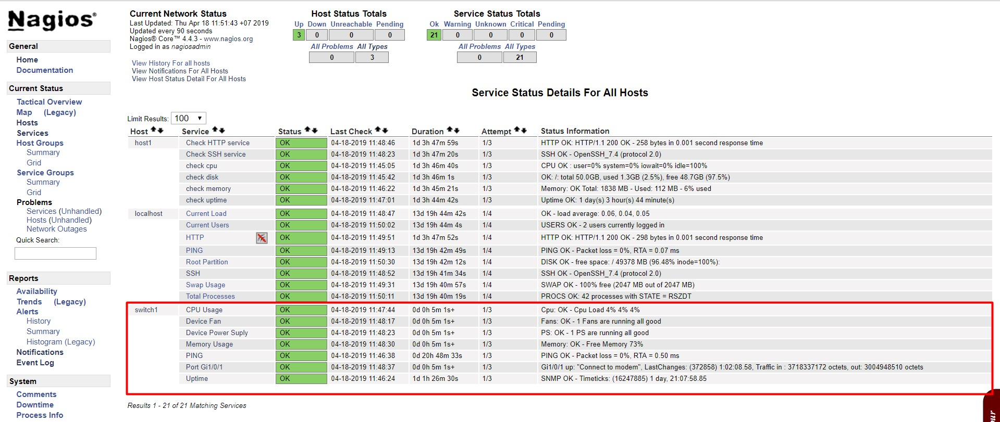

## Monitor switch qua SNMP

### Cài đặt

- Cài đặt các gói cần thiết

```
yum install -y net-snmp net-snmp-utils perl-net-snmp 
```

- Khởi động SNMP 

```
systemctl start snmpd
systemctl enable snmpd
```

- Sửa file cấu hình `/usr/local/nagios/etc/nagios.cfg`

```
cfg_file=/usr/local/nagios/etc/objects/switch.cfg
```

- Sửa file `/usr/local/nagios/etc/objects/switch.cfg` để thêm switch

```
define host {
    use         generic-switch          ; Inherit default values from a template
    host_name   switch1		            ; The name we're giving to this switch
    alias       Switch				    ; A longer name associated with the switch
    address     192.168.30.3         	; Địa chỉ IP của switch
    hostgroups  switches      		    ; Host groups this switch is associated with
}

define hostgroup {

    hostgroup_name          switches                            ; The name of the hostgroup
    alias                   Network Switches                    ; Long name of the group
}
```

### Check ping, uptime 

- Check ping 

```
define service {

    use                     generic-service                     ; Inherit values from a template
    host_name               switch1                     ; The name of the host the service is associated with
    service_description     PING                                ; The service description
    check_command           check_ping!200.0,20%!600.0,60%      ; The command used to monitor the service
    check_interval          5                                   ; Check the service every 5 minutes under normal conditions
    retry_interval          1                                   ; Re-check the service every minute until its final/hard state is determined
}
```

- Check uptime

```
define service {

    use                     generic-service                     ; Inherit values from a template
    host_name               switch1
    service_description     Uptime
    check_command           check_snmp!-C public -o sysUpTime.0
}
```

### Check_cisco_switch plugins

- Tải plugin về:

```
cd /usr/local/nagios/libexec
wget https://raw.githubusercontent.com/doedoe12/Internship/master/Monitor/Nagios/Plugins/check_cisco.pl
wget https://raw.githubusercontent.com/doedoe12/Internship/master/Monitor/Nagios/Plugins/check_cisco_switch.pl
```

- Phân quyền

```
chmod +x check_cisco.pl
chmod +x check_cisco_switch.pl
```

- Define command trong file `/usr/local/nagios/etc/objects/commands.cfg` 

```
define command{
 command_name check_cisco_switch
 command_line $USER1$/check_cisco_switch.pl -H $HOSTADDRESS$ -C $ARG1$ -t $ARG2$ -w $ARG3$ -c $ARG4$
 }

define command{
 command_name check_cisco_int
 command_line $USER1$/check_cisco.pl -H $HOSTADDRESS$ -C $ARG1$ -i $ARG2$
 }
```

- Define các service tại file `/usr/local/nagios/etc/objects/switch.cfg`

Check_memory

```
define service{
 use generic-service
 host_name switch1
 service_description Memory Usage
 check_command check_cisco_switch!public!mem!50!40
}
```

Check_CPU

```
define service{
 use generic-service
 host_name switch1
 service_description CPU Usage
 check_command check_cisco_switch!public!cpu!60!70
}
```

Check_fan

```
define service{
 use generic-service
 host_name switch1
 service_description Device Fan
 check_command check_cisco_switch!public!fan
}
```

Check power supply

```
define service{
 use generic-service
 host_name switch1
 service_description Device Power Suply
 check_command check_cisco_switch!public!ps
}
```

Check traffic port Gi1/0/1

```
define service{
 use generic-service
 host_name switch1
 service_description Port Gi1/0/1
 check_command check_cisco_int!public!Gi1/0/1
}
```

- Lưu file và khởi động lại nagios

```
systemctl restart nagios
```

- Kết quả trên dashboard



## Tham khảo

https://assets.nagios.com/downloads/nagioscore/docs/nagioscore/4/en/monitoring-routers.html
http://www.techspacekh.com/monitoring-cisco-switch-with-nagios-core-web-application/