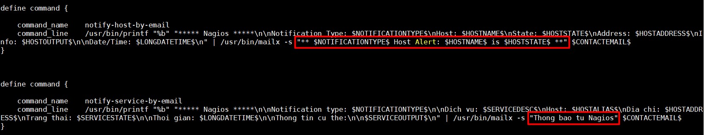
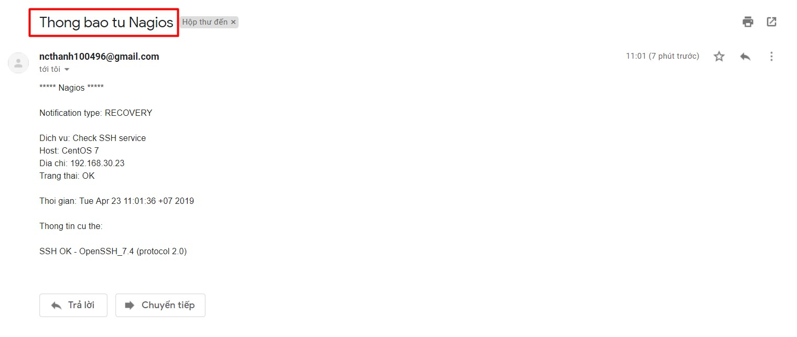
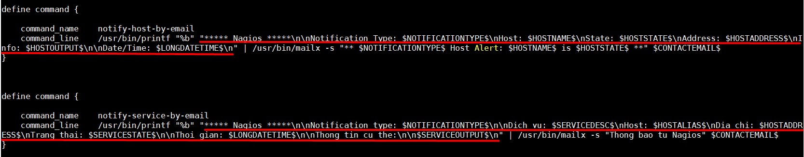
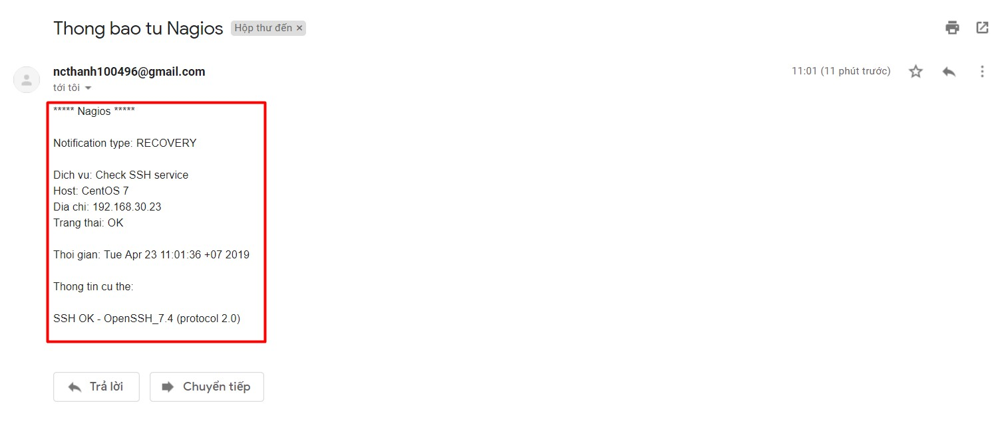
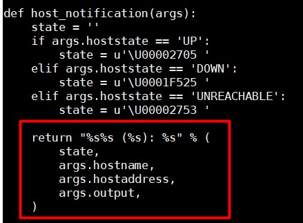
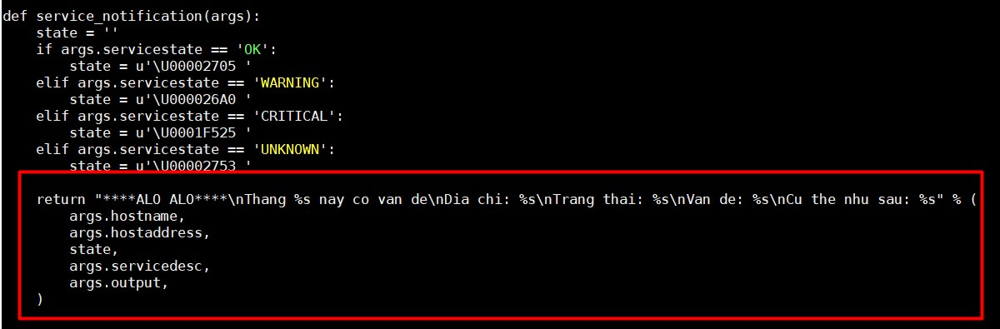
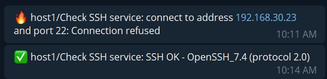

## Cách chỉnh sửa mail cảnh báo của Nagios

- Để chỉnh sửa tiêu đề mail, truy cập file `/usr/local/nagios/etc/objects/commands.cfg`.

Phần được khoanh chính là tiêu đề của email, bạn có thể tuỳ ý chỉnh sửa nó. Ví dụ trên kia thì tôi đã chỉnh sửa tiêu đề email cảnh báo cho service thành "Thong bao tu Nagios", đây là mail nhận được:

- Chỉnh sửa nội dung email

Phần được gạch chân là nội dung của email. Ví dụ thì tôi đã chỉnh sửa một chút nội dung email cảnh báo service, kết quả:

## Chỉnh sửa nội dung cảnh báo telegram

Cấu hình cảnh báo qua telegram xem tại [đây](https://github.com/doedoe12/Internship/blob/master/Monitor/Nagios/Thuc_hanh/09.SendNotify-Telegram.md)

file cấu hình cảnh báo qua telegram được viết bằng python, chỉnh sửa nội dung cảnh báo tại `/usr/local/bin/telegram_nagios.py`

Sửa nội dung cảnh báo về host tại đây:

Sửa nội dung cảnh báo về service tại đây:

**Ví dụ**: Ở đây tôi đã chỉnh sửa nội dung cảnh báo của service, đây là trước khi chỉnh sửa:

Còn đây là sau khi đã sửa:

