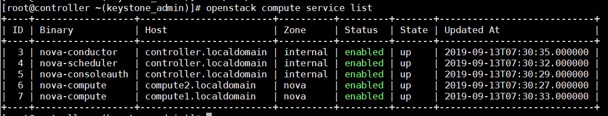
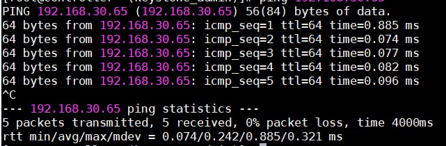

# Cài đặt Openstack Stein bằng Packstack

## 1. Giới thiệu Packstack

- Packstack là một bộ command-line sử dụng [Puppet](http://www.puppetlabs.com/) module để triển khai nhanh Openstack thông qua kết nối SSH.

- Packstack được phát triển bởi Redhat, chỉ hỗ trợ các distro RHEL, Centos

- Tự động hoá các bước cài đặt và lựa chọn thành phần cài đặt

- Nhanh chóng dựng được môi trường Openstack để sử dụng nội bộ, demo, test tính năng.

- Nhược điểm:

	- Đóng kín các bước cài đối với người mới
	
	- Khó bug các lỗi khi cài vì đã được đóng gói cùng với các tool cài đặt tự động.
	
## 2. Cài đặt

### 2.1. Mô hình

- Controller

```
OS: CentOS 7
eth0: 192.168.30.31
```

- Compute1

```
OS: CentOS 7
eth0: 192.168.30.32
```

- Compute2

```
OS: CentOS 7
eth0: 192.168.30.33
```

### 2.2. Chuẩn bị

Trên cả 3 node thực hiện các bước sau:

- Set hostname trong file `/etc/hostname`

- Sửa file `/etc/hosts`:

```
192.168.30.31 controller
192.168.30.32 compute1
192.168.30.33 compute2
```

- Thực hiện các câu lệnh:

```
sudo systemctl disable firewalld
sudo systemctl stop firewalld
sudo systemctl disable NetworkManager
sudo systemctl stop NetworkManager
sudo systemctl enable network
sudo systemctl start network
```

- Tắt SELinux:

```
sed -i 's/SELINUX=enforcing/SELINUX=disabled/g' /etc/sysconfig/selinux
```

### 2.3. Cài đặt Packstack

- Cài đặt repo và update hệ thống:

```
yum -y install centos-release-openstack-stein epel-release
yum update -y
```

- Cài đặt Packstack

```
yum install -y openstack-packstack python-pip
init 6
```

- Thực hiện cài đặt openstack trên node Controller bằng lệnh dưới, khi cài màn hình sẽ yêu cầu nhập mật khẩu của các máy compute, sau đó `packstack` sẽ tự động cài trên các máy này mà không cần thao tác.

```
packstack --allinone \
    --default-password=thanh123 \
    --os-neutron-ovs-bridge-mappings=extnet:br-ex \
    --os-neutron-ovs-bridge-interfaces=br-ex:eth0 \
    --os-neutron-ovs-bridges-compute=br-ex \
    --os-neutron-ml2-type-drivers=vxlan,flat \
    --os-controller-host=192.168.30.31 \
    --os-compute-hosts=192.168.30.32,192.168.30.33 \
    --provision-demo=n \
	--os-neutron-ml2-mechanism-drivers=openvswitch \
	--os-neutron-l2-agent=openvswitch \
	--os-neutron-ml2-tenant-network-types=vxlan
```

## 3. Các thao tác bằng command-line

Thực hiện lệnh sau để khai báo biến môi trường mỗi khi đăng nhập phiên mới vào máy chủ

```
source /root/keystonerc_admin
```

- Kiểm tra trạng thái của các service Nova bằng lệnh `openstack compute service list`



- Kiểm tra trạng thái của dịch vụ Neutron bằng lệnh `neutron agent-list`


- Upload image

```
curl http://download.cirros-cloud.net/0.3.4/cirros-0.3.4-x86_64-disk.img | glance \
image-create --name='cirros' \
--visibility=public \
--container-format=bare \
--disk-format=qcow2
```

- Tạo network public

```
neutron net-create external_network --provider:network_type flat \
--provider:physical_network extnet  \
--router:external \
--shared
```

- Tạo subnet trong network public

```
neutron subnet-create --name ex_subnet --gateway 192.168.30.1 \
--allocation-pool start=192.168.30.50,end=192.168.30.70 \
--enable-dhcp=True external_network 192.168.30.0/24
```

- Tạo network private

```
neutron net-create private_network
neutron subnet-create --name private_subnet private_network 10.10.10.0/24 --dns-nameserver 8.8.8.8
```

- Tạo router tên là `Vrouter` và add các network vừa tạo ở trên vào router

```
neutron router-create Vrouter
neutron router-gateway-set Vrouter external_network
neutron router-interface-add Vrouter private_subnet
```

- Kiểm tra IP của router vừa được gán interface 


- Ping tới ip của dải provider để kiểm tra xem đã gán được interface hay chưa



- Sửa lỗi không console được máy ảo khi có nhiều node compute

Sửa file `/etc/nova/nova.conf` tại các máy compute

```
server_proxyclient_address=192.168.30.32 //bỏ comment và thay địa chỉ ip của chính máy compute đó
```

Khởi động lại openstack-nova-compute

```
systemctl restart openstack-nova-compute
```

## Tham khảo

https://ask.openstack.org/en/question/119449/how-to-configure-a-self-signed-certificate-for-horizon-dashboard-in-openstack/

https://ask.openstack.org/en/question/520/vnc-console-in-dashboard-fails-to-connect-ot-server-code-1006/