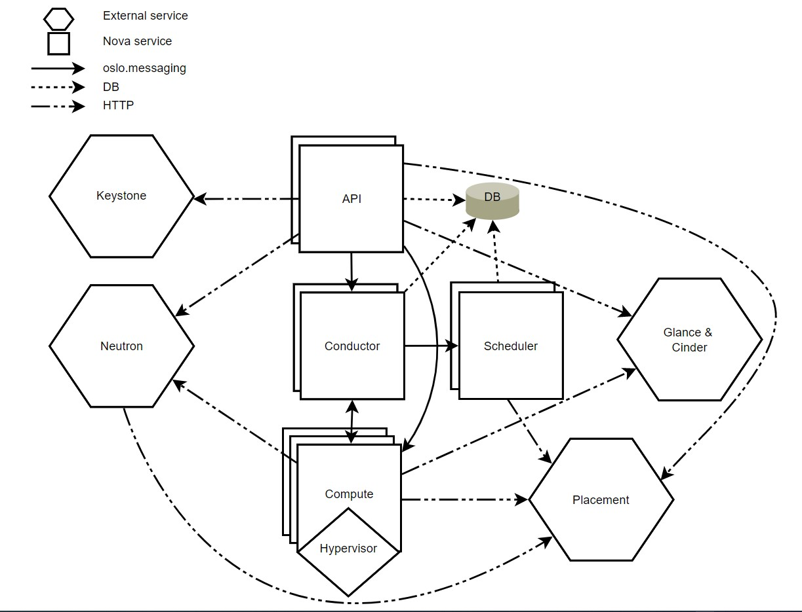

# OpenStack Compute Service - Nova

## 1. Giới thiệu

Sử dụng OpenStack Compute để lưu trữ và quản lý hệ thống điện toán đám mây. OpenStack Compute là phần chính của hệ thống Infrastructure-as-a-Service. Các module chính của Nova được viết bằng Python.

OpenStack Compute tương tác với OpenStack Identity để xác thực, OpenStack Placement để theo dõi và lựa chọn tài nguyên, OpenStack Image cho disk và server images, OpenStack Dashboard cho giao diện người dùng và quản trị. 

Nova cho phép bạn điều khiển các máy ảo và networks, bạn cũng có thể quản lý các truy cập tới cloud từ user và project. OpenStack Compute không chứa các phần mềm ảo hoá. Thay vào đó, nó sẽ định nghĩa các driver để tương tác với các kĩ thuật ảo hoá khác chạy trên hệ điều hành của bạn và cung cấp các chức năng thông qua một web-based API.

## 2. Các thành phần của Nova

- **nova-api service**: Tiếp nhận và phản hồi các compute API call từ người dùng cuối. Service hỗ trợ OpenStack Compute API. Nó cũng có một loạt các policies và thực hiện hầu hết các orchestration activity ví dụ như chạy máy ảo.

- **nova-api-metadata service**: Là service tiếp nhận các metadata request từ máy ảo. Service này thường được dùng khi chạy multi-host kết hợp với nova-network.

- **nova-compute service**: Là service chịu trách nhiệm tạo và huỷ các máy ảo qua hypervisor APIs. Ví dụ:

	- XenAPI cho XenServer/XCP
	
	- libvirt cho KVM/QEMU
	
	- VMwareAPI cho VMware
	
Quá trình xử lý khá phức tạp, về cơ bản, daemon tiếp nhận các actions từ queue và thực hiện một loạt các câu lệnh hệ thống như chạy máy ảo kvm và update trạng thái trong database.

- **nova-placement-api**: Dùng để theo dõi và thống kê mức độ sử dụng của mỗi một resource provider. (Từ OpenStack Stein đã tách riêng thành service Placement).

- **nova-scheduler service**: Service này sẽ lấy các yêu cầu máy ảo đặt vào queue và xác định xem chúng được chạy trên compute server host nào.

- **nova-conductor module**: Là module chịu trách nhiệm về các tương tác giữa `nova-compute` và database. Nó sẽ loại bỏ tất cả các kết nối trực tiếp từ `nova-compute` tới database.

- **nova-consoleauth daemon**: Xác thực token cho user mà console proxies cung cấp. Dịch vụ này buộc phải chạy cùng với console proxies. Bạn có thể chạy proxies trên 1 nova-consoleauth service hoặc ở trong một cluster configuration. (Thành phần này hiện đã bị dừng và sẽ loại bỏ trong phiên bản tới).

- **nova-novncproxy daemon**: Cung cấp proxy cho việc truy cập các máy ảo đang chạy thông qua VNC connection. Nó hỗ trợ các trình duyệt based novnc client.

- **nova-spicehtml5proxy daemon**: Cung cấp proxy để truy cập các máy ảo đang chạy thông qua SPICE connection. Nó hỗ trợ các trình duyệt based HTML5 client.

- **nova-xvpvncproxy daemon**: Cung cấp proxy cho việc truy cập các máy ảo đang chạy thông qua VNC connection. Nó hỗ trợ OpenStack-specific Java client. (Deprecated bắt đầu từ Stein và sẽ bị bỏ trong bản tiếp theo)

- **The queue**: Trung tâm giao tiếp giữa các daemon. Thường dùng RabbitMQ hoặc các AMQP message queue khác như ZeroMQ.

- **SQL database**: Dùng để lưu trạng thái của hạ tầng cloud bao gồm:

	- Các loại máy ảo có thể chạy
	
	- Các máy ảo đang được dùng
	
	- Các network khả dụng
	
	- Project
	
Theo lý thuyết, nova hỗ trợ tất cả các database mà SQLAlchemy hỗ trợ, ví dụ như: SQLite3, MySQL, MariaDB và PostgreSQL.

## 3. Kiến trúc của Nova

Nova bao gồm nhiều process máy chủ, mỗi process chạy một function khác nhau. Giao diện người dùng là REST API, còn các thành phần bên trong Nova giao tiếp với nhau qua cơ chế RPC.

API server xử lý các REST request, thường liên quan tới đọc/ghi database, tuỳ chọn gửi các RPC message tới các Nova service khác và tạo các phản hồi tới REST call. RPC message được thực hiện thông qua thư viện **oslo.messaging**.

Hầu hết các thành phần chính của Nova có thể nằm trên nhiều máy chủ khác nhau, và có một manager để lắng nghe các RPC message. Ngoại trừ **nova-compute**, là một tiến trình đơn chạy trên hypervisor mà nó đang quản lý (Trừ khi sử dụng VMware hoặc Ironic driver)

Nova cũng sử dụng một cơ sở dữ liệu trung tâm được chia sẻ giữa các thành phần.

Để triển khai mở rộng Nova theo chiều ngang, cần tìm hiểu một khái niệm sharding gọi là [Cells](https://docs.openstack.org/nova/stein/user/cells.html)

Hình dưới mô tả kiến trúc của Nova

- **DB**: Cơ sở dữ liệu SQL để lưu trữ dữ liệu

- **API**: Thành phần nhận các HTTP request, chuyển đổi câu lệnh và giao tiếp với các thành phần khác thông qua **oslo.messaging** queue hoặc HTTP

- **Scheduler**: Quyết định xem host nào chứa instance nào

- **Compute**: Quản lý giao tiếp với hypervisor và máy ảo

- **Conductor**: Xử lý các yêu cầu cần phối hợp (build/resize), hoạt động như một database proxy, hoặc xử lý chuyển đổi đối tượng.

- **Placement**: Theo dõi resource provider inventories và mức độ sử dụng.

## Nguồn 

https://docs.openstack.org/nova/stein/install/get-started-compute.html

https://docs.openstack.org/nova/stein/user/architecture.html