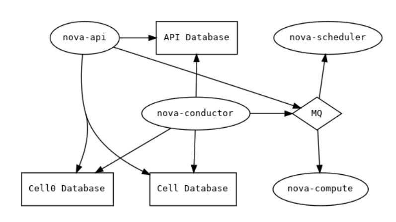
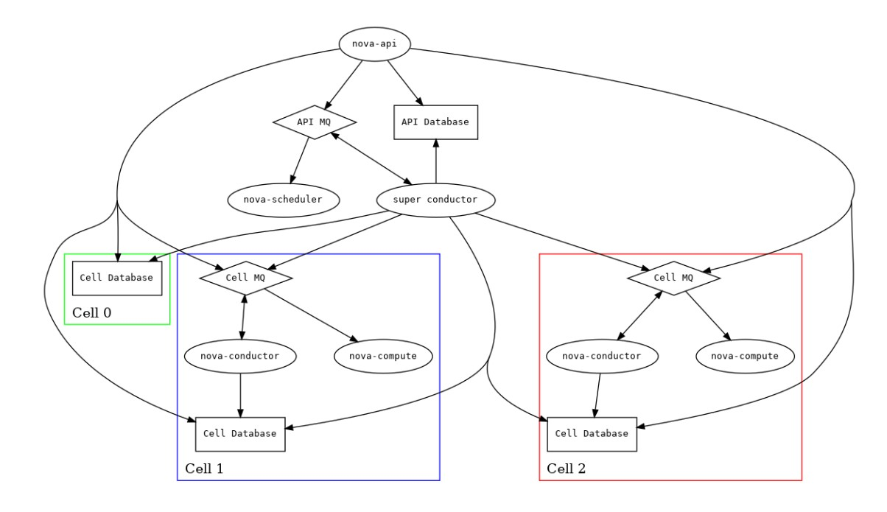

# 1. Remote console access

OpenStack cung cấp một số phương thức khác nhau để bạn có thể tương tác với máy ảo của mình như: VNC, SPICE, RDP hay MKS. Khi được cấu hình, chúng có thể được truy cập bởi người dùng thông qua OpenStack Dashboard hoặc command line. 

Tốt nhất là chỉ nên triển khai một console type, và không phải mọi console type đều được hỗ trợ bởi tất cả các compute driver. Bất cả bạn có cấu hình ra sao thì một console proxy service luôn yêu cầu phải có. Các proxy service này đảm nhiệm các nhiệm vụ sau:

- Cung cấp một bridge nối giữa public network và private network.

- Trung gian xác thực token

- Xử lý minh bạch các kết nối hypervisor khác nhau để cung cấp trải nghiệm thống nhất.

Đối với một số kết hợp compute driver và console driver, các proxy service được cung cấp bởi hypervisor hoặc một service khác. Còn lại, Nova cung cấp service để xử lý proxying. Luồng hoạt động khi kết nối VNC console:

1. User kết nối tới API và nhận một **access_url**, ví dụ `http://ip:port/?path=%3Ftoken%3Dxyz`

2. User dán URL đó lên trình duyệt hoặc sử dụng nó như một biến

3. Trình duyệt hoặc client kết nối tới proxy

4. Proxy uỷ quyền token cho user, và maps token tới private host và port của VNC server cho một instance.

Compute host chỉ định địa chỉ proxy nên sử dụng để kết nối qua option **vnc.server_proxyclient_address**. Bằng cách này, VNC proxy hoạt động như một bridge giữa public network và private network.

5. Proxy khởi động kết nối tới VNC server và tiếp tục proxy cho đến khi session kết thúc.

Một triển khai thông thường với noVNC-based VNC console sẽ gồm các thành phần sau:

- Một hoặc nhiều **nova-novncproxy** service. Hỗ trợ browser-based noVNC clients. Trong triển khai đơn giản, service này thường nằm trên cùng máy **nova-api** vì nó có tác dụng như một proxy giữa public network và private compute host network.

- Một hoặc nhiều **nova-compute** service. Lưu trữ các instance mà console được cung cấp.

Quá trình trên được mô tả như hình:


**Lưu ý**: **nova-consoleauth** là thành phần cần thiết để uỷ quyền token nhưng đã bị bỏ từ phiên bản OpenStack Rocky.

## noVNC-based VNC console

VNC là một console đồ hoạ được hỗ trợ rộng rãi bởi nhiều hypervisor và client. noVNC cung cấp hỗ trợ VNC thông qua một trình duyệt web.

### Cấu hình

Để kích hoạt noVNC VNC console service, bạn phải cấu hình cả **nova-novncproxy** service và **nova-compute** service. Hầu hết các option được định nghĩa trong section `[vnc]`

**nova-novncproxy** service chấp nhận các option sau:

| Options | Default value | Description |
|---------|---------------|-------------|
| daemon | false | Chạy như tiến trình ngầm |
| ssl_only | false | Không cho phép kết nối không mã hoá |
| source_is_ipv6 | false | Đặt giá trị là True nếu source host sử dụng địa chỉ IPv6 |
| cert | self.pem | Đường dẫn tới file SSL certificate |
| key | None | SSL key file |
| web | /usr/share/spice-html5 | Đường dẫn tới thư mục nội dung sẽ được cung cấp cho web server |
| vnc.novncproxy_host | 0.0.0.0 | Địa chỉ IP mà noVNC console proxy bind tới |
| vnc.novncproxy_port | 6080 | Port noVNC console proxy bind tới |

Ví dụ cấu hình file `nova-novncproxy.conf`:

```
[vnc]
novncproxy_host = 0.0.0.0
novncproxy_port = 6082
```

Cấu hình **nova-compute** service:

| Options | Default value | Description |
|---------|---------------|-------------|
| enabled | true | Kích hoạt các tính năng liên quan đến VNC |
| novncproxy_base_url | http://127.0.0.1:6080/vnc_auto.html | Public address của noVNC VNC console proxy |
| server_listen | 127.0.0.1 | Địa chỉ IP hoặc hostname mà instance sẽ lắng nghe các yêu cầu kết nối VNC đến node này |
| server_proxyclient_address | 127.0.0.1 | Địa chỉ private, internal IP hoặc hostname của VNC console proxy |

Ví dụ:

```
[vnc]
enabled = True
novncproxy_base_url = http://IP_ADDRESS:6082/vnc_auto.html
server_listen = 127.0.0.1
server_proxyclient_address = 127.0.0.1
```

## 2. Nova-conductor

Nova-conductor service xuất hiện từ bản OpenStack Grizzly

Conductor như một nơi điều phối các task. Rebuilt, resize/migrate và building một instance đều được quản lý ở đây. Điều này làm cho việc phân chia trách nhiệm tốt hơn giữa những gì compute node nên xử lý và những gì scheduler nên được xử lý, để dọn dẹp các path của execution.

Ví dụ một tiến trình build một instance cũ là:

- API nhận request để build một instance

- API send một RPC cast để `scheduler` chọn một compute

- Scheduler send một RPC cast để compute build một instance, scheduler có thể sẽ cần giao tiếp với tất cả các compute

	- Nếu build thành công thì dừng ở đây
	
	- Nếu thất bại thì compute sẽ quyết định nếu `max number` của scheduler retries là hit và dừng lại ở đó
	
		- Nếu việc build được lên lịch lại thì compute sẽ send một RPC cast tới scheduler để pick một compute khác.
		
Nova-conductor là một RPC server. Trong nova-conductor sẽ có hàng loạt các API, nhiệm vụ chính sẽ là một proxy line tới database và tới các RPC server khác như nova-api. RPC client sẽ nằm trong nova-compute.

Khi muốn upstate của một VM trên nova-compute, thay vì kết nối trực tiếp đến database thì nova-compute sẽ call đến nova-conductor trước, sau đó nova-conductor sẽ thực hiện kết nối tới database và upstate VM trong database.


### Lợi ích và hạn chế của nova-conductor

#### Bảo mật

- Lợi ích:

Nếu không có thành phần nova-conductor service, tất cả các compute node có nova-compute service sẽ có quyền truy cập trực tiếp vào database bằng việc sử dụng conductor API, khi compute-node bị tấn công thì attacker sẽ có toàn quyền để xâm nhập vào database. Với nova-conductor, sự ảnh hưởng của các node tới database sẽ được kiểm soát.

- Hạn chế:

Nova-conductor API đã hạn chế quyền hạn kết nối tới database của nova-compute nhưng các service khác vẫn có quyền truy cập trực tiếp vào database. Với một môi trường multi-host, nova-compute, nova-api-metadata đều chạy trên compute node và vẫn tham chiếu trực tiếp đến database.

#### Nâng cấp

Nova-conductor đứng giữa nova-compute và database. Nếu database schema update thì sẽ không upgrade trên nova-compute trên cùng một thời điểm, thay vào đó nova-conductor sẽ sử dụng những API tương thích để làm việc với database.

## 3. Nova Cell Layout

Một hệ thống Nova thông thường gồm các thành phần:

- **nova-api** service: Cung cấp external REST API cho user

- **nova-scheduler** và **placement** service: Theo dõi tài nguyên và quyết định instance sẽ nằm trên compute node nào

- **API Database**: Được sử dụng chủ yếu bởi nova-api và nova-scheduler (được gọi là dịch vụ API-level thấp) theo dõi thông tin về vị trí của các instance, cũng như các vị trí tạm thời của các instance đang được built nhưng chưa được lên lịch.

- **nova-conductor** service: Đứng giữa nova-compute và database, làm giảm tải cho các tác vụ long-running cho API-level service, cũng như ngăn compute node truy cập trực tiếp đến database.

- **cell database**: Được sử dụng bởi API, conductor, compute service. Phần lớn chứa các thông tin về instance

- **cell0 database**: Giống như cell database, nhưng chỉ chứa instance bị lỗi trong quá trình scheduled.

- **message queue**: Cho phép các service giao tiếp với nhau thông qua RPC.

Muốn triển khai được OPS thì ít nhất phải có tất cả các thành phần trên. Triển khai quy mô nhỏ thường chỉ có một message queue và được chia sẻ giữa tất cả các dịch vụ, một database server duy nhất để lưu trữ API database, và một cell database cũng như một cell0 database. Điều này cũng có nghĩa là **single-cell deployment** bởi vì chỉ có một cell "thực". `cell0 database` giống với một cell thông thường nhưng lại không có compute node, và chỉ được sử dụng như một nơi lưu các instance fail không nằm trên compute thực (vì vậy nó là một real cell).

Mục đích chính của cell trong nova là cho phép môi trường phát triển lớn. Chỉ sử dụng một API cho tất cả nhưng sẽ làm việc được với nhiều cell (xác định thông tin của các instance trên các node). Khi sử dụng cell database, các compute host sẽ được sắp xếp vào nhóm trên là cells. Cells được xem như một cái cây. Top-cell level sẽ là host bao gồm nova-api service, không bao gồm các nova-compute service. Để mở rộng mô hình thì trên các child-level sẽ bao gồm các `nova-*` service ngoại trừ nova-api.

### Service Layout

#### Simple



#### Multiple Cell 



## Tham khảo

https://docs.openstack.org/nova/stein/admin/remote-console-access.html

https://github.com/trangnth/Timhieu_Openstack/blob/master/Doc/03.%20Nova/5.%20vnc-nova.md

https://docs.openstack.org/nova/stein/user/cellsv2-layout.html