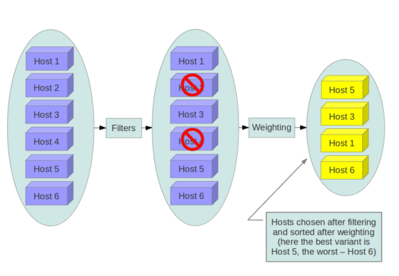
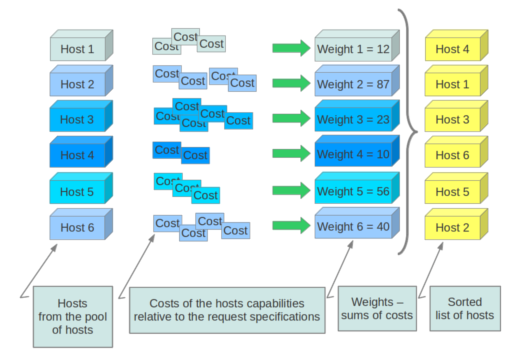
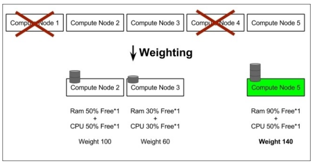

# Tìm hiểu về nova-scheduler

## 1. Giới thiệu

**nova-scheduler** là một thành phần trong Nova. Nó sẽ nhận trực tiếp lệnh từ nova-api để tìm kiếm node phù hợp để tạo máy ảo và nó cũng tìm kiếm node phù hợp khi người dùng muốn migrate máy ảo. Để làm được việc này, nova-scheduler sử dụng 2 cơ chế đó là filtering và weighting. **nova-scheduler** giao tiếp với các thành phần khác thông qua queue và central database repo. Tất cả các compute node sẽ public trạng thái của nó bao gồm tài nguyên hiện có và dung lượng phần cứng khả dụng cho nova-scheduler thông qua queue. nova-scheduler sau đó sẽ dựa vào những dữ liệu này để đưa ra quyết định khi có request.

Khi nhận được yêu cầu từ người dùng, nova-scheduler sẽ filter những host phù hợp để launch máy ảo, những host không phù hợp sẽ bị loại. Sau đó nó dùng tiếp weighting để xác định xem đâu là host phù hợp nhất. Người dùng có thể thay đổi các thông số của 2 cơ chế này thông qua file `/etc/nova/nova.conf`

Compute được cấu hình với những thông số scheduler mặc định sau:

```
[scheduler]
driver = filter_scheduler

[filter_scheduler]
available_filters = nova.scheduler.filters.all_filters
enabled_filters = RetryFilter, AvailabilityZoneFilter, ComputeFilter, ComputeCapabilitiesFilter, ImagePropertiesFilter, ServerGroupAntiAffinityFilter, ServerGroupAffinityFilter
```

Mặc định thì `scheduler_driver` được cấu hình như là `filter scheduler`, scheduler này sẽ xem xét các host có đầy đủ các tiêu chí sau:

- Chưa từng tham gia vào scheduling (RetryFilter)

- Nằm trong vùng requested availability zone (AvailabilityZoneFilter)

- Có RAM phù hợp (RamFilter)

- Có dung lượng ổ cứng phù hợp cho root và ephemeral storage (DiskFilter)

- Có thể thực thi yêu cầu (ComputeFilter)

- Đáp ứng các yêu cầu ngoại lệ với các instance type (ComputeCapabilitiesFilter)

- Đáp ứng mọi yêu cầu về architecture, hypervisor type, hoặc virtual machine mode properties được khai báo trong instance's image properties (ImagePropertiesFilter)

- Ở host khác với các instance khác trong group (nếu có) (ServerGroupAntiAffinityFilter)

- Ở trong danh sách các group hosts (nếu có) (ServerGroupAffinityFilter).

Scheduler sẽ cache lại danh sách available host, dùng `scheduler_driver_task_period` để quy định thời gian danh sách được update.

## 2. Cơ chế Filtering



Quá trình filter được lặp lại trên các compute node. Danh sách các host được chọn sẽ được sắp xếp sau bởi weighter. Scheduler sau đó sẽ chọn host theo số lượng các instance request. Nếu scheduler không thể chọn bất cứ host nào thì có nghĩa instance đó không thể được scheduled. Filter scheduler có rất nhiều cơ chế filtering và weighting. Bạn cũng có thể tự chọn cho mình những giải thuật phù hợp.

- **AllHostsFilter**: Không filter, được tạo máy ảo trên bất cứ host nào available

- **ImagePropertiesFilter**: Filter host dựa vào properties được định nghĩa trên instance's image. Nó sẽ chọn các host có thể hỗ trợ các thông số cụ thể trên image được sử dụng bởi instance. ImagePropertiesFilter dựa vào kiến trúc, hypervisor type và virtual machine mode được định nghĩa trong instance. Ví dụ, máy ảo yêu cầu host hỗ trợ kiến trúc ARM thì ImagePropertiesFilter sẽ chỉ chọn những host đáp ứng yêu cầu này.

- **AvailabilityZoneFilter**: Filter bằng availability zone. Các host phù hợp với availability zone được  ghi trên instance properties sẽ được chọn. Nó sẽ xem availability zone của compute node và availability zone từ phần request.

- **ComputeCapabilitiesFilter**: Kiểm tra xem host compute service có đủ khả năng đáp ứng các yêu cầu ngoài lề (extra_specs) với instance type không. Nó sẽ chọn các host có thể tạo được instance type cụ thể. extra_specs chứa key/value pairs ví dụ như `free_ram_mb (compared with a number, values loke ">= 4096")`

- **ComputeFilter**: Chọn tất cả các host đang được kích hoạt

- **CoreFilter**: Filter dựa vào mức độ sử dụng CPU core. Nó sẽ chọn host có đủ số lượng CPU core

- **AggregateCoreFilter**: Filter bằng số lượng CPU core với giá trị `cpu_allocation_ratio`

- **IsolatedHostsFilter**: Filter dựa vào image_isolated, host_isolated và restrict_isolated_hosts_to_isolated_images flags

- **JsonFilter**: Cho phép sử dụng JSON-based grammar để lựa chọn host

- **RamFilter**: Filter bằng RAM, các hosts có đủ dung lượng RAM sẽ được chọn

- **AggregateRamFilter**: Filter bằng số lượng RAM với giá trị `ram_allocation_ratio`. `ram_allocation_ratio` ở đây là tỉ lệ RAM ảo với RAM vật lý (mặc định là 1.5)

- **DiskFilter**: Filter bằng dung lượng disk. Các host có đủ dung lượng disk sẽ được chọn

- **AggregateDiskFilter**: Filter bằng dung lượng disk với giá trị `disk_allocation_ratio`

- **NumInstancesFilter**: Filter dựa vào số lượng máy ảo đang chạy trên node compute đó. Node nào có quá nhiều máy ảo đang chạy sẽ bị loại. Nếu chỉ số `max_instances_per_host` được thiết lập. Những node có số lượng máy ảo đạt ngưỡng thiết lập sẽ bị ignored.

- **AggregateNumInstancesFilter**: Filter dựa theo chỉ số `max_instances_per_host`

- **IoOpsFilter**: Filter dựa theo số lượng I/O operations.

- **AggregateIoOpsFilter**: Filter dựa theo chỉ số `max_io_ops_per_host`

- **SimpleCIDRAffinityFilter**: Cho phép các instance trên các node khác nhau có cùng IP block

- **DifferentHostFilter**: Cho phép các instance đặt trên các node khác nhau

- **SameHostFilter**: Đặt instance trên cùng 1 node

- **RetryFilter**: Chỉ chọn các host chưa từng được schedule

## 3. Cơ chế Weighting



Sau khi filter các node có thể tạo máy ảo, scheduler sẽ dùng `weights` để tìm kiếm host phù hợp nhất. Weights được tính toán trên từng host khi mà instance chuẩn bị được schedule, weight được tính toán bằng cách giám sát việc sử dụng tài nguyên của hệ thống. Chúng ta có thể cấu hình để cho các instance được tạo trên các host khác nhau hoặc tạo trên cùng 1 node cho tới khi tài nguyên của node đó cạn kiệt thì mới chuyển sang node tiếp theo.

Nova scheduler tính toán mỗi weight với 1 configurable multiplier rồi sau đó cộng tất cả lại. Host có weight lớn nhất sẽ được ưu tiên. Cơ chế weights cũng cho phép bạn tạo 1 subnet gồm các node phù hợp rồi schedule sẽ lựa chọn ngẫu nhiên.



Tóm lại, trong số các input của nova-scheduler có 3 thứ quan trọng nhất đó là cấu hình trong file `nova.conf`, service capability của mỗi host và request specifications. Cấu hình trong file sẽ quyết định cấu trúc của các class, service capability giống như base intelligent data còn request spec chính là service target.

## 4. Tìm hiểu khái niệm Host Aggregate và Availability Zone

### 4.1. Host Aggregate

- Phương thức tạo ra một nhóm logic để phân vùng các server. Host Aggregate trong OPS tập hợp các compute node được chỉ định và liên kết với metadata. Một host có thể nằm trong nhiều hơn một Host Aggregate. Chỉ có người quản trị mới có quyền tạo và thấy được các Host Aggregate.

- Các metadata trong các Host Aggregate thường được dùng để cung cấp thông tin cho quá trình nova-scheduler để xác định được host đặt các máy ảo. Metadata quy định trong một Host Aggregate sẽ chỉ định host chạy các instance mà có flavor cùng metadata.

- Người quản trị sử dụng Host Aggregate để xử lý cân bằng tải, dự phòng, resource pool, nhóm các server cùng thuộc tính. Các Host Aggregate sẽ không được public ra cho các end-user mà sẽ được gắn vào các flavor

- Ví dụ về Host Aggregate: Có thể tạo một tập hợp các compute node tuỳ vào vị trí địa lý, hoặc các host trên rack 1 sử dụng disk SSD.

### 4.2. Availability Zones (AZs)

`Availability Zones` là visible logical abstraction của end-user cho việc phân vùng một đám mây mà không biết về kiến trúc hạ tầng vật lý của nó.

Availability Zone là một metadata cụ thể được gắn vào một Host Aggregate. Việc thêm một metadata vào một Host Aggregate sẽ khiến cho các aggregate này bị nhìn thấy bởi các end-user, do đó cần nhờ nova-scheduler làm việc với một Host Aggregate cụ thể

Availability Zone cho phép các end-user chọn một Host Aggregate để chạy máy ảo. Ví dụ sử dụng Availability Zone, người dùng có thể khởi tạo một máy ảo chạy trên DC FPT ở HCM.

Giữa Aggregates và Availability Zones:

- Một host có thể nằm trong nhiều Aggregate, nhưng chỉ có thể thuộc về một Availability Zone

- Mặc định thì một host sẽ là thành viên của default Availability Zone ngay cả khi nó không thuộc Aggregate nào (tuỳ chọn cấu hình là `default_availability_zone`)

## Tham khảo

https://docs.openstack.org/nova/stein/user/aggregates.html

https://docs.openstack.org/nova/stein/user/filter-scheduler.html

https://github.com/thaonguyenvan/meditech-thuctap/blob/master/ThaoNV/Tim%20hieu%20OpenStack/docs/nova/nova-scheduler.md

https://github.com/trangnth/Timhieu_Openstack/blob/master/Doc/03.%20Nova/7.%20nova-scheduler.md