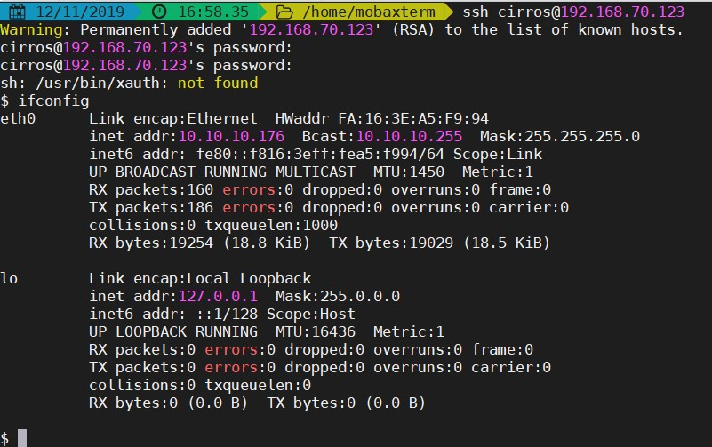
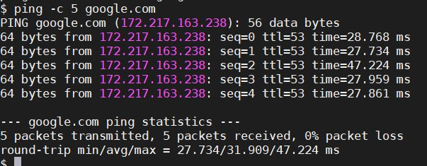

# Sử dụng Neutron

## 1. Khởi tạo Network, Router, Port

- Khởi tạo external network

```
openstack network create --share --provider-physical-network provider \
--provider-network-type flat provider1

+---------------------------+-----------------------------------------------------------------------------------------------------------------------------------------------------------------------------------+
| Field                     | Value                                                                                                                                                                             |
+---------------------------+-----------------------------------------------------------------------------------------------------------------------------------------------------------------------------------+
| admin_state_up            | UP                                                                                                                                                                                |
| availability_zone_hints   |                                                                                                                                                                                   |
| availability_zones        |                                                                                                                                                                                   |
| created_at                | 2019-11-12T07:15:38Z                                                                                                                                                              |
| description               |                                                                                                                                                                                   |
| dns_domain                | None                                                                                                                                                                              |
| id                        | 943b2f94-2b3d-4a43-8e12-c6f9571a89ec                                                                                                                                              |
| ipv4_address_scope        | None                                                                                                                                                                              |
| ipv6_address_scope        | None                                                                                                                                                                              |
| is_default                | False                                                                                                                                                                             |
| is_vlan_transparent       | None                                                                                                                                                                              |
| location                  | Munch({'project': Munch({'domain_name': 'Default', 'domain_id': None, 'name': 'test', 'id': u'b65a4cca5a0d4c80a143a654db53f1c1'}), 'cloud': '', 'region_name': '', 'zone': None}) |
| mtu                       | 1500                                                                                                                                                                              |
| name                      | provider1                                                                                                                                                                         |
| port_security_enabled     | True                                                                                                                                                                              |
| project_id                | b65a4cca5a0d4c80a143a654db53f1c1                                                                                                                                                  |
| provider:network_type     | flat                                                                                                                                                                              |
| provider:physical_network | provider                                                                                                                                                                          |
| provider:segmentation_id  | None                                                                                                                                                                              |
| qos_policy_id             | None                                                                                                                                                                              |
| revision_number           | 1                                                                                                                                                                                 |
| router:external           | Internal                                                                                                                                                                          |
| segments                  | None                                                                                                                                                                              |
| shared                    | True                                                                                                                                                                              |
| status                    | ACTIVE                                                                                                                                                                            |
| subnets                   |                                                                                                                                                                                   |
| tags                      |                                                                                                                                                                                   |
| updated_at                | 2019-11-12T07:15:38Z                                                                                                                                                              |
+---------------------------+-----------------------------------------------------------------------------------------------------------------------------------------------------------------------------------+
```

- Khởi tạo subnet cho external network

```
openstack subnet create --subnet-range 192.168.70.0/24 --dhcp --gateway 192.168.70.1 --network provider1 --allocation-pool start=192.168.70.110,end=192.168.70.130 --dns-nameserver 8.8.8.8 subnet_provider1

+-------------------+-----------------------------------------------------------------------------------------------------------------------------------------------------------------------------------+
| Field             | Value                                                                                                                                                                             |
+-------------------+-----------------------------------------------------------------------------------------------------------------------------------------------------------------------------------+
| allocation_pools  | 192.168.70.110-192.168.70.130                                                                                                                                                     |
| cidr              | 192.168.70.0/24                                                                                                                                                                   |
| created_at        | 2019-11-12T07:21:51Z                                                                                                                                                              |
| description       |                                                                                                                                                                                   |
| dns_nameservers   | 8.8.8.8                                                                                                                                                                           |
| enable_dhcp       | True                                                                                                                                                                              |
| gateway_ip        | 192.168.70.1                                                                                                                                                                      |
| host_routes       |                                                                                                                                                                                   |
| id                | 97b1a995-f91b-46a2-88ff-ab324344d97e                                                                                                                                              |
| ip_version        | 4                                                                                                                                                                                 |
| ipv6_address_mode | None                                                                                                                                                                              |
| ipv6_ra_mode      | None                                                                                                                                                                              |
| location          | Munch({'project': Munch({'domain_name': 'Default', 'domain_id': None, 'name': 'test', 'id': u'b65a4cca5a0d4c80a143a654db53f1c1'}), 'cloud': '', 'region_name': '', 'zone': None}) |
| name              | subnet_provider1                                                                                                                                                                  |
| network_id        | 943b2f94-2b3d-4a43-8e12-c6f9571a89ec                                                                                                                                              |
| prefix_length     | None                                                                                                                                                                              |
| project_id        | b65a4cca5a0d4c80a143a654db53f1c1                                                                                                                                                  |
| revision_number   | 0                                                                                                                                                                                 |
| segment_id        | None                                                                                                                                                                              |
| service_types     |                                                                                                                                                                                   |
| subnetpool_id     | None                                                                                                                                                                              |
| tags              |                                                                                                                                                                                   |
| updated_at        | 2019-11-12T07:21:51Z                                                                                                                                                              |
+-------------------+-----------------------------------------------------------------------------------------------------------------------------------------------------------------------------------+
```

- Tạo một Self-service network

```
openstack network create self_net

+---------------------------+-----------------------------------------------------------------------------------------------------------------------------------------------------------------------------------+
| Field                     | Value                                                                                                                                                                             |
+---------------------------+-----------------------------------------------------------------------------------------------------------------------------------------------------------------------------------+
| admin_state_up            | UP                                                                                                                                                                                |
| availability_zone_hints   |                                                                                                                                                                                   |
| availability_zones        |                                                                                                                                                                                   |
| created_at                | 2019-11-12T07:27:01Z                                                                                                                                                              |
| description               |                                                                                                                                                                                   |
| dns_domain                | None                                                                                                                                                                              |
| id                        | 52490b83-742e-485f-bb60-c510b83e869d                                                                                                                                              |
| ipv4_address_scope        | None                                                                                                                                                                              |
| ipv6_address_scope        | None                                                                                                                                                                              |
| is_default                | False                                                                                                                                                                             |
| is_vlan_transparent       | None                                                                                                                                                                              |
| location                  | Munch({'project': Munch({'domain_name': 'Default', 'domain_id': None, 'name': 'test', 'id': u'b65a4cca5a0d4c80a143a654db53f1c1'}), 'cloud': '', 'region_name': '', 'zone': None}) |
| mtu                       | 1450                                                                                                                                                                              |
| name                      | self_net                                                                                                                                                                          |
| port_security_enabled     | True                                                                                                                                                                              |
| project_id                | b65a4cca5a0d4c80a143a654db53f1c1                                                                                                                                                  |
| provider:network_type     | vxlan                                                                                                                                                                             |
| provider:physical_network | None                                                                                                                                                                              |
| provider:segmentation_id  | 29                                                                                                                                                                                |
| qos_policy_id             | None                                                                                                                                                                              |
| revision_number           | 1                                                                                                                                                                                 |
| router:external           | Internal                                                                                                                                                                          |
| segments                  | None                                                                                                                                                                              |
| shared                    | False                                                                                                                                                                             |
| status                    | ACTIVE                                                                                                                                                                            |
| subnets                   |                                                                                                                                                                                   |
| tags                      |                                                                                                                                                                                   |
| updated_at                | 2019-11-12T07:27:03Z                                                                                                                                                              |
+---------------------------+-----------------------------------------------------------------------------------------------------------------------------------------------------------------------------------+
```

- Khởi tạo subnet cho Self-service network

```
openstack subnet create --subnet-range 10.10.10.0/24 --gateway 10.10.10.1 --dns-nameserver 8.8.8.8 --network self_net subnet_self_net

+-------------------+-----------------------------------------------------------------------------------------------------------------------------------------------------------------------------------+
| Field             | Value                                                                                                                                                                             |
+-------------------+-----------------------------------------------------------------------------------------------------------------------------------------------------------------------------------+
| allocation_pools  | 10.10.10.2-10.10.10.254                                                                                                                                                           |
| cidr              | 10.10.10.0/24                                                                                                                                                                     |
| created_at        | 2019-11-12T07:30:55Z                                                                                                                                                              |
| description       |                                                                                                                                                                                   |
| dns_nameservers   | 8.8.8.8                                                                                                                                                                           |
| enable_dhcp       | True                                                                                                                                                                              |
| gateway_ip        | 10.10.10.1                                                                                                                                                                        |
| host_routes       |                                                                                                                                                                                   |
| id                | a505ca9a-ee19-4502-9d25-dcb2fdbdddb7                                                                                                                                              |
| ip_version        | 4                                                                                                                                                                                 |
| ipv6_address_mode | None                                                                                                                                                                              |
| ipv6_ra_mode      | None                                                                                                                                                                              |
| location          | Munch({'project': Munch({'domain_name': 'Default', 'domain_id': None, 'name': 'test', 'id': u'b65a4cca5a0d4c80a143a654db53f1c1'}), 'cloud': '', 'region_name': '', 'zone': None}) |
| name              | subnet_self_net                                                                                                                                                                   |
| network_id        | 52490b83-742e-485f-bb60-c510b83e869d                                                                                                                                              |
| prefix_length     | None                                                                                                                                                                              |
| project_id        | b65a4cca5a0d4c80a143a654db53f1c1                                                                                                                                                  |
| revision_number   | 0                                                                                                                                                                                 |
| segment_id        | None                                                                                                                                                                              |
| service_types     |                                                                                                                                                                                   |
| subnetpool_id     | None                                                                                                                                                                              |
| tags              |                                                                                                                                                                                   |
| updated_at        | 2019-11-12T07:30:55Z                                                                                                                                                              |
+-------------------+-----------------------------------------------------------------------------------------------------------------------------------------------------------------------------------+
```

- Khởi tạo một router

```
openstack router create router1

+-------------------------+-----------------------------------------------------------------------------------------------------------------------------------------------------------------------------------+
| Field                   | Value                                                                                                                                                                             |
+-------------------------+-----------------------------------------------------------------------------------------------------------------------------------------------------------------------------------+
| admin_state_up          | UP                                                                                                                                                                                |
| availability_zone_hints |                                                                                                                                                                                   |
| availability_zones      |                                                                                                                                                                                   |
| created_at              | 2019-11-12T07:32:17Z                                                                                                                                                              |
| description             |                                                                                                                                                                                   |
| distributed             | False                                                                                                                                                                             |
| external_gateway_info   | None                                                                                                                                                                              |
| flavor_id               | None                                                                                                                                                                              |
| ha                      | False                                                                                                                                                                             |
| id                      | 997f4912-c882-4ec7-b35e-15aab3f00f77                                                                                                                                              |
| location                | Munch({'project': Munch({'domain_name': 'Default', 'domain_id': None, 'name': 'test', 'id': u'b65a4cca5a0d4c80a143a654db53f1c1'}), 'cloud': '', 'region_name': '', 'zone': None}) |
| name                    | router1                                                                                                                                                                           |
| project_id              | b65a4cca5a0d4c80a143a654db53f1c1                                                                                                                                                  |
| revision_number         | 1                                                                                                                                                                                 |
| routes                  |                                                                                                                                                                                   |
| status                  | ACTIVE                                                                                                                                                                            |
| tags                    |                                                                                                                                                                                   |
| updated_at              | 2019-11-12T07:32:17Z                                                                                                                                                              |
+-------------------------+-----------------------------------------------------------------------------------------------------------------------------------------------------------------------------------+
```

- Gắn external network làm gateway để truy cập internet, còn các mạng Self-service cắm vào các interface để định tuyến

```
openstack network set --external provider1
openstack router set router1 --external-gateway provider1
openstack router add subnet router1 subnet_self_net
```

- Xem thông tin router vừa tạo:

```
openstack router show router1

+-------------------------+--------------------------------------------------------------------------------------------------------------------------------------------------------------------------------------------+
| Field                   | Value                                                                                                                                                                                      |
+-------------------------+--------------------------------------------------------------------------------------------------------------------------------------------------------------------------------------------+
| admin_state_up          | UP                                                                                                                                                                                         |
| availability_zone_hints |                                                                                                                                                                                            |
| availability_zones      | nova                                                                                                                                                                                       |
| created_at              | 2019-11-12T07:32:17Z                                                                                                                                                                       |
| description             |                                                                                                                                                                                            |
| distributed             | False                                                                                                                                                                                      |
| external_gateway_info   | {"network_id": "943b2f94-2b3d-4a43-8e12-c6f9571a89ec", "enable_snat": true, "external_fixed_ips": [{"subnet_id": "97b1a995-f91b-46a2-88ff-ab324344d97e", "ip_address": "192.168.70.115"}]} |
| flavor_id               | None                                                                                                                                                                                       |
| ha                      | False                                                                                                                                                                                      |
| id                      | 997f4912-c882-4ec7-b35e-15aab3f00f77                                                                                                                                                       |
| interfaces_info         | [{"subnet_id": "a505ca9a-ee19-4502-9d25-dcb2fdbdddb7", "ip_address": "10.10.10.1", "port_id": "8eb77e28-69db-4136-854a-6c0322b9c0e3"}]                                                     |
| location                | Munch({'project': Munch({'domain_name': 'Default', 'domain_id': None, 'name': 'test', 'id': u'b65a4cca5a0d4c80a143a654db53f1c1'}), 'cloud': '', 'region_name': '', 'zone': None})          |
| name                    | router1                                                                                                                                                                                    |
| project_id              | b65a4cca5a0d4c80a143a654db53f1c1                                                                                                                                                           |
| revision_number         | 4                                                                                                                                                                                          |
| routes                  |                                                                                                                                                                                            |
| status                  | ACTIVE                                                                                                                                                                                     |
| tags                    |                                                                                                                                                                                            |
| updated_at              | 2019-11-12T07:38:06Z                                                                                                                                                                       |
+-------------------------+--------------------------------------------------------------------------------------------------------------------------------------------------------------------------------------------+
```

## 2. Xoá router, subnet, network

### Xoá Self-service subnet đang gắn vào router

- Để xoá một subnet đang gắn vào một router, cần xoá subnet đó khỏi router trước để xoá các port đang được binding

- Xem router nào đang chứa subnet

```
openstack router show <tên_router>
```

- Xoá subnet khỏi router

```
openstack router remove subnet <tên_hoặc_id_router> <id_subnet>
```

- Xoá subnet

```
openstack subnet delete <id_subnet>
```

### Xoá Self-service network

- Khi xoá một network thì sẽ xoá các subnet đang binding vào

- Kiểm tra các network

```
openstack network list
```

- Xoá network

```
openstack network delete <network_id>
```

## 3. Quản lý Security Group

Security Group đảm nhiệm vai trò filter như `iptables`

- Liệt kê các project

```
openstack project list

+----------------------------------+---------+
| ID                               | Name    |
+----------------------------------+---------+
| 068de3a4e1e74c5c8f2a67c61dfcf09e | service |
| 0e4c96f6de7d46f481573515809cfb0e | admin   |
| b65a4cca5a0d4c80a143a654db53f1c1 | test    |
+----------------------------------+---------+
```

- Liệt kê các Security Group

```
openstack security group list

+--------------------------------------+---------+------------------------+----------------------------------+------+
| ID                                   | Name    | Description            | Project                          | Tags |
+--------------------------------------+---------+------------------------+----------------------------------+------+
| 98fdd587-4718-4b25-8700-bf5b4a07a511 | default | Default security group | b65a4cca5a0d4c80a143a654db53f1c1 | []   |
| d46963d4-7682-475d-ba59-d8316e52206c | default | Default security group |                                  | []   |
+--------------------------------------+---------+------------------------+----------------------------------+------+
```

- Xem thông tin một Security Group

```
openstack security group show <security_group_id>

+-----------------+----------------------------------------------------------------------------------------------------------------------------------------------------------------------------------------------------------------+
| Field           | Value                                                                                                                                                                                                          |
+-----------------+----------------------------------------------------------------------------------------------------------------------------------------------------------------------------------------------------------------+
| created_at      | 2019-11-12T07:15:37Z                                                                                                                                                                                           |
| description     | Default security group                                                                                                                                                                                         |
| id              | 98fdd587-4718-4b25-8700-bf5b4a07a511                                                                                                                                                                           |
| location        | Munch({'project': Munch({'domain_name': 'Default', 'domain_id': None, 'name': 'test', 'id': u'b65a4cca5a0d4c80a143a654db53f1c1'}), 'cloud': '', 'region_name': '', 'zone': None})                              |
| name            | default                                                                                                                                                                                                        |
| project_id      | b65a4cca5a0d4c80a143a654db53f1c1                                                                                                                                                                               |
| revision_number | 1                                                                                                                                                                                                              |
| rules           | created_at='2019-11-12T07:15:38Z', direction='egress', ethertype='IPv6', id='70035089-b605-48fa-aa86-53c735e331ba', updated_at='2019-11-12T07:15:38Z'                                                          |
|                 | created_at='2019-11-12T07:15:37Z', direction='ingress', ethertype='IPv4', id='8a2b764c-edb2-4798-9540-2ac0ffaa2339', remote_group_id='98fdd587-4718-4b25-8700-bf5b4a07a511', updated_at='2019-11-12T07:15:37Z' |
|                 | created_at='2019-11-12T07:15:38Z', direction='ingress', ethertype='IPv6', id='9d25a24c-5e81-44c9-83c5-cdea272cf998', remote_group_id='98fdd587-4718-4b25-8700-bf5b4a07a511', updated_at='2019-11-12T07:15:38Z' |
|                 | created_at='2019-11-12T07:15:38Z', direction='egress', ethertype='IPv4', id='b6ddc5a1-8bb5-4082-a3b9-cf8561de320f', updated_at='2019-11-12T07:15:38Z'                                                          |
| tags            | []                                                                                                                                                                                                             |
| updated_at      | 2019-11-12T07:15:38Z                                                                                                                                                                                           |
+-----------------+----------------------------------------------------------------------------------------------------------------------------------------------------------------------------------------------------------------+
```

- Tạo một rule mới cho phép SSH vào instance

```
openstack security group rule create --protocol tcp  --dst-port 22 --project <project_id> <security_group_id>

+-------------------+-----------------------------------------------------------------------------------------------------------------------------------------------------------------------------------+
| Field             | Value                                                                                                                                                                             |
+-------------------+-----------------------------------------------------------------------------------------------------------------------------------------------------------------------------------+
| created_at        | 2019-11-12T08:07:21Z                                                                                                                                                              |
| description       |                                                                                                                                                                                   |
| direction         | ingress                                                                                                                                                                           |
| ether_type        | IPv4                                                                                                                                                                              |
| id                | 6f47fc48-4c57-437f-a169-9a3acae57a78                                                                                                                                              |
| location          | Munch({'project': Munch({'domain_name': 'Default', 'domain_id': None, 'name': 'test', 'id': u'b65a4cca5a0d4c80a143a654db53f1c1'}), 'cloud': '', 'region_name': '', 'zone': None}) |
| name              | None                                                                                                                                                                              |
| port_range_max    | 22                                                                                                                                                                                |
| port_range_min    | 22                                                                                                                                                                                |
| project_id        | b65a4cca5a0d4c80a143a654db53f1c1                                                                                                                                                  |
| protocol          | tcp                                                                                                                                                                               |
| remote_group_id   | None                                                                                                                                                                              |
| remote_ip_prefix  | 0.0.0.0/0                                                                                                                                                                         |
| revision_number   | 0                                                                                                                                                                                 |
| security_group_id | 98fdd587-4718-4b25-8700-bf5b4a07a511                                                                                                                                              |
| tags              | []                                                                                                                                                                                |
| updated_at        | 2019-11-12T08:07:21Z                                                                                                                                                              |
+-------------------+-----------------------------------------------------------------------------------------------------------------------------------------------------------------------------------+
```

- Tạo rule cho phép ping tới instance

```
openstack security group rule create --proto icmp <security_group_id>

+-------------------+-----------------------------------------------------------------------------------------------------------------------------------------------------------------------------------+
| Field             | Value                                                                                                                                                                             |
+-------------------+-----------------------------------------------------------------------------------------------------------------------------------------------------------------------------------+
| created_at        | 2019-11-12T08:06:52Z                                                                                                                                                              |
| description       |                                                                                                                                                                                   |
| direction         | ingress                                                                                                                                                                           |
| ether_type        | IPv4                                                                                                                                                                              |
| id                | 06abbbb1-388f-4434-898e-96a91271ad5b                                                                                                                                              |
| location          | Munch({'project': Munch({'domain_name': 'Default', 'domain_id': None, 'name': 'test', 'id': u'b65a4cca5a0d4c80a143a654db53f1c1'}), 'cloud': '', 'region_name': '', 'zone': None}) |
| name              | None                                                                                                                                                                              |
| port_range_max    | None                                                                                                                                                                              |
| port_range_min    | None                                                                                                                                                                              |
| project_id        | b65a4cca5a0d4c80a143a654db53f1c1                                                                                                                                                  |
| protocol          | icmp                                                                                                                                                                              |
| remote_group_id   | None                                                                                                                                                                              |
| remote_ip_prefix  | 0.0.0.0/0                                                                                                                                                                         |
| revision_number   | 0                                                                                                                                                                                 |
| security_group_id | 98fdd587-4718-4b25-8700-bf5b4a07a511                                                                                                                                              |
| tags              | []                                                                                                                                                                                |
| updated_at        | 2019-11-12T08:06:52Z                                                                                                                                                              |
+-------------------+-----------------------------------------------------------------------------------------------------------------------------------------------------------------------------------+
```

## 4. Test

- Launch một máy ảo với interface trên Self-service network:

```
openstack server create --flavor <flavor_id> --image <image_id> --nic net-id=NETWORK_ID <tên_instace>
```

Thay NETWORK_ID bằng ID của Self-service network

Kết quả:

```
+-------------------------------------+-----------------------------------------------+
| Field                               | Value                                         |
+-------------------------------------+-----------------------------------------------+
| OS-DCF:diskConfig                   | MANUAL                                        |
| OS-EXT-AZ:availability_zone         |                                               |
| OS-EXT-SRV-ATTR:host                | None                                          |
| OS-EXT-SRV-ATTR:hypervisor_hostname | None                                          |
| OS-EXT-SRV-ATTR:instance_name       |                                               |
| OS-EXT-STS:power_state              | NOSTATE                                       |
| OS-EXT-STS:task_state               | scheduling                                    |
| OS-EXT-STS:vm_state                 | building                                      |
| OS-SRV-USG:launched_at              | None                                          |
| OS-SRV-USG:terminated_at            | None                                          |
| accessIPv4                          |                                               |
| accessIPv6                          |                                               |
| addresses                           |                                               |
| adminPass                           | L34EHCiDs4GA                                  |
| config_drive                        |                                               |
| created                             | 2019-11-12T08:28:31Z                          |
| flavor                              | test (aedc5b03-4cad-4b8b-9d7d-958187208388)   |
| hostId                              |                                               |
| id                                  | 13a3ef89-2996-40a2-a9da-5b00cd5df227          |
| image                               | cirros (723a89d8-eeba-40db-a89c-902ac11b23f0) |
| key_name                            | None                                          |
| name                                | thanhnc_test                                  |
| progress                            | 0                                             |
| project_id                          | b65a4cca5a0d4c80a143a654db53f1c1              |
| properties                          |                                               |
| security_groups                     | name='default'                                |
| status                              | BUILD                                         |
| updated                             | 2019-11-12T08:28:31Z                          |
| user_id                             | 5094702192244dc4b23c17180902d5ed              |
| volumes_attached                    |                                               |
+-------------------------------------+-----------------------------------------------+
```

- Kiểm tra trạng thái máy ảo

```
openstack server list

+--------------------------------------+--------------+--------+-----------------------+--------+--------+
| ID                                   | Name         | Status | Networks              | Image  | Flavor |
+--------------------------------------+--------------+--------+-----------------------+--------+--------+
| 13a3ef89-2996-40a2-a9da-5b00cd5df227 | thanhnc_test | ACTIVE | self_net=10.10.10.176 | cirros | test   |
+--------------------------------------+--------------+--------+-----------------------+--------+--------+
```

- Để console vào instance, lấy link console:

```
nova get-vnc-console <tên_instance> <console_type>
```

Kết quả sẽ nhận về một URL, copy paste URL này vào trình duyệt để console vào instance:

```
+-------+-------------------------------------------------------------------------------------------+
| Type  | Url                                                                                       |
+-------+-------------------------------------------------------------------------------------------+
| novnc | http://controller:6080/vnc_auto.html?path=%3Ftoken%3D8b8d3b24-126d-4559-950f-68ebf9c2d5e1 |
+-------+-------------------------------------------------------------------------------------------+
```

- Để có thể truy cập vào instance từ bên ngoài, cần cấp Floating IP cho instance:

Tạo một Floating IP trên provider network

```
openstack floating ip create <tên_hoặc_id_provider_network>

+---------------------+-----------------------------------------------------------------------------------------------------------------------------------------------------------------------------------+
| Field               | Value                                                                                                                                                                             |
+---------------------+-----------------------------------------------------------------------------------------------------------------------------------------------------------------------------------+
| created_at          | 2019-11-12T09:52:52Z                                                                                                                                                              |
| description         |                                                                                                                                                                                   |
| dns_domain          | None                                                                                                                                                                              |
| dns_name            | None                                                                                                                                                                              |
| fixed_ip_address    | None                                                                                                                                                                              |
| floating_ip_address | 192.168.70.123                                                                                                                                                                    |
| floating_network_id | 943b2f94-2b3d-4a43-8e12-c6f9571a89ec                                                                                                                                              |
| id                  | b66e4258-a833-4c97-a027-d3a19847f033                                                                                                                                              |
| location            | Munch({'project': Munch({'domain_name': 'Default', 'domain_id': None, 'name': 'test', 'id': u'b65a4cca5a0d4c80a143a654db53f1c1'}), 'cloud': '', 'region_name': '', 'zone': None}) |
| name                | 192.168.70.123                                                                                                                                                                    |
| port_details        | None                                                                                                                                                                              |
| port_id             | None                                                                                                                                                                              |
| project_id          | b65a4cca5a0d4c80a143a654db53f1c1                                                                                                                                                  |
| qos_policy_id       | None                                                                                                                                                                              |
| revision_number     | 0                                                                                                                                                                                 |
| router_id           | None                                                                                                                                                                              |
| status              | DOWN                                                                                                                                                                              |
| subnet_id           | None                                                                                                                                                                              |
| tags                | []                                                                                                                                                                                |
| updated_at          | 2019-11-12T09:52:52Z                                                                                                                                                              |
+---------------------+-----------------------------------------------------------------------------------------------------------------------------------------------------------------------------------+
```

- Gắn Floating IP cho instance

```
openstack server add floating ip <instance_name> <floating_ip>
```

- Ping tới instance bằng Floating IP:

```
[root@controller ~]# ping -c 5 192.168.70.123
PING 192.168.70.123 (192.168.70.123) 56(84) bytes of data.
64 bytes from 192.168.70.123: icmp_seq=1 ttl=62 time=2.50 ms
64 bytes from 192.168.70.123: icmp_seq=2 ttl=62 time=1.64 ms
64 bytes from 192.168.70.123: icmp_seq=3 ttl=62 time=1.37 ms
64 bytes from 192.168.70.123: icmp_seq=4 ttl=62 time=1.36 ms
64 bytes from 192.168.70.123: icmp_seq=5 ttl=62 time=1.39 ms

--- 192.168.70.123 ping statistics ---
5 packets transmitted, 5 received, 0% packet loss, time 4005ms
rtt min/avg/max/mdev = 1.366/1.659/2.508/0.438 ms
```

- SSH vào instance:



- Ping từ instance ra internet:



## Tham khảo

https://github.com/hungnt1/Openstack_Research/blob/master/Neutron/3.%20Neutron-CLI.md

https://docs.openstack.org/neutron/stein/admin/deploy-lb-selfservice.html

https://docs.openstack.org/neutron/stein/admin/deploy-lb-provider.html

https://docs.openstack.org/mitaka/user-guide/cli_access_instance_through_a_console.html