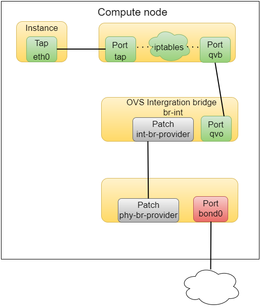
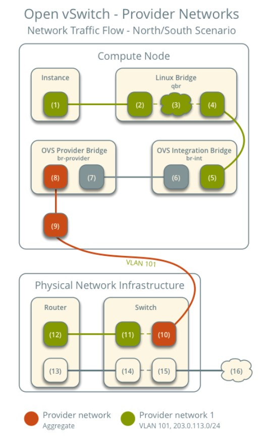
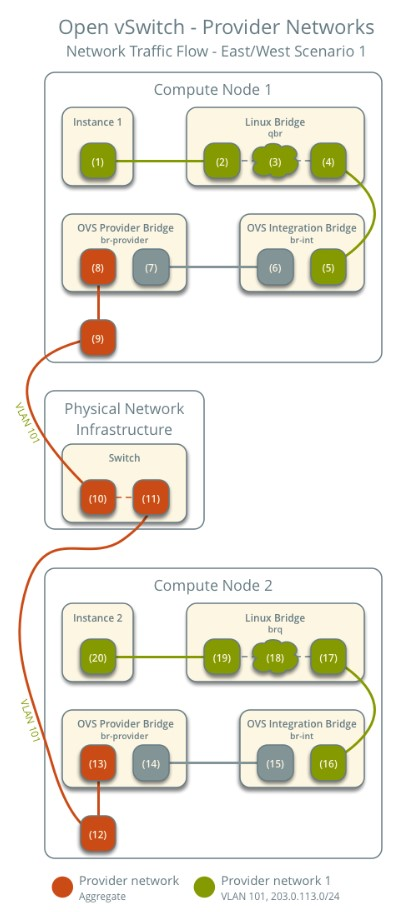
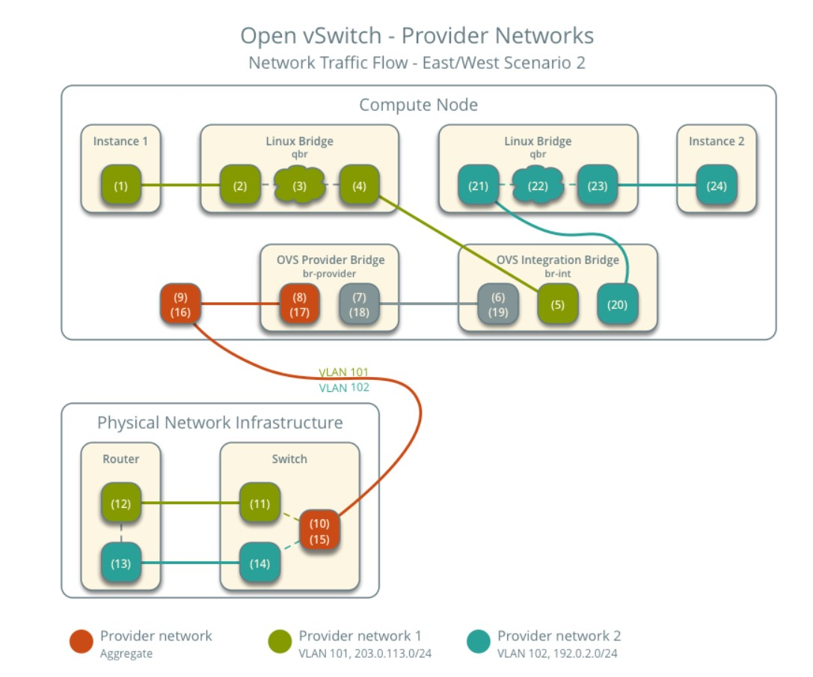
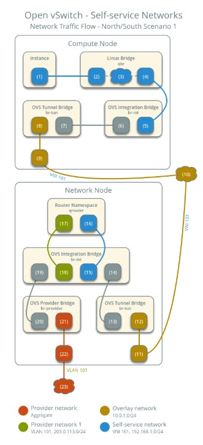
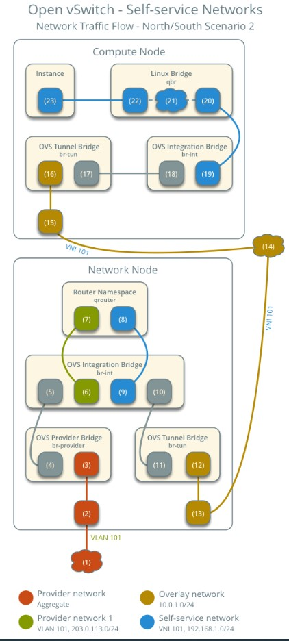
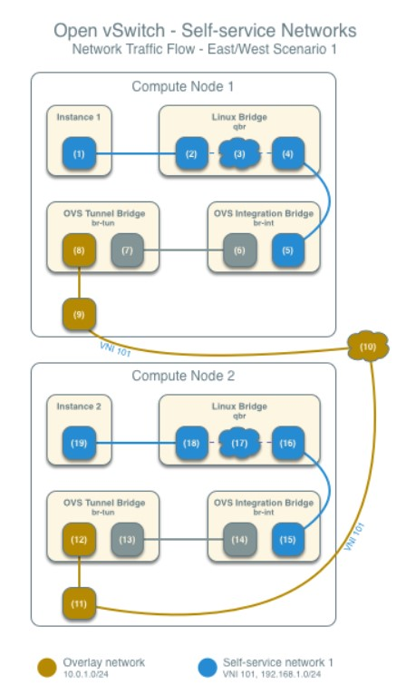
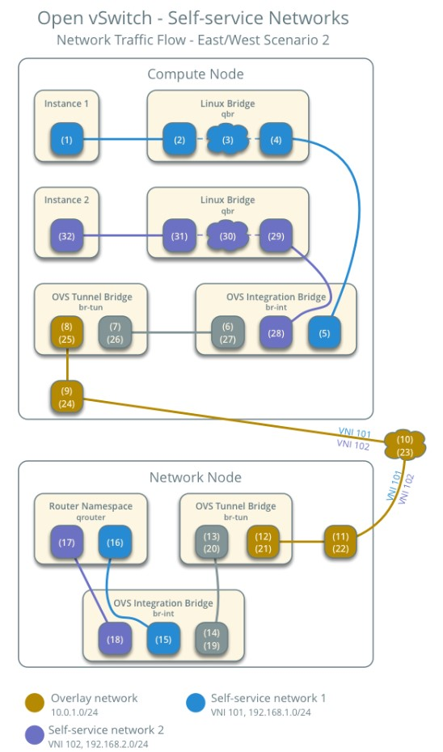

# Kiến trúc Network trong OpenStack (OpenvSwitch) và đường đi của gói tin trong OPS.

## 1. Provider network

Mô hình kiến trúc tổng quan của network trong OpenStack sử dụng provider network



#### Instance Networking

Gói tin sẽ bắt đầu từ card `eth0` trên máy ảo, nó được kết nối với `tap` device trên host. `tap` device này ở trên Linux Bridge. Sở dĩ có 1 layer Linux Bridge là vì OpenStack sử dụng các rules của iptables trên `tap` device để thực hiện security groups. Trước đây khi mà OpenvSwitch chưa hỗ trợ iptables thì nó buộc dùng thêm một layer là Linux Bridge nữa dù lý tưởng nhất vẫn là interface của VM gán trực tiếp vào bridge integration (br-int) của OVS.

Ở các phiên bản gần đây, OpenvSwitch đã hỗ trợ iptables vì thế không cần thêm layer của LB nữa.

Mặc dù vậy, mô hình với layer LB đã được kiểm chứng là khá stable nên mình sẽ tìm hiểu mô hình này.

Nếu xem các rules trên node compute nơi chứa máy ảo thì sẽ thấy có vài rules liên quan tới `tap` device

```
[root@compute2 ~]# iptables -S | grep tap7d11b2ae-62
-A neutron-openvswi-FORWARD -m physdev --physdev-out tap7d11b2ae-62 --physdev-is-bridged -m comment --comment "Direct traffic from the VM interface to the security group chain." -j neutron-openvswi-sg-chain
-A neutron-openvswi-FORWARD -m physdev --physdev-in tap7d11b2ae-62 --physdev-is-bridged -m comment --comment "Direct traffic from the VM interface to the security group chain." -j neutron-openvswi-sg-chain
-A neutron-openvswi-INPUT -m physdev --physdev-in tap7d11b2ae-62 --physdev-is-bridged -m comment --comment "Direct incoming traffic from VM to the security group chain." -j neutron-openvswi-o7d11b2ae-6
-A neutron-openvswi-sg-chain -m physdev --physdev-out tap7d11b2ae-62 --physdev-is-bridged -m comment --comment "Jump to the VM specific chain." -j neutron-openvswi-i7d11b2ae-6
-A neutron-openvswi-sg-chain -m physdev --physdev-in tap7d11b2ae-62 --physdev-is-bridged -m comment --comment "Jump to the VM specific chain." -j neutron-openvswi-o7d11b2ae-6
```

`neutron-openvswi-sg-chain` là nơi chứa neutron-managed security groups. `neutron-openvswi-FORWARD` điều khiển outbound traffic từ VM ra ngoài trong khi đó `neutron-openvswi-i7d11b2ae-6` sẽ điều khiển inbound traffic tới VM.

Interface thứ 2 gán vào Linux Bridge có tên `qvb...`, interface này sẽ nối LB tới integration bridge (br-int)

#### Linux Bridge

Chứa các rules dùng cho security group, có một đầu là tap interface có địa chỉ MAC trùng với địa chỉ MAC của card mạng trên máy ảo là một đầu là `qvb...` được nối với `qvo...` trên integration bridge

#### Integration Bridge

Bridge này thường có tên là br-int thường được dùng để **tag** và **untag** VLAN cho traffic vào và ra VM. Lúc này br-int sẽ trông như sau:

```
ovs-vsctl show
...........
Bridge br-int
            Interface int-br-provider
                type: patch
                options: {peer=phy-br-provider}
        Port br-int
            Interface br-int
                type: internal
        Port "qvo5652dd5f-cd"
            tag: 1
            Interface "qvo5652dd5f-cd"
```

Interface `qvo...` là điểm đến của `qvb...` và nó sẽ chịu trách nhiệm với các traffic vào và ra khỏi layer LB. Nếu bạn sử dụng VLAN, sẽ có thêm tag:1. Interface int-br-provider kết nối tới phy-br-provider trên layer bridge external.

#### External bridge

Bridge này sẽ được gán với interface external để đi ra ngoài internet (có thể dùng bond hoặc không). Nó sẽ trông như sau:

```
#ovs-vsctl show
.........
Bridge br-provider
        Controller "tcp:127.0.0.1:6633"
            is_connected: true
        fail_mode: secure
        Port phy-br-provider
            Interface phy-br-provider
                type: patch
                options: {peer=int-br-provider}
        Port br-provider
            Interface br-provider
                type: internal
        Port "bond0"
            Interface "bond0"
```

## 2. Self-service Network

Mô hình self-service network sẽ phức tạp hơn khi mà traffic còn phải đi qua một router được đặt trên node controller.


#### Tunnel Bridge

Traffic tới từ node compute sẽ được chuyển tới node controller thông qua GRE/VXLAN tunnel trên bridge tunnel (br-tun). Nếu sử dụng VLAN thì nó sẽ chuyển đổi VLAN tagged traffic từ integration bridge sang GRE/VXLAN tunnels. Việc chuyển đổi qua lại giữa VLAN IDs và tunnel IDs được thực hiện bởi OpenFlow rules trên `br-tun`

Đối với GRE hoặc VXLAN-based network truyền tới từ patch-tun của br-int sang patch-int của br-tun. Bridge này sẽ chứa 1 port cho tunnel có tên `vxlan-...`

#### DHCP Router on Controller

DHCP server thường được chạy trên node controller hoặc compute. Nó là một instance của dnsmasq chạy trong một network namespace. Network namespace là một Linux kernel facility cho phép thực hiện một loạt các tiến trình tạo ra network stack (interface, routing tables, iptables rule).

Có thể xem danh sách các network namespace với câu lệnh `ip netns`

```
[root@controller ~]# ip netns
qdhcp-aa901699-9b69-4ac5-95c5-e2537572f639 (id: 3)
qdhcp-0506df07-8641-4cc7-a9d8-1036baf02e6c (id: 1)
qdhcp-deb9a445-063b-4b58-a3db-f5a6d6e60a91 (id: 2)
qrouter-0f321089-2a66-4c7e-90d4-a87b6e2646b8 (id: 0)
```

`qdhcp...` laf DHCP server namespace còn `qrouter...` là router

Dùng câu lệnh `ip netns exec` để xem cấu hình của các interface bên trong.

```
[root@controller ~]# ip netns exec qdhcp-aa901699-9b69-4ac5-95c5-e2537572f639 ip addr
1: lo: <LOOPBACK,UP,LOWER_UP> mtu 65536 qdisc noqueue state UNKNOWN group default qlen 1000
    link/loopback 00:00:00:00:00:00 brd 00:00:00:00:00:00
    inet 127.0.0.1/8 scope host lo
       valid_lft forever preferred_lft forever
    inet6 ::1/128 scope host
       valid_lft forever preferred_lft forever
18: tapd2dcbdcf-9d: <BROADCAST,MULTICAST,UP,LOWER_UP> mtu 1450 qdisc noqueue state UNKNOWN group default qlen 1000
    link/ether fa:16:3e:00:0e:1c brd ff:ff:ff:ff:ff:ff
    inet 10.10.20.2/24 brd 10.10.20.255 scope global tapd2dcbdcf-9d
       valid_lft forever preferred_lft forever
    inet 169.254.169.254/16 brd 169.254.255.255 scope global tapd2dcbdcf-9d
       valid_lft forever preferred_lft forever
    inet6 fe80::f816:3eff:fe00:e1c/64 scope link
       valid_lft forever preferred_lft forever
```

#### Router on Controller

Router cũng là một network namespace với một loạt các routing rule và iptables rule để thực hiện việc định tuyến giữa các subnets.

Chúng ta cũng có thể xem cấu hình của router với câu lệnh `ip netns exec`. Xem bảng định tuyến bên trong router thông qua câu lệnh `ip netns exec qrouter... ip route`

```
[root@controller ~]# ip netns exec qrouter-0f321089-2a66-4c7e-90d4-a87b6e2646b8 ip route
default via 192.168.70.1 dev qg-c3fca761-74
10.10.10.0/24 dev qr-a9bdb9c9-46 proto kernel scope link src 10.10.10.1
10.10.20.0/24 dev qr-1c67b943-cf proto kernel scope link src 10.10.20.1
192.168.70.0/24 dev qg-c3fca761-74 proto kernel scope link src 192.168.70.120
```

## 3. Network traffic flow

### 3.1. Provider Network

#### North-south



1. Instance forward gói tin từ interface (1) tới security group bridge instance port (2) thông qua **veth** pair

2. Các security group rule (3) trên security group bridge xử lý firewall và theo dõi kết nối cho gói tin

3. Security group bridge OVS port (4) forward gói tin tới OVS integration bridge security group port (5) thông qua **veth** pair

4. OVS integration bridge thêm internal VLAN tag vào gói tin

5. OVS integration bridge **int-br-provider** patch port (6) forward gói tin tới OVS provider bridge **phy-br-provider** patch port (7)

6. OVS provider bridge thay đổi internal VLAN tag của gói tin thành VLAN tag 101 

7. OVS provider bridge provider network port (8) forward gói tin tới interface mạng vật lý (9)

8. Interface mạng vật lý forward gói tin tới switch vật lý (10)

9. Switch loại bỏ VLAN tag 101 khỏi gói tin và forward nó tới router (11)

10. Router định tuyến gói tin từ provider network (12) tới external network (13) và forward gói tin tới switch (14)

11. Switch forward gói tin tới external network (15)

12. External network (16) nhận gói tin.

#### East-West 1: Các instance cùng mạng



1. Instance 1 interface (1) forward gói tin tới security group bridge instance port (2) thông qua **veth** pair

2. Các security group rule (3) trên security group bridge xử lý firewall và theo dõi kết nối của gói tin

3. Security group bridge OVS port (4) forward gói tin tới OVS integration bridge security group port (5) qua **veth** pair

4. OVS integration bridge thêm internal VLAN tag vào packet

5. OVS integration bridge **int-br-provider** patch port (6) forward gói tin tới OVS provider bridge **phy-br-provider** patch port (7)

6. OVS provider bridge thay đổi internal VLAN tag thành VLAN tag thực 101

7. OVS provider bridge provider network port (8) forward gói tin tới interface mạng vật lý (9)

8. Interface mạng vật lý forward gói tin tới switch vật lý (10)

9. Switch forward gói tin từ compute 1 sang compute 2 (11)

10. Interface mạng vật lý (12) forward gói tin tới OVS provider bridge provider network port (13)

11. OVS provider bridge **phy-br-provider** patch port (14) forward gói tin tới OVS integration bridge **int-br-provider** patch port (15)

12. OVS integration bridge thay đổi VLAN tag 101 thành internal VLAN tag

13. OVS integration bridge security group port (16) forward gói tin tới security group bridge OVS port (17)

14. Các security group rule (18) trên security group bridge xử lý firewall và theo dõi kết nối gói tin

15. Security group bridge instance port (19) forward gói tin tới interface của instance 2 thông qua **veth** pair

#### East-West 2: Các instance khác mạng



1. Interface instance 1 (1) forward gói tin tới security group bridge instance port (2) qua **veth** pair

2. Các security group rule (3) trên security group bridge xử lý firewalling và theo dõi kết nối của của tin

3. Security group bridge OVS port (4) forward gói tin tới OVS integration bridge security group port (5) qua **veth** pair

4. OVS integration bridge thêm internal VLAN tag vào gói tin

5. OVS integration bridge **int-br-provider** patch port (6) forward gói tin tới OVS provider bridge **phy-br-provider** patch port (7)

6. OVS provider bridge thay đổi internal VLAN tag của gói tin thành VLAN tag thực 101

7. OVS provider bridge provider network port (8) forward gói tin tới interface mạng vật lý (9)

8. Interface mạng vật lý forward gói tin tới switch vật lý (10)

9. Switch bỏ VLAN tag 101 khỏi gói tin và forward nó tới router (11)

10. Router định tuyến gói tin từ provider network 1 (12) tới provider network 2 (13)

11. Router forward gói tin tới switch (14)

12. Switch thêm tag VLAN 102 vào packet và forward nó tới compute node 1 (15)

13. Interface mạng vật lý (16) forward gói tin tới OVS provider bridge network port (17)

14. OVS provider bridge **phy-br-provider** patch port (18) forward gói tin tới OVS integration bridge **int-br-provider** patch port (19)

15. OVS integration bridge thay đổi VLAN tag 102 thành internal VLAN tag.

16. OVS integration bridge security group port (20) bỏ internal VLAN tag và forward gói tin tới security group bridge OVS port (21)

17. Các security group rule (22) trên security group bridge xử lý firewalling và theo dõi kết nối của gói tin

18. Security group bridge instance port (23) forward gói tin tới instance 2 interface (24) thông qua **veth** pair

### 3.2. Self-service Network

#### North-south 1: Instance with a fixed IP address



Instance nằm trong self-service network và gửi một gói tin ra Internet

1. Instance interface (1) forward gói tin tới security group bridge instance port (2) thông qua **veth** pair

2. Các security group rule (3) trên security group bridge xử lý firewalling và theo dõi kết nối cho gói tin

3. Security group bridge OVS port (4) forward gói tin tới OVS integration bridge security group port (5) thông qua **veth** pair

4. OVS integration bridge thêm một internal VLAN tag vào gói tin

5. OVS integration bridge trao đổi internal VLAN tag cho một internal tunnel ID

6. OVS integration bridge patch port (6) forward gói tin tới OVS tunnel bridge patch port (7)

7. OVS tunnel bridge (8) đóng gói gói tin sử dụng VNI 101

8. Underlying physical interface (9) cho overlay network forward gói tin tới network node thông qua overlay network (10)

9. Underlying physical interface (11) cho overlay network forward gói tin tới OVS tunnel bridge (12)

10. OVS tunnel bridge mở gói tin và thêm vào một internal tunnel ID

11. OVS tunnel bridge trao đổi internal tunnel ID cho một internal VLAN tag

12. OVS tunnel bridge patch port (13) forward gói tin tới OVS integration bridge patch port (14)

13. OVS integration bridge port cho self-service network (15) bỏ internal VLAN tag và forward gói tin tới self-service network interface (16) trong router namespace.

- Đối với IPv4, router thực hiện SNAT trên gói tin để thay đổi địa chỉ IP nguồn thành địa chỉ IP router trên provider network và gửi nó tới gateway trên provider network thông qua gateway interface trên provider network (17)

- Đối với IPv6, router gửi gói tin tới địa chỉ IP next-hop, thường là địa chỉ IP gateway trên provider network, thông qua provider gateway interface (17).

14. Router forward gói tin tới OVS integration bridge port cho provider network (18)

15. OVS integration bridge thêm internal VLAN tag cho gói tin

16. OVS integration bridge **int-br-provider** patch port (19) forward gói tin tới OVS provider bridge **phy-br-provider** patch port (20)

17. OVS provider bridge thay đổi internal VLAN tag thành VLAN tag thực 101

18. OVS provider bridge provider network port (21) forward gói tin tới interface mạng vật lý (22)

19. Interface mạng vật lý forward gói tin ra Internet thông qua hạ tầng mạng vật lý (23)

#### North-south 2: Instance with a floating IPv4 address



Instance nằm trong self-service network, một host bên ngoài Interface gửi gói tin tới instance

1. Hạ tầng mạng vật lý (1) forward gói tin tới provider physical network interface (2)

2. Provider physical network interface forward gói tin tới OVS provider bridge provider network port (3)

3. OVS provider bridge thay đổi VLAN tag 101 thành internal VLAN tag

4. OVS provider bridge **phy-br-provider** port (4) forward gói tin tới OVS integration bridge **int-br-provider** port (5)

5. OVS integration bridge port cho provider network (6) bỏ internal VLAN tag và forward gói tin tới provider network interface (6) trong router namespace

- Đối với IPv4, router thực hiện DNAT trên gói tin để thay đổi địa chỉ đích thành địa chỉ IP instance trên self-service network và gửi nó tới địa chỉ gateway trên self-service network thông qua self-service interface (7)

- Đối với IPv6, router gửi gói tin tới địa chỉ next-hop, thường là địa chỉ gateway trên self-service network, thông qua self-service interface (8)

6. Router forward gói tin tới OVS integration bridge port cho self-service network (9)

7. OVS integration bridge thêm một internal VLAN vào gói tin

8. OVS integration bridge trao đổi internal VLAN tag cho một internal tunnel ID

9. OVS integration bridge **patch-tun** patch port (10) forward gói tin tới OVS tunnel bridge **patch-int** patch port (11)

10. OVS tunnel bridge (12) đóng gói packet sử dụng VNI 101

11. Underlying physical interface (13) cho overlay network forward packet tới network node thông qua overlay network (14)

12. Underlying physical interface (15) cho overlay network forward packet tới OVS tunnel bridge (16)

13. OVS tunnel bridge mở packet và thêm vào một internal tunnel ID

14. OVS tunnel bridge trao đổi internal tunnel ID cho một internal VLAN tag

15. OVS integration bridge **patch-int** patch port (17) forward packet tới OVS integration bridge **patch-tun** patch port (18)

16. OVS integration bridge bỏ internal VLAN tag khỏi packet

17. OVS integration bridge security group port (19) forward packet tới security group bridge OVS port (20) thông qua **veth** pair

18. Các security group rule (21) trên security group bridge xử lý firewalling và theo dõi kết nối cho gói tin.

19. Security group bridge instance port (22) forward packet tới instance interface (23) qua **veth** pair

#### East-West 1: Instances on the same network



1. Instance 1 interface (1) forward packet tới security group bridge instance port (2) qua **veth** pair

2. Các security group rule (3) trên security group bridge xử lý firewalling và theo dõi kết nối cho packet

3. Security group bridge OVS port (4) forward packet tới OVS integration bridge security group port (5) qua **veth** pair

4. OVS integration bridge thêm một internal VLAN tag vào packet

5. OVS integration bridge trao đổi internal VLAN tag cho một internal tunnel ID

6. OVS integration bridge patch port (6) forward packet tới OVS tunnel bridge patch port (7)

7. OVS tunnel bridge (8) đóng gói packet sử dụng VNI 101

8. Underlying physical interface (9) cho overlay network forward packet tới compute node 2 bằng overlay network (10)

9. Underlying physical interface (11) cho overlay network forward packet tới OVS tunnel bridge (12)

10. OVS tunnel bridge mở packet và thêm vào một internal tunnel ID

11. OVS tunnel bridge trao đổi internal tunnel ID cho một internal VLAN tag

12. OVS tunnel bridge **patch-int** patch port (13) forward packet tới OVS integration bridge **patch-tun** patch port (14)

13. OVS integration bridge bỏ internal VLAN tag khỏi packet

14. OVS integration bridge security group port (15) forward packet tới security group bridge OVS port (16) qua **veth** pair

15. Các security group rule (17) trên security group bridge xứ lý firewalling và theo dõi kết nối cho packet

16. Security group bridge instance port (18) forward packet tới instance 2 interface (19) qua **veth** pair.

#### East-West 2: Instances on different networks



1. Instance interface (1) forward packet tới security group bridge instance port (2) qua **veth** pair

2. Các security group rule (3) trên security group bridge xử lý firewalling và theo dõi kết nối cho packet

3. Security group bridge OVS port (4) forward packet tới OVS integration bridge security group port (5) qua **veth** pair

4. OVS integration bridge thêm một internal VLAN tag vào packet

5. OVS integration bridge trao đổi internal VLAN tag cho một internal tunnel ID

6. OVS integration bridge **patch-tun** patch port (6) forward packet tới OVS tunnel bridge **patch-int** patch port (7)

7. OVS tunnel bridge (8) đóng gói packet sử dụng VNI 101

8. Underlying physical interface (9) cho overlay network forward packet tới network node thông qua overlay network (10)

9. Underlying physical interface (11) cho overlay network forward packet tới OVS tunnel bridge (12)

10. OVS tunnel bridge mở packet và thêm vào một internal tunnel ID

11. OVS tunnel trao đổi internal tunnel ID cho một internal VLAN tag

12. OVS tunnel bridge **patch-int** patch port (13) forward packet tới OVS integration bridge **patch-tun** patch port (14)

13. OVS integration bridge port cho self-service network 1 (15) bỏ internal VLAN tag và forward packet tới self-service network 1 interface (16) trong router namespace

14. Router gửi packet tới địa chỉ next-hop, thường là địa chỉ gateway trên self-service network 2, thông qua self-service network 2 interface (17)

15. Router forward packet tới OVS integration bridge port cho self-service network 2 (18)

16. OVS integration bridge thêm internal VLAN tag vào packet 

17. OVS integration bridge trao đổi internal VLAN tag cho một internal tunnel ID

18. OVS integration bridge **patch-tun** patch port (19) forward packet tới OVS tunnel bridge **patch-int** patch port (20)

19. OVS tunnel bridge (21) đóng gói packet sử dụng VNI 102

20. Underlying physical interface (22) cho overlay network forward packet tới compute node qua overlay network (23)

21. Underlying physical interface (24) cho overlay network forward packet tới OVS tunnel bridge (25)

22. OVS tunnel bridge mở packet và thêm vào một internal tunnel ID

23. OVS tunnel bridge trao đổi internal tunnel ID cho internal VLAN tag

24. OVS tunnel bridge **patch-int** patch port (26) forward packet tới OVS integration bridge **patch-tun** patch port (27)

25. OVS integration bridge bỏ internal VLAN tag khỏi packet

26. OVS integration bridge security group port (28) forward packet tới security group bridge OVS port (29) qua **veth** pair

27. Các security group rule (30) trên security group bridge xử lý firewalling và theo dõi kết nối cho packet

28. Security group bridge instance port (31) forward packet tới instance interface (32) qua **veth** pair

## Tham khảo

https://github.com/thaonguyenvan/meditech-thuctap/blob/master/ThaoNV/Tim%20hieu%20OpenStack/docs/neutron/neutron-openvswitch.md

https://docs.openstack.org/neutron/stein/admin/deploy-ovs-provider.html

https://docs.openstack.org/neutron/stein/admin/deploy-ovs-selfservice.html